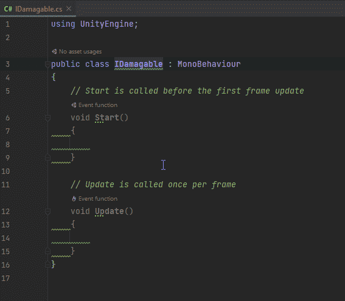

# Unity 中的 IDamagable 接口

> 原文：<https://blog.devgenius.io/idamagable-interface-in-unity-f43fd830e2d7?source=collection_archive---------2----------------------->

## 使用接口使行为变得可破坏

 [## 接口

### 接口很像 C#中的抽象类。是 C#中实现抽象的一种方式。接口用于…

ktmarine1999.medium.com](https://ktmarine1999.medium.com/interfaces-f35ac8626ed) 

我为我的易损坏接口创建了一个新的 C#脚本

我把它变成了一个界面。

我要说的是，任何可伤害的东西都需要一个健康属性和一个伤害方法。

现在我只是把这个合同应用到任何我想成为易损坏的玩家，敌人，箱子，板条箱，桶等等。任何实现这个接口的东西都保证在这个接口中有方法和属性。如何使用这些方法取决于个人行为。对于每一个敌人，我将分别实现易损坏的接口。首先，我将把属性放在敌人行为中。

因为这个属性在敌人的行为中，所以我所有的敌人都有这个属性。我唯一需要添加到单个职业中的是一个伤害方法。

我更改了损坏方法的签名，所以我必须在实现 IDamageable 的行为中更改它。

现在在我的玩家攻击行为中，我可以得到可伤害的部分，并造成我选择的伤害。

攻击行为并不在乎它击中了什么，只要它击中了可损坏的东西，它就会对它造成损坏。

