# 使用 Python 为您的企业识别潜在客户

> 原文：<https://blog.devgenius.io/identify-potential-customers-for-your-business-with-python-820caec3917?source=collection_archive---------2----------------------->

图片来源:[博尔特洞察](https://www.boltinsight.com/post/4-useful-tips-for-identifying-your-potential-customers)

# 介绍

当你开车沿街行驶时，你会注意到许多咖啡馆、餐馆、酒吧等。他们会注意到你。而且，他们知道你是谁。他们利用你的个人数据让你在你不需要的东西上花更多的钱。

事实上，个性化营销已经变得无处不在——即使是街角的小咖啡馆也能以低成本和零努力有效吸引顾客。

让我们看看数据科学如何对此有所帮助。

# 资料组

数据集包含 12684 个条目，25 个数字和分类属性，以及一个二元目标标签: **1(** 接受)和 **0(** 拒绝)。

它提供关于不同驾驶场景的信息，包括目的地、当前时间、天气、乘客等。在每种情况下，当地公共餐饮都会提供折扣。我们的目标是找到愿意接受它的司机。请查看[网页](https://archive.ics.uci.edu/ml/datasets/in-vehicle+coupon+recommendation#)了解更多数据。

# 先决条件

从启动您最喜欢的 Python IDE 开始。导入工具并读取[数据集](https://github.com/Vice10/datasets/blob/main/ivcr_s2.csv)。这个版本已经清理完毕，可以开始运行了。

让我们看看我们的数据是什么样的。

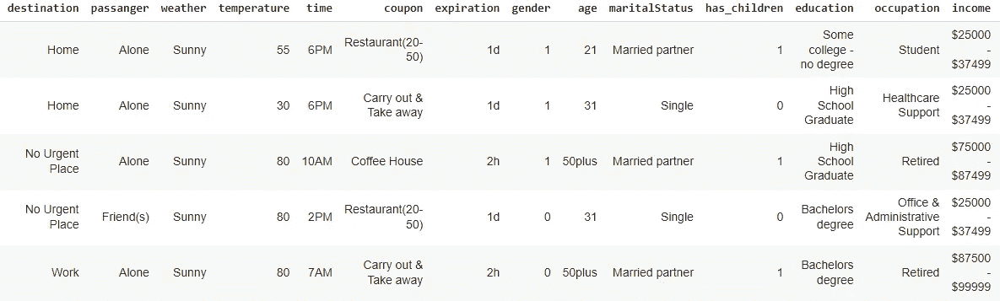

下一步是列类型的推断。这是手动完成的。

数据集具有以下结构:

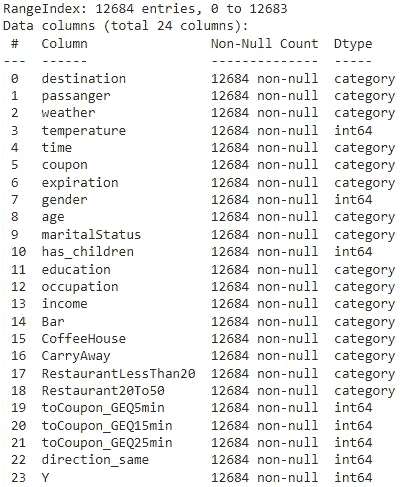

数据集并不是完全平衡的——57%的人接受提议，43%的人不接受。我们稍后将解决这个问题。

无聊的东西在后面。让我们更好地了解我们的数据。

# 电子设计自动化(Electronic Design Automation)

首先，显示几个条形图来探索分类特征。

孤独的司机在数据集中过多。有朋友的司机更有可能接受优惠券。

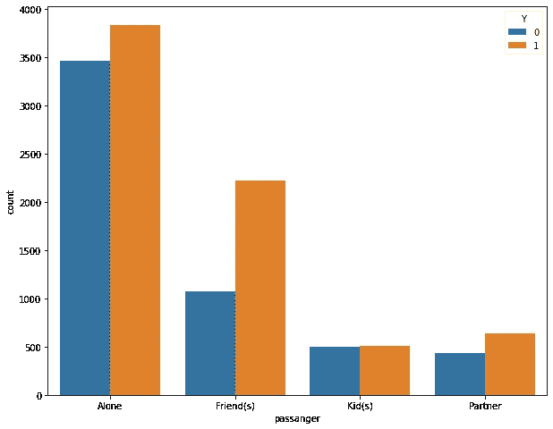

乘客

收入过高或过低的人更有可能选择打折。

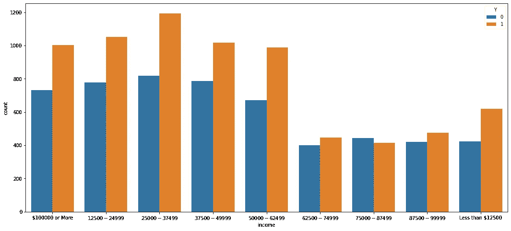

收入

已婚伴侣和单身人士比例过高，他们对这一提议很感兴趣。

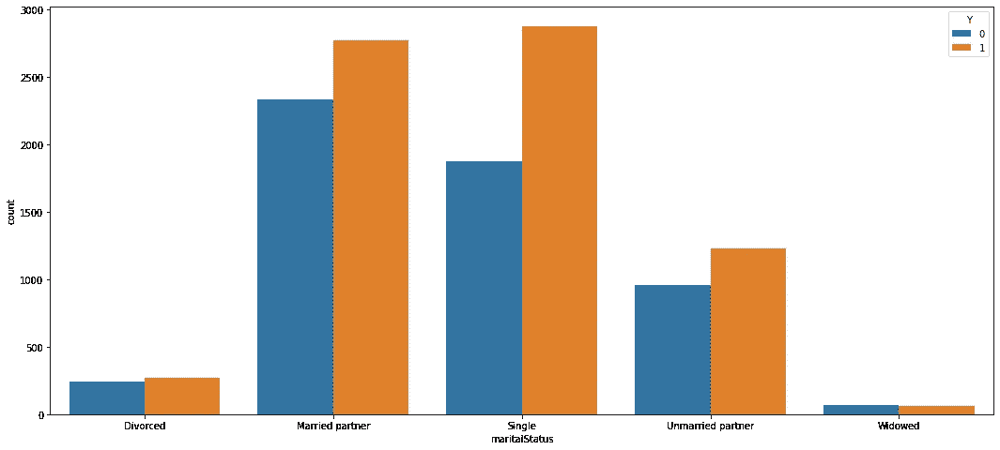

婚姻状况

不要给酒吧提供优惠券——这很糟糕。

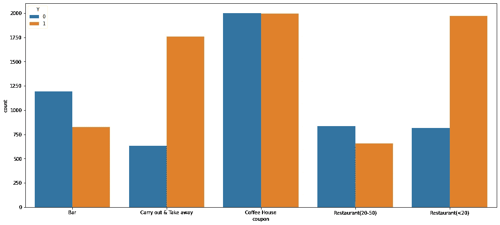

优惠券

下面的柱状图代表了一种常见的时间模式。

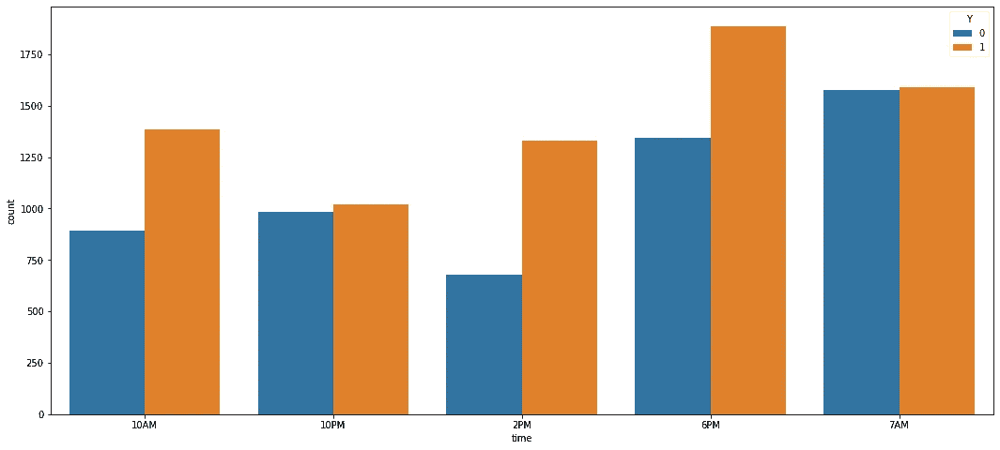

时间

学生和失业者尤其享受折扣。

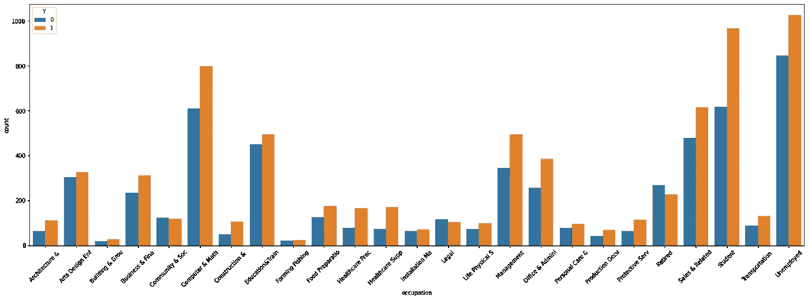

职业

以下是数字特征的相关矩阵:

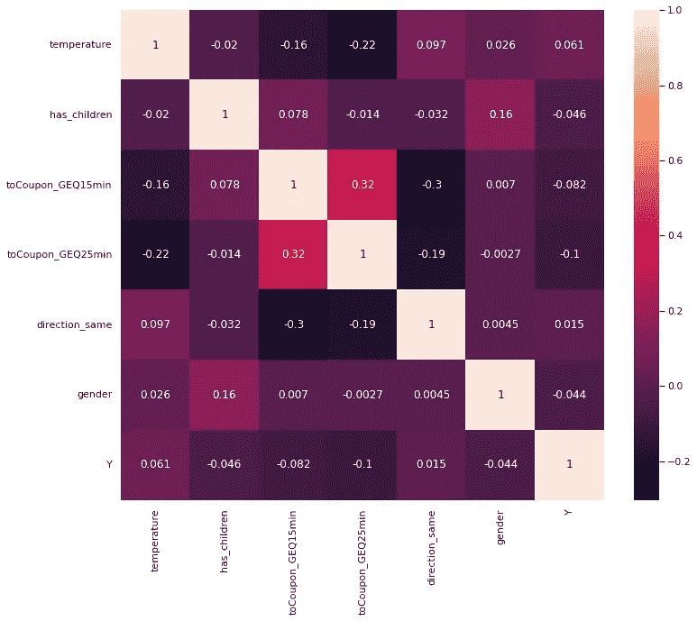

toCoupon _ GEQ5min 丢失了，因为它在相关矩阵中产生了 NaNs(出于某种奇怪的原因)

# 平衡、分割、训练、测试

导入必要的 ML 工具并对分类特征进行一次性编码:

接下来，平衡数据集、编码标注并缩放要素:

定义一些功能，包括分割、训练、测试、绘图程序。这将帮助我们在一行代码中运行 ML 实验。

我们还需要一些辅助功能:

无聊的东西在后面。

让我们看看 XGBClassifier 是如何工作的:

Colab 花了 16.5 秒来训练这个模型。

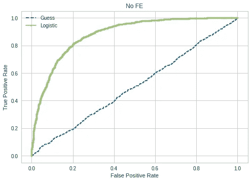

受试者工作特征曲线

ROC AUC 评分达到 **88.2%** 。

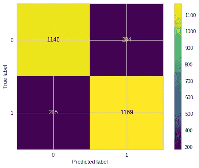

混淆矩阵

准确率高达 **80%** 。

如果我们没有**平衡**数据集，相应的得分将是 **82.2%** 和 **75%** 。

五个最重要的特征是:优惠券 _ 餐馆(<20), coupon_Carry out & Take away, expiration_1d, temperature, coupon_Coffee House.

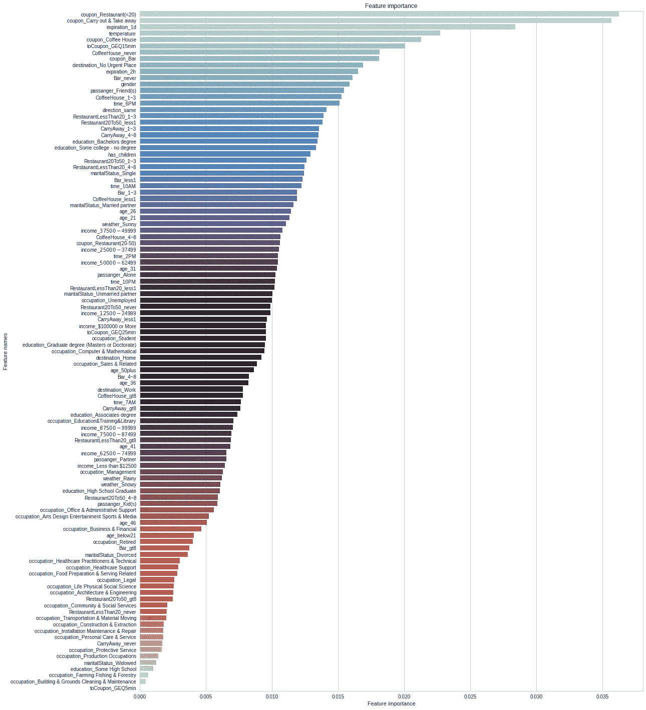

Feature Importance

# Can We Trust Our Model?

Even though we can measure importance of each feature, we cannot assess its impact on the model output.

If there is no way to explain behaviour of the model, how can we trust it? How can we prove that the model resembles the business logic?

A tool called [Shapley values](/where-machine-learning-meets-game-theory-f44ff176fe70) 会派上用场来回答这些问题。

但是，如果您尝试使用它，将需要一段时间，因为数据集非常庞大。

我们需要**减少**的**维度**，以最小化沙普利解释者的工作量。

# 主成分分析

我们将使用 PCA 来识别共同解释数据集中 74.8%方差的特征。目标是训练一个轻量级的 XGBClassifier，它可以被 Shapley 解释器处理。

首先，让我们绘制 2D 主成分分析图:

下图没有传达任何有意义的信息，因为这些点相互重叠，分布在整个商店里。

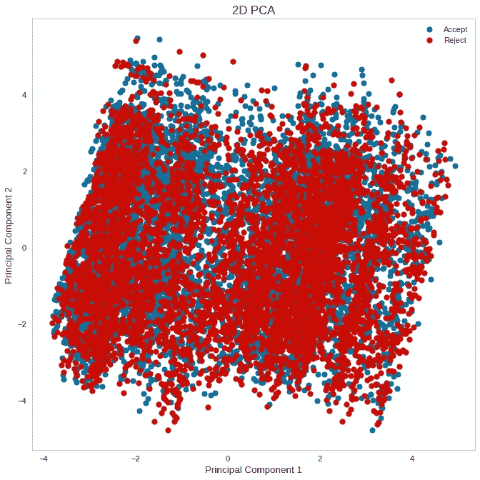

事实证明，我们需要 50 个分量来解释几乎 75%的方差。

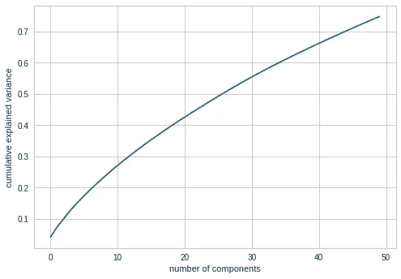

我们现在必须确定这些组件:

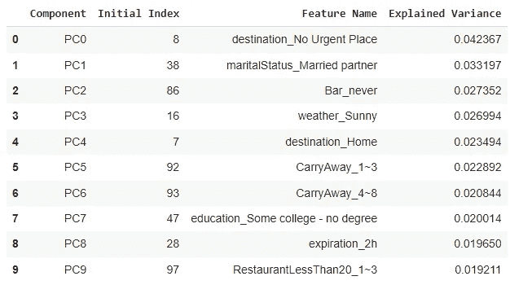

有趣的是，有些组件已经两次被包含在列表中，所以我们需要识别唯一的列名，这些列名将被用来初始化简化的数据集。

让我们评估一下结果:

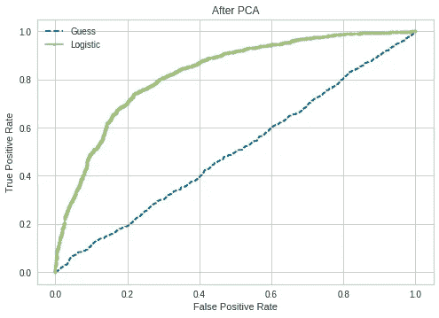

ROC AUC 评分为 **82.7%** ，提示模型稳健。

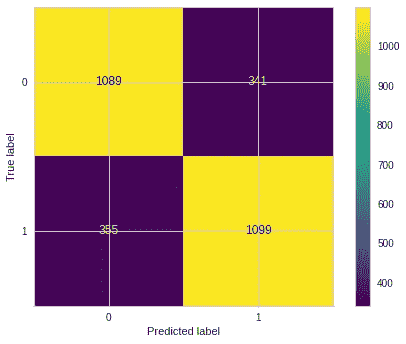

准确度仅比原始数据集小 4%—**76%**。

总体而言，该模型表现良好，因为数据框的体积减少了 40%(107 个特征中只有 43 个用于训练该模型)。

# 解释输出

现在是 Shapley 值解释哪些特征会影响模型输出的时候了。

条形图表明，expire _ 1d 和 expire _ 2h 一起比未包含在数据集中的其他 35 个要素更重要。

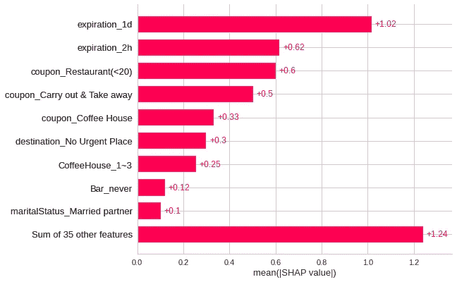

虽然条形图提供了绝对 Shap 值，但蜂群图说明了影响向量。

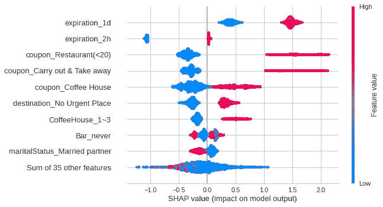

寻找更高级的图表吗？给你:

此图旨在使用监督聚类和热图显示数据集的总体子结构:

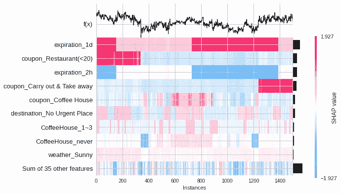

热图

这是具有附加力布局的 SHAP 值的可视化:

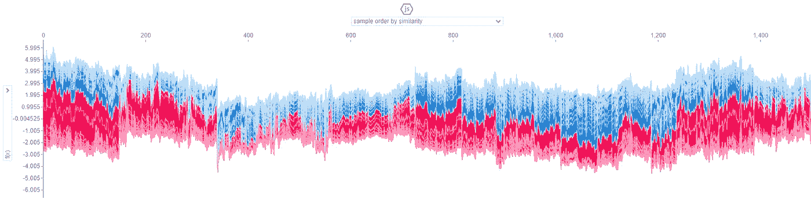

力

# 结论

本文建议数据科学如何帮助营销专业人员识别潜在客户。它还展示了数据科学家如何使用 PCA 分解和 Shapley 值有效地可视化和解释大型 ML 模型。

*本文代码笔记本* [*此处*](https://github.com/Vice10/ds_notebooks/blob/main/feature_extraction_balanced.ipynb) *。*