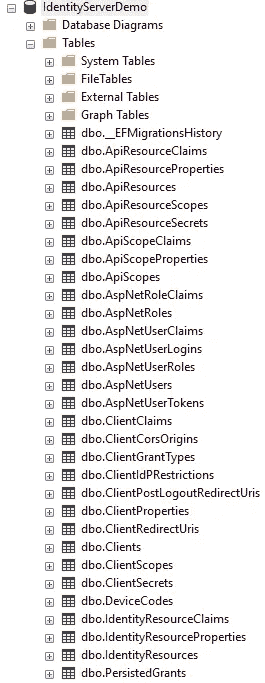
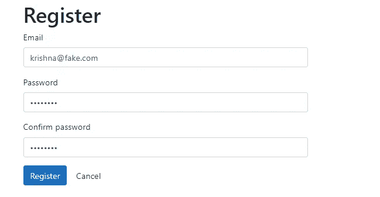
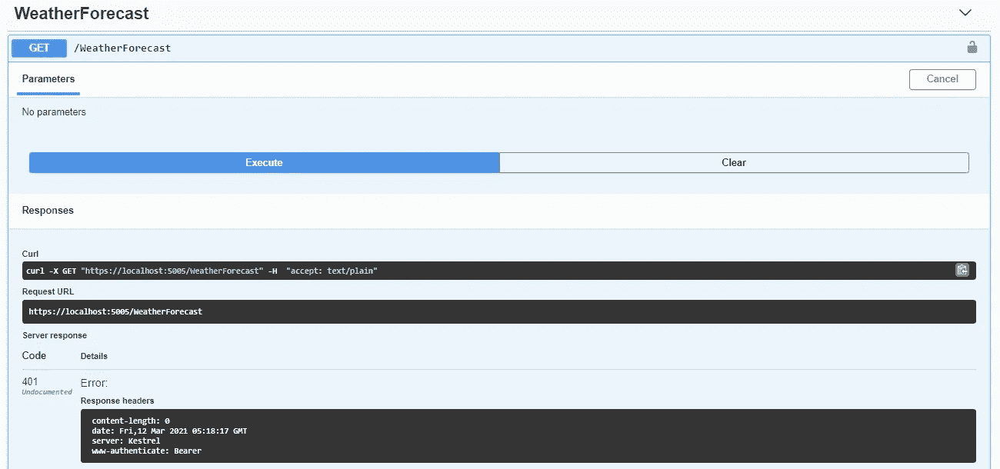
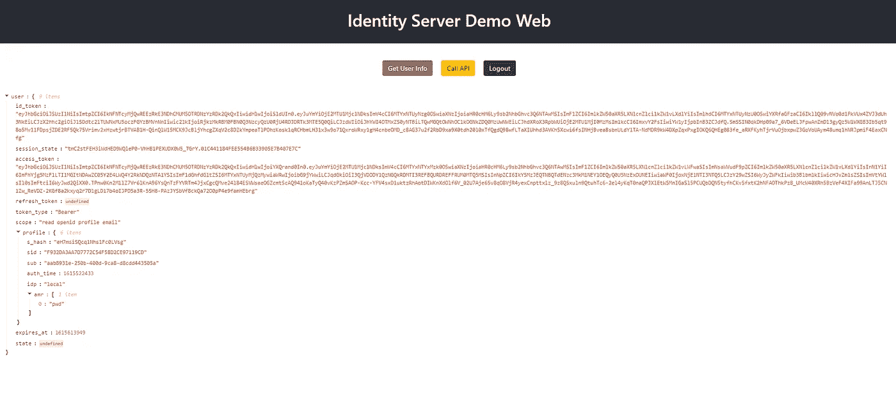
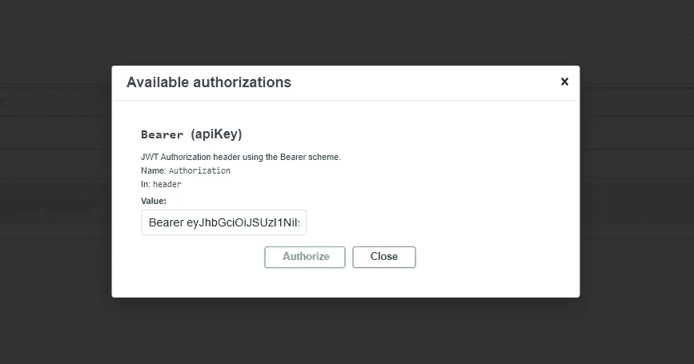
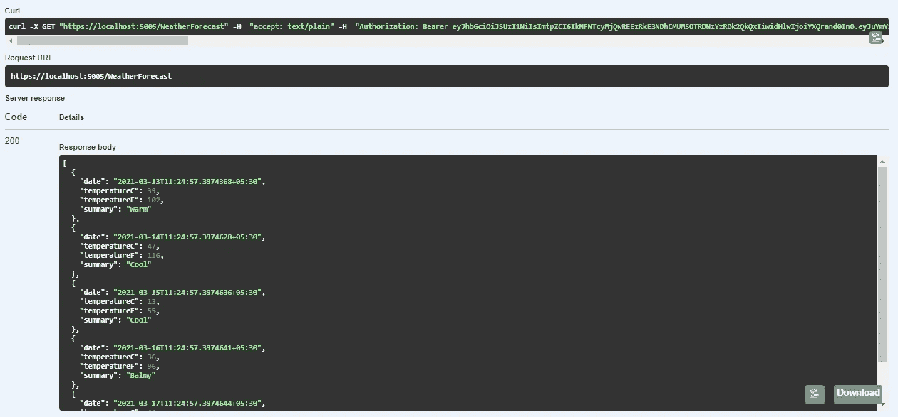

# IdentityServer4 使用 ASP.NET 身份进行身份验证，用于用户管理

> 原文：<https://blog.devgenius.io/identityserver4-authentication-with-asp-net-identity-for-user-management-6449bb985d21?source=collection_archive---------0----------------------->


图片由 [Unsplash](/s/photos/user?utm_source=unsplash&utm_medium=referral&utm_content=creditCopyText) 上的 [Taras Shypka](https://unsplash.com/@bugsster?utm_source=unsplash&utm_medium=referral&utm_content=creditCopyText) 拍摄

你好！让我们来看看如何设置 IdentityServer4，以使用 ASP.NET 身份进行用户管理，并创建一个 React 应用程序来登录用户，并使用 PKCE 流的授权代码向受保护的 API 发出请求。

在我们开始之前，让我们概述一下我们的问题陈述。我们想要

*   使用 IdentityServer4 对用户进行身份验证并提供令牌
*   使用 ASP.NET 身份进行用户管理，如登录、注销、注册等
*   使用从 IdentityServer 获得的令牌保护 API 应用程序
*   允许 React web 应用程序在用户登录后向安全的 API 端点发出请求

我们为什么想要这种架构？过去，一切都在一个应用程序中。巨石柱。我们在同一个应用程序中拥有前端、服务、身份/用户管理。当我们转向分离和分布式架构时，我们希望应用程序专注于它们各自的职责。IdentityServer 帮助我们实现了这一点，因为它提供了身份验证服务，这意味着您的所有应用程序都可以使用相同的集中逻辑进行身份验证。我借用一下[微软对 IdentityServer](https://docs.microsoft.com/en-us/dotnet/architecture/cloud-native/identity-server) 的解释:

> I dentityServer 是一个开源的认证服务器，实现了 ASP.NET 核心的 OpenID Connect (OIDC)和 OAuth 2.0 标准。它旨在提供一种通用的方法来验证对所有应用程序的请求，无论它们是 web、本机、移动还是 API 端点。IdentityServer 可用于为多个应用程序和应用程序类型实现单点登录(SSO)。它可用于通过登录表单和类似的用户界面对实际用户进行身份验证，以及基于服务的身份验证，这通常涉及令牌发放、验证和续订，无需任何用户界面。

大多数教程和介绍侧重于使用客户端凭据流从 IdentityServer 获取访问令牌，这对于服务到服务的身份验证非常有用，但在本教程中，我们将重点关注授权代码流，它使用户能够使用电子邮件/用户名和密码登录，以获得一个令牌，web 应用程序可以使用该令牌来访问受保护的 API 端点。

本文假设您具备。NET 核心 API、JWT 令牌认证、带迁移的实体框架和 React。

在开始之前，确保您的开发环境具有。NET Core 3.1 SDK 和运行时以及 React 应用程序的节点和纱线。

您可以克隆我的 [GitHub repo](https://github.com/krisravishankar/identity-server-demo) 并跟随，或者您可以自己创建以下项目。

# 【ASP.NET 身份的 T2 身份服务器 4 项目

让我们创建一个名为 **IdentityServer 的***ASP.NET 核心 Web App*** 。核心**瞄准。网芯 3.1。为了简单起见，该项目将包含 IdentityServer 框架以及具有 ASP.NET 身份的用户管理。

一旦创建了 web 应用程序，让我们添加下面的 Nuget 包。我在括号中提到了版本号(在撰写本文时)。

*   微软。实体框架工作核心(3.1.13)
*   微软。实体框架工作核心设计(3.1.13)
*   微软。EntityFrameworkCore . Relational(3 . 1 . 13)
*   微软。EntityFrameworkCore . SQL server(3 . 1 . 13)
*   微软。AspNetCore . identity . entityframeworkcore(3 . 1 . 13)
*   身份服务器 4 (4.1.1)
*   IdentityServer4。AspNetIdentity (4.1.1)
*   IdentityServer4。实体框架(4.1.1)

让我们开始编码吧。首先，我们将创建一个继承自 IdentityUser 的 ApplicationUser 类。

然后，我们将创建应用程序的数据库上下文。数据库上下文必须从 IdentityDbContext 继承。

现在，我们将在应用程序的 Startup.cs 文件中设置 IdentityServer 和 ASP.NET 身份。

上述要点中的第 11–13 行将 ASP.NET 身份配置为使用 ApplicationUser 用户类型和 IdentityRole 角色类型。这仅仅意味着您的应用程序的用户是 ApplicationUser 类型。

上面要点中的第 15–25 行配置 IdentityServer4。 **AddAspNetIdentity()** 方法将 ASP.NET 身份绑定到 IdentityServer4 中，以便它们可以一起工作。

我们还在这里设置 IdentityServer 的配置和操作存储。[配置存储库](https://identityserver4.readthedocs.io/en/latest/topics/deployment.html?highlight=operational%20store#configuration-data)存储了客户端、作用域、API 资源、声明等信息。[操作存储器](https://identityserver4.readthedocs.io/en/latest/topics/deployment.html?highlight=operational%20store#operational-data)包含授权码、刷新令牌等。

注意正在使用的**AddDeveloperSigningCredential()**方法。这将在启动时创建临时密钥材料。您将在开发中使用它，但决不会在生产中使用。当您准备好投入生产时，您将使用证书或签名凭据来创建令牌。

现在创建一个名为 Config.cs 的类，我们在其中声明一个客户端、一些 API 资源和一些作用域。

我们将详细研究这些。在客户端部分，我们创建一个名为 **identity-server-demo-web** 的客户端。这是我们稍后将构建的 React web 应用程序。我们正在创建一个名为 **identity-server-demo-api** 的 API 资源，可以访问 **read** 和 **write** 作用域。我们还配置了以下范围:openid、profile、email、read、write 和 identity-server-demo-api。openid、配置文件和电子邮件范围是 [OpenID 连接范围](https://auth0.com/docs/scopes/openid-connect-scopes)。

让我们创建一个初始化器，它在启动时将这些客户机、资源和作用域添加到数据库中。

在我们开始应用程序之前，还有一件事要做。让我们在 Startup.cs 中配置应用程序:

请注意，我们正在向管道添加 IdentityServer。在第 14–16 行，我们使用最新的迁移更新数据库，并添加客户端、范围和资源的种子数据。

将连接字符串添加到 appsettings.json 中的数据库，如下所示:

让我们创建迁移来设置数据库模式。打开 cmd 并导航到项目文件夹，然后运行以下命令:

```
dotnet ef migrations add InitialMigration -c ApplicationDbContext
```

这将添加 ASP.NET 身份所需的表迁移。

```
dotnet ef migrations add InitialIdentityServerPersistedGrantDbMigration -c PersistedGrantDbContext -o Migrations/IdentityServer/PersistedGrantDb
```

这增加了 IdentityServer 所需的两个表的迁移:PersistedGrants 和 DeviceCodes。

```
dotnet ef migrations add InitialIdentityServerConfigurationDbMigration -c ConfigurationDbContext -o Migrations/IdentityServer/ConfigurationDb
```

这增加了对配置表的迁移，如 Clients、ClientScopes、ApiResources、ApiScopes 等。

因为我们已经在启动和 DatabaseInitializer 中添加了`context.Database.Migrate()`,当应用程序启动时，将会创建数据库和必要的表。

在这一点上，我们可以走了。让我们通过打开终端并使用`dotnet run`命令来启动应用程序。该应用程序现已准备就绪，并在 [https://localhost:5001](https://localhost:5001.) 处监听。

你现在可以浏览到 [https://localhost:5001/。知名/openid-configuration](https://localhost:5001/.well-known/openid-configuration) 确保 IdentityServer4 设置正确。本页将提供您的应用程序中目前可用的各种端点的信息，以支持不同的 IdentityServer4 功能，如获取令牌、获取用户信息、结束会话等。

您还可以验证是否已经创建了包含所有必要表的数据库，如下所示:



很好，现在我们已经设置了 IdentityServer4。由于我们还设置了 ASP.NET 身份，我们现在可以创建几个页面来注册和登录用户。我将在本教程中跳过这些，因为它们相当简单。您将需要一个 [AccountController](https://github.com/krisravishankar/identity-server-demo/blob/main/identity-server-core/IdentityServer.Core/Controllers/AccountController.cs) ，它包含注册、登录和注销的方法以及相应的视图。您可以使用我的 GitHub repo 中的控制器、视图和视图模型。

您在这里所做的是为用户设置一种方法来注册他/她自己，并使用电子邮件地址和密码登录。当您创建完控制器和视图后，您可以再次运行应用程序，并转到您的注册页面。继续注册一个用户。



现在我们将把焦点转移到我们需要保护的 API 上。

# **API 项目**

创建一个名为 **IdentityServer 的新的***ASP.NET 核心 Web API*** 项目。演示 Api** 。这将启动一个带有 WeatherForecastController 的 API 项目，我相信我们都很熟悉这个项目。在现实世界中，这个应用程序将拥有您所有的业务和领域逻辑。

安装**身份服务器 4。通过 nuget 的 AccessTokenValidation** 包。我已经用 **Swagger** 配置了我的 API 项目，以便轻松测试我的 API。将以下内容添加到启动时的 ConfigureServices 和 Configure 方法中。

用[Authorize]属性修饰 WeatherForecastController。这将阻止对该端点的匿名访问，因此您必须登录并提供授权令牌。

现在运行这个项目，在打开的 Swagger 页面中，尝试使用 GET WeatherForecast 端点。你能得 200 分吗？不，你会得到一个 401 状态码。这是意料之中的，因为我们还没有提供令牌。



现在请注意 Swagger 页面上的绿色授权按钮。单击它，您将看到一个输入字段，用于输入不记名令牌。让我们暂停一下，看看如何获得这个不记名令牌。

# React web 应用程序项目

最后，我们将创建一个 React web 应用程序，它本质上是您的用户(人类)实际使用的应用程序。该应用程序将需要来自我们在之前的项目中创建的 API 的一些数据，但是这些 API 受到保护，并且只能由经过身份验证的用户访问，即那些已经设法从我们在第一个项目中创建的 IdentityServer 获得访问令牌的用户。

继续用下面的包创建一个 React 应用程序

*   oidc-客户端
*   反应-路由器-dom
*   反应路由器防护装置

和以下开发依赖项

*   @types/react-router-dom

oidc-client 是一个漂亮的小库，它抽象了所有的 oidc 逻辑，让你以最少的配置连接到你的权威。您需要做的只是创建一个服务，并设置 oidc-client 所需的 UserManager 对象，如下所示:

观察这里的设置对象。这是连接 IdentityServer 所需的最重要的信息。此处给定的值应该与 IdentityServer 中客户端的配置完全匹配。核心项目。如果这些值中的任何一个不正确，您将从 IdentityServer 获得一个 ***未知客户端或客户端未启用*** 错误。

*   authority —身份服务器的 URL。核心应用程序
*   client_id —客户端应用程序的名称，应该与您在 IdentityServer 中配置的名称相同。核心-> Config.cs 文件
*   redirect_uri —登录完成后，React 应用程序中标识服务器的页面。核心应该重定向用户以完成认证过程
*   post_logout_redirect_uri —注销完成后，应用程序将被重定向到此页面
*   response_type —我们在这里将[授权码与 PKCE 流](https://auth0.com/docs/flows/authorization-code-flow-with-proof-key-for-code-exchange-pkce)一起使用，所以值是“Code”
*   范围-您为应用程序用户请求的范围
*   用户存储—保存 ID 令牌、访问令牌和用户信息的位置，默认情况下，它保存到会话存储，但我将它保存在本地存储中

在 React 应用程序的公共文件夹中，您还需要一个名为 signin-callback.html 的页面。该页面有一个脚本，用于在成功登录后完成身份验证过程，并检索该用户的令牌。请注意，您还必须在公共文件夹中包含 oidc-client.min.js 文件的副本，以便 signin-callback.html 页面可以访问所需的脚本。

我已经在我的应用程序中使用了 react-router-guards 来提供安全路线。这个想法是，如果在本地存储器中发现用户，它将允许访问受保护的路由。

我们现在有三个应用程序设置。让我们继续运行它们。验证您现在正在运行以下应用程序:

*   身份服务器。核心在 [https://localhost:5001](https://localhost:5001)
*   身份服务器。[上的 demo . Api https://localhost:5005](https://localhost:5005)
*   [http://localhost:3006](http://localhost:3006) 上的 React web 应用程序

转到 React web 应用程序。您将看到一个登录按钮。当您单击登录按钮时，您将被带到 IdentityServer 上托管的登录页面。核心 app。继续使用您注册时使用的凭据登录。如果您的凭证正确，您将登录，然后重定向回您的 React 应用程序，特别是 signin-callback.html 页面。在 Dev Tools 中打开 Network 选项卡，注意 IdentityServer 检索用户令牌的请求。完成后，您将被带到安全页面，在这里您可以看到您的用户信息，包括 ID 令牌和访问令牌。



现在单击调用 API 按钮。这将向 WeatherForecast API 发出请求，同时在 API 调用的授权头中传递该用户的 access_token 值。由于您在启动文件中配置的代码，API 项目将验证令牌。您将在页面上看到 API 的响应。

让我们也验证一下这个令牌在 Swagger 页面上是否有效。返回到 API 项目的页面，单击绿色的 Authorize 按钮。从 React 应用程序中复制 access_token 值(不带引号),并将其输入到 Swagger 输入框中，单词 Bearer 在令牌前面，如下所示，然后单击 Authorize。



现在再次尝试获取天气预报端点。您将看到您收到了 200 OK 以及天气信息。还要检查 curl 请求。授权头已由 Swagger 添加到请求中。



因此，我们已经能够设置 IdentityServer，保护 API 端点免受匿名访问，并使用前端应用程序登录用户，通过使用用户的访问令牌代表用户向受保护的 API 端点发出请求。

很酷，对吧？

有一些很棒的资源帮助我学习和实现 IdentityServer。应归功于以下来源:

*   [身份服务器 4 文档](https://identityserver4.readthedocs.io/en/latest/)
*   [斯科特·布兰迪的教程](https://www.scottbrady91.com/Identity-Server/Getting-Started-with-IdentityServer-4)
*   [保罗·约内斯库的文章](https://itnext.io/how-to-develop-a-net-core-3-1-api-secured-with-identity-server-4-part-1-638c3c3d0564)
*   Jan Skoruba 的 React 应用程序演示了 oidc 客户端库的使用

完整的源代码可以在 [my GitHub](https://github.com/krisravishankar/identity-server-demo) 上找到。我希望这篇文章对你有用。感谢阅读！