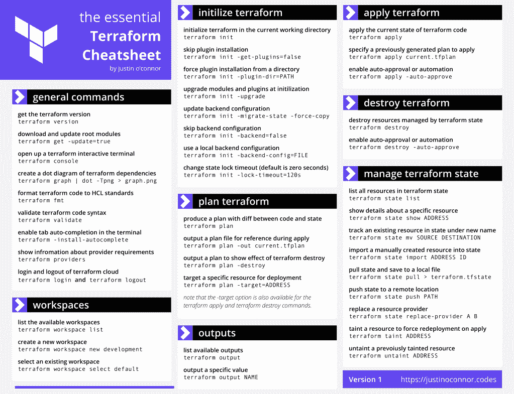

# 如果你在 DevOps 和/或使用 Terraform，有人做了一个很酷的备忘单

> 原文：<https://blog.devgenius.io/if-youre-in-devops-and-or-use-terraform-someone-made-a-cool-cheat-sheet-7ba7e44b68cb?source=collection_archive---------2----------------------->

由[英功](https://unsplash.com/@yinggong)对[破浪](https://unsplash.com/photos/-tg9d-JLXV8)。

让我们面对现实吧:小抄太棒了。

我不是在谈论像婴儿床床单或人们在高中或大学使用的东西。不，我在这里说的是更道德的术语:一个高度浓缩的参考，当你身处困境时可以看看。

一位名叫 Justin O'Connor 的云工程师为 Terraform 做了一份很棒的备忘单，你可以在这里找到。你可以把它打印出来，或者用书签标记，或者保存到你的电脑上。当软件社区的成员完全免费地制作如此棒的资源时，这总是很棒的。

奥康纳这样解释他的工作:

> 我发现很多关于 Terraform 命令的相同问题在寻找最佳开始方式的团队中反复出现。由于缺乏针对 Terraform 的高质量和中肯的备忘单，我想我应该为社区创建一个。
> 
> 请注意，本备忘单并不打算列出所有可能的命令或选项组合(这正是[文档](https://www.terraform.io/docs/cli/index.html)的目的)，而是提供一些最常用命令的列表。

— [基本地形备忘单](https://justinoconnor.codes/2021/09/06/the-essential-terraform-cheat-sheet/)

在他的博客文章中，可以下载 PDF 格式的备忘单，由于它得到了[知识共享署名-共享 4.0 国际许可](http://creativecommons.org/licenses/by-sa/4.0/)的许可，我可以在这里分享它的图片并讨论其中的一些内容。

贾斯汀·所罗门·奥康纳的《基本地形说明书》；[知识共享署名-相似分享 4.0 国际许可](http://creativecommons.org/licenses/by-sa/4.0/)。

床单的组织真的很好；您可以预先获得一些通用命令和一些工作区管理命令。`terraform init`是一个需要了解的有用命令，并且他进入了您可以为其设置的一些标志中。对于那些不知道这个命令是做什么的人，我这里有一篇关于`terraform init`的文章:

 [## terraform init 命令有什么作用？

### 在启动和运行 Terraform 时，您可能会使用的第一个命令是 terraform init。

tremaineeto.medium.com](https://tremaineeto.medium.com/what-does-the-terraform-init-command-do-552c7d81ba7b) 

然后床单进入`terraform plan`、`terraform output`、`terraform apply`、`terraform destroy`和`terraform state`，如果你潜入陆地，所有这些你肯定都会用到。

就是这样——下载 PDF 文件，放在手边！再次感谢贾斯汀·奥康纳制作了这个。无论你做什么，不要做这个在 Reddit 上分享的原始帖子中开玩笑建议的命令(毕竟它没有在备忘单上是有原因的):

 [## 通过我的推荐链接加入媒体

### 作为一个媒体会员，你的会员费的一部分会给你阅读的作家，你可以完全接触到每一个故事…

tremaineeto.medium.com](https://tremaineeto.medium.com/membership)