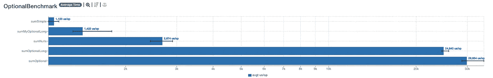
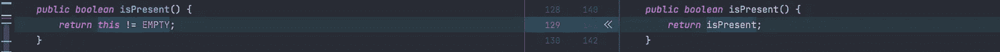
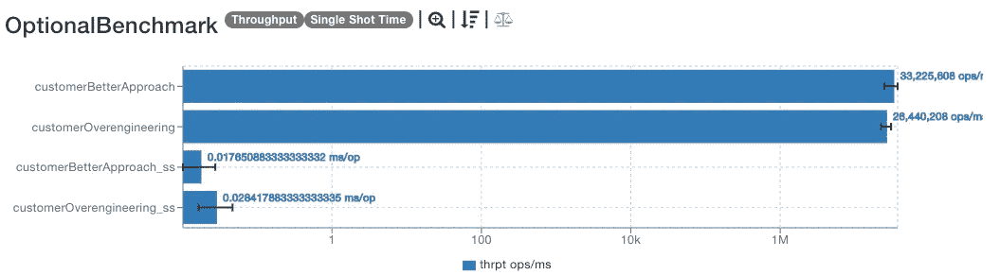

# 无知的 Java 开发人员不理解这 3 个特性的好处

> 原文：<https://blog.devgenius.io/ignorant-java-developers-dont-understand-these-3-feature-benefits-8034d458edea?source=collection_archive---------1----------------------->

## **这就是为什么 Java 开发人员不要低估 Lambdas、Optional 和 Enums 的威力**

来自[派克斯](https://www.pexels.com/photo/photo-of-man-sitting-in-front-of-people-3184299/?utm_content=attributionCopyText&utm_medium=referral&utm_source=pexels)的[派克斯](https://www.pexels.com/@fauxels?utm_content=attributionCopyText&utm_medium=referral&utm_source=pexels)的照片

无知的 Java 开发人员日复一日，编写代码，继续他们的生活。

探险者知道为什么某个变化是重要的。并理解为什么改进很重要。这就是有经验的 Java 开发人员每天提高知识的方式。

***有哪些 Java 特性是理所当然的？*** 带着下面的问题来看看。

为什么 lambda 不仅仅是语法糖？为什么`Optional`在某些场合不好？为什么只有接口的常量已经过时了？

让我们找出无知的开发人员没有注意到的问题。

# 1.你为什么用兰姆达斯？

我们现在都用 Java lambdas。以至于我们甚至为了使用兰姆达斯而使用它们。

在 lambdas 之前，有匿名类。你应该像这样创造它们。

如今，你会得到一个即时通知，切换到兰姆达斯。那么 lambdas 带来了什么，匿名类没有的呢？为什么如今它们如此重要？

假设调用类有很多标量和非标量字段。

***Lambda 激励纯函数开发。***

Lambdas 和匿名类也会捕获调用类。您可以从这两个实现中调用非静态方法。由于 lambdas 可以受益于内联缓存命中，所以最好引用静态方法和有效的最终变量。

***Lambda 速度快，重量轻。每次都会创建匿名类。***

Lambda 应该是一个纯函数，所以 JVM 很容易内联和缓存。因此，只有第一次调用将是“昂贵的”，但随后的每次调用都将对此行为进行摊销。

***lambda 是 JVM 匿名类。匿名类是 Java 匿名类。***

lambdas 的这个属性支持延迟计算的调用点。这就是为什么只有第一个电话是昂贵的。每个下一个调用都更快，因为`ConstantCallSite`被缓存了。本质上，“懒惰”让兰姆达斯跑得更快。

***除了性能属性之外，还增强了可读性。***

你应该让兰姆达斯越小越好。此外，在 lambdas 中避免外部引用，这样 [indy 可以尽可能高效地完成工作](https://blogs.oracle.com/javamagazine/post/behind-the-scenes-how-do-lambda-expressions-really-work-in-java)。如果可能的话，使用方法引用，因为它们比 lambdas 更有效，并且节省代码行。

我在[上深入写过 lambdas 如何打败匿名类](https://medium.com/javarevisited/experienced-developers-use-these-quirks-to-create-better-java-lambdas-4ae656148274)。因此，也可以查看一下，以填补空白或更深入地探索 lambdas。

# 2.为什么你不应该误用`Optional`？

一些开发商滥用可选。

他们在没有上下文的情况下过度使用 Optional。

Optional 提供了良好的 API，吸引了许多懒惰的开发人员。所以他们链接方法，而一个简单的空检查就足够了。

[来源](https://www.govnokod.ru/24731)

你可以看到的另一件事是`ofNullable`的误用。即使这种方法已经存在，仍然需要空检查。因此，如果空检查就足够了，就不要插入可选的。

Optional 带来的另一个东西是可选包装器。`OptionalLong`就是一个例子。
从基准测试中我们可以看出，包装器比普通可选的要快。

基准[详细信息](https://jmh.morethan.io/?gist=7a9da3ea312be8fc6f5716e63caeb6eb)

还有  `[MyOptionalLong](https://gist.github.com/xfix/34b8c8717191c191e577a843cfc9e15b)` 由`Optional`提炼而来，如这位 [Redditor](https://www.reddit.com/r/rust/comments/q99eqe/rust_option_30x_more_efficient_to_return_than/hgynrll/?utm_source=share&utm_medium=web2x&context=3) 所暗示的。

`MyOptionalLong`给`isPresent`增加了一点改进。这使用引用相等来查看 Optional 是否有值。区别就在这里。

这消除了对布尔变量`isPresent`的需要。因此，这个方法让 JVM 执行积极的内联。小改进和思考的食粮！

关于第一个例子，你能做得更好吗？

去掉无用的拳击。此外，在不需要的时候移除空可选的返回。

这种行为上的小变化导致了更好的单次触发时间，以及更好的整体吞吐量。

[详情](https://jmh.morethan.io/?gist=98fd37eda2ddcc819ac8c485ce5d7c35)

以后要问的好问题是: ***“为什么可选？简单的空值检查能完成这项工作吗？”***

可选的好处是`map`函数。这应该会使代码有点混乱。所以不需要下面的序列:

*   检查是否为空
*   null ->返回 null
*   非空->获取值

同样，如果你用`orElse`添加一个默认值，你会得到一个更清晰的代码。

*那么什么时候使用可选呢？*

检查斯图尔特·马克斯的[演示文稿](https://stuartmarks.files.wordpress.com/2016/09/optionalmotherofallbikesheds3.pdf)。因为他更博学，创造了可选择的。

要点: ***避免可选 API 的引力，保持简单。***

# 3.你不需要常量，只需要接口

到目前为止，您可能已经看到了这段代码。

[来源](https://stackoverflow.com/a/14419212/5999670)

你应该使用枚举来代替只有常量的接口。

***枚举提供自定义方法，*** [***缓存机会***](https://richardstartin.github.io/posts/5-java-mundane-performance-tricks#dont-iterate-over-enumvalues) ***，以及*** [***适当枚举结构***](https://richardstartin.github.io/posts/5-java-mundane-performance-tricks) ***。***

*枚举内聚性地把常量放在一个地方。这里有个很好的例子:`[HttpStatus](https://docs.spring.io/spring-framework/docs/current/javadoc-api/org/springframework/http/HttpStatus.html)`。只有常量的接口不会像该枚举那样提供所需的安全性。可以只实现常量接口，而 enum 是 final。这个属性很好地包装了常数，防止了任何滥用。*

你是如何从仅包含常量的接口中提取所有常量的？

Enum 在这里使用`values()`方法。这样你就可以提取所有的常量，并随心所欲地使用它们。此外，您可以缓存这些值并提高性能。这已经用[这个变更集](https://github.com/spring-projects/spring-framework/commit/7f1062159ee9926d5abed7cadc2b36b6b7fc242e)中的`HttpStatus`完成了。

您可能不需要提高性能或一次获取所有常量。即便如此，如果需要的话，你也要为枚举做好准备。

举个例子， ***枚举并不仅仅局限于 Java 代码*** 。您可以使用 JPA 和 Hibernate 将 enums 映射到 PostgreSQL。这意味着您可以将它们与实体一起使用，并在需要时添加额外的枚举逻辑。