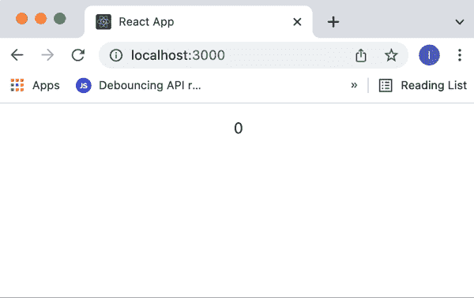

# 设计模式实现示例:第 1 部分

> 原文：<https://blog.devgenius.io/illustrations-of-design-patterns-implementations-part-1-a0094426504a?source=collection_archive---------11----------------------->


感谢 Ricardo Gomes 的这张照片:[https://unsplash.com/@rgaleria](https://unsplash.com/@rgaleria)

当我还是一名初级软件工程师时，我被告知要学习设计模式。我学会了它们。在某种程度上，我意识到我知道并理解了其中的很多，但是当我被要求举出一些应用设计模式的真实案例时——我一个也说不出来。

在这篇文章中，我将给出设计模式的实际实现的例子，我们可以在使用 React 和常见的第三方服务时找到，如 MobX、Redux 等。对于一些模式，我将分享现实生活场景的想法，在那里可以使用这些模式。

# 示例 1:观察者

观察者设计模式是我的最爱之一(因为它是最容易理解的模式之一)。让我们回顾一下这种模式的定义:

> Observer 是一个行为设计模式，它允许你通知几个对象关于他们订阅监听的对象正在发生的某些事件。最新的被称为可观测的。

对于那些不知道的人来说，行为模式是允许对象之间有效交互的模式。

我现在要举的例子很可怕，但我不想想出什么复杂的东西来给你添堵。简单说一下这个模式，假设你有某个网站，它可以根据时间把它的 UI 从亮模式换成暗模式。有趣的是，我们不想把所有的 UI 都改成黑暗模式，我们只想改变 UI 的某些部分。如果是晚上 8 点到早上 6 点，我们希望我们的组件是深色的。否则——光。因此，我们的组件(观察者)需要倾听(观察)时间(可观察的)并相应地改变它的颜色。这基本上可以通过观察者模式来实现。

在我看来，这种模式实现的最好例子是 MobX。MobX 的核心理念是我们创建一个商店，在那里我们有我们的**观察点**。然后，我们用一个**观察者** HOC 包装我们的 React 组件，该观察者为我们的组件订阅可观察对象。

> 重要提示:我们的组件将只监听那些在渲染过程中使用的可观察到的变化。不是所有可观察到的。

我将展示一个稍加修改的示例，摘自 MobX 官方文档:

我们将不讨论 MobX 库的细节，因为这不是本文的主题。我们创建了一个商店，在那里我们希望有我们可观察的**秒**，我们也用 **increaseTimer** 函数修改它。这个例子中你需要知道的就是**make auto observable(this)**会把**秒**变量变成可观测的。

现在，我们将向该商店订阅组件。

如你所见，我们用特设的**观察者**包装了**应用**组件，然后我们开始渲染**秒**，这是我们从**定时器商店**中获取的。

> 重要提示:在 **useEffect** 钩子中，我正在设置一个间隔来调用 **increaseTimer** 方法并改变存储中的 **seconds** 变量，并且我也在卸载时清除这个间隔。记得在卸载时清除间隔和侦听器。

如果我们启动 React 应用程序，看起来会是这样:



**就这样。**这是现实生活中观察者模式实现的一个简单例子。

另一个很好的例子是 Redux 的 **useSelector** 。

在这个特定的例子中,**使用选择器**做什么——它基本上将我们的**应用**组件订阅到 Redux 商店，具体来说是订阅到**用户**数组。每当**用户**数组发生变化，它会通知 **App** 组件，并导致重新渲染。所以，**用户**——是可观察对象，**App**——是观察者。

# 示例 2:工厂

工厂是最受欢迎的模式之一。定义:

> 工厂——是一种创造性的设计模式，它为您提供了一个接口，允许您创建其他类的实例，而无需指定确切的类。

创造性设计模式——是一种让您轻松安全地创建新对象的模式。

简单地说，工厂只是一个对象，它允许你创建其他对象。当然你可以自己创建其他对象，不需要工厂。但是工厂的想法是隐藏其他对象的创建逻辑，因为这个创建逻辑可能很复杂。

我能想到的最好的使用案例之一是这样的——假设你为一家公司工作，这家公司轻视第三方库，想要为几乎任何任务从头创建自己的库。这家公司创建不同的项目，其中一些使用相同的 API。

所以，问题是:我们有几个项目使用相同的 API。而且这些项目有 100%的 API 重复代码。

解决方案:让我们创建一个 NPM 包。这个包将为您提供调用我们的 API 的方法。

但是工厂模式在哪里？怎么用？

假设我们必须创建一个 NPM 包，它允许我们调用这些路由:
GET*/users*to*GET 一组用户 *GET*/users/:id*to*GET 一个特定用户
GET*/activities*to*GET 一组活动
GET*/activities/:id【id*****

**我将以这种方式完成这项任务(没有工厂模式的示例):**

1.  **创建网络客户端。**

**这个网络客户端基本上用默认配置设置了 Axios， **networkClient** 变量公开了一些方法，我可以用它们来调用 API。在这个特殊的例子中，我们只能发出 GET 请求。**

**2.为用户创造服务。**

**这只是一个具有两个方法的类，这两个方法非常简单——这两个方法使用**网络客户端**向用户 API 发出 GET 请求。然后我导出这个类的一个实例。**

**3.为活动创建服务。**

**4.我们如何使用这些服务的例子。**

**看一下导入，我正在导入用户服务 API，然后导入活动服务 API。这就是问题所在，用户服务和活动服务在我们公司的许多应用程序中重复，我们必须进行两次导入，而我们只能进行一次导入。带有工厂模式。**

**现在到工厂模式。让我们稍微修改一下我们的用户服务和活动服务:**

**注意，我们不再导入这些类的实例，而是导入类本身。**

**现在，我们的 API 工厂将如下所示:**

**我用可用的 API 服务创建了一个对象**API**。然后，我查看这个 API 服务是否存在—我返回这个服务的一个新实例，如果不存在—我抛出一个错误。**

> **提示:我没有使用 if-else/switch，因为通过键访问对象的值更快。在这个特殊的例子中，if-else/switch 就可以了(因为只有 2 个 API)，但是在我们想象的情况下，我们可能有 10 个以上的 API 要调用，所以 object 会更好。**

**然后我会像这样使用这个工厂:**

**您看，现在我们只导入一个工厂，并从这个工厂获取我们服务的实例。关键是，如果我真的用这个工厂创建了一个库，我们的导入会是这样的:**

```
**import apiFactory from '@companyName/apiFactory';**
```

****就是这个**，我已经隐藏了服务实例的创建细节。现在，您不需要自己创建服务，不需要向您的项目添加更多代码，您只需使用这个**@ company name/API factory**NPM 包，并访问您需要进行 API 调用的任何实例。**

**当然，您可以在 **node_modules** 中看到源代码，但是您需要这样做吗？如果事情不顺利，也许你会。我有时也会检查 **node_modules** 并在需要时创建补丁。但是现在——你有一个工厂，工厂返回你需要的实例，你不需要其他任何东西。**

**感谢您阅读这篇文章。如果您有任何意见、问题，认为有些地方解释错误或可以解释得更好，请通过电子邮件***islamrustamov @ rambler . ru***或下面的评论与我联系。**

***资源:***

***百科—*[](https://www.wikipedia.org/)**

****Redux 官方文档—*[*https://react-redux.js.org/api/hooks*](https://react-redux.js.org/api/hooks)***

***MobX 官方文档—*[*https://mobx.js.org/README.html*](https://mobx.js.org/README.html)**

***我的头***