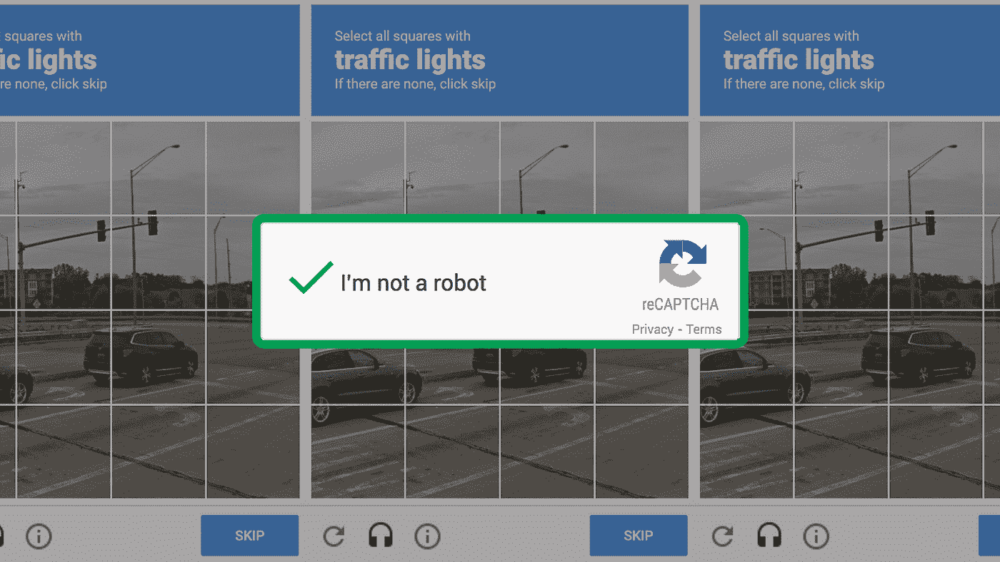

# 我是人还是机器人，知道谷歌做什么

> 原文：<https://blog.devgenius.io/im-a-human-or-a-robot-knowing-what-google-does-c6cb88fe02f1?source=collection_archive---------6----------------------->

## 谷歌验证码背后的原因

[来源](https://www.prothomalo.com/education/science-tech/%E0%A6%86%E0%A6%AE%E0%A6%BF-%E0%A6%B9%E0%A6%BF%E0%A6%89%E0%A6%AE%E0%A7%8D%E0%A6%AF%E0%A6%BE%E0%A6%A8-%E0%A6%A8%E0%A6%BE-%E0%A6%B0%E0%A7%8B%E0%A6%AC%E0%A6%9F-%E0%A6%A4%E0%A6%BE-%E0%A6%9C%E0%A7%87%E0%A6%A8%E0%A7%87-%E0%A6%97%E0%A7%81%E0%A6%97%E0%A6%B2%E0%A7%87%E0%A6%B0-%E0%A6%95%E0%A6%BE%E0%A6%9C-%E0%A6%95%E0%A7%80)

在谷歌上很难找到没有经过人工验证的用户。这个验证对所有人来说都是一个麻烦，但是为什么 Google 还在用这个呢？这里我们就知道背后的原因了。

# 谷歌假装是情人。

由[凯文·莱特拉](https://unsplash.com/@kev200?utm_source=medium&utm_medium=referral)在 [Unsplash](https://unsplash.com?utm_source=medium&utm_medium=referral) 上拍摄的照片

谷歌偶尔表现得像个情人。现在好多了，现在他转着嘴唇说，你对我来说是谁！

然后谷歌还要用各种方式解释我是谁。你要选择图中的红绿灯。哪幅画里有自行车，就要展示出来。再次，你必须键入图中所示的字母。

最可悲的是当我看到世界上有 60 万种生物时，谷歌却宣布我是机器人。然后你要证明自己是一个人。很难找到没有使用谷歌返回捕获的人。

假设你正在毫不犹豫地浏览谷歌。这样的时间会让你匆忙接受考验。你会被要求证明你不是机器人。而且我也是这么说的如果你想通过考试，而不是没有答对卷子。

如果答案是正确的，您将能够像以前一样再次在谷歌上搜索信息。如果出现错误，您将不得不再次键入字符，或者从新的一组图像中选择某些图像。

# 验证码背后的故事

谷歌要求你匹配的字母或图像被称为验证码。captcha 这个词是由英语中一串笨拙的单词的首字母组成的。谷歌的系统是为了证明正在浏览谷歌的人是人造人，而不是自动化程序。

谷歌表示，验证码是由垃圾邮件、受恶意软件感染的计算机、老式 DSL 路由器或 SEO 排名工具引起的。

现在的问题是，为什么要向您显示验证码是为了阻止恶意的自动化软件而创建的？

这个问题的简单答案是，谷歌可能把你误认为一个自动化程序或机器人。然后，您可能需要键入图像中的字符作为捕获答案，或者单击特定的图像。
不过，如果你反复显示验证码，可以用杀毒软件扫描一下，看看是否感染了恶意软件。现在我们进入第二个问题，谷歌为什么要停止自动化软件？

# 为什么谷歌对机器人有这么多异议？

[亚历山大·奈特](https://unsplash.com/@agk42?utm_source=medium&utm_medium=referral)在 [Unsplash](https://unsplash.com?utm_source=medium&utm_medium=referral) 上拍照

虽然谷歌免费提供信息搜索服务，但公司成本巨大。有服务器成本；有带宽成本，有员工工资。可以显示 100 个这样的成本部分。

谷歌为你提供免费服务，交换条件是展示广告。他的收入也很高。但谷歌使用自动化工具或机器人来使用服务有什么好处呢？
给机器人看广告没有任何好处。机器人在看到饼干的广告后，将无法在商店里购买饼干。

另一个原因是很多时候 Google 通过 SEO 排名工具自动搜索某些关键词。基本上，许多人这样做是为了确保当他们通过键入谷歌排名或那些关键词来搜索网站时，它会显示在结果的开头。但这是不道德的。这就是为什么谷歌使用验证码来停止使用这个自动化工具。

# 还是有更大的目的？

然而，谷歌显示验证码的背后可能有更大的目的。因此，他们的人工智能可以用来训练软件。

给人工智能程序输入的数据越多，它能学习的就越多。然而，提供大量信息并不是一件容易的事情。谷歌利用像你我这样的用户来简化这个过程。

此前，谷歌习惯于输入验证码中显示的随机字母或数字。这有助于谷歌软件理解扫描书籍页面上的文本。或者帮助谷歌识别图像中显示的物体。

又想起来了；验证码会让你识别红绿灯。你已经在很多图片里辨认出来了。虽然这些数据很少，但它将帮助谷歌开发无人驾驶汽车技术。也许不是今天，而是将来的某一天。无人驾驶汽车可能会通过结合成千上万的信息，如你输入的信息，来学习识别道路上的交通灯。

一方面，你免费为谷歌工作。另一方面，即使是一小步，他也凭借过硬的技术向前迈了一步。

# 一锤定音

然而，当验证码出现时，就没有机会避免了。花我们生命中宝贵的两秒钟，就可以回答谷歌的问题。我们可以为我们对伟大技术的发展所做的小小贡献感到骄傲。

参考:[https://www.prothomalo.com](https://www.prothomalo.com/education/science-tech/%E0%A6%86%E0%A6%AE%E0%A6%BF-%E0%A6%B9%E0%A6%BF%E0%A6%89%E0%A6%AE%E0%A7%8D%E0%A6%AF%E0%A6%BE%E0%A6%A8-%E0%A6%A8%E0%A6%BE-%E0%A6%B0%E0%A7%8B%E0%A6%AC%E0%A6%9F-%E0%A6%A4%E0%A6%BE-%E0%A6%9C%E0%A7%87%E0%A6%A8%E0%A7%87-%E0%A6%97%E0%A7%81%E0%A6%97%E0%A6%B2%E0%A7%87%E0%A6%B0-%E0%A6%95%E0%A6%BE%E0%A6%9C-%E0%A6%95%E0%A7%80)