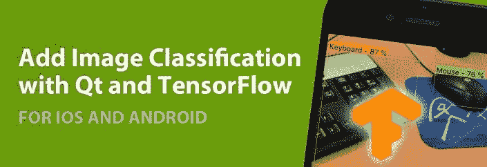
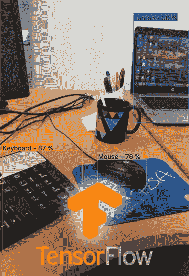
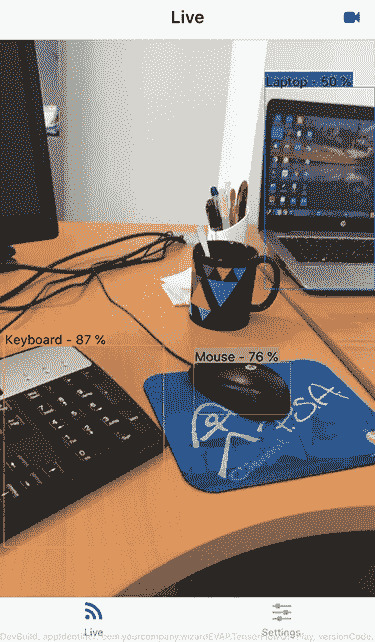
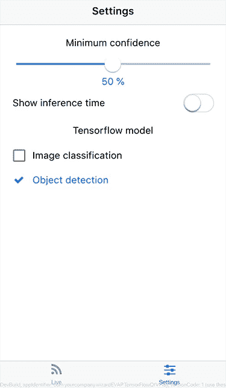
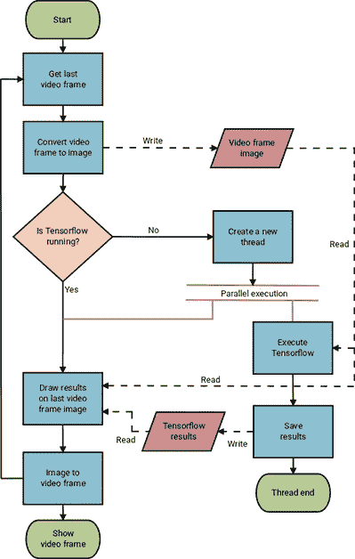

# 图像分类和机器学习教程| Qt & TensorFlow

> 原文：<https://blog.devgenius.io/image-classification-machine-learning-tutorial-qt-tensorflow-b8c3ae56679c?source=collection_archive---------29----------------------->

人工智能和智能应用正稳步变得越来越受欢迎。公司强烈依赖人工智能系统和机器学习，根据他们的数据做出更快、更准确的决策。

本指南提供了一个使用 Google 的 TensorFlow 框架进行图像分类和对象检测的示例。

通过阅读这篇文章，你将学会如何:

*   为 Android、iOS 和桌面 Linux 构建 TensorFlow。
*   将 TensorFlow 集成到基于 Qt 的 [Felgo](https://felgo.com/) 项目中。
*   使用 TensorFlow API 运行图像分类和对象检测模型。

# 为什么要在手机应用中加入人工智能

截至 2017 年，四分之一的组织已经将超过 15%的 IT 预算投资于机器学习[。随着超过 75%的企业在](https://www.statista.com/statistics/695582/worldwide-machine-learning-share-of-budget/)[大数据](https://www.gartner.com/newsroom/id/3130817)上投入资金和精力，机器学习在未来将变得更加重要。

# 机器学习的真实例子

人工智能正在成为一项业务关键技术，其目标是通过更加数据驱动的方法来改善决策。不管是哪个行业，机器学习都有助于**让计算过程更高效、更划算、更可靠**。例如，它用于:

*   **金融服务:**跟踪客户和客户满意度，对市场趋势做出反应或计算风险。例如，PayPal 使用机器学习来检测和打击欺诈。
*   **医疗保健:**用于个性化健康监测系统，使医疗保健专业人员能够及早发现潜在异常。看看[人工智能在医疗保健领域的最新例子](https://sombrainc.com/ai-in-healthcare-2019-can-intelligent-machines-make-humans-healthier)。
*   **零售:**根据你之前的购买或活动提供个性化推荐。例如，网飞或 Spotify 上的推荐。
*   **语音识别系统**，比如 Siri 或者 Cortana。
*   **人脸识别系统**，比如脸书的 DeepLink。
*   **垃圾邮件检测和**过滤。

# 图像分类和对象检测示例

**TensorFlow** 是 Google 开放的机器学习框架。其灵活的架构允许跨各种平台(CPU、GPU、TPU)和架构(桌面、服务器集群、移动和边缘设备)轻松部署计算。它支持 Linux、macOS、Windows、Android 和 iOS 等。

## 关于张量流

TensorFlow 有不同的味道。主要的是*张量流*。另一个是 *TensorFlow Lite* ，这是 TensorFlow 针对移动和嵌入式设备的轻量级解决方案。然而，TensorFlow Lite 目前处于技术预览状态。这意味着目前并不支持所有 TensorFlow 特性，尽管在不久的将来它将成为移动和嵌入式设备的参考。

关于如何使用 Tensorflow 构建应用程序，有大量的在线资料。首先，我们强烈推荐 TensorFlow 移动/嵌入式团队负责人 Pete Warden 的免费电子书[使用 TensorFlow 构建移动应用](https://www.oreilly.com/data/free/building-mobile-applications-with-tensorflow.csp)。

本指南的示例使用了最初的 TensorFow 风格。它展示了如何将 TensorFlow 与 Qt 和 [Felgo](https://felgo.com/) to 集成，以创建一个简单的多平台应用程序，其中包括两个预训练的神经网络，一个用于图像分类，另一个用于对象检测。这个例子的代码托管在 [GitHub](https://github.com/FelgoSDK/TensorFlowQtVPlay) 上。

## 克隆存储库

要克隆此存储库，请执行以下命令，递归克隆它，因为 TensorFlow 存储库位于其中。包含的 Tensorflow 版本是 1.8。

[现在就在你的 iOS 或 Android 设备上运行这段代码](https://felgo.com/web-editor?snippet=d70a3a95)，并实时重新加载代码

非常感谢项目开发人员分享此示例并准备本指南:

*   *贾维尔·博尼拉，计算机科学博士，在欧洲最大的聚光太阳能技术研发和测试中心之一的 CIEMAT-Plataforma Solar de almería(PSA)**从事聚光太阳能热设施和发电厂的建模、优化和自动控制研究。*
*   *何塞·安东尼奥·卡巴略，机械工程师，博士生，来自* [*阿尔梅里亚大学*](http://cms.ual.es/UAL/en/) *，在*[*CIEMAT-Plataforma Solar de almería(PSA)*](http://www.psa.es/en/index.php)*从事关于聚光太阳能热设施和发电厂中有效利用水和能源的建模、优化和自动控制的博士论文。*

# 将 Felgo 和 Qt 与 TensorFlow 配合使用的优势

Felgo 和 Qt 是多平台应用程序的优秀工具。Qt 拥有一套丰富的现成可用的[多平台组件](https://felgo.com/doc/apps-api/)用于不同的领域，如**多媒体、网络和连接、图形、输入法、传感器、数据存储和更多**。Felgo 进一步有助于简化移动和嵌入式设备的部署，并添加了一些不错的功能，如**分辨率和纵横比独立性以及额外的组件和控件**。Felgo 还提供了更容易访问的原生特性，以及货币化、分析、云服务等插件。

Felgo 的一个很好的特性是，它不局限于移动设备，所以您可以在您的开发计算机上测试和原型化您的应用程序，这肯定比编译和部署您的应用程序到模拟器要快。你甚至可以使用 Felgo live reloading 来查看代码的变化。Android 和 iOS 设备也支持实时重装，非常适合在移动设备上微调更改或测试代码片段。

因此 Tensorflow 提供了机器学习框架，而 [Felgo](https://felgo.com/) 和 Qt 促进了应用程序在多个平台上的部署:桌面和移动。

如果您需要帮助，请获得 [Qt 培训和咨询服务](https://felgo.com/qt-training-consulting-services/)。

# 如何为 Qt 构建 TensorFlow

我们需要为每个平台和架构构建 TensorFlow。推荐的方式是使用`bazel`构建系统。但是，我们将在这个例子中探索如何使用`make`来构建适用于 Linux、Android 和 iOS 的 TensorFlow。检查是否安装了所有必需的库和工具，TensorFlow Makefile 自述文件。

如果您对构建用于 macOS 的 Tensorflow 感兴趣，请查看 Makefile 自述文件中支持的系统部分。对于 Windows，选中 TensorFlow CMake build。

如果您在编译过程中遇到问题，请查看 open Tensorflow [issues](https://github.com/tensorflow/tensorflow/issues) 或在那里发布您的问题以获得帮助。

一旦你建立了 Tensorflow，你的应用程序就可以链接这三个库:`libtensorflow-core.a`、`libprotobuf.a`和`libnsync.a`。

**注意:**当你为不同平台和架构构建时，在同一个 Tensorflow 源代码文件夹中，Tensorflow 可能会删除之前编译的库，所以一定要备份。这些是您可以找到这些库的路径，带有`MAKEFILE_DIR=./tensorflow/tensorflow/contrib/makefile`:

*   Linux
    -libtensor flow-core:`$(MAKEFILE_DIR)/gen/lib` -libprotobuf:`$(MAKEFILE_DIR)/gen/protobuf/lib64` -libsync:`$(MAKEFILE_DIR)/downloads/nsync/builds/default.linux.c++11/`
*   Android ARM V7
    -libtensor flow-core:`$(MAKEFILE_DIR)/gen/lib/android_armeabi-v7a` -libprotobuf:`$(MAKEFILE_DIR)/gen/protobuf_android/armeabi-v7a/lib/` -libsync:`$(MAKEFILE_DIR)/downloads/nsync/builds/armeabi-v7a.android.c++11/`
*   Android x86
    -libtensor flow-core:`$(MAKEFILE_DIR)/gen/lib/android_x86` -libprotobuf:`$(MAKEFILE_DIR)/gen/protobuf_android/x86/lib/` -libsync:`$(MAKEFILE_DIR)/downloads/nsync/builds/x86.android.c++11/`
*   iOS
    -libtensor flow-core:`$(MAKEFILE_DIR)/gen/lib` -libprotobuf:`$(MAKEFILE_DIR)/gen/protobuf_ios/lib/` -libsync:`$(MAKEFILE_DIR)/downloads/nsync/builds/arm64.ios.c++11/`

以下部分中的 shell 命令仅在 Tensorflow 主文件夹中执行时才有效。

# 为 Linux 构建

我们只需要执行下面的 Linux 编译脚本。

[现在在你的 iOS 或 Android 设备上运行这段代码](https://felgo.com/web-editor?snippet=40206c954)，并实时重新加载代码

如果您正在为 64 位版本进行编译，可能会遇到以下编译错误:

现在，在你的 iOS 或 Android 设备上运行这段代码,并实时重新加载代码

在这种情况下，将`tensorflow/tensorflow/contrib/makefile/Makefile`文件中的`$(MAKEFILE_DIR)/gen/protobuf-host/lib`引用更改为`$(MAKEFILE_DIR)/gen/protobuf-host/lib64`。

对于某些 GCC 8 编译器版本，可能会出现以下错误。

[现在就在你的 iOS 或 Android 设备上运行这段代码](https://felgo.com/web-editor?snippet=23a4447e),并实时重新加载代码

为了避免这种情况，请在`tensorflow/tensorflow/contrib/makefile/compile_nsync.sh`文件中的用于 Linux 的`PLATFORM_CFLAGS`变量(`case "$target_platform" in linux`)中包含`-Wno-error=class-memaccess`标志。

# 为 Android 构建(在 Linux 上)

首先，您需要设置`NDK_ROOT`环境变量指向您的 NDK 根路径。你可以从这个链接下载。第二，你需要在 NDK 编译 cpu 特性库。这个例子是用安卓 NDK r14e 测试的。

[现在就在你的 iOS 或 Android 设备上运行这段代码](https://felgo.com/web-editor?snippet=9dd42897)，并重新加载实时代码

然后，执行下面的脚本，为`ARM v7`指令编译 Tensorflow。

[现在就在你的 iOS 或 Android 设备上运行这段代码](https://felgo.com/web-editor?snippet=85aa29d5),并实时重新加载代码

如果要针对`x86`平台编译。例如，为了在 Android 模拟器中进行调试，使用以下参数执行相同的命令。

**注意:**如果您在使用 Android NDK r14 编译 Android x86 时遇到问题，请使用 Android NDK r10e，并根据其路径设置`NDK_ROOT`。

[现在在你的 iOS 或 Android 设备上运行这段代码](https://felgo.com/web-editor?snippet=acbffee6)，并实时重新加载代码

Tensorflow Android 支持的架构如下。

[现在在你的 iOS 或 Android 设备上运行这段代码](https://felgo.com/web-editor?snippet=3d97d7ba)，并实时重新加载代码

# 为 iOS 构建(在 macOS 上)

以下脚本可用于在 macOS 上为 iOS 构建 Tensorflow。

现在，在你的 iOS 或 Android 设备上运行这段代码,并实时重新加载代码

如果在为 iOS 构建 Tensorflow 时出现以下错误。

[现在就在你的 iOS 或 Android 设备上运行这段代码](https://felgo.com/web-editor?snippet=98cd5c30)，并实时重新加载代码

你可以避免它执行[这个评论](https://github.com/tensorflow/tensorflow/issues/18356)中给出的改变。也就是在`Makefile`中将`-D__thread=thread_local \`改为`-D__thread= \`(仅针对`i386`架构)。

# 如何在您的 Qt 手机应用程序中使用 TensorFlow

这个应用的源代码在一个 GitHub 仓库里。本节将介绍应用程序代码。

# 在项目中链接 TensorFlow

以下代码显示了添加到我们的`qmake`项目文件中的行，以便根据目标平台包含 TensorFlow 头文件和 TensorFlow 库的链接。

对于 Android，在 Qt Creator 中`ANDROID_NDK_ROOT`被设置为 Android NDK r14e 的路径`ANDROID_NDK_PLATFORM`被设置为`android-21`(项目- >构建环境)。

[现在在你的 iOS 或 Android 设备上运行这段代码](https://felgo.com/web-editor?snippet=e96c7c3a)，并实时重新加载代码

# 用 QML 创建 GUI

GUI 非常简单，只有两个页面。

*   **现场视频输出页面**:用户可以在前后摄像头之间切换。
*   **设置页面**:设置最小置信度和选择模型的页面:一个用于图像分类，另一个用于物体检测。

## Main.qml

在`main.qml`中，有一个[存储](https://felgo.com/doc/vplay-storage/)组件，用于加载/保存最小置信水平、所选模型以及是否显示推断时间。推理时间是 Tensorflow 神经网络模型处理图像所用的时间。存储键为`kMinConfidence`、`kModel`和`kShowTime`。它们的默认值由`defMinConfidence`、`defModel`和`defShowTime`给出。实际值存储在`minConfidence`、`model`和`showTime`中。

[现在就在你的 iOS 或 Android 设备上运行这段代码](https://felgo.com/web-editor?snippet=4376528a)，并实时重新加载代码

有一个[导航](https://felgo.com/doc/vplayapps-navigation/)组件，有两个[导航项](https://felgo.com/doc/vplayapps-navigationitem/)，每个都是一个[页面](https://felgo.com/doc/vplayapps-page/)。`VideoPage`显示现场摄像机输出。它读取`minConfidence`、`model`和`showTime`属性。`AppSettingsPage`也读取这些属性，并在`onMinConfidenceChanged`、`onModelChanged`和`onShowTimeChanged`事件中设置它们的新值。

[现在在你的 iOS 或 Android 设备上运行这段代码](https://felgo.com/web-editor?snippet=c802fc7b)，并实时重新加载代码

## 视频页面. qml

下面是 iOS 上物体检测的视频页面截图。

`QtMultimedia`模块加载在该页面上。

[现在在你的 iOS 或 Android 设备上运行这段代码](https://felgo.com/web-editor?snippet=b424882e)，并实时重新加载代码

`VideoPage`具有`minConfidence`、`model`和`showTime`属性。它还有另一个属性来存储摄像机索引，`cameraIndex`。

现在，在你的 iOS 或 Android 设备上运行这段代码,并实时重新加载代码

当页面显示或隐藏时，有一个启动和停止的照相机组件。它有两个布尔属性。如果至少有一台摄像机，则第一个为真，如果至少有两台摄像机，则第二个为真。

现在，在你的 iOS 或 Android 设备上运行这段代码,并实时重新加载代码

导航栏中还有一个按钮，用于切换相机。仅当有多台摄像机可用时，此按钮才可见。由于 [Qt 错误 37955](https://bugreports.qt.io/browse/QTBUG-37955) ，需要`initialRotation()`功能，该错误会错误地旋转 iOS 上的前置摄像头视频输出。

[现在就在你的 iOS 或 Android 设备上运行这段代码](https://felgo.com/web-editor?snippet=ae0fdd9f)，并实时重新加载代码

现在，在你的 iOS 或 Android 设备上运行这段代码,并实时重新加载代码

当没有检测到摄像机时，会向用户显示一个图标和一条消息。

[现在就在你的 iOS 或 Android 设备上运行这段代码](https://felgo.com/web-editor?snippet=92bc751e),并实时重新加载代码

当相机加载时，一个带有酷动画的图标和一条消息也会显示给用户。

[现在就在你的 iOS 或 Android 设备上运行这段代码](https://felgo.com/web-editor?snippet=001c66f3)，并实时重新加载代码

摄像机视频输出占据了整个页面。仅当至少
一台摄像机被检测到并处于活动状态时才可见。我们定义了一个在 C++类中实现的过滤器`objectsRecognitionFilter`。该过滤器获取每个视频帧，将其作为输入数据转换到 TensorFlow，调用 TensorFlow 并在视频帧上绘制结果。这个 C++类后面会介绍。

[现在就在你的 iOS 或 Android 设备上运行这段代码](https://felgo.com/web-editor?snippet=96f16a21),并实时重新加载代码

## AppSettingsPage.qml

下面是 iOS 上的这个页面的截图。

`AppSettingsPage`允许用户使用滑块选择检测的最低置信水平。滑块值存储在`minConfidence`中。

[现在就在你的 iOS 或 Android 设备上运行这段代码](https://felgo.com/web-editor?snippet=b510de43)，并实时重新加载代码

推理时间，Tensorflow 处理图像所花费的时间也可以显示在屏幕上。它可以通过开关启用或禁用。布尔值存储在`showTime`中。

现在，在你的 iOS 或 Android 设备上运行这段代码，并重新加载代码

还有两个专用的复选框来选择模型:一个用于图像分类，另一个用于对象检测。所选模型存储在“模型”属性中。如果当前选定的模型未被选中，则另一个模型会被自动选中，因为它们中的一个应该总是被选中。

[现在就在你的 iOS 或 Android 设备上运行这段代码](https://felgo.com/web-editor?snippet=d0b6077f)，并实时重新加载代码

# C++ TensorFlow 接口和视频帧过滤器

用 C++编写了两个主要任务。

*   与 TensorFow 接口
*   管理视频帧

这里没有详细介绍 C++类的源代码，相反，对过程进行了概述和解释，并给出了进一步细节的链接。不过，你可以看看托管在 [GitHub](https://github.com/FelgoSDK/TensorFlowQtVPlay) 上的源代码。

## 与 Tensorflow 接口

C++类与 TensorFlow 库接口，查看代码以获得该类的详细描述。这个类是一个包装器，查看 [Tensorflow C++ API](https://www.tensorflow.org/api_guides/cc/guide) 文档了解更多信息。

## 管理视频帧

下一个流程图显示了管理视频帧的工作流程。

对象过滤器`ObjectsRecognizer`被应用到`VideoOutput`来处理帧。这个过滤器是通过 C++类实现的:`ObjectsRecogFilter`和`ObjectsRecogFilterRunable`，有关如何应用过滤器的更多信息，请查看[Qt 多媒体中的视频过滤器介绍](http://blog.qt.io/blog/2015/03/20/introducing-video-filters-in-qt-multimedia/)。

过滤器在`ObjectsRecogFilter`类的“运行”方法中进行处理。一般步骤如下。

1.  我们需要将我们的`QVideoFrame`转换成`QImage`，这样我们就可以操纵它。
2.  我们检查 Tensorflow 是否正在运行。由于 Tensorflow 在另一个线程中执行，我们使用了`QMutex`和`QMutexLocker`类来检查它是否正在运行。一个很好的例子在 [QMutexLocker 类文档](http://doc.qt.io/qt-5/qmutexlocker.html)中给出。
    -如果 Tensorflow 正在运行—什么都不做
    -如果 Tensorflow 没有运行—我们通过 C++类在另一个线程中执行它:`TensorflowThread`和`WorkerTF`，信号和插槽用于与主线程和这些类通信，查看【QThreads 通用用法】(https://wiki . Qt . io/QThreads _ general _ usage)了解更多详细信息。我们提供视频帧图像作为输入。当 Tensorflow 完成时，我们也通过信号和槽来存储所选模型给出的结果。
3.  我们获得存储的结果(如果有的话)并将它们应用于当前的视频帧图像。如果我们的模型是图像分类，如果分数高于最小置信度值，我们只需绘制顶级图像类的名称和分数。如果我们的模型是对象检测，我们迭代所有的检测并画出边界框、对象的名称和置信度值，如果它们高于最小置信度水平的话。有一个辅助的 C++类，`AuxUtils`，提供了在框架上绘图的函数，比如`drawText`和`drawBoxes`。
4.  最后一步是将我们的`QImage`转换回由 QML `VideoOutput`组件处理的`QVideoFrame`，然后我们返回去处理一个新的视频帧。

# 用于图像分类和目标检测的神经网络模型

我们需要神经网络模型来执行图像分类和对象检测任务。谷歌提供了一套预先训练好的模型来做到这一点。Tensorflow 冻结神经网络模型的文件扩展名为`.pb`。Github 上的例子已经包括 [MobileNet](https://ai.googleblog.com/2017/06/mobilenets-open-source-models-for.html) 型号: [MobileNet V2 1.0_224](https://storage.googleapis.com/mobilenet_v2/checkpoints/mobilenet_v2_1.0_224.tgz) 用于图像分类， [SSD MobileNet V1 coco](http://download.tensorflow.org/models/object_detection/ssd_mobilenet_v1_coco_2018_01_28.tar.gz) 用于物体检测。MobileNets 是一类用于移动和嵌入式视觉应用的高效神经网络模型。

## 图像分类模型

图像分类模型可以从 [TensorFlow-Slim 图像分类模型库](https://github.com/tensorflow/models/tree/master/research/slim)下载。我们的示例代码是为`MobileNet`神经网络设计的。比如下载 mobilenet_v2_1.0_224.tgz，解压后将`mobilenet_v2_1.0_224_frozen.pb`文件复制到我们的`assets`文件夹中作为`image_classification.pb`。这种情况下的图像大小，`224 x 224`像素，是在我们的`Tensorflow` C++类中定义的常量`fixed_width`和`fixed_height`中设置的。本例中的输出层`MobilenetV2/Predictions/Reshape_1`也在`Tensorflow`类的常量列表变量`listOutputsImgCla`中指定。这些型号的标签已经设置在`image_classification_labels.txt`文件中。标签属于 ImageNet 类。

## 目标检测模型

查看 [Tensorflow 检测模型动物园](https://github.com/tensorflow/models/blob/master/research/object_detection/g3doc/detection_model_zoo.md)获取物体检测模型的完整列表。可以使用任何`SSD MobileNet`型号。这种模型为每个被检测对象提供*标题*、*置信度*和*包围盒*输出。例如，下载`ssd_mobilenet_v1_coco_2018_01_28.tar.gz`并解压缩，将`frozen_inference_graph.pb`复制到我们的`assets`文件夹中作为`object_detection.pb`。这种型号的标签已经由`object_detection_labels.txt`文件给出。标签属于 [COCO 标签](https://github.com/nightrome/cocostuff/blob/master/labels.md)。

# 已知问题

尽管给出的例子是可行的，但仍有改进的余地。特别是在 C++代码中，天真的解决方案被认为是简单的。

还有一些问题需要解决，下面的列表总结了这些问题。

*   即使对于高端移动设备，iOS 上的应用程序性能也比 Android 上的高得多。找到这种情况的根本原因需要进一步的调查。
*   `AuxUtils` C++类的`sp`方法旨在提供独立于屏幕大小和分辨率的字体像素大小，尽管它并不适用于所有设备。因此，应该考虑由[费尔戈 QML](https://felgo.com/doc/vplayapps-app/#sp-method) `[sp](https://felgo.com/doc/vplayapps-app/#sp-method)`函数提供的相同实现。
*   从 QML 和 Qt 类可以很容易地访问资产文件。例如，`assets:/assets/model.pbit` 提供了一个名为`model.pb`的文件的访问权限，该文件存储在 Android 的 assets 文件夹中。然而，从一般的 C++类中访问资产并不容易，因为这些类不能解析`assets:/`。Tensorflow C++类就是这种情况。当前的解决方案是将文件复制到一个众所周知的路径，例如复制到`QStandardPaths::writableLocation(QStandardPaths::AppLocalDataLocation)`，但是这涉及到检查目标文件夹是否存在(或者创建它)，检查资产文件是否存在并且没有改变(或者复制它)。
*   `QVideoFrame`转换为`QImage`是为了在`ObjectsRecogFilterRunable` C++类的`run`方法中利用它。目前，这是使用 Qt 私有模块`multimedia-private`中的`qt_imageFromVideoFrame`函数来完成的。因此，应用程序被绑定到这个特定的 Qt 模块构建版本，针对其他版本的 Qt 模块运行应用程序可能会在任何时候崩溃。此外，`qt_imageFromVideoFrame`功能无法正确管理 BGR 视频帧的转换。因此，它们在不使用该功能的情况下被转换成图像。
*   当前实现在处理视频帧的独立线程中连续执行 Tensorflow。也就是 Tensorflow 线程结束时，会用最新的帧再次执行。这种方法提供了流畅的用户体验，但另一方面，它使设备变得相当热，并快速耗尽电池。

如果您有将 TensorFlow 集成到您的 Felgo 应用程序的业务请求，请不要犹豫，欢迎致电[support@felgo.com](mailto:support@felgo.com)或[联系我们这里](https://felgo.com/contact/)。Felgo SDK 是免费使用的，所以一定要去看看！

如果你喜欢这篇文章，请随意在脸书或推特上分享。

# 更多相关应用开发资源

*   [Qt AR:为什么以及如何给你的手机应用添加增强现实](https://felgo.com/cross-platform-app-development/qt-ar-why-and-how-to-add-augmented-reality-to-your-mobile-app)
*   [处理安全区域插页，切口&iPhone X、iPad X 和 Android P 的显示屏切口](https://felgo.com/cross-platform-app-development/notch-developer-guide-ios-android)

# 最佳应用程序开发教程和免费应用程序模板

所有这些教程都附有移动应用程序的完整源代码！你可以免费复制代码来制作你自己的应用程序！

*   [如何用单一代码库为 iOS & Android 创建移动应用](https://felgo.com/doc/apps-getting-started/)
*   [如何在您的手机应用中支持多语言和国际化](https://felgo.com/doc/howto-multi-language/)
*   [跨平台应用中的常用 Widgets &控件](https://felgo.com/doc/apps-howto-common-widgets-and-controls/)
*   [如何支持多种屏幕尺寸&屏幕密度—响应式应用指南](https://felgo.com/doc/apps-supporting-multiple-screens-and-screen-densities/)
*   [应用布局指南](https://felgo.com/doc/apps-howto-layout-and-positioning/)
*   [应用导航指南](https://felgo.com/doc/apps-howto-use-app-navigation/)
*   [如何给你的手机 App 添加原生代码](https://felgo.com/doc/apps-howto-app-logic/)
*   [如何用主题轻松设计你的应用](https://felgo.com/doc/apps-howto-style-your-app-with-themes/)
*   [如何为你的应用添加动画](https://felgo.com/doc/apps-howto-make-animations/)
*   [如何在手机应用程序中添加聊天内容](https://felgo.com/cross-platform-app-development/how-to-add-chat-service-and-cross-platform-leaderboard-with-user-profiles-to-your-ios-or-android-app)
*   [如何让天气 App 接入休息天气服务](https://felgo.com/cross-platform-app-development/access-rest-services-qt-v-play-weather-service-example-app-open-source)
*   [会议 App 模板](https://felgo.com/events/qt-world-summit-open-source-conference-app)
*   [Widget Gallery 应用模板](https://felgo.com/doc/v-play-appdemos-showcase-example/)
*   [推特应用模板](https://felgo.com/doc/v-play-appdemos-twitter-example/)
*   [Messenger 应用模板](https://felgo.com/doc/v-play-appdemos-messaging-example/)
*   [房产查询器应用模板](https://felgo.com/doc/v-play-appdemos-propertycross-example/)

# 应用开发视频教程

[用 Qt: Felgo Apps 制作跨平台应用](https://www.youtube.com/watch?v=KQgqTYCfJjM)

[如何为您的手机应用添加应用内聊天或游戏化功能](https://www.youtube.com/watch?v=oQfvbnf_Gm0)

[如何用 Qt 快速设计器(QML 设计器)制作手机 App&Felgo](https://www.youtube.com/watch?v=hB4r-lL2H2k)

*原载于【https://blog.felgo.com】**。***