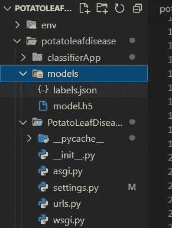
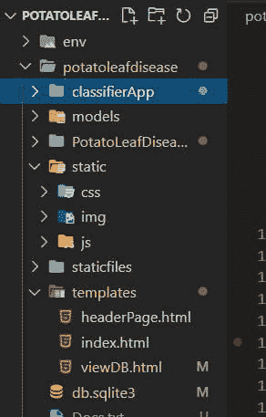

# 基于 Tensorflow、Django 和 Heroku 的影像分类

> 原文：<https://blog.devgenius.io/image-classification-using-tensorflow-and-heroku-for-django-daf8868cc88d?source=collection_archive---------9----------------------->


费萨尔在 [Unsplash](https://unsplash.com?utm_source=medium&utm_medium=referral) 上拍摄的照片

本教程将向您介绍为 django 使用 tensorflow 和 heroku 的基础知识。我们将看到如何通过 django web 框架使用 tensorflow 库实现图像分类，然后在 heroku 上托管 django 网站。

本教程认为您已经将训练好的模型保存为. h5 文件。一旦你有了这个文件，你将能够在这篇文章的结尾建立一个图像分类网站。即使您没有模型，您也可以跟随学习，因为您将很容易理解如何在 django 中为图像分类项目集成 h5 模型，并且步骤将会简单易懂，因为它将显示成功部署您的图像分类网站所需遵循的每个步骤。

**姜戈是什么？**

Django 是一个高级 Python web 框架，它鼓励快速开发和干净、实用的设计。由经验丰富的开发人员构建，它解决了 web 开发的许多麻烦，因此您可以专注于编写应用程序，而无需重新发明轮子。它是免费和开源的。要了解更多信息，他们在这里有一个很棒的文档[。](https://docs.djangoproject.com/en/4.0/)

**什么是**[**tensor flow**](https://www.tensorflow.org/)**？**

TensorFlow 是一个机器学习的端到端开源平台。它有一个全面、灵活的工具、库和社区资源的生态系统，让研究人员推动 ML 的最新发展，让开发人员轻松构建和部署 ML 驱动的应用程序。

**什么是**[**Heroku**](https://www.heroku.com/)？

Heroku 是一个云平台即服务(PaaS ),支持多种编程语言。各种规模的开发人员、团队和企业都使用 Heroku 来部署、管理和扩展应用。

让我们开始构建项目:

**1。创建虚拟环境**

第一步是创建一个虚拟环境，这样我们就可以在一个独立于系统包的环境中下载和存储这个特定项目所需的包。要创建虚拟环境:

```
$ py -3 -m venv env
```

激活环境:

```
$ .\env\Scripts\activate
```

**2。安装 django**

我们需要 django，所以我们将使用 pip 安装 django:

```
$ pip install django
```

**3。创建一个 django 项目**

下载 django 后，我们将使用 django-admin 命令创建我们的 django 项目。在下文中，> *PotatoLeafDisease* 是我们的项目名称，您可以给它取任何名称:

```
$ django-admin startproject PotatoLeafDisease $ cd PotatoLeafDisease
```

**4。创建 django 应用程序**

下一步是在项目中创建我们的应用程序。> *classifierApp* 是我们在下面的应用:

```
$ python manage.py startapp classifierApp
```

在> [*settings.py*](http://settings.py) 文件中，将我们刚刚创建的应用添加到> INSTALLED_APPS 列表中

```
INSTALLED_APPS = [ 
'django.contrib.admin', 
'django.contrib.auth', 
'django.contrib.contenttypes', 
'django.contrib.sessions', 
'django.contrib.messages', 
'django.contrib.staticfiles', 
'classifierApp', ]
```

**5。创建一个>模型**，它将在 django 后端存储我们的分类结果。转到>型号。文件并编写以下代码

```
from django.db import models
from django.utils import timezone
# Create your models here.
class Result(models.Model):
    imagepath = models.TextField()
    image = models.ImageField(null=True, blank=True)
    predicted = models.TextField()
    confidence = models.IntegerField(default=0, null=True, blank=True)
    saved = models.DateTimeField(default=timezone.now)

    class Meta:
        ordering = ('-saved',)

    def __str__(self):
        return self.imagepath
```

模型结果将存储图像路径细节和预测类及其置信度百分比。现在，在对> models.py 进行更改之后，我们需要进行迁移来更新数据库的配置:

```
$ python manage.py makemigrations $ python manage.py migrate
```

在> admin.py 文件中注册模型:

```
from django.contrib import admin from . import models admin.site.register(models.Result)
```

**6。创建*模型文件夹**

在存储 *classifierApp* 的同一目录下的根目录下创建一个新文件夹，并将模型文件(. h5)和 *labels.json* 文件放入。



> *labels.json* 文件看起来类似于下图:

```
{
    "0": "A",
    "1": "B",
    "2": "C",
    "3": "U"
}
```

7。创建视图

我们现在将使用 keras 加载我们的模型，并使用该模型预测新图像的类别。为此，我们需要安装几个库:

```
$ pip install keras $ pip install tensorflow $ pip install Pillow
```

在> views.py 中，编写以下代码:

```
from django.shortcuts import render

from django.core.files.storage import FileSystemStorage
from .models import Result
from rest_framework.views import APIView
from rest_framework.response import Response
from .serializers import LeafDiseaseSerializer  

from keras.models import load_model
from keras.preprocessing import image
import json 
import tensorflow as tf
import numpy as np

import os
os.environ['TF_CPP_MIN_LOG_LEVEL'] = '3' 

img_height, img_width = 256, 256
with open('./models/labels.json', 'r') as f:
    labelInfo = f.read()

labelInfo = json.loads(labelInfo)
# print(labelInfo)

tf.compat.v1.disable_eager_execution()
model_graph = tf.Graph()
with model_graph.as_default():
    tf_session = tf.compat.v1.Session()

    with tf_session.as_default():
        model=load_model('./models/model.h5')

# Create your views here.
def index(request):
    return render(request, 'index.html')

def predictImage(request):
    # print(request)
    # print(request.POST.dict())

    try:

        fileObj = request.FILES['filePath']
        fs = FileSystemStorage()

        filePathName = fs.save(fileObj.name, fileObj)
        filePathName = fs.url(filePathName)
        testimage = '.'+filePathName
        # print(testimage)
        # print(filePathName)

        # print(type(testimage))

        # if '%20' in testimage:
        #     testimage = fileObj.replace("%20", ' ')
        #     print(testimage)

        img = image.load_img(testimage, target_size=(img_height, img_width))
        test_image = image.img_to_array(img)
        test_image = np.expand_dims(test_image, axis = 0)

        confidence = 0
        with model_graph.as_default():
            with tf_session.as_default():
                pred = model.predict(test_image)
                # print(pred)
                confidence = round(np.max(pred) * 100, 2)

        predictedLabel = labelInfo[str(np.argmax(pred[0]))]
        print('Predicted label: ', predictedLabel)  
        print(f'Confidence : {confidence}%')    

        filename = filePathName.split('/')[-1]
        print(filename)

        new_item = Result(imagepath = filePathName , image = filename, predicted = predictedLabel, confidence = confidence)
        new_item.save()

        context = {'filePathName':filePathName, 'predictedLabel': predictedLabel, 'confidence': confidence, 'filename': filename}
        return render(request, 'index.html', context)

    except:
        return render(request, 'index.html')

def viewDataBase(request):
    all_results = Result.objects.all()

    for i in all_results:
        print(i.imagepath)
        break

    # listOfImages = os.listdir('./media/')
    # listOfImagesPath = ['./media/' + i for i in listOfImages]
    context = { 'all_results':all_results}  #  'listOfImagesPath': listOfImagesPath,
    return render(request, 'viewDB.html', context)
```

在上面的代码中，我们首先导入库，然后加载> *labels.json* 文件和模型> *.h5* 。为此，我们使用 keras 的 load _ model。models 使用 tensorflow 图加载它。

接下来是为我们的模板定义视图。我们总共有三个视图…索引、预测图像、视图数据库。

I .索引视图是主页视图。

二。预测图像视图用于预测图像的类别，但它将渲染相同的 index.html，但具有预测的结果。

三。最后，视图数据库视图将显示保存的结果。

所以对于模板文件，你可以自己创建一个，但是在这篇文章中，我用的是从 github 下载的。

我按照 youtube [链接](https://youtu.be/mgX-2_ybqNk)中的步骤，在这篇文章中使用了相同的前端静态文件和模板。

**8。创建模板文件**

如果您已经准备好自己的模板文件和静态文件，或者从上面的链接下载，下一步是创建一个名为 template 的新文件夹，并在项目文件夹(根文件夹)中创建 static。将 html 文件放在模板文件夹中，然后将静态文件或文件夹(如 css、js 和图像文件)放在静态文件夹中。文件目录结构如下所示:



下面给出>模板列表中> [settings.py](http://settings.py) 文件内模板的路径:

```
TEMPLATES = [
    {
        'BACKEND':'django.template.backends.django.DjangoTemplates',
        'DIRS': [os.path.join(BASE_DIR, 'templates')],
        'APP_DIRS': True,
        'OPTIONS': {
            'context_processors': [
                'django.template.context_processors.debug',
                'django.template.context_processors.request',
                'django.contrib.auth.context_processors.auth',
                'django.contrib.messages.context_processors.messages',
            ],
        },
    },
]
```

还要添加以下路径:

```
STATIC_URL = 'static/' STATICFILES_DIRS = [ 
   os.path.join(BASE_DIR, 'static') 
] MEDIA_URL = '/media/' MEDIA_ROOT = os.path.join(BASE_DIR, 'media') STATIC_ROOT = os.path.join(BASE_DIR, 'staticfiles')
```

**9。创建网址**

首先在 app 文件夹(classifierApp)中创建> urls.py 文件，并为视图创建 urlpatterns

```
from django.urls import path
from . import views
from django.conf.urls.static import static 
from django.conf import settings

app_name = 'classifierApp'

urlpatterns = [
    path('', views.index, name='homepage'),
    path('predict', views.predictImage, name='predict'),
    path('viewdb', views.viewDataBase, name='view'),

]

urlpatterns += static(settings.MEDIA_URL, document_root=settings.MEDIA_ROOT)
urlpatterns += static(settings.STATIC_URL, document_root=settings.STATIC_ROOT)
```

转到项目文件夹的> urls.py 文件，该文件夹与存储 [*settings.py*](http://settings.py) 文件的目录相同，并包含应用程序的 URL

```
from django.contrib import admin
from django.urls import path, include

urlpatterns = [
    path('admin/', admin.site.urls),
    path('', include('classifierApp.urls', namespace='potatoleafdisease')),
]
```

运行以下命令收集静态文件:

```
$ python manage.py collectstatic
```

运行服务器并检查 django 是否运行良好；

```
$ python manage.py runserver
```

**10。部署在 Heroku**

首先安装以下模块

```
$ pip install gunicorn $ pip install whitenoise $ pip install dj-database-url $ pip install psycopg2 $ pip install dj-database-url
```

将 env 中安装的所有依赖项添加到> *requirements.txt，*

```
$ pip freeze > requirements.txt
```

如果您使用的是 tensor flow 2 . x 版..在 heroku 上免费托管的情况下，您可能会遇到段塞大小的问题，一些解决方案包括使用> tensorflow-cpu 而不是 tensorflow 2.x..因为 tensorflow 本身的大小加起来接近 500mb，而 tensorflow-cpu 占用的内存块相对较小。

其他技术包括[链接](https://devcenter.heroku.com/articles/slug-compiler):

*   将 pdf 或音频文件等大型资产移动到资产存储。
*   通过. slugignore 删除不需要的依赖项并排除不需要的文件。
*   清除生成缓存。

**创建过程文件**

在*过程文件*中:PotatoLeafDisease 是一个项目名

```
web: gunicorn PotatoLeafDisease.wsgi -log-file -
```

Make *runtime.txt* ，所有那些文件(requirements.txt、Procfile 和 runtime.txt)都应该在根目录内(项目目录内)

*runtime.txt* :

```
python-3.10.3
```

在[devcenter.heroku.com](https://devcenter.heroku.com/)中检查支持的版本

为了在 heroku 上托管一个网站，我们需要在 heroku 上创建一个帐户，并下载和设置 heroku CLI

一、建立 heroku 账户

二。下载 Heroku CLI

三。配置 Django Heroku:

我们将使用 git 在 heroku 上添加文件

```
$ git init $ git add . $ git commit -m "First commit"
```

通过输入命令行登录 heroku

```
heroku login
```

创建网站名称

```
$ heroku create potatoleafdisease
```

禁用 collectstatic:

```
$ heroku config:set DISABLE_COLLECTSTATIC=1
```

在 [settings.py](http://settings.py) 中:

将其添加到中间件列表中:

```
DEBUG = False ALLOWED_HOSTS = ['potatoleafdisease.herokuapp.com', 'localhost', '127.0.0.1'] MIDDLEWARE = [ 
    'whitenoise.middleware.WhiteNoiseMiddleware', ]
```

如果要使用 heroku 中的数据库，在 [*settings.py*](http://settings.py) 中指定以下内容，表示您将使用默认的 heroku 数据库。

heroku 的数据库更新

```
import dj_database_url

db_from_env = dj_database_url.config(conn_max_age=600)
DATABASES['default'].update(db_from_env)
```

使用以下命令在 heroku 上进行迁移(如果我们不想在我们的网站上进行更改或使用数据库，这是不必要的)

```
$ heroku run python manage.py makemigrations $ heroku run python manage.py migrate
```

现在最后把文件推给 heroku:

```
$ git push heroku master
```

从终端打开网站如下，你也可以直接从你的 heroku 帐户仪表板打开。

```
$ heroku open
```

最后，我们的图像分类项目与 django 和 heroku 集成完成。

如果你想更新你的网站或者改进你的模型，你可以先修改本地文件，然后再推送到 heroku。这将更新 heroku 上的文件，并显示更新的网站。

为此，我们将再次使用 git 来推送我们编辑过的文件:

```
$ git add . $ git commit -m "edited " $ git push heroku master
```

让我们连接上 [github](https://github.com/Ugyenwangdi/BostonHousePredicton)

*原载于*[*https://wulfi . hash node . dev*](https://wulfi.hashnode.dev/image-classification-using-tensorflow-and-heroku-for-django)*。*