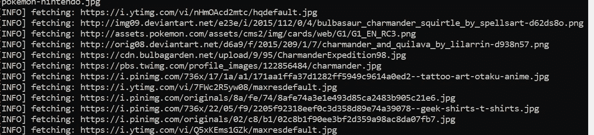

# 乌龙茶和绿茶的图像分类器

> 原文：<https://blog.devgenius.io/image-classifier-for-oolong-tea-and-green-tea-c06de29d834?source=collection_archive---------9----------------------->

## [从我的网站发布](https://www.tobiolabode.com/blog/2020/10/21/image-classifier-for-oolong-tea-and-green-tea)


由[万基·金](https://unsplash.com/@kimdonkey?utm_source=medium&utm_medium=referral)在 [Unsplash](https://unsplash.com?utm_source=medium&utm_medium=referral) 上拍摄的照片

# 开发数据集

在这个项目中，我将做一个图像分类器。我记得不久前我的尝试不起作用。为了稍微改变一下，我将使用 Pytorch 框架。而不是张量流。因为这是我第一次使用 Pytorch。在我开始我的项目之前，我将参加一个辅导。这个项目是一个识别瓶装乌龙茶和瓶装绿茶区别的分类器。

我用的教程是 [PyTorch 的 60 分钟闪电战](https://pytorch.org/tutorials/beginner/deep_learning_60min_blitz.html)。(虽然我花了 60 多分钟才完成)。打出教程后，我习惯了使用 Pytorch。所以我开始着手这个项目。因为这将是一个图像分类器。我需要将大量的图像放入我的数据集中。第一次碰到一篇中等的文章。用了一把好的刮刀。但是即使经过一些编辑，它还是不起作用。


所以我转而使用 Bing 进行图片搜索。Bing 有一个你可以使用的图像 API。这使得它比谷歌更容易收集图像。我使用了来自 [pyimagesearch](https://www.pyimagesearch.com/2018/04/09/how-to-quickly-build-a-deep-learning-image-dataset/) 的这篇文章。开始的时候，我在 API 上遇到了一些问题。因为微软给我的终端不适用于本教程。环顾四周和一些编辑后，我能够让它工作。



但是看着图像文件夹，我想到了这个:


看完代码后，我注意到程序没有生成新的图像。但是将图像更改为“000000”。这是因为没有从博客文章中复制最后一段代码。这更新了计数器变量。


现在我有教程代码工作，我们可以尝试我的搜索词。来创建我的数据集。首先我从绿茶开始。所以我用了“瓶装绿茶”这个词。这个程序给了我这些图像:


后来，我用“瓶装乌龙茶”这个术语得到了乌龙茶。


现在我已经亲自检查了数据集。并删除任何与课程无关的图片。我删除的图像是这样的:


这是因为我们希望分类器能够处理瓶装饮料。所以树叶不相关。不管它们有多好吃。

它们是一些空白的图像。不用说，对于图像分类器来说是没有用的。


尽管这张图片中有几个绿茶瓶子。它也有一个乌龙茶瓶子，所以这将混淆模型。所以最好简化成只有几个绿茶瓶子。而不是不属于某一类的整个种类。

在我对两个数据集都做了这些之后。我准备继续创建模型。于是去 Google Collab，导入 Pytorch。

因为数据集的图像少于 200 幅。我认为应用数据增强是个好主意。我首先发现了这个使用 Pytorch 变换的教程。

当应用转换时，它陷入了几个问题。第一，它不能正确地绘图，也不能识别我的图像。但是我能修好它


这些问题源于没有正确地对数据集进行切片。因为 ImageFolder(Pytorch helper 函数)返回一个元组，而不仅仅是图像列表。

# 开发模型

在那之后，我开始开发这个模型。我用的是 60 分钟闪电战教程里用的 CNN。我处理的第一个错误是数据不能正常通过网络。

```
shape ‘[-1, 400]’ is invalid for input of size 179776
```

我可以通过将内核大小改为 2 x 2 来解决这个问题。并将特征图更改为 64。

```
self.fc1 = nn.Linear(64 * 2 * 2, 120)x = x.view(-1, 64 * 2 * 2)
```

紧接着，我陷入了另一个错误:

```
ValueError: Expected input batch_size (3025) to match target batch_size (4).
```

通过再次改变 x 变量的形状修复了这个问题。

```
x = x.view(-1, 64 * 55 * 55)
```

利用这个[论坛的帖子](https://discuss.pytorch.org/t/valueerror-expected-input-batch-size-324-to-match-target-batch-size-4/24498/6)。

然后另一个错误😩。

```
RuntimeError: size mismatch, m1: [4 x 193600], m2: [256 x 120] at /pytorch/aten/src/TH/generic/THTensorMath.cpp:41
```

这是通过改变线性层再次修复。

```
self.fc1 = nn.Linear(64 * 55 * 55, 120)
```

该死，我不知道一层厚厚的东西会让我这么头疼。

经过训练。我需要测试这个模型。在制作模型之前，我没有制作测试文件夹。(菜鸟失误)。之后我用每个班的前 5 张图片快速制作了它。这是一件糟糕的事情。这可能会污染数据。并导致过度拟合。但我需要看看这个模型当时是否有效。

我想在测试文件夹中绘制一个图像。所以我借用了教程里的代码。这导致了一个错误。但是通过将范围改为 1 来修复它。而不是 5。这是因为我的模型只有 2 个标签。(张量[0]和张量[1])不是 4。

加载模型时。它给了我一个错误。但这是通过调整测试文件夹中的图像大小修复的。在模型运行了几次后，我注意到它没有显示损失。所以我编辑了代码。

```
if i % 10 == 0: print('[%d, %d] loss: %.5f' % (epoch + 1, i + 1, running_loss / 10)) running_loss = 0.0
```


正如我们所见，损失非常高。

当我在测试文件夹中测试模型时，它给了我这个:


也就是说最多只能猜测。后来我发现这是因为它把每张图片都当成了绿茶。有 5 张带有绿茶标签的图片。这导致它 50%的时间是正确的。

这就把我带到了模型调试的世界。努力降低损失率，提高准确率。

# 调试模型

当我发现这篇[中型文章](https://blog.slavv.com/37-reasons-why-your-neural-network-is-not-working-4020854bd607)时，我开始在调试我的模型方面取得一些进展

作者说的第一点是从一个简单的问题开始，这个问题已知适用于你的数据类型。尽管我认为我使用的是一个为处理图像数据而设计的简单模型。当我借用 Pytorch 教程中的模型时。但是没有用。所以选择了更简单的模型形状。这是我从一本[张量流教程](https://www.tensorflow.org/tutorials/images/cnn)中找到的。它只有 3 个卷积层。和两个致密层。我不得不改变最终层的参数，因为他们给了我错误。因为它是为 10 个目标设计的。而不是 2。之后，我摆弄了一下超参数。有了这个，我就能把测试图像的准确率提高到 80%😀。

```
Accuracy of the network on the 10 test images: 80 %108
```


# 测试新模型

因为测试数据集被污染了，因为我使用了来自训练数据集的图像。我想用新的图像重组测试数据集。以确保准确性。

为了重组它，我采用了以下方式:


【https://stackoverflow.com/a/60333941 

同时分别调用测试和训练数据集。

```
train_dataset = ImageFolder(root='data/train')test_dataset  = ImageFolder(root='data/test')
```

有了测试图片，我决定用谷歌而不是必应。因为它给出不同的结果。之后，我在新的测试数据集上测试了这个模型。

```
Accuracy of the network on the 10 test images: 70 %107
```

由于这不是一个明显的减少，在模型中学到了一些关于绿茶和乌龙茶。

使用 Pytorch 教程中的代码，我想进一步分析它:

```
Accuracy of Green_tea_test : 80 %Accuracy of oolong_tea_test : 60 %
```

# 绘制预测图

我喜欢这个。我想让程序告诉我哪些图像出错了。所以，我去工作，试图这样做。为此，我在一个独立的列表中将图像数据和标签缝合在一起。

```
for i, t, p, in zip(img_list, truth_label, predicted_label): one_merge_dict = {'image': i, 'truth_label': t, 'predicted_label':    p} merge_list.append(one_merge_dict)print(merge_list)
```

在我的第一次尝试中，我得到了这个:


正如我们可以看到它非常杂乱，显示所有的图像。为了清除它，我删除了不需要的文字。


现在我可以开始区分图像的对错。

我能够通过使用一个小的 if 语句做到这一点


我想去掉空白，所以我决定改变图片的布局。

```
ax = plt.subplot(1, 4, i + 1)fig = plt.figure(figsize=(15,15))
```


现在我有一个想法，模型出了什么问题。第一个样品绿茶没有传统的绿色设计。所以这是可以理解的，这是错误的。第二个样本。是乌龙茶，但被误归类为绿茶。我的猜测是瓶子有一个非常浅的色调。与训练数据中的金色或橙色调乌龙瓶相比。然后是第三个例子，瓶子有传统的乌龙茶设计和橙色调色板。但是模型把它和绿茶混为一谈。我猜瓶子上的叶子影响了模型的判断。导致它被归类为绿茶。

现在我已经完成了这个项目。这并不是说我可能不会回来这个项目。作为实施方面的补充。比如拥有一个可以检测乌龙茶或绿茶的手机应用程序。用你手机的摄像头。或者一个简单的网络应用程序，用户可以上传他们的瓶装茶图片。并且模型可以对你在网站上的形象进行分类。