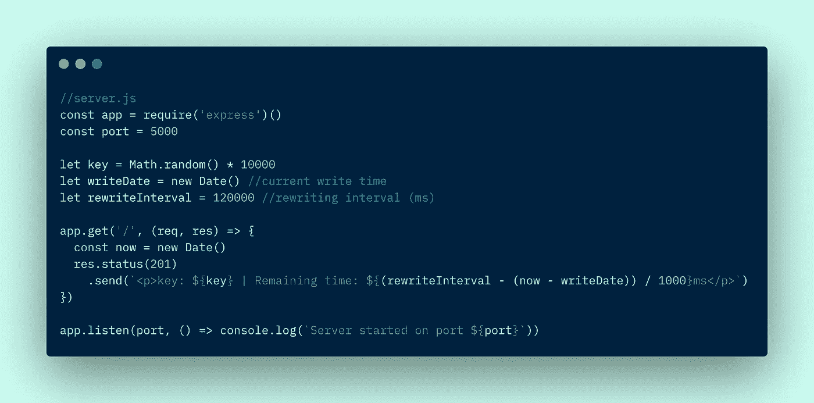
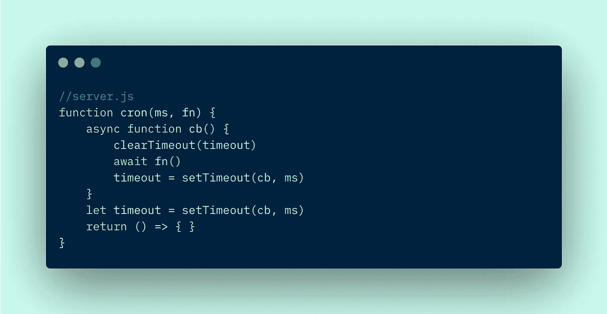
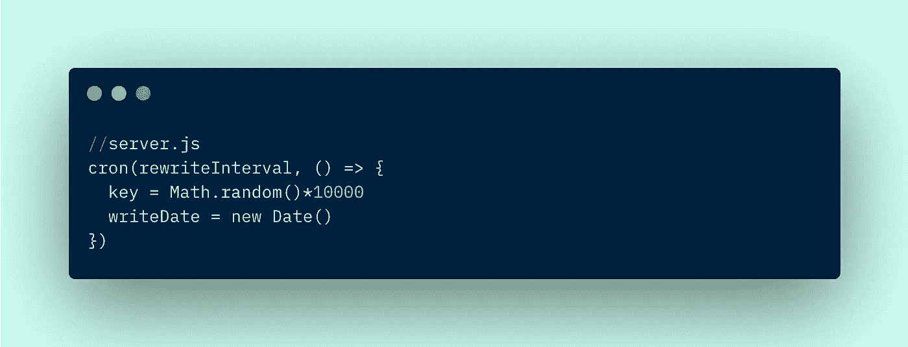
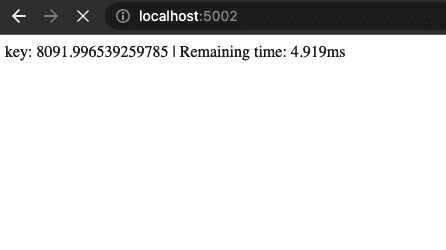

# 节点服务器和 API 中的 CRON 作业

> 原文：<https://blog.devgenius.io/implement-cron-jobs-in-your-node-servers-apis-86f09ad6337d?source=collection_archive---------2----------------------->

如今，编写作业调度程序是一个非常复杂的过程。给人的印象是这不是一个显而易见的代码实现，通常的做法是在项目中包含不必要的代码包袱。今天，我们将构建一个节点 API 服务器，它有自己的定制开发的 CRON 功能。

在本次演示中，我们将编写一个 API 来维护一个随机数密钥和一个创建时间戳，其中我们的 CRON 作业会在一个定义的固定时间间隔后用一个新的随机数覆盖这个密钥。我们的 API 将根据 GET 请求向用户发送这个密钥，以及密钥的剩余期限。

## 创建应用程序

我们初始化的 Node + Express API 如下所示:



Server.js 服务于 http://localhost:5002

我们需要使用以下命令安装依赖项 Express 和 Nodemon(用于自动服务器重启):

```
$ npm i express
$ npm i --save-dev nodemon
```

我们还需要更新 package.json 文件，并将下面一行添加到“scripts”部分:

```
"dev": "nodemon server.js"
```

Nodemon 有一个简洁的特性，您可以在命令的末尾添加一个或多个`--ignore <file_name>`标志，以阻止 Nodemon 在某些文件更改时重启服务器。

最后，我们可以通过终端中的`npm run dev`在端口 5002 提供我们的应用程序。

## 添加 CRON 功能

我们需要我们的 CRON 系统在每次定义的持续时间过后更新我们的密钥。我们还需要将写入时间改写为新的写入时间。我们可以使用回调函数系统来实现这一点，并在服务器运行时不断循环。



强大的 CRON 功能

这段精彩的代码接受两个参数。第一个是以毫秒为单位的期望间隔时间，第二个是我们希望以循环间隔执行的函数。在函数的范围内，我们定义了第二个函数，也可以是异步的，它是我们的回调函数。在超时持续时间结束时，回调函数被调用，我们的原始函数运行，超时被重新排队，以便在额外的时间间隔结束时重新执行。我们返回一个空的匿名函数，以便节点知道在服务器初始化时执行这个 CRON 系统。最令人兴奋的是，它没有任何额外的负担或安装。

在这种情况下，我们将为 CRON 逻辑提供的功能如下:



我们在 CRON 逻辑中传递一个匿名函数作为“fn”参数

在这里，我们可以看到传递给 CRON 系统的函数用一个新的随机数字键覆盖了以前的键，并将覆盖的时间戳更新为当前时间。CRON 系统成功实现了 120000 毫秒的重复时间，在下面的示例中为 5000 毫秒。

向`[http://localhost:5002](http://localhost:5002)`发出 GET 请求，如下所示:



持续请求显示我们的新密钥和每 5 秒刷新一次的时间

恭喜，您现在已经在您的服务器或 API 中实现了 CRON 功能。任何你喜欢的地方。这对于常规的数据/web 抓取或者如果您有需要在给定的时间间隔内无限期完成的任务来说非常有用。

要了解如何托管这样的应用程序，请继续关注我的 Heroku 和 Raspberry Pi 托管教程！