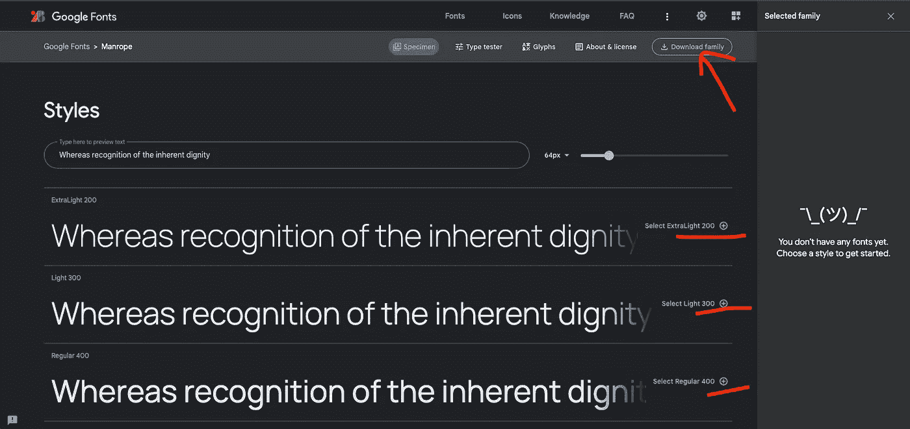
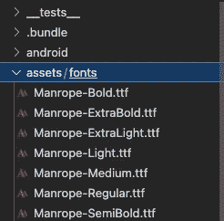
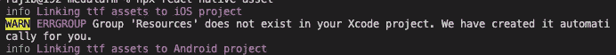
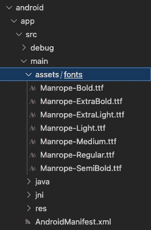
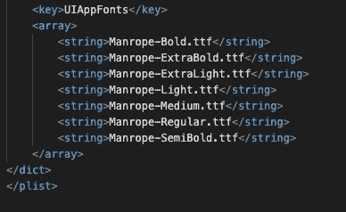

# 在 React Native 上实现自定义字体

> 原文：<https://blog.devgenius.io/implement-custom-fonts-on-react-native-0-70-649c16f7609f?source=collection_archive---------0----------------------->

大家好，我想出了一个在 react native 上实现自定义字体/谷歌字体的新教程，特别是如果你使用的是最新的 React Native 版本，即 0.70。因为最新版本已经删除了链接选项。

字体是出色用户体验的基石，自定义字体可以为应用程序提供独特的身份，帮助您在竞争激烈的市场中脱颖而出，为您的应用程序提供更好的 UI 体验。

以下是需要遵循的步骤:

1.  转到谷歌字体网站，并选择所需的字体家族(如:Manrope)
2.  对于特定的字体系列，您可以选择多种样式，即:粗体、常规、半粗体等。选择后，我们可以点击下载家庭，它得到下载的 zip 中的字体。

谷歌字体网站

3.提取 zip 文件并打开静态文件夹，您可以看到扩展名为. ttf 的字体列表。通过创建新的文件夹资产/字体将其放在根文件夹中，并粘贴到文件夹中。

粘贴到项目目录后的文件夹结构

4.创建一个名为 react-native.config.js 的文件，粘贴以下代码，让您的项目知道从哪里获取字体。

5.运行`npx react-native-asset` < =该命令是`react-native link`的增强。这将自动创建 android 文件夹内的资产/字体文件夹。您应该会看到类似这样的内容。

运行上述命令后的输出

你也可以看到 android 文件夹的变化如下:

android 文件夹上的更改

对于 ios，您可以在 info.plist 文件中看到更改:

您可以在 info.plist 文件中看到的更新

6.重新构建项目，您可以看到变化。

现在，您可以创建如下样式:

# 结论

希望以上步骤对你有所帮助。如果你有任何问题，请留下你的笔记，我会尽我所能让你明白。

非常感谢您的阅读！！