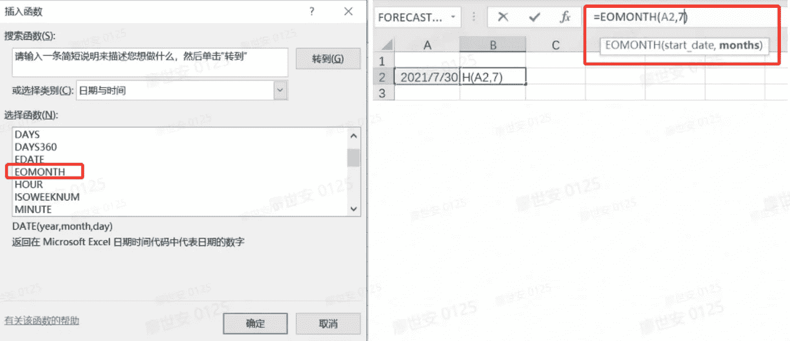

# 用 Python 实现 Excel 的 eomonth()

> 原文：<https://blog.devgenius.io/implement-excels-eomonth-in-python-c81afb70165e?source=collection_archive---------10----------------------->

*Python 实现挑战，参考答案*



> 摘录:在本文中，我们尝试在 Excel `eomonth`中复制一个日期函数，并一步一步地提出一个 Python 实现。然后，我们将尝试通过迭代来优化 Python 版本，并设计出一个在各个方面都优于 Excel 的 Python 实现。

# 灵感的来源

我碰巧看到 Sergio Yahni 的文章 [Automate MS-Excel:最有用的 Microsoft Excel 公式的 Python 代码](https://medium.com/@sergioyahni/automate-ms-excel-python-code-for-the-most-useful-microsoft-excel-formulas-28bb8f1d4460)[并且碰巧这些年来我已经用 Python 重新实现了许多 Excel 公式，其中许多甚至比它们的 Excel 对等物更加通用和健壮。](https://medium.com/u/29c721494018?source=post_page-----c81afb70165e--------------------------------)

正如我在下面的前一篇博客中提到的，我在 20 年后放弃了 Excel VBA，转向了 Python，但我最看重的 Excel 专家(未被微软认可:-)的知识确实在我的 Python 学习道路上帮助很大。

[](/no-code-or-low-code-90c2f0d93596) [## 无代码还是低代码？

### 我们真的想走这条路吗？

blog.devgenius.io](/no-code-or-low-code-90c2f0d93596) 

# Excel 版本

Excel 的数据操作能力非常强大，尤其是当涉及到它的大量内置函数时(但是，也有一些限制，例如，缺少 count distinct 函数)。

`eomonth(start_date, months)`函数是`end of month`的缩写，它取一个开始日期并返回指定月份的月末日期。

1.  比如`=EOMONTH(“2022–1–24”, 1)`会返回`2022-02-28`；`=EOMONTH(“2022–1–24”, 2)`将返回`2022-03–31`。
2.  `months`可以为零，表示返回当月的最后一天，即`=EOMONTH(“2022–1–24”, 0)`将返回`2022-01-31`。
3.  `months`甚至可以是负数，表示返回前几个月的最后一天，即`=EOMONTH(“2022–1–24”, -1)`将返回`2021-12-31`。

当我们使用 Python 处理数据值时，同样的需求经常出现。让我们先进行详细的需求分析。

# 需求分析和迭代

## 第一步，基本要求

1.  实现一个 Python 函数:`def eomonth(start_date, months)`。
2.  它应该能够添加(或减去)`months`月数到`start_date`，并返回结果的月末日期。
3.  `months`应为整数，可以是负数、正数或零。

## 第二步，检查参数的有效性，避免误用

1.  检查`start_date`是否为日期格式。
2.  检查`start_date`的有效性，例如`2021-2-29`无效。
3.  检查`months`是否为有效整数。

## 步骤 3，为函数设置默认值，以简化函数调用

1.  将`start_date`的默认值设置为`None`，这意味着取当前日期(`today`)代替。
2.  将`months`的默认值设置为`0`。

## 步骤 4，扩展功能以接受日期列表

1.  允许一个`list`或一个`pandas.Series`作为`start_date`传入，在这种情况下，返回相同长度的日期列表。
2.  确保当`start_date`是单个日期时，它仍然返回单个日期。

## 第五步，尝试适应更多的现实生活场景

1.  尝试解析一个字符串格式`start_date`来修正日期，如果失败抛出异常。
2.  如果`start_date`是一个列表，尝试解析每一项，如果有几项失败，就返回一个`None`。

## 第六步，其他已知或未知的情况

1.  Python 中有很多 DateTime 格式，常见的有`datetime.datetime`、`datetime.date`、`timestamp`、`datetime64[ns, UTC]`等。它们的问题是它们通常彼此不兼容，并且有不同的方法。
2.  Excel 中的日期格式实际上是基于`1900-1-1`的，这意味着像`2021-7-30`这样的日期在某些情况下会被解释为`44407`，如果必要的话需要翻译。
3.  时区在某些情况下可能是个问题，例如，`2021/7/31 16:00:00`可能读作`2021/8/1 0:00:00`。
4.  如果需要处理大量的数据，例如十亿行，如何确保效率？

# 结论和警告

在上面的步骤中，我们实际上已经实现了与 Excel 完全相同的功能，并且利用 Python 相对于 Excel 效率低下的优势，它至少是一个更快的解决方案。

步骤 2 到步骤 5 在可用性、健壮性和应用范围方面将实现带到了更高的层次，这就是**需求分析的真正价值**。

第六步并不容易，除非你有大量的实践经验，通过反复试验。您使用和更新自己的函数越多，它就越健壮。例如，在我的`pandas`包升级后，我最近才发现`pandas.to_datetime`和`datetime.datetime`之间的不兼容问题。**在大多数情况下，这一步没有必要考虑**。除非你的`eomonth`功能是要用在飞船上。

总而言之:

1.  如果它满足用户的所有基本需求，我们认为它是一个足够好的需求分析。
2.  如果我们添加一些额外的功能，比如接受列表，我们认为这是一个优化的需求分析。
3.  我们认为这是一种过度杀戮，例如:

*   `months`可以是十进制数值，也可以是月份列表。
*   考虑到史前的日期，或者宇宙的灭绝。
*   让对 Python 一无所知的人也能接触到。

# 参考答案

下面是我多年前写的 Python 库中的一个片段，供你参考。如果你有不同或更好的解决方案，请不要犹豫，留下你的评论。

```
def eomonth(d, months=0):
    months = int(months)
    if isinstance(d, list):
        return [eomonth(d0, months) for d0 in d]
    elif isinstance(d, pd.Series):
        return d.map(lambda d0: eomonth(d0, months))
    else:
        y, m = divmod(d.month + months + 1, 12)
        # y, m = int(y), int(m)
        if m==0:
            y -= 1
            m = 12
        return pytz.UTC.localize(datetime.datetime(d.year + y, m, 1) - datetime.timedelta(days=1))
```