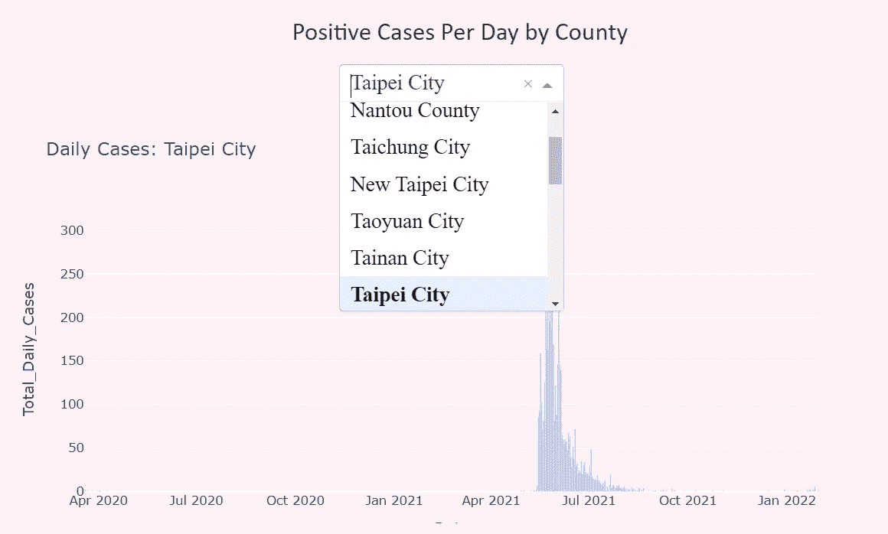

# 在 Django 项目中实现交互式 Plotly Dash Plot

> 原文：<https://blog.devgenius.io/implement-interactive-plotly-dash-plot-within-your-django-project-66f3f4fbef94?source=collection_archive---------1----------------------->

Plotly 是 Python 中一个极其有用和复杂的可视化库。它不仅提供简单的绘图功能，还提供了一堆高级功能。Dash 是一个基于 plotly 的 web 应用程序的 web 框架。在 dash 应用程序的帮助下，我们能够只用几行代码创建复杂且高度功能化的绘图。

# 介绍

在本文中，我将向您展示如何在 Django 框架中实现普通的 plotly 可视化以及高级的 dash 应用程序可视化(以及 MySQL 数据库)。Django 是一个用 Python 编写的 web 框架，以可伸缩性和快速开发著称。这些特性使得 Django 成为最受欢迎的框架之一，无论是对于初学者还是 web 开发专家。

# 先决条件和配置

在我们深入 django 和 plotly 之前，有一些包我们必须确保它们被正确安装。其中包括:

*   姜戈
*   Plotly
*   姜戈 _ 普罗特利 _ 达什
*   频道
*   渠道-redis

除了这些包之外，您还必须在 django 项目中配置设置文件。打开 django 项目的 settings.py，修改如下。

Django_plotly_dash 设置的相关修改. py

还要通过在 urls.py 中添加 urlpatterns 来注册 django_plotly_dash 路由结构。

```
urlpatterns = [
    ...
    path('django_plotly_dash/', include('django_plotly_dash.urls')),
]
```

关于 django_dash_plotly 安装的更多信息，你可以在这里查看官方文件[。](https://django-plotly-dash.readthedocs.io/en/latest/installation.html)

# 普通情节

这部分向你展示了如何在 django 框架中实现普通的 plotly 情节。我们将以 MySQL 数据库和 pymysql 包进行连接为例。首先，创建一个正常的 plotly 绘图，并使用 plotly 下的 graph_objs 模块将其转换为 graph 对象。第二，调用对象，分配对象在你的 views.py 中渲染上下文，为了更好的管理，最好用 view.py 把绘图功能分开。您可以在项目文件夹下创建一个额外的 py 文件，并调用 views.py 中的脚本。

然后在 views.py 中，您应该有一个部分调用您刚刚创建的函数，并将生成的 graph 对象分配给 context。

最后，在 html 中，只需使用双花括号(django 中模板语言)从上下文中调用 graph 对象。

`{{target_plot|safe}}`

有关使用 graph_objs 绘图的更多信息，请查看[本页](https://plotly.com/python/creating-and-updating-figures/)。

# 互动破折号 Plotly 情节

现在，如果我们想建立高水平的互动情节，仅仅使用 plotly 是不够的。这就是破折号发挥作用的时候。在本文中，我们以回调为例。回调允许您在某些输入变量改变时更新绘图。例如，您可能希望显示几个城市的人口分布。通过使用回拨功能，您将能够在城市之间切换，情节将自动调整。

下面是带回调函数的 dash plotly plot 的样例代码。创建此脚本

为了让 Django 识别 dashapp 名称，请将 dash plotly 绘图脚本导入 urls.py 或 views.py。

`from .Dash_Apps import dash_plot`

最后，在 html 文件中使用如下语法调用 dash 应用程序(通过注册的 DjangoDash 对象名)。

```

{%plotly_app name=”CityPlot”}
```

下面是用回调函数成功实现 dash plotly plot 后的结果。



如果您需要更多关于基本回调的信息，请参考本页[。](https://dash.plotly.com/basic-callbacks)

# 结论

虽然实现 dash plotly 应用程序有点复杂，但由于 dash 提供的强大功能，它确实是值得的。如果你需要 dash plotly plot 是如何实现的参考，你可以在这里查看我的 Github repo [关于可视化台湾政府公开数据的 covid19 统计数据。](https://github.com/BurgerWu/Covid19_Django_Webapp)

# 参考

1.  [django-plotly-dash 官方文件](https://django-plotly-dash.readthedocs.io/en/latest/index.html)
2.  [破折号公文](https://dash.plotly.com/)
3.  [Plotly Python 官方文档](https://plotly.com/python/)