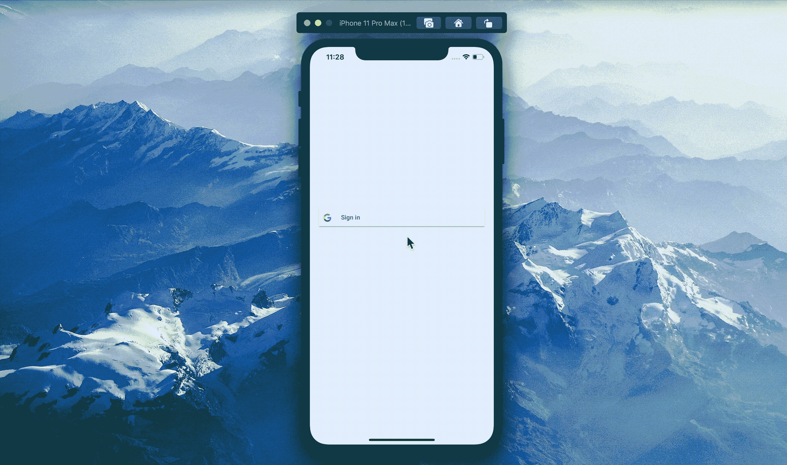

# 在 SwiftUI 应用中使用 Google 实现登录

> 原文：<https://blog.devgenius.io/implement-sign-in-with-google-in-a-swiftui-app-4870fae8d42c?source=collection_archive---------3----------------------->

使用 UIViewRepresentable 显示社交签到按钮和界面

麦克斯韦·尼尔森在 T2 的照片

大家好，

在本文中，我将分享如何在 SwiftUI 项目中实现“使用 Google 登录”(或其他社交登录)。

到目前为止，社交登录按钮和流程只能使用 UIKit 中的视图控制器来实现。因此，我们将使用 UIViewRepresentable 为它们创建 SwiftUI 视图，以实现我们项目中的功能。

> 我们特别实现了与 Google 的登录，然而，这个概念仍然适用于实现其他提供者(例如，与 GitHub 的登录)。

好，让我们一步一步来——

# 1.安装所需的依赖项并设置项目

请访问 Google 官方文档网站，按照初始步骤设置您的项目以使用 Google Auth。

 [## 开始将谷歌登录整合到你的 iOS 应用中

### 在您开始将您的 iOS 应用程序与 Google 登录组件集成之前，您必须下载依赖项…

developers.google.com](https://developers.google.com/identity/sign-in/ios/start-integrating) 

# 2.从文档中按原样添加 AppDelegate 代码

请访问此页面并添加按原样给出的 AppDelegate 代码。

 [## 将 Google 登录集成到您的 iOS 应用|适用于 iOS 的 Google 登录

### Google Sign-In 管理 OAuth 2.0 流和令牌生命周期，简化您与 Google APIs 的集成。下载…

developers.google.com](https://developers.google.com/identity/sign-in/ios/sign-in?ver=swift) 

# 3.包装 SwiftUI 的登录按钮和流程

上面的文档页面(我们已经在步骤 2 中使用过)包含了从开始到结束所需的所有步骤(四个步骤)。除此之外，我们已经完成了前两步(直到“启用登录”)。

文档中的步骤 3 和 4(“添加登录按钮”和“注销用户”)都是针对视图控制器的。我们将在这里通过使用 UIViewRepresentable 将它们包装成 SwiftUI 视图来涵盖这两者。

GoogleSignInButton 结构是按钮的视图(特别是对于 Google，另一个提供者的按钮需要一个新的视图)。

SocialLogin 结构是负责社交登录提供者流的 UI 的视图。这是一个通用视图，可以封装所有不同提供者的 ui。

目前，我们有调用 Google 登录流的尝试登录方法。类似地，我们可以有一个可以调用 GitHub 登录流的 attemptLoginGitHub 方法。

# 4.在 SwiftUI 应用中使用

所有的设置都已完成，现在我们可以简单地使用登录按钮，获得提供商的 UI 流，如下所示

> 就这样，完成了！

# 感谢您的阅读！

*请随时与我联系并联系，查看我们的项目，或者加入我们的开源社区:* [*LinkedIn*](https://www.linkedin.com/in/yugantar-jain-1a7820158/)*，*[*GitHub*](http://github.com/yugantarjain)*，* [*导师 iOS*](https://github.com/anitab-org/mentorship-ios) *，*[*AnitaB.org 社区*](https://anitab-org.zulipchat.com)