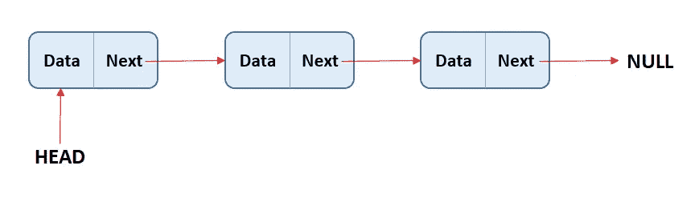
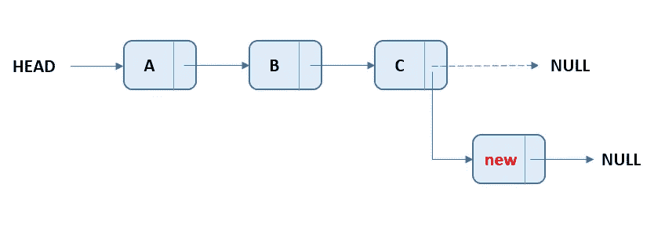

# PHP 中链表的实现

> 原文：<https://blog.devgenius.io/implementation-of-linked-list-in-php-10cf72daf76f?source=collection_archive---------4----------------------->

链表是一种线性数据结构，它包含节点结构，每个节点包含两个元素。存储该节点值的数据部分和存储下一个节点链接的下一部分，如下图所示:

节点结构

第一个节点也称为 HEAD，通常用于遍历链表。最后一个节点(最后一个节点的下一部分)指向 NULL。该列表可以被视为一个节点链，其中每个节点都指向下一个节点。

链表结构

[**表示:**](https://www.alphacodingskills.com/c/ds/c-linked-list.php)

在 PHP 中，单链表可以表示为一个类，一个节点可以表示为一个单独的类。链接列表类包含节点类类型的引用。

> //节点结构
> 类节点{
> public $ data；
> public $ next；
> }
> 
> class linked list {
> public $ head；
> 
> //构造函数创建空的 linked list
> public function _ _ construct(){
> $ this->head = null；
> }
> }；

[**创建链表**](https://www.alphacodingskills.com/cpp/ds/cpp-linked-list.php)

让我们创建一个包含三个数据节点的简单链表。

> //节点结构
> 类节点{
> public $ data；
> public $ next；
> }
> 
> class linked list {
> public $ head；
> 
> //构造函数创建空的 linked list
> public function _ _ construct(){
> $ this->head = null；
> }
> }；
> 
> //测试代码
> //创建空 linked list
> $ my list = new linked list()；
> 
> //添加第一个节点。
> $ first = new Node()；
> $first- >数据= 10；
> $ first->next = null；
> //链接头节点
> $ my list->head = $ first；
> 
> //添加第二个节点。
> $ second = new Node()；
> $秒- >数据= 20；
> $ second->next = null；
> //链接第一个节点
> $ first->next = $ second；
> 
> //添加第三个节点。
> $ third = new Node()；
> $第三- >数据= 30；
> $ third->next = null；
> //链接第二个节点
> $ second->next = $ third；
> ？>

[**遍历链表**](https://www.alphacodingskills.com/java/ds/java-linked-list-traversal.php)

遍历链表非常容易。它需要创建一个指向列表头部的临时节点。如果 temp 节点不为空，则显示其内容，并使用 temp next 移动到下一个节点。重复这个过程，直到临时节点变为空。如果开始时 temp 节点为空，则列表中不包含任何项目。
功能*打印列表*就是为此而创建的。这是一个 **3 步流程。**

> 公共函数 PrintList() {
> //1。创建一个指向 head
> $temp = new Node()的临时节点；
> $temp = $this- >头；
> 
> //2。如果 temp 节点不为空，则继续
> //显示内容，并移动到
> //下一个节点，直到 temp 变为空
> if(＄temp！= null){
> echo " \ n 列表包含:"；
> while(＄temp！= null) {
> echo $temp- >数据。" ";
> $temp = $temp- >接下来；
> }
> } else {
> 
> //3。如果开始时 temp 节点为空，
> //list 为空
> echo " \ n list 为空。"；
> }
> }

[**在链表的末尾添加一个新节点**](https://www.alphacodingskills.com/cs/ds/cs-insert-a-new-node-at-the-end-of-the-linked-list.php)

在这个方法中，一个新的节点被插入到链表的末尾。例如，如果给定的列表是 10->20->30，并且在末尾添加了新元素 100，则链表将变为 10->20->30->100。

在链表的末尾插入一个新节点非常容易。首先，创建一个具有给定元素的新节点。然后，通过将最后一个节点链接到新节点，将它添加到列表的末尾。

功能 *push_back* 就是为此而创建的。这是一个 **6 步流程**。

在链表的末尾添加一个新节点

> 公共函数 push _ back($ new element){
> 
> //1。分配节点
> $ new Node = new Node()；
> 
> //2。分配数据元素
> $ new node->data = $ new element；
> 
> //3。将 null 分配给新节点的下一个节点
> $ new node->next = null；
> 
> //4。检查链表是否为空，
> //如果为空则使新节点为头
> if($ this->head = = null){
> $ this->head = $ newNode；
> } else {
> 
> //5。否则，遍历到最后一个节点
> $ temp = new Node()；
> $ temp = $ this->head；
> while(＄temp->下一个！= null){
> $ temp = $ temp->next；
> }
> 
> //6。将最后一个节点的 next 改为新节点
> $ temp->next = $ new node；
> }
> }

下面是一个完整的程序，使用了上面讨论的链表的所有概念。

> //节点结构
> 类节点{
> public $ data；
> public $ next；
> }
> 
> class linked list {
> public $ head；
> 
> public function _ _ construct(){
> $ this->head = null；
> }
> 
> //在列表末尾添加新元素
> 公共函数 push _ back($ new element){
> $ new Node = new Node()；
> $ new node->data = $ new element；
> $ newNode->next = null；
> if($ this->head = = null){
> $ this->head = $ new node；
> } else {
> $ temp = new Node()；
> $ temp = $ this->head；
> while($temp- >下一个！= null) {
> $temp = $temp- >接下来；
> }
> $ temp->next = $ new node；
> }
> }
> 
> //显示列表内容
> 公共函数 print list(){
> $ temp = new Node()；
> $ temp = $ this->head；
> if(＄temp！= null){
> echo " \ n 列表包含:"；
> while(＄temp！= null) {
> echo $temp- >数据。" ";
> $temp = $temp- >接下来；
> }
> } else {
> echo " \ n 列表为空。"；
> }
> }
> }；
> 
> //测试代码
> $ my list = new linked list()；
> 
> //在列表末尾添加三个元素。
> $ my list->push _ back(10)；
> $ my list->push _ back(20)；
> $ my list->push _ back(30)；
> $ my list->print list()；
> ？>

上述代码的输出将是:

> 该列表包含:10 20 30