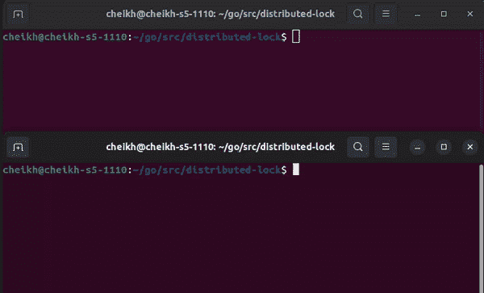

# 用 Go 实现分布式锁

> 原文：<https://blog.devgenius.io/implementing-a-distributed-lock-with-go-and-dbus-85a3f5ea0fb9?source=collection_archive---------2----------------------->

## 用 dBus 实现分布式锁 via 的方法


图片 [DeepMind](https://unsplash.com/@deepmind) via unsplash

微服务架构是一种分布式系统，因为它将应用程序分解为独立的组件与整体架构不同，微服务架构由多个服务组成，每个服务处理应用程序功能的一个方面。随着 Kubernetes 等工具简化微服务的部署，这已经成为一种非常普遍的做法。而且你也不能怪开发者，因为微服务提供了多个故障点。多点故障使平台即使在其中一个服务关闭时也能运行。随着微服务的出现，帮助这些“微进程”通信的方法被开发出来。在这篇文章中，我将详细介绍我用 dBus 实现分布式锁的方法。如果你想知道，dBus“是一个消息总线系统，一种应用程序相互通信的简单方式。”我选择 dBus 是因为我想要一个利用预安装的 Linux 组件的解决方案。

# **初始设置**

为了访问 dBus，我将实现包`github.com/godbus/dbus/v5`。这个包提供了与 dBus 通信的绑定。我要做的第一件事是定义我的自定义锁类型。以下是该类型的定义:

```
type BusLock struct {
 conn *dbus.Conn
 mu  *sync.Mutex
 id   string
}
```

以下是每个字段的作用:

*   `conn`:连接到`dbus`。这将用于发送和接收锁定消息。
*   `mu`:底层互斥，由接收到的消息锁定/解锁。
*   `id`:dBus 连接的唯一标识符。这用于防止程序处理自己的消息。

接下来，我将定义一个函数来初始化一个`BusLock`对象。该功能将通过连接到系统总线来启动。然后在连接上放置一个滤波器，只接受路径`/medium/examples/lock`的信号。提取连接 id，并将其设置为返回的`BusLock`对象的属性，以及连接和互斥锁。下面是该函数的代码:

```
func NewBusLock() (b BusLock, err error) { conn, err := dbus.**SystemBus**()
 if err != nil {
  return
 } if err = conn.**AddMatchSignal**(
   dbus.WithMatchObjectPath(**"/medium/examples/lock"**),
 ); err != nil {
  return
 } ids := conn.Names()
 var m sync.Mutex b = BusLock{
   conn: conn,
   id:   ids[0],
   mu : &m,
 } return
}
```

接下来，我将定义一个 struct 方法来监听和处理传入的信号。我给它取名`Listen`。这就是奇迹开始发生的地方。方法`Listen`的唯一职责是跨应用程序实例同步互斥状态。该功能将首先初始化一个类型为`dbus.Signal`的通道。它会将通道指定为传入消息的接收者。然后，我利用一个循环来检查消息数据。我检查是否通过了`true`或`false`，并相应地更新锁。下面是方法`Listen`的代码:

```
func (b BusLock) Listen() { c := make(chan *dbus.**Signal**, 10) b.conn.**Signal**(c) fmt.Println("listening") for v := range c { if v.Sender == b.id {
     continue
    } action := v.Body[0].(bool)
    fmt.Println("From : ", v.Sender, v) if action {
     b.mu.**Lock**()
     fmt.Println("Locking")
     continue
    } fmt.Println("UnLocking")
    b.mu.**Unlock**()

 }
}
```

接下来，我将为类型`BusLock`再添加两个方法。这些方法将负责锁定和解锁互斥体，以及发布事件。这两种方法的定义如下:

```
func (b *BusLock) Lock (){ b.mu.Lock()
  b.conn.Emit("/medium/examples/lock", "medium.examples.lock", true)
}func (b *BusLock) UnLock () { b.mu.Unlock()
  b.conn.Emit("/medium/examples/lock", "medium.examples.lock", false)
}
```

现在我已经有了执行我想要的功能的最小代码集，我将开始实现。

# 实施

为了实现它，我将首先调用`NewBusLock`来初始化一个`BusLock`类型的实例。初始化之后，我将调用 Goroutine 上的方法`Listen`来监听传入的消息。在这篇文章中，我将添加另一个 Goroutine 来更好地说明我的观点。Goroutine 将锁定 10 秒。我会在里面写代码来测量这个过程的时间。下面是实现过程:

```
func main() { bl, err := NewBusLock() if err != nil {
   log.Fatal(err)
 } go bl.Listen() go func(){ now := time.Now()
       // wait for other instance to set lock
       time.Sleep(5 * time.Second) bl.Lock()
       time.Sleep(10 * time.Second)
       bl.UnLock() fmt.Println( time.Since(now) ) }()  // will keep program alive  
  c := make(chan int) <-c}
```

我会运行这个程序两次。第一个应该不超过 15 秒，第二个应该至少需要 20 秒。第二个程序需要 20 秒，因为它在等待锁被释放(10 秒)并执行自己的操作，也是 10 秒。下面是这个想法在实践中的 gif 图:



# 结论

我选择用 dBus 实现分布式锁，因为它不需要在 Linux 等系统上下载额外的软件(如 redis)。这只是一个初始的**原型**，因为它似乎只适用于 **2 实例**。我计划将来对它进行迭代。至于我的“Kuberneters”，dBus 有 TCP 支持。

不过，这种解决方案也有一些缺陷。外部系统组件的意外行为可能会导致此实现中断。另一件事是，锁发布后启动的实例不会收到当前状态。解决这个问题的一个方法是在启动时读取锁的状态。死锁也是一个问题，但是可以通过超时来缓解，以防实例在解锁之前崩溃。你可以在最下面找到这篇文章中使用的代码。

**附加链接**

 [## 什么是分布式系统？亚特兰蒂斯人

### 分布式系统是一个计算机程序的集合，它利用跨多个…

www.atlassian.com](https://www.atlassian.com/microservices/microservices-architecture/distributed-architecture)  [## dbus

### D-Bus 是一种消息总线系统，是应用程序之间相互通信的一种简单方式。除了进程间…

www.freedesktop.org](https://www.freedesktop.org/wiki/Software/dbus/)  [## GitHub-godbus/dbus:D-Bus 的本地 Go 绑定

### dbus 是一个简单的库，它为 D-Bus 消息总线系统实现了本地 Go 客户端绑定。完整的原生…

github.com](https://github.com/godbus/dbus)  [## medium _ examples/main cheikh shift 上的分布式锁/medium_examples

### 中型文章的代码示例。在 GitHub 上创建一个帐户，为 cheikhshift/medium_examples 开发做贡献。

github.com](https://github.com/cheikhshift/medium_examples/tree/main/distributed-lock)