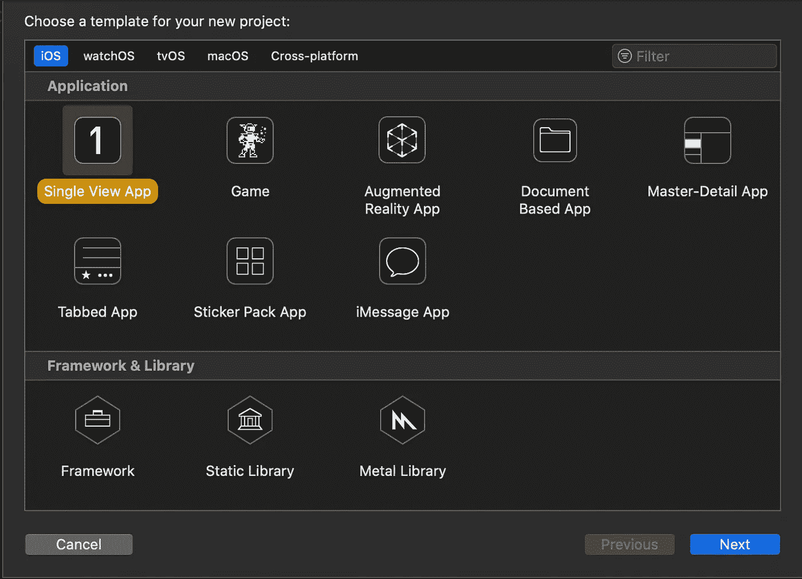

# 在 SwiftUI 中实现 AR…没有故事板

> 原文：<https://blog.devgenius.io/implementing-ar-in-swiftui-without-storyboards-ec529ace7ab2?source=collection_archive---------0----------------------->


[freestocks](https://unsplash.com/@freestocks?utm_source=medium&utm_medium=referral) 在 [Unsplash](https://unsplash.com?utm_source=medium&utm_medium=referral) 上拍摄的照片

AR 通常是用故事板实现的，但不一定是 T21。本教程是为我的开发伙伴准备的，他们想把 SwiftUI 和 AR 配对，而不需要故事板的麻烦。

# 我们开始吧

转到您现有的 SwiftUI 项目；对于这个演示，我创建了一个新的单视图 SwiftUI 项目。



创建单视图应用程序。


选择 SwiftUI 作为用户界面。

好消息！对于这种集成，不需要弄乱`AppDelegate.swift`或`SceneDelegate.swift`。我们将查看的唯一文件是`ContentView.swift`和`ARView.swift`(接下来您将创建它们)。

# 添加 AR 视图

将您的 ARView.swift 文件创建为常规 swift 文件。


将 ARView.swift 创建为常规 swift 文件。


项目中所有文件的概述。

斯威夫特是一张白纸。我们需要导入 ARKit 并用 UIViewController 和 ARSCNViewDelegate 协议声明 ARView 类。

```
**import Foundation
import ARKit****class ARView: UIViewController, ARSCNViewDelegate {****}**
```

现在我们需要实际创建一个视图。这通常是使用故事板的 AR 项目具有 IBAction 出口的地方。


我们将添加以下代码**(粗体)**，而不是使用它:

```
import Foundation
import ARKitclass ARView: UIViewController, ARSCNViewDelegate { **var arView: ARSCNView {
      return self.view as! ARSCNView
   }** **override func loadView() {
     self.view = ARSCNView(frame: .zero)
   }**}
```

现在让我们加载，指定一个代理，并为这个新的`arView`创建一个场景。

```
import Foundation
import ARKitclass ARView: UIViewController, ARSCNViewDelegate {

   var arView: ARSCNView {
      return self.view as! ARSCNView
   }override func loadView() {
     self.view = ARSCNView(frame: .zero)
   } **override func viewDidLoad() {
      super.viewDidLoad()
      arView.delegate = self
      arView.scene = SCNScene()
   }**}
```

接下来，我们将把最后的位添加到我们的`ARView`类中；这些是标准的 AR 视图和会话处理功能。

```
import Foundation
import ARKitclass ARView: UIViewController, ARSCNViewDelegate {

   var arView: ARSCNView {
      return self.view as! ARSCNView
   } override func loadView() {
     self.view = ARSCNView(frame: .zero)
   } override func viewDidLoad() {
      super.viewDidLoad()
      arView.delegate = self
      arView.scene = SCNScene()
   } **// MARK: - Functions for standard AR view handling
   override func viewDidAppear(_ animated: Bool) {
      super.viewDidAppear(animated)
   }** **override func viewDidLayoutSubviews() {
      super.viewDidLayoutSubviews()
   }** **override func viewWillAppear(_ animated: Bool) {
      super.viewWillAppear(animated)
      let configuration = ARWorldTrackingConfiguration()
      arView.session.run(configuration)
      arView.delegate = self
   }** **override func viewWillDisappear(_ animated: Bool) {
      super.viewWillDisappear(animated)
      arView.session.pause()
   }** **// MARK: - ARSCNViewDelegate
   func sessionWasInterrupted(_ session: ARSession) {}

   func sessionInterruptionEnded(_ session: ARSession) {}** **func session(_ session: ARSession, didFailWithError error: Error)    
   {}** **func session(_ session: ARSession, cameraDidChangeTrackingState       
   camera: ARCamera) {}**}
```

此时，确保将相机访问添加到`Info.plist`，否则您的 AR 视图将不被允许呈现，并导致严重的 SIGABRT 错误。


允许摄像机进入。

# 把它绑在一起

为了在这个`ARView`和 SwiftUI 之间转换，我们需要向`ARView.swift`和`Content.swift`添加一些 ViewIndicators。

从`ARView.swift`开始，在`ARView`类声明上方添加以下内容。

```
... //other imports
**import SwiftUI****// MARK: - ARViewIndicator
struct ARViewIndicator: UIViewControllerRepresentable {
   typealias UIViewControllerType = ARView

   func makeUIViewController(context: Context) -> ARView {
      return ARView()
   }** **func updateUIViewController(_ uiViewController:    
   ARViewIndicator.UIViewControllerType, context:
   UIViewControllerRepresentableContext<ARViewIndicator>) { }
}**... //ARView class declaration and rest of code
```

切换到 ContentView.swift，您将希望添加一个类似的 ViewIndicator，但使用不同的名称。

```
**// MARK: - NavigationIndicator****struct NavigationIndicator: UIViewControllerRepresentable {
   typealias UIViewControllerType = ARView** **func makeUIViewController(context: Context) -> ARView {
      return ARView()
   }** **func updateUIViewController(_ uiViewController: 
   NavigationIndicator.UIViewControllerType, context:
   UIViewControllerRepresentableContext<NavigationIndicator>) { }
}**... //ContentView Struct
```

# 最后润色

所以我们在`ARView.swift`和`ContentView.swift`中有一个免故事板的 ARView 类和 ViewIndicators，它们可以在两个视图之间无缝转换。

尽管如此，我们仍然需要一种从 ContentView 主屏幕进入 ARView 的方法。让我们给`ContentView.swift`添加一个堆栈结构和几个按钮来提示 ARView 这种调用视图的方法即使在更复杂的环境中也是一样的。

```
... //NavigationIndicator**struct ContentView: View {
   @State var page = "Home"

   var body: some View {
      VStack {
         if page == "Home" {
            Button("Switch to ARView") {
               self.page = "ARView"
            }
         } else if page == "ARView" {
            ZStack {
               NavigationIndicator()
               VStack {
                  Spacer()
                  Spacer()
                  Button("Home") {
                     self.page = "Home"
                  }.padding()
                  .background(RoundedRectangle(cornerRadius: 10)
                  .foregroundColor(Color.white).opacity(0.7))
               }
            }
         }
      }
   }
}**
```

运行项目应该显示如下内容:


在 [Github](https://github.com/mgipson/AR-SwiftUI) 上查看完整代码。

# 尽情享受吧！关注更多关于 iOS 开发、任何 Swift 和通用编程的文章和教程！