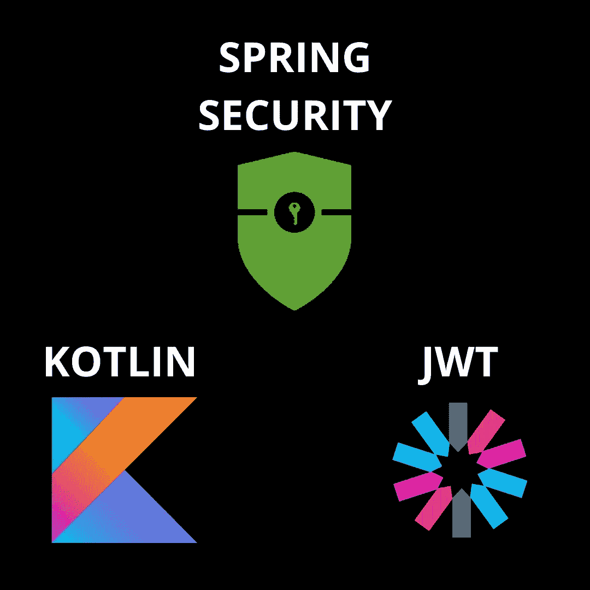
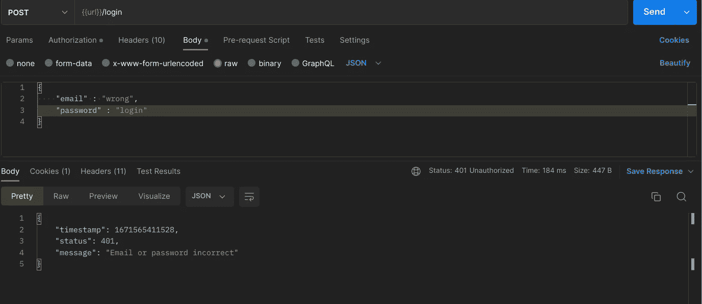
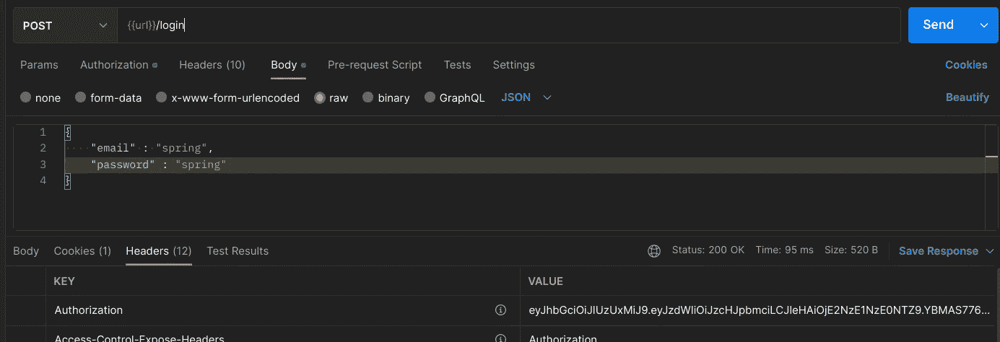
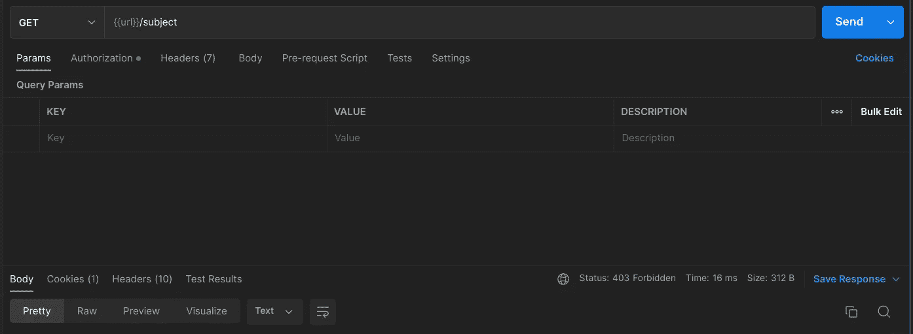
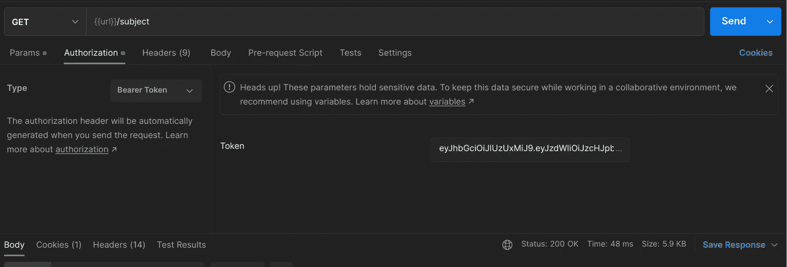

# 使用 Spring Security、Kotlin 和 JWT 实现身份验证和授权|一种简单明了的方法

> 原文：<https://blog.devgenius.io/implementing-authentication-and-authorization-using-spring-security-kotlin-and-jwt-an-easy-and-cc82a1f20567?source=collection_archive---------0----------------------->



# 介绍

自从我进入 Java 和 Spring 世界以来，我一直听说 Spring 安全是多么复杂和难以学习和理解。我个人非常同意那句话:互联网上缺乏现代材料，只有一堆过时和被否决的实现。

仅有的几次我不得不在我的个人项目上实现 Spring Security，这更像是从我在互联网或课程上找到的源代码中复制和粘贴代码。

# 让我们来看看代码

如果你只需要代码，这是一个我根本不会判断的行为(*我会对同一个*)你可以向下滚动到下面，复制并粘贴代码。

我认为您已经有了一个 spring boot 应用程序，并且可以在没有 auth 的情况下运行

## 属国

```
<dependency>
    <groupId>org.springframework.boot</groupId>
    <artifactId>spring-boot-starter-security</artifactId>
</dependency>
<dependency>
    <groupId>io.jsonwebtoken</groupId>
    <artifactId>jjwt</artifactId>
    <version>0.9.1</version>
</dependency>
```

## 模型

首先，创建一个数据类来存储请求凭证，稍后您必须将它映射到一个对象

```
import java.beans.ConstructorProperties

data class LoginDto
@ConstructorProperties("email", "password")
constructor(val email: String, val password: String)
```

第二步，创建一个继承***用户详细信息*** 的类

```
import org.springframework.security.core.GrantedAuthority
import org.springframework.security.core.userdetails.UserDetails

class UserSecurity
    (
    val id: String,
    val email: String,
    private val uPassword: String,
    private val uAuthorities: MutableCollection<GrantedAuthority>
) : UserDetails {
    override fun getAuthorities() = uAuthorities
    override fun getPassword() = uPassword
    override fun getUsername() = email
    override fun isAccountNonExpired() = true
    override fun isAccountNonLocked() = true
    override fun isCredentialsNonExpired()= true
    override fun isEnabled() = true
}
```

## 服务

创建一个继承自***UserDetailsService***的类，并实现其成员

```
 import com.ufc.backend.backend.security.model.UserSecurity
import org.springframework.security.core.authority.SimpleGrantedAuthority
import org.springframework.security.core.userdetails.UserDetails
import org.springframework.security.core.userdetails.UserDetailsService
import org.springframework.security.core.userdetails.UsernameNotFoundException
import org.springframework.stereotype.Service
import java.util.*

@Service
class UserDetailsService(
    private val repository: UserRepository
) : UserDetailsService {
    override fun loadUserByUsername(username: String): UserDetails {
       // Create a method in your repo to find a user by its username
        val user = repository.findByPersonEmail(username) ?: throw UsernameNotFoundException("$username not found")
        return UserSecurity(
            user.id,
            user.person.email,
            user.password,
            Collections.singleton(SimpleGrantedAuthority("user"))
        )
    }
}
```

## JWT

让我们开始编写著名的、花哨的样板类: ***JwtUtils。***

你可以在网上找到很多不同的实现，我写了一个我认为最容易理解的实现。

```
import io.jsonwebtoken.Jwts
import io.jsonwebtoken.SignatureAlgorithm
import org.springframework.stereotype.Component
import java.util.*

@Component
class JwtTokenUtil {

    private val secret = "YOUR_SECRET"
    private val expiration = 6000000

    fun generateToken(username: String): String =
        Jwts.builder().setSubject(username).setExpiration(Date(System.currentTimeMillis() + expiration))
            .signWith(SignatureAlgorithm.HS512, secret.toByteArray()).compact()

    private fun getClaims(token: String) =
        Jwts.parser().setSigningKey(secret.toByteArray()).parseClaimsJws(token).body

    fun getEmail(token: String): String = getClaims(token).subject

    fun isTokenValid(token: String): Boolean {
        val claims = getClaims(token)
        val expirationDate = claims.expiration
        val now = Date(System.currentTimeMillis())
        return now.before(expirationDate)
    }
}
```

这是很多样板代码。我只根据令牌的到期时间来检查它是否有效，你可能会觉得奇怪和不同，但实际上验证是自动完成的，方法是***get claims(token)***，如果令牌是错误的，那么将会抛出一个异常

## 过滤

## 认证过滤器

创建一个从 usernamepasswordtauthenticationfilter 继承的类

```
 import com.fasterxml.jackson.databind.ObjectMapper
import org.springframework.security.authentication.AuthenticationManager
import org.springframework.security.authentication.UsernamePasswordAuthenticationToken
import org.springframework.security.core.Authentication
import org.springframework.security.core.AuthenticationException
import org.springframework.security.core.authority.SimpleGrantedAuthority
import org.springframework.security.web.authentication.UsernamePasswordAuthenticationFilter
import java.util.*
import javax.servlet.FilterChain
import javax.servlet.http.HttpServletRequest
import javax.servlet.http.HttpServletResponse

class JwtAuthenticationFilter(
    private val jwtTokenUtil: JwtTokenUtil,
    private val authenticationManager: AuthenticationManager
) :
    UsernamePasswordAuthenticationFilter() {

    override fun attemptAuthentication(req: HttpServletRequest, response: HttpServletResponse): Authentication {
        val credentials = ObjectMapper().readValue(req.inputStream, LoginDto::class.java)
        val auth = UsernamePasswordAuthenticationToken(
            credentials.email,
            credentials.password,
            Collections.singleton(SimpleGrantedAuthority("user"))
        )
        return authenticationManager.authenticate(auth)
    }

    override fun successfulAuthentication(
        req: HttpServletRequest?, res: HttpServletResponse, chain: FilterChain?,
        auth: Authentication
    ) {
        val username = (auth.principal as UserSecurity).username
        val token: String = jwtTokenUtil.generateToken(username)
        res.addHeader("Authorization", token)
        res.addHeader("Access-Control-Expose-Headers", "Authorization")
    }

    override fun unsuccessfulAuthentication(
        request: HttpServletRequest,
        response: HttpServletResponse,
        failed: AuthenticationException
    ) {
        val error = BadCredentialsError()
        response.status = error.status
        response.contentType = "application/json"
        response.writer.append(error.toString())
    }

}

private data class BadCredentialsError(
    val timestamp: Long = Date().time,
    val status: Int = 401,
    val message: String = "Email or password incorrect",
) {
    override fun toString(): String {
        return ObjectMapper().writeValueAsString(this)
    }
}
```

这个类的解释非常简短和直接，它负责在您成功登录时生成一个令牌，在您执行错误的凭证时抛出一个异常

```
 import com.ufc.backend.backend.security.services.UserDetailsService
import org.springframework.http.HttpHeaders.AUTHORIZATION
import org.springframework.security.authentication.AuthenticationManager
import org.springframework.security.authentication.UsernamePasswordAuthenticationToken
import org.springframework.security.core.context.SecurityContextHolder
import org.springframework.security.web.authentication.www.BasicAuthenticationFilter
import java.io.IOException
import javax.servlet.FilterChain
import javax.servlet.ServletException
import javax.servlet.http.HttpServletRequest
import javax.servlet.http.HttpServletResponse

class JwtAuthorizationFilter(
    private val jwtTokenUtil: JwtTokenUtil,
    private val service: UserDetailsService,
    authManager: AuthenticationManager,

    ) : BasicAuthenticationFilter(authManager) {

    @Throws(IOException::class, ServletException::class)
    override fun doFilterInternal(
        req: HttpServletRequest,
        res: HttpServletResponse,
        chain: FilterChain
    ) {
        val header = req.getHeader(AUTHORIZATION)
        if (header == null || !header.startsWith("Bearer ")) {
            chain.doFilter(req, res)
            return
        }
        getAuthentication(header.substring(7))?.also {
            SecurityContextHolder.getContext().authentication = it
        }
        chain.doFilter(req, res)
    }

    private fun getAuthentication(token: String): UsernamePasswordAuthenticationToken? {
        if (!jwtTokenUtil.isTokenValid(token)) return null
        val email = jwtTokenUtil.getEmail(token)
        val user = service.loadUserByUsername(email)
        return UsernamePasswordAuthenticationToken(user, null, user.authorities)
    }
}
```

该类负责验证令牌并在 SecurityContext 上设置经过身份验证的用户

# 配置

我们已经具备了开始配置和告诉 spring 使用我们的方法进行认证和授权所需的一切

```
import org.springframework.context.annotation.Bean
import org.springframework.context.annotation.Configuration
import org.springframework.security.authentication.AuthenticationManager
import org.springframework.security.config.annotation.authentication.builders.AuthenticationManagerBuilder
import org.springframework.security.config.annotation.web.builders.HttpSecurity
import org.springframework.security.config.http.SessionCreationPolicy
import org.springframework.security.crypto.bcrypt.BCryptPasswordEncoder
import org.springframework.security.web.SecurityFilterChain

@Configuration
open class SecurityConfig(
    private val userDetailsService: UserDetailsService,
) {
    private val jwtToken = JwtTokenUtil()

    private fun authManager(http: HttpSecurity): AuthenticationManager {
        val authenticationManagerBuilder = http.getSharedObject(
            AuthenticationManagerBuilder::class.java
        )
        authenticationManagerBuilder.userDetailsService(userDetailsService)
        return authenticationManagerBuilder.build()
    }

    @Bean
    open fun filterChain(http: HttpSecurity): SecurityFilterChain {
        val authenticationManager = authManager(http)
        // Put your endpoint to create/sign, otherwise spring will secure it as
        // well you won't be able to do any request
        http.authorizeRequests().antMatchers("/users")
            .permitAll().anyRequest().authenticated().and().csrf().disable()
            .authenticationManager(authenticationManager)
            .sessionManagement().sessionCreationPolicy(SessionCreationPolicy.STATELESS).and()
            .addFilter(JwtAuthenticationFilter(jwtToken, authenticationManager))
            .addFilter(JwtAuthorizationFilter(jwtToken, userDetailsService, authenticationManager))

        return http.build()
    }

    @Bean
    open fun bCryptPasswordEncoder(): BCryptPasswordEncoder {
        return BCryptPasswordEncoder()
    }
}
```

# 保护密码

我保证，这是您的服务中拯救用户的最后一件事:注入以下依赖项

```
@Service
class UserService(
    private val passwordEncoder: BCryptPasswordEncoder
)
```

然后，用你的方法保存你的用户，加密密码

```
 user.password = passwordEncoder.encode(user.password)
```

# 让我们测试一下

首先，进入您暴露为不受保护的端点和配置文件，并为您创建一个用户。

有了这些，拿起电子邮件和密码，让我们在以下端点上执行 POST:

```
POST YOUR_API_URL:YOUR_PORT/login
```

默认情况下，Spring Security 会为您创建一个/login，所以让我们来试试

# 证明

## 错误登录



## 成功登录



**200** 如您所见，它在响应上生成了一个令牌，这是我们的 JWT 令牌

# 批准

让我们尝试运行一个没有令牌的受保护端点:



它给我们 4003 禁止，基本上说，我们没有登录

现在，令牌在手，让我们再表演一次:



它返回 200，**我们通过认证了！**

# 让用户登录您的应用程序

我们被记录了，那又怎样？我们要怎么利用这些信息？这很简单，在你的服务器上，或者在你想检索这些信息的任何地方

```
val userLoggedId = (SecurityContextHolder.getContext().authentication.principal as UserSecurity).id
val userLogged = yourUserService.findById(userLoggedId)
```

# 支持

就是这样的家伙，如果你觉得这很有用，或者它包含一些错误或失误，请随时告诉我。实际上，我可能会在将来发现这篇文章完全错误，我不知道，我们会看到，我这样做是为了帮助社区和帮助自己，无论何时我想使用这个堆栈再次实现 auth。

我有空，并且洗耳恭听我的 [Linkedin](https://www.linkedin.com/in/ren%C3%AA-j%C3%BAnior-55901b198/)