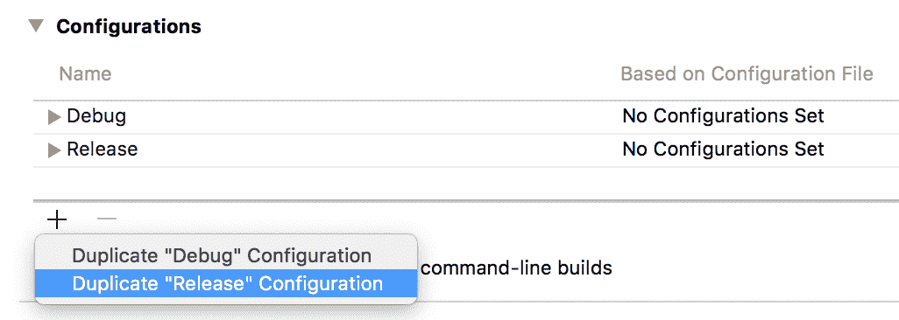
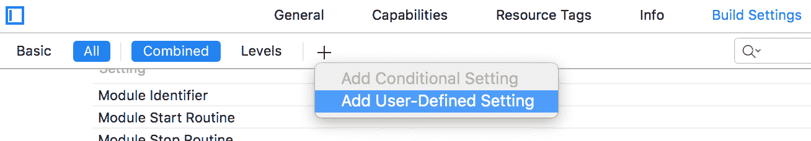
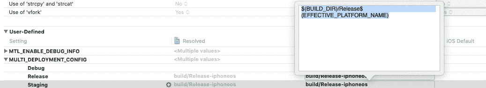
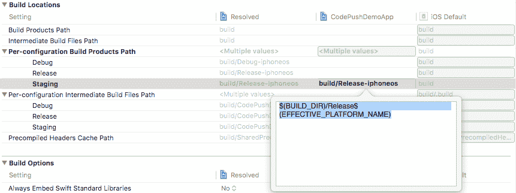
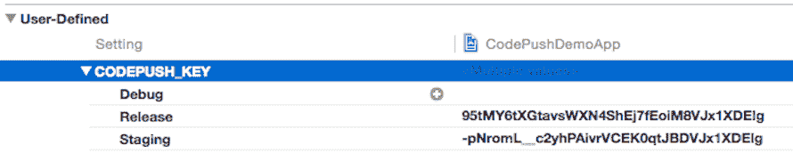
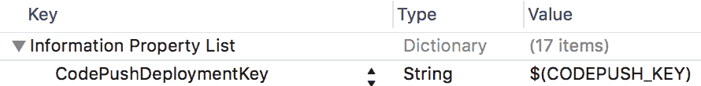

# 在 React Native (iOS)上实现 codepush

> 原文：<https://blog.devgenius.io/implementing-codepush-on-react-native-ios-1cdefa4640c7?source=collection_archive---------0----------------------->

**代码推送设置 iOS**

1.  安装 appcenter-cli
    T3【NPM】安装 app center-CLI 或 yarn 添加 appcenter-cli
2.  登录到应用中心
3.  打开终端和 *appcenter 登录*
4.  在 appcenter 中创建应用程序
    访问 [appcenter.m](http://appcenter.ms) s 并在那里添加您的应用程序。
5.  创建 react-native 项目后，安装 appcenter 依赖项。
    *npm 安装应用中心应用中心-分析应用中心-崩溃-保存-精确或添加应用中心应用中心-分析应用中心-崩溃-精确*
6.  集成 React 原生 iOS
    pod 安装—报告-更新
7.  使用以下内容创建一个名为 AppCenter-Config.plist 的新文件，并将{APP_SECRET_VALUE}替换为您的 app secret 值。不要忘记将此文件添加到 Xcode 项目中(在 Xcode 中右键单击应用程序，然后单击将文件添加到…)。

```
<?xml version=”1.0" encoding=”UTF-8"?> <!DOCTYPE plist PUBLIC “-//Apple//DTD PLIST 1.0//EN” “https://www.apple.com/DTDs/PropertyList-1.0.dtd"><plist version=”1.0"><dict><key>AppSecret</key><string>{APP_SECRET_VALUE}</string></dict></plist>
```

现在，修改应用程序的 AppDelegate.m 文件，以包含启动 SDK 的代码:

1.  将这些行添加到#if DEBUG 或#ifdef FB_SONARKIT_ENABLED 声明(如果存在)上方的导入部分*:*

```
#import <AppCenterReactNative.h>#import <AppCenterReactNativeAnalytics.h>#import <AppCenterReactNativeCrashes.h>**Add these lines to the didFinishLaunchingWithOptions method**[AppCenterReactNative register];[AppCenterReactNativeAnalytics registerWithInitiallyEnabled:true];[AppCenterReactNativeCrashes registerWithAutomaticProcessing];
```

现在配置 react-native-code-push

```
npm install react-native-code-push 
```

在您的项目目录中。

现在，在 AppDelegate.m 中添加这些行

```
#import <CodePush/CodePush.h>- (NSURL *)sourceURLForBridge:(RCTBridge *)bridge{#if DEBUGreturn [[RCTBundleURLProvider sharedSettings] jsBundleURLForBundleRoot:@”index” fallbackResource:nil];#elsereturn [CodePush bundleURL];#endif}
```

现在，打开您的 Xcode 项目，在项目导航器窗口中选择您的项目

1.  确保选择项目节点，而不是您的目标之一
2.  选择信息选项卡
3.  单击配置部分中的+按钮，并选择复制“发布”配置



1.  命名新的配置阶段(或您喜欢的任何名称)
2.  选择“构建设置”选项卡
3.  单击工具栏上的+按钮，并选择添加用户定义的设置



1.  将此设置命名为 MULTI_DEPLOYMENT_CONFIG。转到设置并添加值$(BUILD _ DIR)/$(CONFIGURATION)$(EFFECTIVE _ PLATFORM _ NAME)进行发布。之后，添加值$(构建目录)/发布$(有效平台名称)用于暂存。



1.  注意
    对于 Xcode 10 和更低版本:转到构建位置>每个配置的构建产品路径>暂存并将暂存值从$(Build _ DIR)/$(CONFIGURATION)$(EFFECTIVE _ PLATFORM _ NAME)更改为$(Build _ DIR)/Release $(EFFECTIVE _ PLATFORM _ NAME)



1.  注意
    由于[https://github.com/facebook/react-native/issues/11813](https://github.com/facebook/react-native/issues/11813)，我们必须执行此步骤，以便在 RN 0.40.0 或更高版本上使用除调试或发布之外的其他配置。
2.  再次单击工具栏上的+按钮，选择 Add User-Defined Setting
    将该设置命名为 CODEPUSH_KEY，展开它，并为登台配置指定您的登台部署密钥，为发布配置指定您的生产部署密钥。



1.  注意
    作为提醒，您可以通过从您的终端运行 app center code push deployment list-a<owner name>/<appName>-display keys 来检索这些密钥。
2.  打开项目的 Info.plist 文件，并将 CodePushDeploymentKey 条目的值更改为$(CODEPUSH_KEY)



就是这样！现在，当您运行或构建应用程序时，您的临时版本将自动配置为与您的临时部署同步，而您的发布版本将配置为与您的生产部署同步。

此外，如果您想要为它们提供单独的名称或图标，您可以修改产品捆绑标识符、产品名称和资产目录应用程序图标集名称构建设置，这样当安装在同一设备上时，您的暂存构建就可以与发布构建区分开来。

1.  // #1)创建您的新部署以保存特定应用程序变体的发布
    appcenter 代码推送部署 add-a<owner name>/<appName>test-variant-one

// #2)针对客户部署任何新版本
app center code push release-react-a<owner name>/<appName>-d 测试-变体-one

为 CodePush 创建一个名为 CodepushManager.js 的组件

```
import React from ‘react’;import {Platform} from ‘react-native’;import codePush from ‘react-native-code-push’;class CodePushManager extends React.Component {render() {return null;}}export default codePush({checkFrequency: codePush.CheckFrequency.ON_APP_RESUME,installMode: codePush.InstallMode.ON_NEXT_RESUME,minimumBackgroundDuration: 60,})(CodePushManager);
```

在 App.js 中导入 CodepushManager

1.  生成密钥对

openssl genrsa -out private.pem

OpenSSL RSA-pub out-in private . PEM-out public . PEM

1.  使用 xcode 构建您的应用程序并上传到 appstore
2.  appcenter 代码推送发布-react-a owner-name/AppName-d Staging-k private . PEM

感谢您的阅读！！祝你玩得愉快