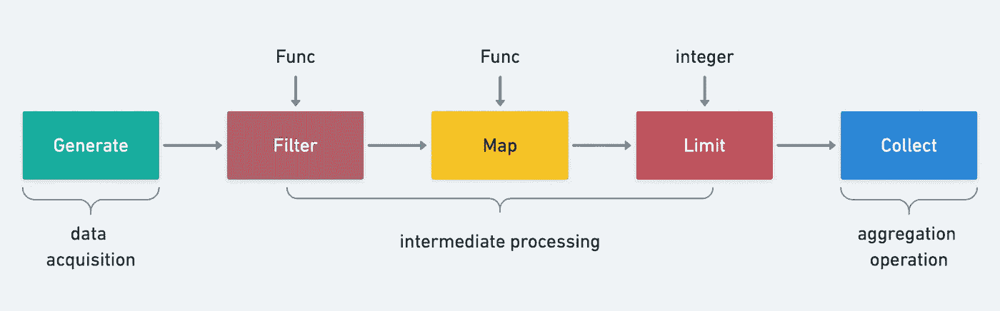

# 实现 Go 流 API

> 原文：<https://blog.devgenius.io/implementing-go-stream-api-a74a6156ac35?source=collection_archive---------3----------------------->



# 什么是流处理

Java 开发人员应该非常熟悉 Java 中的 Stream API，它大大提高了处理数据集合的能力。

```
**int** sum = widgets.stream()
              .filter(w -> w.getColor() == RED)
              .mapToInt(w -> w.getWeight())
              .sum();
```

Stream 的思想是将数据处理抽象成数据流，并在每次处理后返回一个新的流供使用。

# 流函数定义

最重要的一步是在编写代码之前仔细考虑需求，所以让我们试着站在作者的角度考虑组件的流程。首先，我们先把底层的实现逻辑放在一边，试着从头开始定义流函数。

Stream 的工作流程实际上是生产-消费模型的一部分，整个过程与工厂中的生产过程非常相似。

1.  创建阶段/数据采集(原材料)
2.  处理阶段/中间处理(流水线处理)
3.  聚集阶段/最终操作(最终产品)

API 是围绕一个流的三个生命周期定义的。

## 创建阶段

为了创建抽象对象流，可以理解为构造函数。

我们支持三种构造流的方式:切片转换、通道转换和函数转换。

注意，这个阶段的方法是普通的公共方法，没有绑定到流对象。

```
// Create stream by variable parameter pattern
**func** **Just**(items ... .**interface**{}) **Stream**// Create a stream via channel
**func** **Range**(source <-**chan** **interface**{}) **Stream**// Create stream by function
**func** **From**(generate GenerateFunc) **Stream**// Concatenate a stream
**func** **Concat**(s Stream, others . . Stream) **Stream**
```

## 处理阶段

处理阶段所需的操作通常与我们的业务逻辑相对应，例如转换、过滤、去重、排序等等。

这个阶段的 API 是一个需要绑定到流对象的方法。

下面的定义结合了常见的业务场景。

```
// Remove duplicate items
Distinct(keyFunc KeyFunc) Stream
// Filter item by condition
Filter(filterFunc FilterFunc, opts ... . Option) Stream
// Grouping
Group(fn KeyFunc) Stream
// Return the first n elements
Head(n **int64**) Stream
// Returns the last n elements
Tail(n **int64**) Stream
// Convert objects
Map(fn MapFunc, opts . . Option) Stream
// Merge items into slice to create a new stream
Merge() Stream
// Reverse
Reverse() Stream
// Sort
Sort(fn LessFunc) Stream
// Works on each item
Walk(fn WalkFunc, opts ... . Option) Stream
// Aggregate other Streams
Concat(streams ... . Stream) Stream
```

处理阶段的处理逻辑返回一个新的流对象，这里有一个基本的实现范式。


## 聚集阶段

聚合阶段实际上是我们想要的处理结果，例如，它是否匹配、计数、遍历等等。

```
// Check for all matches
AllMatch(fn PredicateFunc) **bool**
// Check if at least one match exists
AnyMatch(fn PredicateFunc) **bool**
// Check for all mismatches
NoneMatch(fn PredicateFunc) **bool**
// Count the number of matches
Count() **int**
// Clear the stream
Done()
// Perform an operation on all elements
ForAll(fn ForAllFunc)
// Perform an operation on each element
ForEach(fn ForEachFunc)
```

在理清了组件的需求边界之后，我们对我们要用 Stream 实现什么有了一个更清晰的想法。在我的感知中，一个真正的架构师对需求及其后续演化的把握可以非常精准，而这只有通过对需求的深入思考，穿透需求背后的本质才能实现。通过代替作者的视角来模拟整个项目构建过程，学习作者的思维方法论是我们学习开源项目的最大价值。

好了，让我们试着定义完整的流接口和函数。

> *界面的作用不仅仅是一个模板，还要利用它的抽象能力来构建项目的整体框架而不要一开始就陷入细节，通过界面简洁地快速表达我们的思维过程，要学会养成自上而下的思维方式从全局的角度来观察整个系统，一开始就很容易陷入细节。*

```
rxOptions **struct** {
  unlimitedWorkers **bool**
  workers **int**
}
Option **func**(opts *rxOptions)
// key generator
// item - the element in the stream
KeyFunc **func**(item **interface**{}) **interface**{}
// filter function
FilterFunc **func**(item **interface**{}) **bool**
// object conversion function
MapFunc **func**(intem **interface**{}) **interface**{}
// object comparison
LessFunc **func**(a, b **interface**{}) **bool**
// traversal function
WalkFunc **func**(item **interface**{}, pip **chan**<- **interface**{})
// match function
PredicateFunc **func**(item **interface**{}) **bool**
// perform an operation on all elements
ForAllFunc **func**(pip <-**chan** **interface**{})
// performs an operation on each item
ForEachFunc **func**(item **interface**{})
// execute operations on each element concurrently
ParallelFunc **func**(item **interface**{})
// execute the aggregation operation on all elements
ReduceFunc **func**(pip <-**chan** **interface**{}) (**interface**{}, error)
// item generation function
GenerateFunc **func**(source <-**chan** **interface**{})Stream **interface** {
  // Remove duplicate items
  Distinct(keyFunc KeyFunc) Stream
  // Filter item by condition
  Filter(filterFunc FilterFunc, opts . . Option) Stream
  // Grouping
  Group(fn KeyFunc) Stream
  // Return the first n elements
  Head(n **int64**) Stream
  // Returns the last n elements
  Tail(n **int64**) Stream
  // Get the first element
  First() **interface**{}
  // Get the last element
  Last() **interface**{}
  // Convert the object
  Map(fn MapFunc, opts . . Option) Stream
  // Merge items into slice to create a new stream
  Merge() Stream
  // Reverse
  Reverse() Stream
  // Sort
  Sort(fn LessFunc) Stream
  // Works on each item
  Walk(fn WalkFunc, opts ... . Option) Stream
  // Aggregate other Streams
  Concat(streams ... . Stream) Stream
  // Check for all matches
  AllMatch(fn PredicateFunc) **bool**
  // Check if there is at least one match
  AnyMatch(fn PredicateFunc) **bool**
  // Check for all mismatches
  NoneMatch(fn PredicateFunc) **bool**
  // Count the number of matches
  Count() **int**
  // Clear the stream
  Done()
  // Perform an operation on all elements
  ForAll(fn ForAllFunc)
  // Perform an operation on each element
  ForEach(fn ForEachFunc)
}
```

channel()方法用于获取流管道属性，因为我们在实现中处理接口对象，所以我们公开一个私有方法来读取。

```
// Get the internal data container channel, internal method
channel() **chan** **interface**{}
```

# 实施思路

整理好功能定义后，接下来考虑几个工程实现。

# 如何实现链式调用

链式调用，构建器模式用来创建对象可以达到链式调用的效果。事实上，Stream 根据相同的原理实现了类似的连锁效应，在每次调用中创建一个新的流来返回。

```
// Remove duplicate items
Distinct(keyFunc KeyFunc) Stream
// Filter item by condition
Filter(filterFunc FilterFunc, opts . . Option) Stream
```

# 如何达到流水线处理的效果

管道可以理解为流中数据的存储容器。在 go 中我们可以使用 channel 作为数据的管道，在流链调用执行多个操作时达到**异步无阻塞**的效果。

# 如何支持并行处理

数据处理本质上是处理通道中的数据，所以实现并行处理就是简单地并行消耗通道，使用 goroutine 和 WaitGroup 可以非常方便地实现并行处理。

# 归零实现

`core/fx/stream.go`

go-zero 中 Stream 的实现没有定义接口，但是在底层实现时逻辑是一样的。

为了实现流接口，我们定义了一个内部实现类，其中源是 channel 类型，以模拟管道功能。

```
Stream **struct** {
  source <-**chan** **interface**{}
}
```

# 创建 API

## 范围的通道创建

通过频道创建流

```
**func** **Range**(source <-**chan** **interface**{}) **Stream** {  
  **return** Stream{  
    source: source,  
  }  
}
```

## Just 的可变参数模式创建

在可变参数模式下创建流，并在完成编写后关闭通道，这是一个好习惯。

```
**func** **Just**(items ... .**interface**{}) **Stream** {
  source := make(**chan** **interface**{}, len(items))
  **for** _, item := **range** items {
    source <- item
  }
  close(source)
  **return** Range(source)
}
```

## 要创建的函数

按功能创建流

```
**func** **From**(generate GenerateFunc) **Stream** {
  source := make(**chan** **interface**{})
  threading.GoSafe(**func**() {
    **defer** close(source)
    generate(source)
  })
  **return** Range(source)
}
```

因为它涉及对函数参数的外部调用，所以执行过程是不可用的，所以您需要捕获运行时异常，以防止紧急错误被传递到上层并使应用程序崩溃。

```
**func** **Recover**(cleanups ... . **func**()) {
  **for** _, cleanup := **range** cleanups {
    cleanup()
  }
  **if** r := recover(); r ! = **nil** {
    logx.ErrorStack(r)
  }
}**func** **RunSafe**(fn **func**()) {
  **defer** rescue.Recover()
  fn()
}**func** **GoSafe**(fn **func**()) {
  **go** RunSafe(fn)
}
```

## 拼接拼接

拼接其他流创建一个新流，调用内部 Concat 方法方法，Concat 的源代码实现将在后面分析。

```
**func** **Concat**(s Stream, others . . Stream) **Stream** {
  **return** s.Concat(others...)
}
```

# 处理 API

## 重复数据消除独特

因为传入了函数参数`KeyFunc func(item interface{}) interface{}`，这意味着它也支持根据业务场景进行自定义区分，本质上是利用 KeyFunc 返回的结果来实现基于一张地图的区分。

函数参数非常强大，并且提供了很大的灵活性。

```
**func** (s Stream) **Distinct**(keyFunc KeyFunc) **Stream** {
  source := make(**chan** **interface**{})
  threading.GoSafe(**func**() {
    // It's a good habit for channels to remember to close
    **defer** close(source)
    keys := make(**map**[**interface**{}]lang.PlaceholderType)
    **for** item := **range** s.source {
      // Custom de-duplication logic
      key := keyFunc(item)
      // If the key does not exist, write the data to a new channel
      **if** _, ok := keys[key]; !ok {
        source <- item
        keys[key] = lang.
      Placeholder }
    }
  })
  **return** Range(source)
}
```

用例。

```
// 1 2 3 4 5
Just(1, 2, 3, 3, 4, 5, 5).Distinct(**func**(item **interface**{}) **interface**{} {
  **return** item
}).ForEach(**func**(item **interface**{}) {
  t.Log(item)
})// 1 2 3 4
Just(1, 2, 3, 3, 4, 5, 5).Distinct(**func**(item **interface**{}) **interface**{} {
  uid := item.(**int**)
  // Special de-duplication logic for items greater than 4, so that only one item > 3 is retained
  **if** uid > 3 {
    **return** 4
  }
  **return** item
}).ForEach(**func**(item **interface**{}) {
  t.Log(item)
})
```

## 过滤器过滤器

通过将过滤逻辑抽象为 FilterFunc，然后单独对项目进行操作，以根据 FilterFunc 返回的布尔值决定是否写回新通道，从而将实际的过滤逻辑委托给 Walk 方法。

Option 参数包含两个选项。

1.  无限制的工作人员对并发进程的数量没有限制
2.  工人限制并发进程的数量

```
FilterFunc **func**(item **interface**{}) **bool****func** (s Stream) **Filter**(filterFunc FilterFunc, opts . . Option) **Stream** {
  **return** s.Walk(**func**(item **interface**{}, pip **chan**<- **interface**{}) {
    **if** filterFunc(item) {
      pip <- item
    }
  }, opts...)
}
```

用法示例。

```
**func** **TestInternalStream_Filter**(t *testing.T) {
  // keep even numbers 2,4
  channel := Just(1, 2, 3, 4, 5).Filter(**func**(item **interface**{}) **bool** {
    **return** item.(**int**)%2 == 0
  }).channel()
  **for** item := **range** channel {
    t.Log(item)
  }
}
```

## 遍历整个过程

walk 的意思是走，这里是指对每一项执行 WalkFunc 操作，并将结果写入一个新的流。

请注意，新流的通道中的数据顺序是随机的，因为内部并发机制用于异步读写数据。

```
// item element in item-stream
// The pipe-item is written to the pipe if it matches the condition
WalkFunc **func**(item **interface**{}, pipe **chan**<- **interface**{})**func** (s Stream) **Walk**(fn WalkFunc, opts . .Option) **Stream** {
  option := buildOptions(opts...)
  **if** option.unlimitedWorkers {
    **return** s.walkUnLimited(fn, option)
  }
  **return** s.walkLimited(fn, option)
}**func** (s Stream) **walkUnLimited**(fn WalkFunc, option *rxOptions) **Stream** {
  // Create a channel with a buffer
  // default is 16, channel with more than 16 elements will be blocked
  pipe := make(**chan** **interface**{}, defaultWorkers)
  **go** **func**() {
    **var** wg sync.WaitGroup **for** item := **range** s.source {
      // All elements of s.source need to be read
      // This also explains why the channel is written last and remembered to finish
      // If it is not closed, it may lead to leaks and blocking
      // Important, not assigning a value to val is a classic concurrency trap, and is used later in another goroutine
      val := item
      wg.Add(1)
      // Execute the function in safe mode
      threading.GoSafe(**func**() {
        **defer** wg.Done()
        fn(item, pipe)
      })
    }
    wg.Wait()
    close(pipe)
  }() // return a new Stream
  **return** Range(pipe)
}**func** (s Stream) **walkLimited**(fn WalkFunc, option *rxOptions) **Stream** {
  pipe := make(**chan** **interface**{}, option.workers)
  **go** **func**() {
    **var** wg sync.WaitGroup
    // Control the number of concurrent processes
    pool := make(**chan** lang.PlaceholderType, option.workers) **for** item := **range** s.source {
      // Important, not assigning a value to val is a classic concurrency trap, used later in another goroutine
      val := item
      // will block if the concurrency limit is exceeded
      pool <- lang.
      // This also explains why the channel is written last and remembered to finish
      // If you don't close it, it may cause the concurrent thread to keep blocking and lead to leaks
      wg.Add(1) // Execute the function in safe mode
      threading.GoSafe(**func**() {
        **defer** **func**() {
          wg.Done()
          // Read the pool once to release a concurrent location after execution is complete
          <-pool
        }()
        fn(item, pipe)
      })
    }
    wg.Wait()
    close(pipe)
  }()
  **return** Range(pipe)
}
```

用例。

返回的顺序是随机的。

```
**func** **Test_Stream_Walk**(t *testing.T) {
  // return 300,100,200
  Just(1, 2, 3).Walk(**func**(item **interface**{}, pip **chan**<- **interface**{}) {
    pip <- item.(**int**) * 100
  }, WithWorkers(3)).ForEach(**func**(item **interface**{}) {
    t.Log(item)
  })
}
```

## 分组组

通过匹配项目放入地图。

```
KeyFunc **func**(item **interface**{}) **interface**{}**func** (s Stream) **Group**(fn KeyFunc) **Stream** {
  groups := make(**map**[**interface**{}][]**interface**{})
  **for** item := **range** s.source {
    key := fn(item)
    groups[key] = append(groups[key], item)
  }
  source := make(**chan** **interface**{})
  **go** **func**() {
    **for** _, group := **range** groups {
      source <- group
    }
    close(source)
  }()
  **return** Range(source)
}
```

## 获取 Head 的前 n 个元素

n 大于实际数据集长度，将返回所有元素

```
**func** (s Stream) **Head**(n **int64**) **Stream** {
  **if** n < 1 {
    panic("n must be greather than 1")
  }
  source := make(**chan** **interface**{})
  **go** **func**() {
    **for** item := **range** s.source {
      n--
      // The value of n may be greater than the length of s.source, you need to determine if it is >= 0
      **if** n >= 0 {
        source <- item
      }
      // let successive method go ASAP even we have more items to skip
      // why we don't just break the loop, because if break,
      // this former goroutine will block forever, which will cause goroutine leak.
      // n==0 means that source is full and can be closed
      // Since source has met the condition, why not just break and jump out of the loop?
      // The author mentions preventing goroutine leaks
      // Because each operation will eventually create a new Stream, and the old one will never be called
      **if** n == 0 {
        close(source)
        **break**
      }
    }
    // The above loop jumped out of the loop, which means n is greater than the actual length of s.source
    // still need to show the new source closed
    **if** n > 0 {
      close(source)
    }
  }()
  **return** Range(source)
}
```

用法示例。

```
// return 1,2
**func** **TestInternalStream_Head**(t *testing.T) {
  channel := Just(1, 2, 3, 4, 5).Head(2).channel()
  **for** item := **range** channel {
    t.Log(item)
  }
}
```

## 获取 Tail 的最后 n 个元素

为了确保使用环数据结构获得最后 n 个元素，理解环的实现是有趣的。

```
// ring slicing
**type** Ring **struct** {
  elements []**interface**{}
  index **int**
  lock sync.Mutex
}**func** **NewRing**(n **int**) ***Ring** {
  **if** n < 1 {
    panic("n should be greather than 0")
  }
  **return** &Ring{
    elements: make([]**interface**{}, n),
  }
}// Add elements
**func** (r *Ring) **Add**(v **interface**{}) {
  r.lock.Lock()
  **defer** r.lock.Unlock()
  // Write the element to the slice at the specified location
  // The remainder here achieves a circular writing effect
  r.elements[r.index%len(r.elements)] = v
  // Update the next write position
  r.index++
}// Get all elements
// Keep the read order the same as the write order
**func** (r *Ring) **Take**() []**interface**{} {
  r.lock.Lock()
  **defer** r.lock.Unlock() **var** size **int**
  **var** start **int**
  // When there is a circular write situation
  // The start read position needs to be decimalized, because we want the read order to be the same as the write order
  **if** r.index > len(r.elements) {
    size = len(r.elements)
    // Because of the cyclic write situation, the current write position index starts with the oldest data
    start = r.index % len(r.elements)
  } **else** {
    size = r.index
  }
  elements := make([]**interface**{}, size)
  **for** i := 0; i < size; i++ {
    // Read the remainder in a circular fashion, keeping the read order the same as the write order
    elements[i] = r.elements[(start+i)%len(r.elements)]
  } **return** elements
}
```

总结环形切片的优点。

*   支持自动滚动更新
*   内存节省

当固定容量已满时，环形切片使旧数据能够被新数据覆盖，并且由于这一特性，可用于读取通道之后的 n 个元素。

```
**func** (s Stream) **Tail**(n **int64**) **Stream** {
  **if** n < 1 {
    panic("n must be greather than 1")
  }
  source := make(**chan** **interface**{})
  **go** **func**() {
    ring := collection.NewRing(**int**(n))
    // Read all elements, if the number > n ring slices can achieve new data over old data
    // ensure that the last n elements are obtained
    **for** item := **range** s.source {
      ring.Add(item)
    }
    **for** _, item := **range** ring.Take() {
      source <- item
    }
    close(source)
  }()
  **return** Range(source)
}
```

那么为什么不直接使用透镜(源)长度切片呢？

答案是节省内存。任何包含环类型的数据结构都具有节省内存和按需分配资源的优点。

用法示例。

```
**func** **TestInternalStream_Tail**(t *testing.T) {
  // 4,5
  channel := Just(1, 2, 3, 4, 5).Tail(2).channel()
  **for** item := **range** channel {
    t.Log(item)
  }
  // 1,2,3,4,5
  channel2 := Just(1, 2, 3, 4, 5).Tail(6).channel()
  **for** item := **range** channel2 {
    t.Log(item)
  }
}
```

## 元素转换图

元素转换，由完成转换操作的并发进程在内部完成，请注意，输出通道不保证按原始顺序输出。

```
MapFunc **func**(intem **interface**{}) **interface**{}
**func** (s Stream) **Map**(fn MapFunc, opts . . Option) **Stream** {
  **return** s.Walk(**func**(item **interface**{}, pip **chan**<- **interface**{}) {
    pip <- fn(item)
  }, opts...)
}
```

用法示例。

```
**func** **TestInternalStream_Map**(t *testing.T) {
  channel := Just(1, 2, 3, 4, 5, 2, 2, 2, 2, 2, 2, 2).Map(**func**(item **interface**{}) **interface**{} {
    **return** item.(**int**) * 10
  }).channel()
  **for** item := **range** channel {
    t.Log(item)
  }
}
```

## 合并合并

实现相对简单，并且我已经仔细考虑了适合这种方法的场景。

```
**func** (s Stream) **Merge**() **Stream** {
  **var** items []**interface**{}
  **for** item := **range** s.source {
    items = append(items, item)
  }
  source := make(**chan** **interface**{}, 1)
  source <- items
  **return** Range(source)
}
```

## 反面的

反转通道的元素。反转算法的流程是

*   找到中间节点
*   节点的两端开始两两交换

请注意为什么在获取 s.source 时使用片来接收它？切片自动展开，用数组不是更好吗？

其实这里不能用数组，因为你不知道流写 source 往往是在一个并发进程中异步完成的，每个流中的通道可能是动态变化的。

```
**func** (s Stream) **Reverse**() **Stream** {
  **var** items []**interface**{}
  **for** item := **range** s.source {
    items = append(items, item)
  }
  **for** i := len(items)/2 - 1; i >= 0; i-- {
    opp := len(items) - 1 - i
    items[i], items[opp] = items[opp], items[i]
  }
  **return** Just(items...)
}
```

用法示例。

```
**func** **TestInternalStream_Reverse**(t *testing.T) {
  channel := Just(1, 2, 3, 4, 5).Reverse().channel()
  **for** item := **range** channel {
    t.Log(item)
  }
}
```

## 分类

内网调用官方切片包排序方案，只需传入比较函数实现比较逻辑即可。

```
**func** (s Stream) **Sort**(fn LessFunc) **Stream** {
  **var** items []**interface**{}
  **for** item := **range** s.source {
    items = append(items, item)
  } sort.Slice(items, **func**(i, j **int**) **bool** {
    **return** fn(i, j)
  })
  **return** Just(items...)
}
```

用法示例。

```
// 5,4,3,2,1
**func** **TestInternalStream_Sort**(t *testing.T) {
  channel := Just(1, 2, 3, 4, 5).Sort(**func**(a, b **interface**{}) **bool** {
    **return** a.(**int**) > b.(**int**)
  }).channel()
  **for** item := **range** channel {
    t.Log(item)
  }
}
```

## 拼接拼接

```
**func** (s Stream) **Concat**(steams . .Stream) **Stream** {
  // Create a new unbuffered channel
  source := make(**chan** **interface**{})
  **go** **func**() {
    // Create a waiGroup object
    NewRoutineGroup()
    // Asynchronously read data from the original channel
    group.Run(**func**() {
      **for** item := **range** s.source {
        source <- item
      }
    })
    // Asynchronously read the channel data of the Stream to be stitched
    **for** _, stream := **range** steams {
      // open a concurrent process for each Stream
      group.Run(**func**() {
        **for** item := **range** stream.channel() {
          source <- item
        }
      })
    }
    // Block and wait for the read to complete
    group.Wait()
    close(source)
  }()
  // return a new Stream
  **return** Range(source)
}
```

# 聚合 API

## 匹配所有 AllMatch

```
**func** (s Stream) **AllMatch**(fn PredicateFunc) **bool** {
  **for** item := **range** s.source {
    **if** !fn(item) {
      // need to drain s.source, otherwise the previous goroutine may block
      **go** drain(s.source)
      **return** **false**
    }
  } **return** **true**
}
```

## 任意匹配

```
**func** (s Stream) **AnyMatch**(fn PredicateFunc) **bool** {
  **for** item := **range** s.source {
    **if** fn(item) {
      // need to drain s.source, otherwise the previous goroutine may block
      **go** drain(s.source)
      **return** **true**
    }
  } **return** **false**
}
```

## 不匹配

```
**func** (s Stream) **NoneMatch**(fn **func**(item **interface**{}) **bool**) **bool** {
  **for** item := **range** s.source {
    **if** fn(item) {
      // need to drain s.source, otherwise the previous goroutine may block
      **go** drain(s.source)
      **return** **false**
    }
  } **return** **true**
}
```

## 数量盘点计数

```
**func** (s Stream) **Count**() **int** {
  **var** count **int**
  **for** **range** s.source {
    count++
  }
  **return** count
}
```

## 清除完成

```
**func** (s Stream) **Done**() {
  // Drain the channel to prevent goroutine blocking leaks
  drain(s.source)
}
```

## 迭代所有元素

```
**func** (s Stream) **ForAll**(fn ForAllFunc) {
  fn(s.source)
}
```

## 迭代每个元素

```
**func** (s Stream) **ForAll**(fn ForAllFunc) {
  fn(s.source)
}
```

# 摘要

核心逻辑是将通道作为管道，将数据作为流，使用并发进程不断地向通道接收/写入数据，达到异步无阻塞的效果。

回到开头提到的问题，事前实现一个流似乎非常困难，很难想象 go 中 300+行代码就能实现如此强大的组件。

这种效率的基础来自三个语言特性。

*   频道
*   并发
*   函数式编程

# 参考

[**管道格局**](https://go.dev/blog/pipelines)

[**切片反转算法**](https://github.com/golang/go/wiki/SliceTricks#reversing)

# 项目地址

[**https://github.com/zeromicro/go-zero**](https://github.com/zeromicro/go-zero)

欢迎用`go-zero`和**明星**来支持我们！