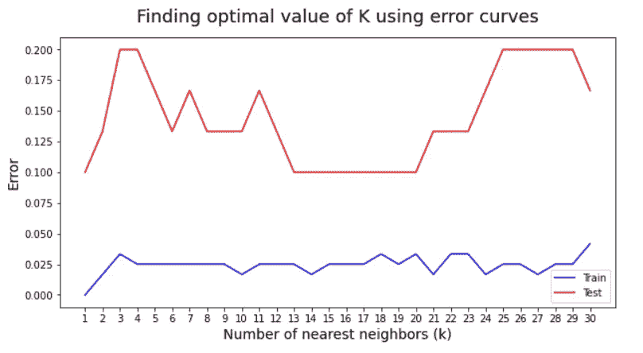
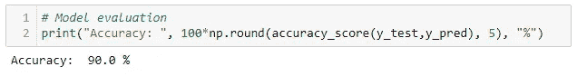
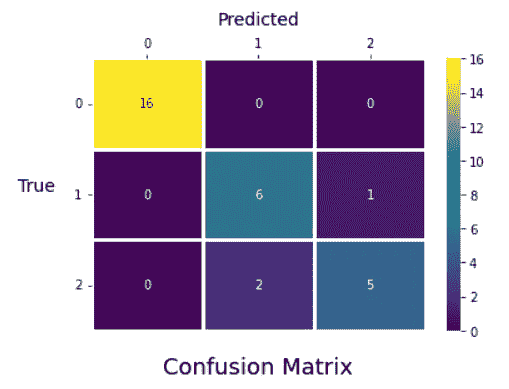
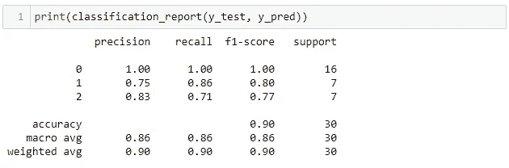
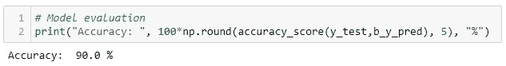
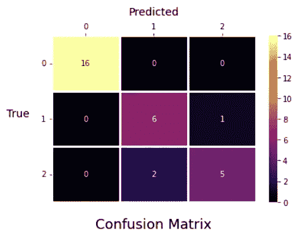
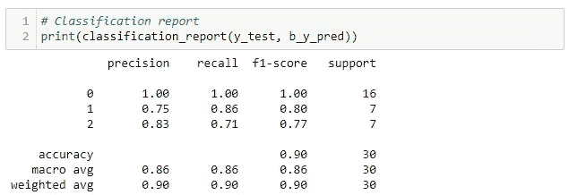

# 在 Python 中从头开始实现 K 近邻

> 原文：<https://blog.devgenius.io/implementing-k-nearest-neighbors-from-scratch-in-python-d5eaaf558d49?source=collection_archive---------2----------------------->

## 并将我们的模型性能与 Scikit-learn 实现进行比较

由[吴镇男·麦金尼](https://unsplash.com/@derickray?utm_source=medium&utm_medium=referral)在 [Unsplash](https://unsplash.com?utm_source=medium&utm_medium=referral) 上拍摄的照片

K 最近邻(KNN)是最简单的监督机器学习算法之一。该算法最初是为分类任务开发的，但后来也扩展到执行回归任务。

与其他有监督的机器学习算法不同， **KNN 没有底层模型，算法只对存储的训练数据进行处理。**

KNN 试图根据每个测试数据点与训练数据集的距离来预测这些值。因此，该算法不会对数据的特征或输出做出任何假设。

由于算法的这种性质，它只在引入测试数据后才开始工作并做出预测，因此也被称为**懒惰学习者**。

除了分类和回归任务，KNN 算法还用于缺失值插补、数据集重采样、异常值检测等。KNN 的一些工业应用包括建立推荐系统、手写识别、图像识别等。

有几种寻找 K 个最近邻居的方法，如使用矩形判定边界来分类数据点的 K 维树、使用球形判定边界的球树**等。在本文中，我们将从头开始使用 Python 实现 KNN 的强力方法。**

# 该算法

因此，创建 KNN 模型的步骤如下:

1.  我们首先需要一个 K 的最优值。
2.  计算测试集中每个数据点与训练集中每个点的距离。
3.  按照升序对计算出的距离以及训练数据中相应的目标值进行排序。
4.  从这些排序的值中，选择 K 个最高值。
5.  对于**分类任务**，对应于 K 顶行的数据点的模式将是预测输出，对于**回归任务**，均值/中值将是预测输出。

# 从头开始实施

让我们创建我们的 KNN 算法的基本结构。我们将遵循 Scikit-learn 方法，并用 fit 和 predict 方法定义一个类。

图片作者[作者](https://retinpkumar.medium.com/)

我们将使用邻居数量、问题类型和评估标准来初始化我们的类实例。

问题类型将决定它是回归任务还是分类任务，而度量将决定应该使用哪个距离度量来计算距离。

现在，我们将问题类型 0 指定给回归，1 指定给分类。欧几里德距离的度量值为 0，曼哈顿距离的度量值为 1。

图片作者[作者](https://retinpkumar.medium.com/)

在我们的拟合方法中，我们将用训练数据特征和目标来拟合算法。

图片由[作者](https://retinpkumar.medium.com/)

在以测试特性数据作为参数的预测方法中，我们有 3 个额外的步骤要执行。

*   首先，我们计算距离。
*   然后我们计算邻居。
*   最后，我们做出预测。

代码是不言自明的。

图片由[作者](https://retinpkumar.medium.com/)

把这些放在一起，我们就有了 BruteForceKNN 算法。

图片作者[作者](https://retinpkumar.medium.com/)

现在让我们尝试使用 Scikit learn 库实现 KNN，并计算分类指标。然后，我们将在相同的数据上实现我们的 BruteForceKNN，并比较它相对于 Scikit learn 实现的性能。

# 使用 Scikit 测试-学习实现

让我们导入必要的库和依赖项。

图片作者[作者](https://retinpkumar.medium.com/)

现在，让我们从 Scikit learn 数据集加载虹膜数据。然后，我们将拆分数据，并使用标准缩放来缩放我们的数据。

图片由[作者](https://retinpkumar.medium.com/)

现在，我们需要找到' **k** '的最佳值。

为此，我们将使用默认设置实例化一个基本 KNN 分类器，并对范围从 1 到 31 的“k”值进行预测。

然后我们将计算训练和测试误差，并绘制出**误差曲线**。借助于误差曲线，我们将找到‘k’的最佳值。

图片作者[作者](https://retinpkumar.medium.com/)

图片作者[作者](https://retinpkumar.medium.com/)

从误差曲线中，我们发现 k=14 非常适合我们的数据。因此，我们实例化一个 k=14 的 KNN 对象，拟合训练数据，并使用测试数据进行预测。

图片由[作者](https://retinpkumar.medium.com/)

图片作者[作者](https://retinpkumar.medium.com/)

现在，让我们绘制混淆矩阵并检查其他分类指标。

图片由[作者](https://retinpkumar.medium.com/)

图片由[作者](https://retinpkumar.medium.com/)

图片由[作者](https://retinpkumar.medium.com/)

# 使用我们的强力 KNN 进行测试

现在，我们将实例化我们的 BruteForceKNN 类，并用相同的数据进行预测。

图片作者[作者](https://retinpkumar.medium.com/)

图片由[作者](https://retinpkumar.medium.com/)

这太棒了。我们的模型精度与 Scikit-learn 实现相匹配。现在让我们检查混淆矩阵。

图片由[作者](https://retinpkumar.medium.com/)

图片作者[作者](https://retinpkumar.medium.com/)

图片作者[作者](https://retinpkumar.medium.com/)

我们发现我们的 BruteForceKNN 模型性能与 KNN 分类器的 Scikit-learn 实现完全匹配。

至此，我们已经到了这篇文章的结尾。

我希望您喜欢用 Python 从头开始学习和实现 KNN 算法，并比较模型性能和 Scikit-learn API。

如果你喜欢这篇文章，请[关注我](https://retinpkumar.medium.com/)以获得更多有趣且可行的帖子。