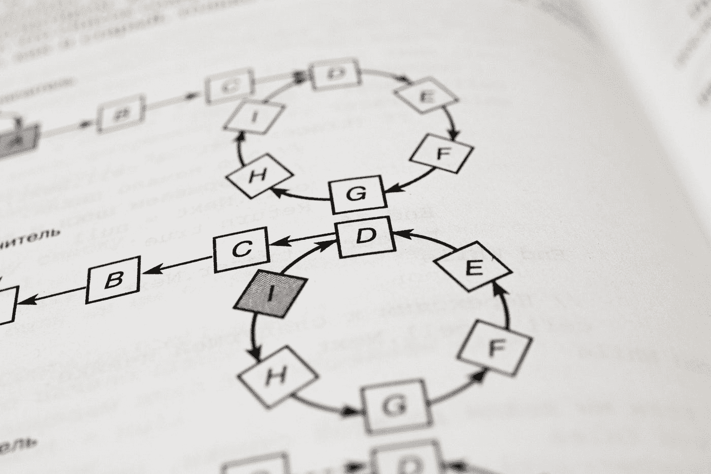
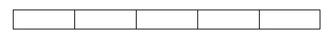
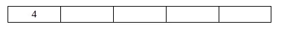
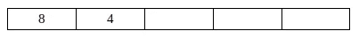
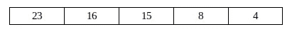
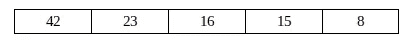

# 在 PHP 中实现 LRU 缓存

> 原文：<https://blog.devgenius.io/implementing-lru-cache-in-php-1632cf6a7443?source=collection_archive---------2----------------------->

## “最近最少使用”是一种实用的缓存技术，它保存频繁访问的数据并丢弃不使用的项。

安德烈·西佐夫在 [Unsplash](https://unsplash.com?utm_source=medium&utm_medium=referral) 上拍摄的照片

LRU 缓存是[缓存替换策略](https://en.wikipedia.org/wiki/Cache_replacement_policies#Least_recently_used_(LRU))，众多策略之一，它:

> 是优化指令或算法，计算机程序或硬件维护的结构可以利用这些指令或算法来管理存储在计算机上的信息缓存。缓存通过将最近或经常使用的数据项保存在比普通内存存储更快或计算成本更低的内存位置来提高性能。当缓存已满时，算法必须选择丢弃哪些项目，以便为新项目腾出空间

# 定义

这是一种保存有限数量项目的缓存策略。当缓存已满，并且您试图插入另一个缓存项时，它应该会删除“最少使用的缓存”项，以便为新来者腾出空间。

# LRU 缓存用例

LRU 缓存算法通过缓存经常使用的数据来提高代码执行效率。缓存大小限制将内存使用减少到合理的数量。这种策略对于处理大量数据的长时间运行的流程非常有用。

# LRU 缓存的工作原理

想象一下，一个空的缓存中有五个数字。最初，它是空的:

当我们**插入**新数字时，它们被追加到缓存中。当我们插入 **4** 时，缓存看起来如下:

然后我们插入 **8** 。这个元素还不在缓存中，所以它放在前面:

然后，我们随后插入 **15** ，然后插入 **16** 和 **23。**编号 **4** 成为“最少使用的元素”。

这是事情开始变得有趣的时候。我们想在名单上再增加一个数字。由于只允许五个数字，我们删除了“最少使用的数字”,并将该数字添加到列表中。新的“最少使用的号码”是 **8** :

现在我们想从缓存中请求编号 **8** 。该号码在列表中，所以它被推到列表的前面。新的“最少使用的号码”是 **15** :

# PHP 实现

我们应该从界面开始。它将使用泛型进行注释，以:

*   正确解析 PHPStorm 中的变量类型
*   允许对诸如 Psalm/PHPStan 这样的工具进行严格的代码验证

## 界面

缓存的接口

## 实施

PHP 中的可靠实现

## 用法示例

用户缓存限制为 50 个用户的任务处理示例

有疑问吗？想法？请给我留下你的看法。让我们一起让我们的代码变得美丽。订阅我的出版物，获取更多类似的文章，成为更好的开发人员。

这个故事对你有价值吗？请留言支持我的工作👏**鼓掌表示感谢***n .*你知道你可以不止一次鼓掌吗？🥰 *谢谢你。*