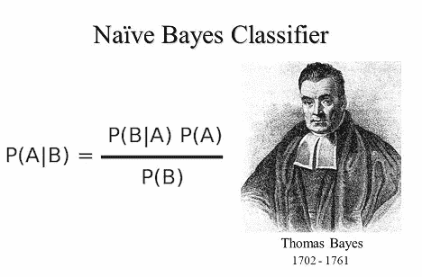
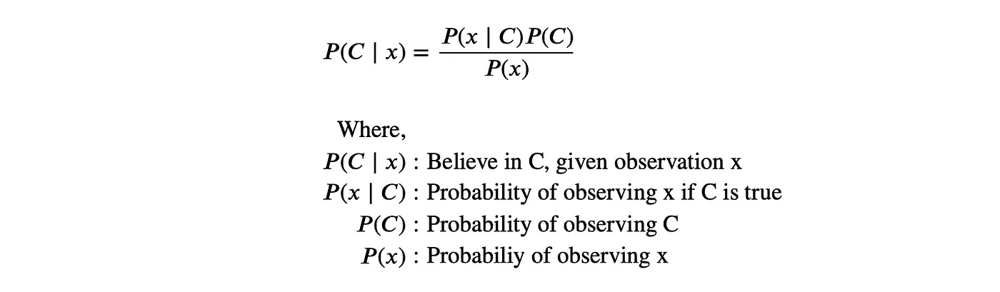
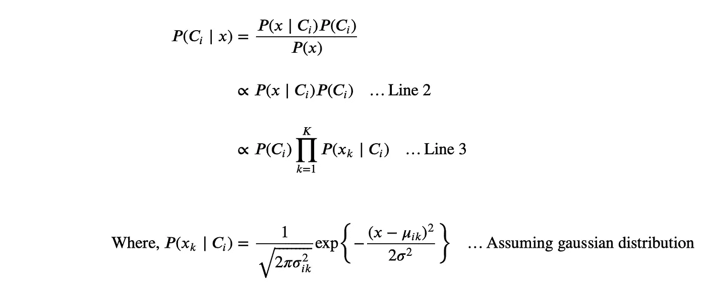
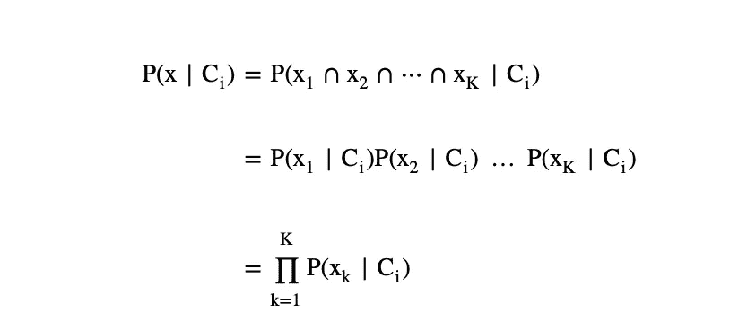
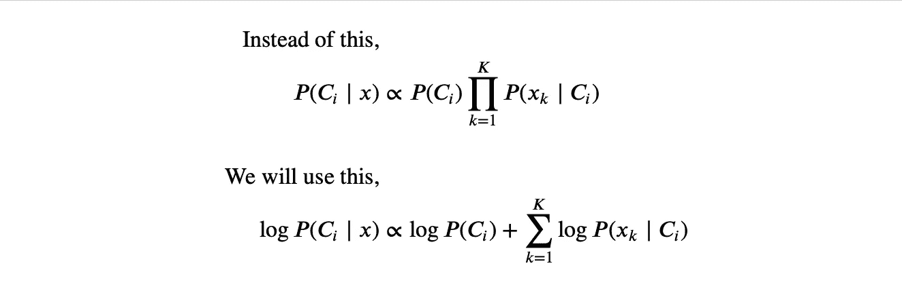

# 用 Python 从头开始实现朴素贝叶斯分类

> 原文：<https://blog.devgenius.io/implementing-na%C3%AFve-bayes-classification-from-scratch-with-python-badd5a9be9c3?source=collection_archive---------2----------------------->

## 通过从头构建朴素贝叶斯分类来理解它



这张图片来自 Scienceprog.com

# 朴素贝叶斯

在机器学习和数据科学中，朴素贝叶斯是一种简单而广泛使用的算法。不幸的是，由于生活给了我们许多简化，这个行业中的许多人往往低估了对复杂算法理解的需要。本文旨在通过用 Python 从头构建一个朴素贝叶斯分类器来教授或更新你的知识，只使用了 *Pandas* 和 *Numpy* 。如果你熟悉概率论，这将有助于你的理解，因为我将谈论一些概率性质。

朴素贝叶斯本身是一种基于概率的分类算法。该模型的基础是贝叶斯定理。



贝叶斯定理

简单地说，朴素贝叶斯分类器通过计算给定实例的每个类的后验概率来对实例进行分类； *P(C ∣ x)* ，并将预测分配给具有最大后验概率的类别。实际上，后验概率很难计算。需要做出一些强有力的假设来绕过这个障碍，因此得名；天真的贝叶斯。我们将在下面进一步探讨这个障碍和任何数学假设。我们开始吧。

# 数据预处理

让我们从我们的图书馆开始。

正如承诺的那样，我们在本教程中将只使用*熊猫*和 *Numpy* 。

接下来，我们将加载数据。

我使用著名的虹膜数据集，从 [Kaggle](https://www.kaggle.com/uciml/iris) 下载。在以下条件下，您也可以使用您的数据遵循本教程；作为预测值的数值数据和作为预测值的分类数据。

像所有机器学习开发一样，我们需要将数据分成训练集和测试集。这通常使用 *Sklearn* 库来完成。我将展示一个巧妙的技巧，使用*熊猫*来实现列车测试分割。

# 模特培训

训练一个朴素贝叶斯模型非常简单。但是在我们到达那里之前，我们必须建立概率的分布。回想一下贝叶斯定理，


为了找到后验概率 *P(C ∣ x)* ，我们需要计算可能性 *P(x ∣ C)* 和先验概率 *P(C)* 。

如果我们知道 *x* 的分布，我们可以很快得到这个可能性。不幸的是，x 的分布是数据科学家必须自己解决的问题。您可以对不同的类使用任意混合的分布，但是请注意，这种选择会显著影响模型的性能。本教程将假设所有类都是高斯(正态)分布，因为高斯分布是许多其他分布的良好近似。

高斯分布有两个参数， *μ* 和 *σ* 。我们不知道这些参数的实际值，所以我们必须从当前的样本中估计它们。

我们还需要找到先验概率 *P(C)* 。我们将通过计算类别 *C* 的所有出现次数并除以样本总数来估计类别 *C* 的先验概率。

公式中还有一个 *P(x)，不需要计算。我们将在后面讨论其原因。*

所有计算都只在训练数据上进行。

我们现在有了计算后验概率所需的一切。培训过程到此结束。

# 分类

朴素贝叶斯分类器中的分类过程是通过给定当前数据计算所有类的后验概率来完成的。我将详细说明如何计算后验概率。当然，我们将从贝叶斯定理开始。



在第 2 行中， *P(x)* 被删除。这是因为观察到 *x* 的概率在所有类中都是相同的。这不会影响计算，因为我们不需要找到类的实际后验概率。而是只需要看哪个类的后验概率最大。将所有后验概率除以相同的常数将返回相同的结果，即谁的值最大。

在第 3 行中， *P(x ∣ C)* 被扩展以包含每一列。初始的 *P(x ∣ C)* 是给定当前类，观察到 *x* (整行)的概率。扩展版计算给定行和类的每一列的概率(单个数据)。

如果你熟悉你的概率，你可能会注意到第 3 行的展开完全是错误的。这是它的细目分类。



从这一点上来说，数学家和统计学家会变得疯狂，说，


生成自[https://imgflip.com/](https://imgflip.com/)

我会说我很天真。

这是朴素贝叶斯模型的基本假设之一，它假设所有的特征都是相互独立的。实际上，这种情况很少发生。这就是为什么他们把这个模型命名为朴素贝叶斯。

回到分类，有些人喜欢计算对数-后验概率而不是后验概率本身。这不会改变任何预测，因为 *log(x)* 是一个严格递增的函数。这意味着如果我们有 *a > b* ，那么我们将有 *log(a) > log(b)* 。因此，后验概率的大小顺序不会改变。我将在我的代码中使用 log 转换。



该模型的分类过程通过简单地计算对数后验概率并观察哪一类具有最大值来完成。下面的代码显示了分类的过程。

在此代码中，对数先验、*对数 P(Cᵢ、*在第 20 行计算，对数似然、*对数 P(xₖ ∣ Cᵢ、*在第 29 行计算。给定数据的类别的对数后验概率*对数 P(Cᵢ ∣ x)* ，通过对第 38 行中的对数前验概率和对数似然性求和来计算。为了分配预测，第 41 行和第 42 行搜索具有最大对数后验概率的类并记录下来。变量`Predictions`存储模型做出的所有预测。

为了评估模型的性能，我将在训练集和测试集上测试模型。

训练集的预测存储在`PredictTrain`中，测试集的预测存储在`PredictTest`中。分类过程到此结束。

# 表演

有许多方法可以评估多类分类器的性能，但是在本文中，我将只计算准确度。

如果您使用相同的数据，并且正确地遵循了所有步骤，您应该会获得以下结果。

对于训练集，

`round(Accuracy(y_train, PredictTrain), 5)`

输出:

```
0.98095
```

对于测试集，

`round(Accuracy(y_test, PredictTest), 5)`

输出:

```
0.91111
```

总的来说，我认为这非常符合数据。您可以通过参数调整进一步提高性能，即使用不同的分布或应用平滑方法。

# 比较

让我们将刚刚创建的模型与使用 *Sklearn* 的典型方法进行比较。

将我们的训练集与 *Sklearn 的*训练集进行比较，

`round(Accuracy(PredictTrain, SkTrain), 5)`

输出:

```
1
```

将我们的测试集与 Sklearn 的测试集进行比较，

`round(Accuracy(PredictTest, SkTest), 5)`

输出:

```
1
```

这表明我们的模型做出了与 *Sklearn 的*高斯朴素贝叶斯库相同的预测。

# 恭喜

我们使用 *Pandas* 和 *Numpy* 从零开始成功构建了一个朴素贝叶斯分类器。考虑使用您的数据重做教程，以便更好地理解。你可以在 [GitHub](https://github.com/gerchristko/Gaussian-Naive-Bayes) 上找到代码和数据集。如果你喜欢这篇文章，请考虑鼓掌并关注。请在评论中分享你的反馈和想法。感谢您的阅读！