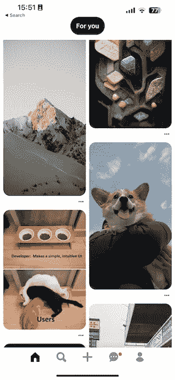
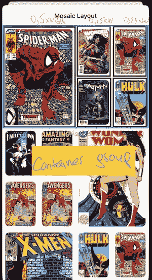
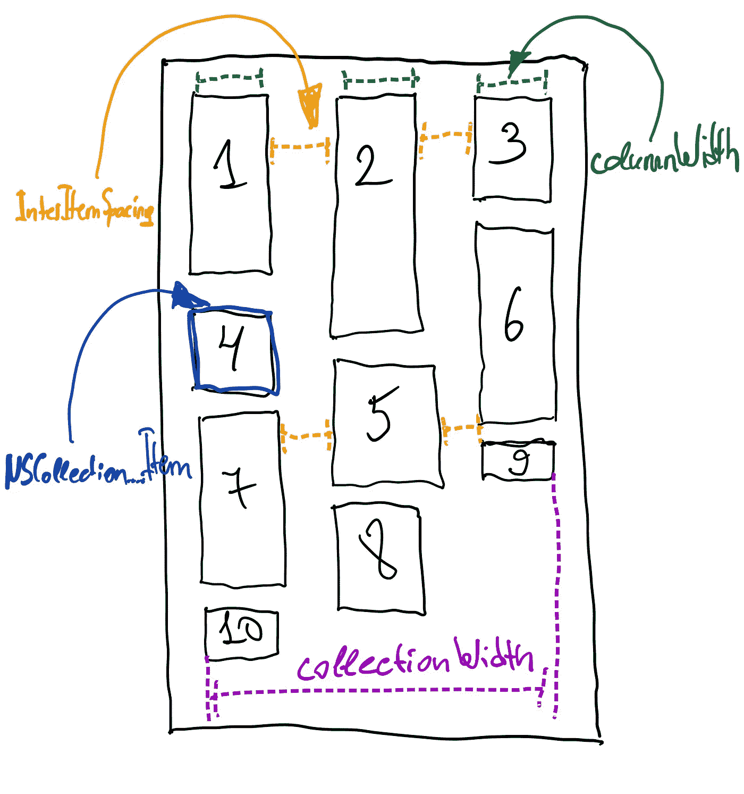
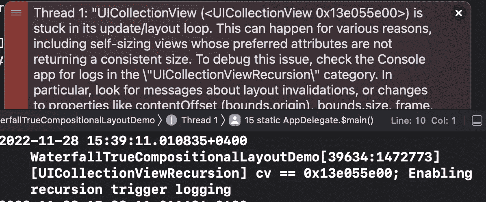
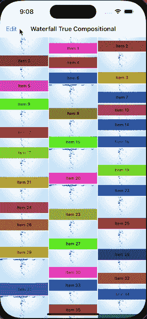

# 使用复合布局实现类似 Pinterest 的布局

> 原文：<https://blog.devgenius.io/implementing-pinterest-like-layout-using-compositional-layout-a21d8ae49d18?source=collection_archive---------1----------------------->



截图取自 Pinterest app

类似 Pinterest 的布局并不是一个尚未解决或有争议解决方案的新问题。互联网上有很多库允许你以马赛克的方式显示单元格——例如[这个](https://github.com/sgr-ksmt/WaterfallLayout)。

然而，大多数都依赖于实现一个定制的 **UICollectionViewLayout** 子类，尽管我们已经有一段时间有了一个新的组合布局 API——[uicollectionviewscompositionallayout](https://developer.apple.com/documentation/uikit/uicollectionviewcompositionallayout)

使用自定义 UICollectionViewLayout 会限制您在收藏视图中拥有不同的布局部分，因为您只能拥有一个收藏视图的布局实例:

```
let layout = WaterfallLayout() 
collectionView.collectionViewLayout = layout
```

# 通过组合布局构建马赛克布局的可能方式

当我在寻找使用组合方式引入瀑布布局的库时，我发现了在一个垂直组中组合不同高度的项目来构建 secion 的解决方案。

让我们看看实现这种方法的库。它有**瀑布布局**，将三个不同高度的项目组合在一个垂直组中。

```
let leadingItemSize = NSCollectionLayoutSize(widthDimension: .fractionalWidth(0.5), heightDimension: .fractionalHeight(1.0)) 
let leadingItem = NSCollectionLayoutItem(layoutSize: leadingItemSize) 
leadingItem.contentInsets = NSDirectionalEdgeInsets(top: 8, leading: 8, bottom: 8, trailing: 8)
let trailingItemSize = NSCollectionLayoutSize(widthDimension: .fractionalWidth(1.0), heightDimension: .fractionalHeight(0.3)) 
let trailingItem = NSCollectionLayoutItem(layoutSize: trailingItemSize) 
trailingItem.contentInsets = NSDirectionalEdgeInsets(top: 8, leading: 8, bottom: 8, trailing: 8) 
let trailingLeftGroup = NSCollectionLayoutGroup.vertical(
  layoutSize: NSCollectionLayoutSize(
    widthDimension: .fractionalWidth(0.25), 
    heightDimension: .fractionalHeight(1.0)
  ), 
  subitem: trailingItem, 
  count: 2) 
let trailingRightGroup = NSCollectionLayoutGroup.vertical(
  layoutSize: NSCollectionLayoutSize(
    widthDimension: .fractionalWidth(0.25), 
    heightDimension: .fractionalHeight(1.0)
  ), 
  subitem: trailingItem, 
  count: 2
) 
...
```

在屏幕上看起来是这样的:



来自 cmpositional-layout-kit-repo 的屏幕截图

它有几个缺点，例如:

*   这种模式是重复的——每三个项目都有相同的结构高度
*   它使用分数高度-依赖于集合视图框架高度，而不是单独项目所需的高度

在某个时候，我偶然发现了一个有趣的 API uicollectionview compositionallayout has—[自定义组创建](https://developer.apple.com/documentation/uikit/nscollectionlayoutgroup/3213853-custom)。我还发现[有一个库](https://github.com/lucamegh/Niagara)实现了这种方法。大家妥妥的看一下，试着自己去实现。

# 履行

## 自定义组 API

创建自定义 NSCollectionLayoutGroup 如下所示:

```
public typealias NSCollectionLayoutGroupCustomItemProvider = (NSCollectionLayoutEnvironment) -> [NSCollectionLayoutGroupCustomItem] 
class func custom(
  layoutSize: NSCollectionLayoutSize, 
  itemProvider: @escaping NSCollectionLayoutGroupCustomItemProvider
) -> Self
```

对于每一个**NSCollectionLayoutGroupCustomItem**，我们可以根据自己的需要在集合视图中设置唯一的框架。

因此，我们可以按照自己的意愿对齐元素——任意列数，任意高度，任意顺序。

## 布局参数

假设您希望列数、每个项目的高度和项目间距都可以配置。我们布局的配置结构可以是这样的:

```
typealias ItemHeightProvider = (_ index: Int, _ itemWidth: CGFloat) -> CGFloat
typealias ItemCountProvider = () -> Int

struct Configuration {
    public let columnCount: Int
    public let interItemSpacing: CGFloat
    public let contentInsetsReference: UIContentInsetsReference
    public let itemHeightProvider: ItemHeightProvider
    public let itemCountProvider: ItemCountProvider

    /// Initialization for configuration of waterfall compositional layout section
    /// - Parameters:
    ///   - columnCount: a number of columns
    ///   - interItemSpacing: a spacing between columns and rows
    ///   - contentInsetsReference: a reference point for content insets for a section
    ///   - itemCountProvider: closure providing a number of items in a section
    ///   - itemHeightProvider: closure for providing an item height at a specific index
    public init(
        columnCount: Int = 2,
        interItemSpacing: CGFloat = 8,
        contentInsetsReference: UIContentInsetsReference = .automatic,
        itemCountProvider: @escaping ItemCountProvider,
        itemHeightProvider: @escaping ItemHeightProvider
    ) {
        self.columnCount = columnCount
        self.interItemSpacing = interItemSpacing
        self.contentInsetsReference = contentInsetsReference
        self.itemCountProvider = itemCountProvider
        self.itemHeightProvider = itemHeightProvider
    }
}
```

## 总体步骤

这些参数足以构建可定制的瀑布布局。实施步骤如下:

*   计算列宽
*   创建一个数组来存储列高度
*   计算项目框架
*   为集合视图中的每个索引创建**NSCollectionLayoutGroupCustomItem**实例
*   返回**NSCollectionLayoutGroupCustomItemProvider**中的自定义项数组
*   计算组高度



它应该是什么样子的一个方案

## 布局生成器

让我们用为索引创建**NSCollectionLayoutGroupCustomItem**项的方法来创建 **LayoutBuilder** :

```
func makeLayoutItem(for row: Int) -> NSCollectionLayoutGroupCustomItem
```

为了让生成器工作，我们需要上面描述的配置以及集合宽度:

```
final class LayoutBuilder {
private var columnHeights: [CGFloat]
private let columnCount: CGFloat
private let itemHeightProvider: ItemHeightProvider
private let interItemSpacing: CGFloat
private let collectionWidth: CGFloat

init(
    configuration: Configuration,
    collectionWidth: CGFloat
) {
    self.columnHeights = [CGFloat](repeating: 0, count: configuration.columnCount)
    self.columnCount = CGFloat(configuration.columnCount)
    self.itemHeightProvider = configuration.itemHeightProvider
    self.interItemSpacing = configuration.interItemSpacing
    self.collectionWidth = collectionWidth
}

func makeLayoutItem(for row: Int) -> NSCollectionLayoutGroupCustomItem {
    // TODO:
}
```

## 计算列宽

我们需要从集合宽度中减去间距，然后除以列数:

```
private var columnWidth: CGFloat { let spacing = (columnCount - 1) * interItemSpacing return (collectionWidth - spacing) / columnCount }
```

## 列高数组

存储列高度，以便我们可以决定每个项目的正确放置位置，保存项目从左到右的顺序:

```
/// In init function:
self.columnHeights = [CGFloat](repeating: 0, count: configuration.columnCount)
```

## 计算项目的框架

首先，我们需要一个正确的原点来放置物品。当我们保存每一列的总高度时，我们可以找到最低的列和它的最大 Y 值(所以它会到它的底部), X 是它的列的偏移量。让我们开始吧:

```
private func itemOrigin(width: CGFloat) -> CGPoint {
    let y = columnHeights[columnIndex()].rounded()
    let x = (width + interItemSpacing) * CGFloat(columnIndex())
    return CGPoint(x: x, y: y)
}

private func columnIndex() -> Int {
    columnHeights
        .enumerated()
        .min(by: { $0.element < $1.element })?
        .offset ?? 0
}
```

有了项的原点、列宽和闭包来检索特定索引项的高度和宽度，我们可以确定一个框架:

```
func frame(for row: Int) -> CGRect {
    let width = columnWidth
    let height = itemHeightProvider(row, width)
    let size = CGSize(width: width, height: height)
    let origin = itemOrigin(width: size.width)
    return CGRect(origin: origin, size: size)
}
```

## 创建 NSCollectionLayoutGroupCustomItem 数组

因为我们有了一个项目的框架，所以我们现在可以实现我们的方法来创建**NSCollectionLayoutGroupCustomItem**实例。也不应该忘记在放置项目的地方增加相应的 columnHeight:

```
func makeLayoutItem(for row: Int) -> NSCollectionLayoutGroupCustomItem {
    let frame = frame(for: row)
    columnHeights[columnIndex()] = frame.maxY + interItemSpacing
    return NSCollectionLayoutGroupCustomItem(frame: frame)
}
```

使用上面的方法，我们可以为我们的部分中的所有项目创建数组:

```
var items = [NSCollectionLayoutGroupCustomItem]()
let itemProvider = LayoutBuilder(
    configuration: config,
    collectionWidth: enviroment.container.contentSize.width
)

for i in 0..<config.itemCountProvider() {
    let item = itemProvider.makeLayoutItem(for: i)
    items.append(item)
}
```

我们应该告诉小组创造方法我们有什么高度。使用**NSCollectionLayoutDimension**API，我们可以估算**。estimated()** 值，它会按照我们指定的所有项目框架来计算，对吗？可惜不是。

当我尝试上面提到的瀑布库[时，收集单元格具有垂直约束并自行确定其高度，我发现布局引擎进入递归，因为内在垂直约束与我们设置的框架冲突:](https://github.com/lucamegh/Niagara)



然而，我们有另一个选项来设置组的高度——绝对值。因此，由于我们已经完成了所有帧的计算，我们可以将组的高度设置为最高的 **columnHeight** 属性:

```
let groupLayoutSize = NSCollectionLayoutSize(
    widthDimension: .fractionalWidth(1),
    heightDimension: .absolute(itemProvider.maxColumnHeight())
)
```

## 创建 NSCollectionLayoutSection

最后，我们可以创建完整描述的 NSCollectionLayoutSection，用于显示类似 pinterest(瀑布，等等)的布局:

```
let group = NSCollectionLayoutGroup.custom(layoutSize: groupLayoutSize) { _ in
    return items
}

let section = NSCollectionLayoutSection(group: group)
section.contentInsetsReference = config.contentInsetsReference
```



使用我们的布局的收藏视图

尽管组合布局 API 对于这样的事情来说似乎有些笨拙，但是我们仍然有一些空间来做我们想做的事情，保持这种布局的所有优点。

对于所描述的布局，我创建了[存储库](https://github.com/eeshishko/WaterfallTrueCompositionalLayout)和 NPM 包，这样每个人都可以检查该方法的完整实现，或者只是添加一个项目并使用它。也可以随意提出任何问题和相应的请求！🤩