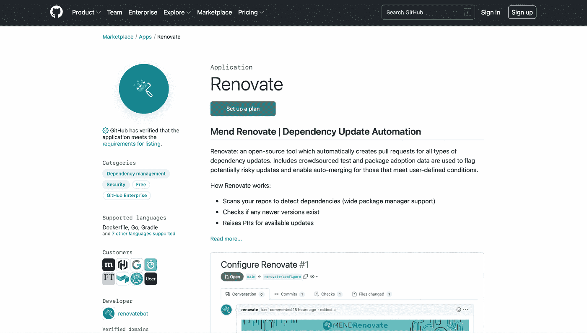
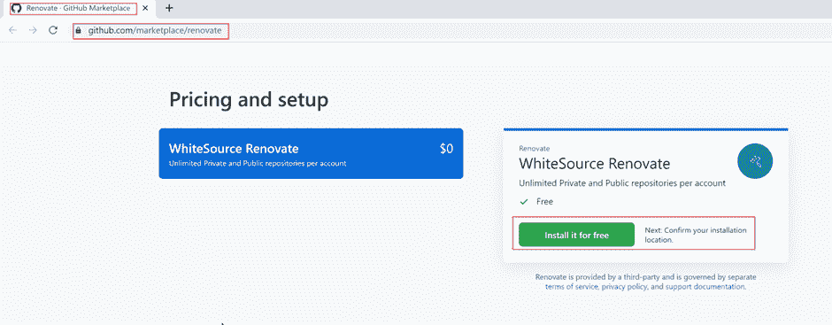
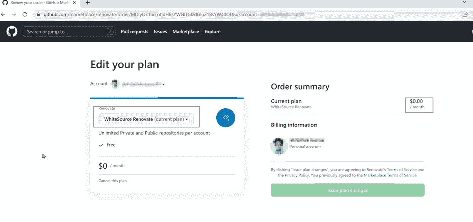
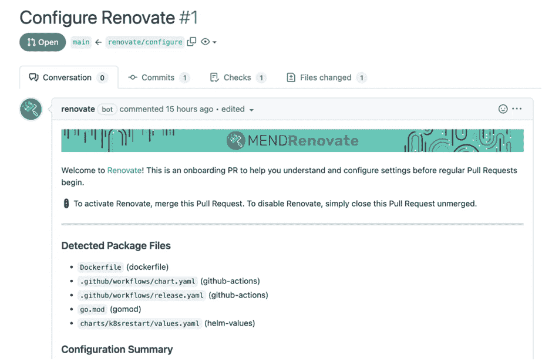
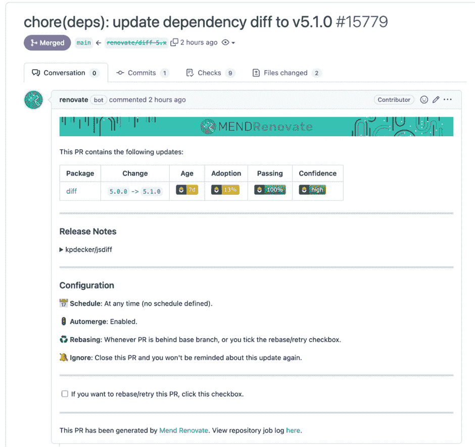
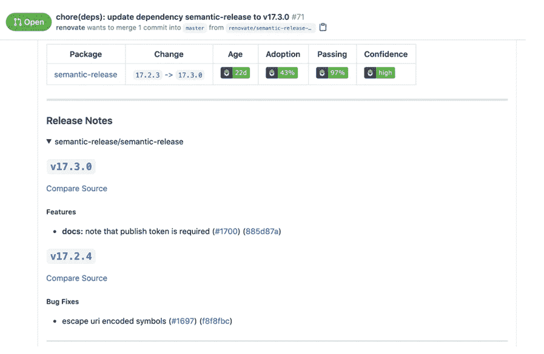

# 在 Javascript 中实现私有存储库安全性的更新

> 原文：<https://blog.devgenius.io/implementing-renovate-for-private-repository-security-in-javascript-cbe731b626b2?source=collection_archive---------8----------------------->

[*来源*](https://unsplash.com/photos/PNbDkQ2DDgM)

在当今的软件开发行业中，使用第三方开源库和软件已经成为一个标准流程。开源社区如此广泛，以至于我们可以获得各种软件需求的开源库，无论是认证、日志还是加密。

使用开源库有助于我们避免重新发明轮子——而不是重复别人已经做的工作，您可以使用现有的库来顺利开发应用程序。然而，使用开源库的这种便利也带来了一些风险。

# 开源库的风险

使用开源库的主要风险是安全漏洞和许可证合规性。当库的代码包含可能被攻击者利用的错误或缺陷时，就会出现安全漏洞。

这些漏洞可以通过多种方式引入到代码中，例如，如果库的开发人员没有正确验证用户输入，攻击者可以利用这一点将恶意代码注入到库中，然后当其他开发人员在他们自己的项目中使用该库时，这些恶意代码就可以被执行。

引入安全漏洞的另一种方式是通过依赖性蔓延。当开发人员向他们的项目中添加一个新的依赖项，并且这个新的依赖项有自己的依赖项时，就会发生这种情况。

随着越来越多的依赖项的增加，跟踪项目中包含的所有代码变得越来越困难，攻击者也更容易混入恶意代码。

许可证合规性是使用开源库时可能出现的另一个问题。如果在项目中使用，一些许可证要求库的代码是可用的。如果开发人员在他们的项目中包含了一个带有这种许可证的库，而没有使代码可用，他们可能违反了许可证的条款。

一些开源许可，如 [AGPL](https://www.gnu.org/licenses/agpl-3.0.en.html) ，可以强加一些法律限制来限制一个项目的使用。

# 管理开源组件

为了降低与开源库相关的风险，跟踪项目中使用的开源组件并确保它们是最新的非常重要。

管理安全风险的一种方法是不断地将您的开源库升级到最新的可用版本。这样，如果在旧版本的库中发现新的安全漏洞，您将已经在使用修补版本，不会受到影响。但是，手动升级项目中的所有依赖项可能是一项乏味且耗时的任务。

这就是[翻新](https://github.com/marketplace/renovate/)的用武之地。Renovate 是一个免费的开源工具，它可以自动识别项目中开源库/依赖项的旧运行版本，并为所有依赖项更新生成 pull 请求。Renovate 的一个关键特性是它是高度可配置的——您可以指定希望更新的时间和频率、希望更新的类型以及希望包含或排除的存储库。

Renovate 也被 [OpenSSF](https://openssf.org/) (开源安全基金会)和 Google 认可为依赖性管理的行业标准工具。

# 开始翻新

让我们看一个快速的分步演示来开始翻新。

1.  访问 Renovate 的[官方 GitHub 页面](https://github.com/marketplace/renovate)将其安装到你的 Github 账户中。单击下面突出显示的按钮开始安装。

1.  之后，你将会看到 GitHub 账户登录页面的提示。使用您的凭据成功登录并继续。在那之后，你应该能够看到你的 GitHub 计划中添加的计划，如下所示。

1.  安装翻新后，选择你想翻新工作的仓库。对于每个选定的存储库，都会生成一个 onboarding pull 请求。

1.  安装了 renew 应用程序后，您需要配置 renew 是在所有存储库上运行还是在选定的存储库上运行。

1.  成功生成一个 pull 请求后，您可以在 below 中配置 **automerge** 特性，如下所示。

1.  一旦拉取请求被成功合并，我们将能够看到每个拉取请求的发布说明。这有助于您管理因执行拉请求而发生的变化。

# 结论

随着应用程序在日常生活中无处不在，开源库的使用在应用程序开发中变得非常流行。如今，几乎 95%的代码库都有某种开源依赖。使用开源软件使开发者的生活更容易，但也产生了安全、许可和操作风险。

手动管理和升级项目的所有开源依赖项可能是一场噩梦。此外，它为人为错误敞开了大门，这可能导致您错过一些关键的安全升级，从而导致类似 2017 年 [Equifax 黑客](https://en.wikipedia.org/wiki/2017_Equifax_data_breach)的关键安全事件。因此，最好有一种可持续的、可靠的方法来管理开源依赖。

这就是实时依赖项管理解决方案(如 renew)的作用所在，它能够不断地自动识别和升级项目中的开源依赖项。