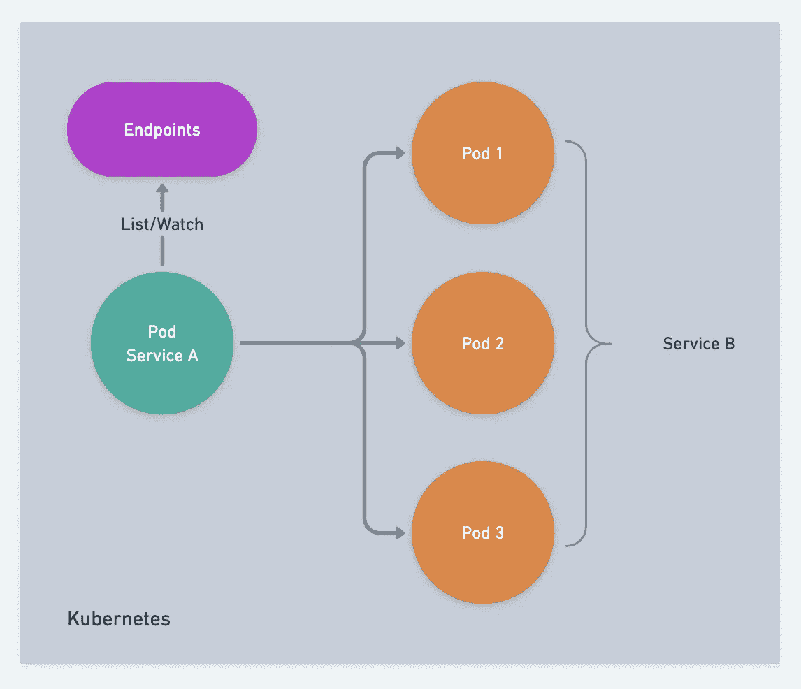

# 实现微服务的服务发现

> 原文：<https://blog.devgenius.io/implementing-service-discovery-for-microservices-df737e012bc2?source=collection_archive---------0----------------------->

# 什么是服务发现？

对于使用微服务的开发人员来说，服务发现的概念应该很熟悉。

例如，如果服务 A 依赖于服务 B，我们需要告诉服务 A 调用服务 B，这是服务发现必须解决的问题。


*   `Service B`向被称为**服务注册**的`Service Registry`注册自己
*   `Service A`从`Service Registry`发现`Service B`的节点信息称为**服务发现**

# 服务注册

服务注册是针对服务器端的，在服务启动后需要注册，它分为几个部分。

*   启动注册
*   定时更新
*   撤退

# 启动注册

当一个服务节点启动时，它需要注册自己`Service Registry`，以便其他节点可以轻松地发现自己。当服务启动并准备好接受请求时，需要进行注册，并且将设置一个有效期，以防止进程在异常退出后被访问。

# 定时更新

相当于`keep alive`周期性的告诉`Service Registry`它还活着，可以继续服役。

# 撤退

当一个进程退出时，我们应该主动撤销注册信息，以便调用者能够及时将请求分发到另一个节点。同时，go-zero 保证了即使一个节点在没有主动注销的情况下退出，该节点也能通过自适应负载均衡及时脱网。

# 服务发现

服务发现是针对调用方的，一般分为两类问题。

*   库存提取
*   增量手表

还有一个常见的工程问题

*   应对服务发现失败

当服务发现服务(例如 etcd、consul、nacos 等)出现时。)下去，我们不修改已经取过的端点列表，这样可以更好的保证我们所依赖的服务在 etcd 等之后仍然可以正常交互。倒下了。

# 库存提取


当`Service A`启动时，它需要从`Service Registry` : `Service B1`，`Service B2`，`Service B3`中获取`Service B`的现有节点列表，然后根据自己的负载均衡算法选择合适的节点发送请求。

# 增量手表

上图已经有`Service B1`、`Service B2`、`Service B3`，如果`Service B4`启动，那么我们需要通知`Service A`有一个额外的节点。如图所示。


# 服务发现失败

对于服务调用者，我们都在内存中缓存一个可用节点列表。无论是使用`etcd`、`consul`还是`nacos`，我们都可能会面临一次服务发现集群失败，以`etcd`为例，当我们遇到`etcd`失败时，我们需要冻结`Service B`的节点信息而不改变它，此时一定不能清空节点信息，一旦清空就无法获取，而`Service B`节点的节点很可能是正常的，`go-zero`会自动隔离并恢复失败的节点。


这是服务注册和服务发现的基本原理，当然实现起来还是比较复杂的，所以我们先来看看`go-zero`支持哪些服务发现方式。

# go-zero 的内置服务发现

`go-zero`默认支持三种服务发现方式。

*   kubernetes 基于端点的服务发现
*   基于 etcd 的服务发现
*   直接联结
*   基于咨询的社区服务发现
*   基于 nacos 的社区服务发现

# 直接联结

直接连接是最简单的方式，当我们的服务足够简单时，比如一台机器可以托管我们的业务，我们就可以这样使用它。


在`rpc`配置文件中直接指定`endpoints`，例如

```
Rpc:
  Endpoints:
  - 192.168.0.111:3456
  - 192.168.0.112:3456
```

`zrpc`调用者将把负载分配给这两个节点，其中一个有问题的节点`zrpc`将自动退出，当该节点恢复时，将再次分配负载。

这种方法的缺点是不能动态添加节点，每个新节点都需要改变调用者的配置并重新启动。

# 基于 etcd 的服务发现

一旦我们的服务达到一定的规模，因为一个服务可能依赖于许多服务，我们需要能够动态地添加和删除节点，而不必修改许多调用者配置和重新启动。

常见的服务发现解决方案有`etcd`、`consul`、`nacos`等。


go-zero 有一个内置的基于`etcd`的服务发现方案，使用如下。

```
Rpc:
  Etcd:
     Hosts:
     - 192.168.0.111:2379
     - 192.168.0.112:2379
     - 192.168.0.113:2379
     Key: user.rpc
```

*   `Hosts`是`etcd`集群地址
*   `Key`是注册服务的`key`

# 基于 Kubernetes 端点的服务发现

如果我们的服务部署在一个`Kubernetes`集群上，`Kubernetes`本身通过自己的`etcd`管理集群状态，所有服务都将其节点信息注册到`Endpoints`对象中，因此我们可以直接授予`deployment`权限来读取集群的`Endpoints`对象以获取节点信息。



*   启动时，`Service B`的每个`Pod`将向集群的`Endpoints`注册
*   当`Service A`的每个`Pod`启动时，可以从集群的`Endpoints`中获取`Service B`的节点信息
*   当`Service B`的节点发生变化时，`Service A`可以通过`watch`集群的`Endpoints`感知到

在这个机制工作之前，我们需要配置当前`namespace`中的`pod`来访问集群`Endpoints`，这里有三个概念。

*   ClusterRole 定义了一个不受`namespace`控制的集群范围的权限角色。
*   ServiceAccount 定义了`namespace`范围内的`service account`
*   ClusterRoleBinding 将一个已定义的`ClusterRole`绑定到另一个`namespace`中的`ServiceAccount`

具体的`Kubernetes`配置文件可以在 [**这里找到**](https://github.com/tal-tech/go-zero/tree/master/zrpc/internal/resolver/kube/deploy) ，其中`namespace`根据需要进行修改。

注:记得在启动时检查这些配置是否到位，并且不能访问`Endpoints`:)

`zrpc`的基于`Kubernetes Endpoints`的服务发现使用如下。

```
Rpc:
  Target: k8s://mynamespace/myservice:3456
```

在哪里？

*   `mynamespace`:被调用的`rpc`服务所在的`namespace`
*   `myservice`:被调用的`rpc`服务的名称
*   `3456`:被调用`rpc`服务的端口

确保添加`serviceAccountName`来指定在创建`deployment`配置文件时使用哪个`ServiceAccount`，例如

```
apiVersion: apps/v1
kind: Deployment
metadata:
  name: alpine-deployment
  labels:
    app: alpine
spec:
  replicas: 1
  selector:
    matchLabels:
      app: alpine
  template:
    metadata:
      labels:
        app: alpine
    spec:
      serviceAccountName: endpoints-reader
      containers:
      - name: alpine
        image: alpine
        command:
        - sleep
        - infinity
```

注意`serviceAccountName`指定哪个`ServiceAccount`用于由`deployment`创建的`pod`。

在`server`和`client`都部署到`Kubernetes`集群后，您可以使用以下命令滚动重启所有`server`节点

```
kubectl rollout restart deploy -n adhoc server-deployment
```

使用以下命令检查`client`节点日志。

```
kubectl -n adhoc logs -f deploy/client-deployment --all-containers=true
```

您可以看到我们的服务发现机制完美地跟随了`server`节点的变化，并且在服务更新期间没有异常请求。

完整的代码示例可从[https://github . com/zero micro/zero-examples/tree/main/discovery/k8s](https://github . com/zero micro/zero-examples/tree/main/discovery/k8s)获得

在下一篇文章中，我将解释如何基于`consul`、`nacos`等实现服务注册发现。在`go-zero`，敬请期待！

# 项目地址

[**https://github.com/tal-tech/go-zero**](https://github.com/tal-tech/go-zero)

欢迎用`go-zero`和**星**支持我们！