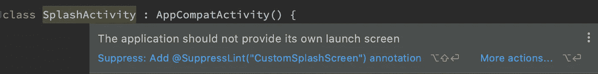

# 以推荐的方式实现闪屏

> 原文：<https://blog.devgenius.io/implementing-splash-screens-the-recommended-way-5a866ae4d114?source=collection_archive---------4----------------------->

***只用四个步骤完成***


随着 Android 12 (API 31)的发布，引入了新的 SplashScreen API，以确保 Android 应用程序的启动方式有一个标准。这意味着，如果你的应用程序安装在 Android 12 设备上，使用传统的闪屏方式将导致意想不到的行为。但是不用担心，使用这个新的 API 实现闪屏只需 4 个简单的步骤。值得注意的是，这个 API 是向后兼容的，这意味着它也可以在 Android 11 和更低版本上实现。您可以轻松地迁移现有的闪屏实现，以符合新推荐的方式(我们将在稍后深入探讨)。

注意:这篇文章也可以在 [Dev](https://dev.to/mayorjay/implementing-splash-screens-the-recommended-way-3873) 上找到

***现在简单的四个步骤……***

**第一步:在 App 的`build.gradle`文件中添加依赖关系** ，添加依赖关系下载库的工件

```
dependencies {
    ...
    implementation "androidx.core:core-splashscreen:${current_version}"
}
```

在写这篇文章的时候，版本是`1.0.0`

**第二步:在`styles.xml` 文件中创建主题** ，新建一个主题(任何名称都可以)，将其父主题设置为`Theme.SplashScreen`或`Theme.SplashScreen.IconBackground`

```
<style name="SplashScreenTheme" parent="Theme.SplashScreen">
    <item name="windowSplashScreenBackground">@color/colorWhite</item>
    <item name="windowSplashScreenAnimatedIcon">@drawable/ic_launcher</item>
    <item name="postSplashScreenTheme">@style/AppTheme</item>
</style>
```

*   `windowSplashScreenBackground`指定窗口背景
*   `windowSplashScreenAnimatedIcon`指定您想在屏幕上看到的图像。在 Android 11 和更低版本中，这里指定的图像是没有动画的，但是在 Android 12 和更高版本中，它有一个很好的动画，所以你可以使用一个推荐值为 1000 的可选属性`windowSplashScreenAnimationDuration`来指定动画的持续时间。
*   `postSplashScreenTheme`指定 Splash 动作到期后应用程序预期使用的主题(通常是 AppTheme)

**第三步:将主题添加到`AndroidManifest.xml`文件中的清单** 中，将主题设置为整个应用程序或仅 MainActivity(或您的开始活动)。

```
<application
    android:name=".MyApplication"
    android:theme="@style/SplashScreenTheme"> 

                OR

<activity 
    android:name=".MainActivity"
    android:theme="@style/SplashScreenTheme">
```

**第四步:安装闪屏** 在`MainActivity.kt`文件中，调用扩展函数安装闪屏，就在调用`super.onCreate(savedInstanceState)`之前

```
override fun onCreate(savedInstanceState: Bundle?) {
    installSplashScreen()
    super.onCreate(savedInstanceState)
    setContentView(R.layout.activity_main)
}
```

就这样，启动应用程序，你应该有一个很酷的闪屏，然后你应该有一个到你的应用程序的平滑过渡。正如我之前所说，好的一面是你可以在任何 Android API 级别上遵循这些相同的步骤

**如果你的应用已经有了闪屏会怎样？ *嗯，有办法……***



闪屏棉绒警告

我相信您一定已经在您现有的闪屏实现中看到过这一点。你可能决定抑制它并继续前进，但是如果你的应用程序安装在 Android 12 设备上，这种行为将是可怕的。但是不用担心，迁移到新的 API 非常容易，就像我们之前讨论的四个步骤一样简单。只要遵循这些步骤，就可以了！

除此之外，如果你的闪屏中有延迟机制——也许你正在从远程或本地存储器中提取一些数据，你必须调用闪屏对象上的`setKeepOnScreenCondition`函数。

```
override fun onCreate(savedInstanceState: Bundle?) {
    val splashScreen = installSplashScreen()
    super.onCreate(savedInstanceState)
    setContentView(R.layout.activity_splash)
    splashScreen.setKeepOnScreenCondition { true }
    startJob()
}
```

这有助于保持初始屏幕打开，直到应用程序准备好启动下一个屏幕，同时也确保您可以平稳过渡到您的应用程序。

关于 SplashScreen API 的高级主题，你可以看看[官方文档](https://developer.android.com/develop/ui/views/launch/splash-screen)。

感谢阅读！如果你有任何意见，请在评论区分享你的想法。也可以通过[*Twitter*](https://twitter.com/mayorjay1)*或者[*LinkedIn*](https://www.linkedin.com/in/joseph-olugbohunmi/)*联系我。**