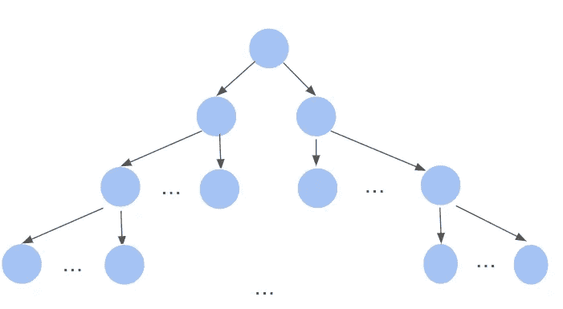
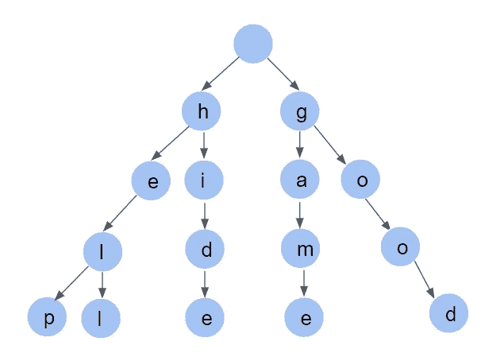
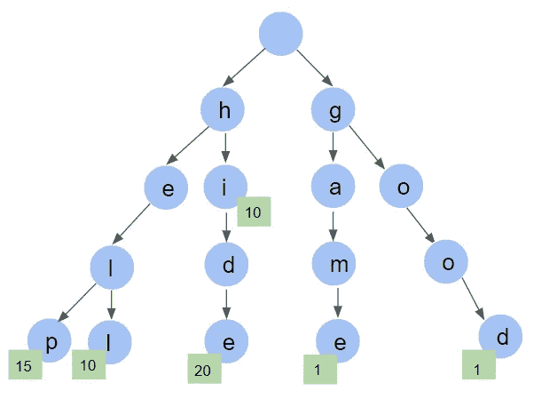
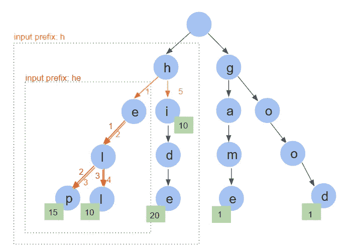

# 为搜索引擎实现自动完成功能

> 原文：<https://blog.devgenius.io/implementing-the-autocomplete-feature-for-a-search-engine-6327a562b1cd?source=collection_archive---------7----------------------->

**第 1 部分:自动补全背后的结构**

来源:unsplash.com—[@ alloweb](https://unsplash.com/@olloweb)

# **TLDR:**

你有没有想过，谷歌、亚马逊和互联网上的其他行为者如何能够立即预测你在他们的**搜索框**中键入的**查询，并给出示例来完成它。如果是这样的话，本文将向您概述自动完成特性背后的基本算法。该算法可用于在用户**进行的**数百万次历史查询中检索不相关的**建议**。**

# **简介:**

我最近读了一篇谷歌的文章，描述了他们搜索引擎中的自动完成功能。当我开始在搜索栏中输入几个字母时，我很想知道在幕后发生了什么，以获得建议列表。

后来，我发现一个**特定的** **数据结构**是任何自动完成功能的第一个**构件**，无论是搜索引擎中的查询完成模块还是手机上的关键字建议模块...这个结构存储了**历史查询**，并使**在实时环境中轻松快速地检索**它们。因此，在几毫秒内，当有人开始输入时，**信息被检索**并且建议被显示在 UI 上。

显然，我认为谷歌和其他主要参与者正在他们的自动完成功能中投入越来越多的智能，以应对他们可能面临的搜索引擎使用越来越多的挑战。因此，他们不会只依赖这种技术，而是会利用一些人工智能模型，一旦收集到用户的数据，就可以获得更有针对性的建议。

第一篇文章的目标是探索这种数据结构，理解其背后的逻辑。第二篇文章随后是一个实际的用例，我们构建了一个 API，模拟了一个自动完成系统，有一百万个搜索查询历史数据库。

# **1。它是如何工作的？**

作为一个搜索引擎用户，只要我们开始输入几个字符，自动完成功能就会给出一组建议，我们输入的字符越多，建议列表就越有针对性。所有这些都在几毫秒内发生，以保证流畅的用户体验。

这种特性背后的基本逻辑是向用户显示以键入的字符开始的前 N 个查询。基于**的历史搜索数据**，查询可以按照它们的**频率**进行排序，这样频繁的查询将首先出现。这是合理的，因为频率可以代表人们的兴趣。

如前所述，我们认为，在当今的行业中，该功能可以利用除历史搜索数据之外的**众多其他参数**，例如，它可以使用当前趋势、用户兴趣、地理位置，并从人工智能研究的进步中获得优势，以个性化结果。

也就是说，构建这样一个自动完成功能需要使用一个高效的数据结构来存储大量的历史数据，这样所需的信息很快就能被检索到。

# **2。数据是如何存储的？**

用于构建**自动完成功能**的最先进的结构是 **trie** (也称为**前缀树**)，这是一个 k 数组搜索树，意味着在每一层我们可以存储 k 个节点。

历史查询字符以优化的方式存储，便于搜索。实际上，正如我们将在下面的章节中看到的，字符的存储方式和它们之间的链接允许快速找到共享相同前缀的查询**。然而，由于我们存储节点和边的事实，它在**内存消耗**方面通常不如数组这样的经典结构有效(除非许多查询共享相同的前缀)。**

一般的 trie 结构

**2.1 在 Trie 中存储历史数据**

trie 结构要求共享相同前缀的所有查询**都存储在子层中。**

下面是一个例子:假设我们在历史中有 6 个查询(帮助、隐藏、地狱、游戏、好、嗨),并希望将它们存储在一个 trie 中。

这个过程包括遍历查询列表，一个字符一个字符地给每个字符分配正确的位置，如下图所示。请注意，前缀 **he-** 在查询 **help** 和 **hell** 之间共享，因此这两者共享树的前三层(层 0 是根，在该结构中保持为空)。

使用查询历史构建的前缀树结构

您可能会注意到，有些查询只是其他查询的子字符串。例如“hi”是“hide”的子串。我们应该在结构中考虑到这一点，添加一个查询结束标志。在我们的例子中，这个标志将是计数本身，它在查询的终端节点将是非空的。

**2.2 包括查询频率**

我们可以考虑两种逻辑，将来自历史数据的**查询频率包含在真实世界的应用程序**中，以便在执行搜索时，根据查询的出现次数对返回的查询进行排序。第一个将在建筑层面。事实上，我们可以考虑使用一种能够保持顺序的结构，而不是简单地遍历历史并将它存储在 trie 中。这样，我们可以确保在遍历 trie 进行搜索时，只需要返回前 N 个分支。

第二种方法将在**中使用，我们在下面的文章**中的实现将在每个查询的终端节点中存储频率。这些信息将帮助搜索算法**检测查询的结尾**和**在历史数据中一次性获得它的出现**。

让我们回到前面的例子，包括频率参数:(帮助:15，隐藏:20，地狱:10，游戏:1，好:1，嗨:10)

新的 trie 如下所示:

具有出现计数的 Trie 结构

**2.3 检索搜索结果**

我们将对这一部分感兴趣，因为**搜索算法**返回与给定前缀匹配的**查询。**

在我们的例子中，输入“h”应该会返回(help，hell，hi，hide)。这包括循环输入查询(1 个字符)并在 trie 中找到构成前缀的路径。一旦找到，子树被递归地遍历**，结果由所有的**下游分支**形成。可以通过检查非空的计数参数来检测分支(完整查询)的结束。**

**让我们举第二个例子，用户输入前缀“he”，在这种情况下，子树根将是“e”，通过遍历它的分支，我们最终得到(help，hell)。一旦检索到，结果可以按频率排序**，并且用户显示对应于前缀的前 N 个查询。****

****

**遍历 trie 以检索共享相同前缀的查询**

# ****3。这种结构效率有多高？****

**让我们试着分析一下这项技术的复杂性。我们用 n 表示查询的平均长度，用 M 表示查询历史的长度。**

****3.1 插入过程****

**为了将一个新的字符串插入到 trie 中，我们需要遍历它并逐个字符地存储它。这是一个 O(n)操作，我们需要执行 M 次才能在第一次构建完整的树。**

****3.1 搜索过程****

**为了在 trie 中找到一个查询，我们需要深入它。时间复杂度也是 O(n)。正是在这里，所有的奇迹发生了，因为搜索是**独立于历史数据集** **或特里树的大小。**影响**执行时间的唯一参数将是查询长度本身**，它永远不会太大**。****

# ****结论:****

**在这篇文章中，我们看到了一个有趣的数据结构，它可以在我们的日常生活中得到应用，并且可以成为我们经常使用的自动补全功能的核心，无论是在搜索引擎、移动消息…**

**最后，我们应该注意到，在搜索时间方面，trie 结构是有效的。然而，在存储和内存消耗方面，它可以使用其他结构**三叉搜索树**进一步优化**。****

**[在下一篇文章](https://medium.com/@kaislar17/implementing-the-autocomplete-feature-for-a-search-engine-fe17cd4f9aa)中，我们将提出这个结构和搜索算法的 python 实现。此外，我们将构建一个 API 来对 1M 真实查询历史样本执行自动补全。**