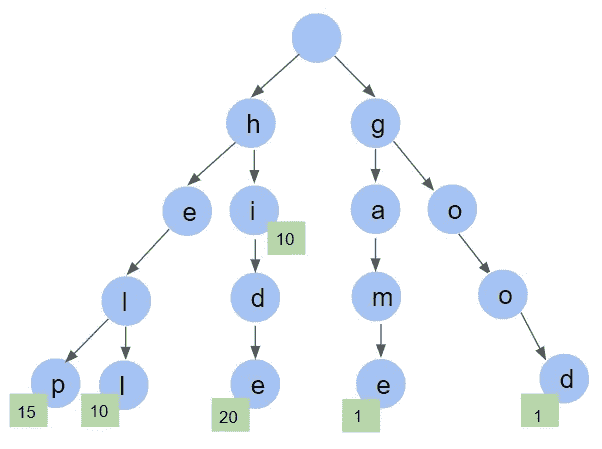
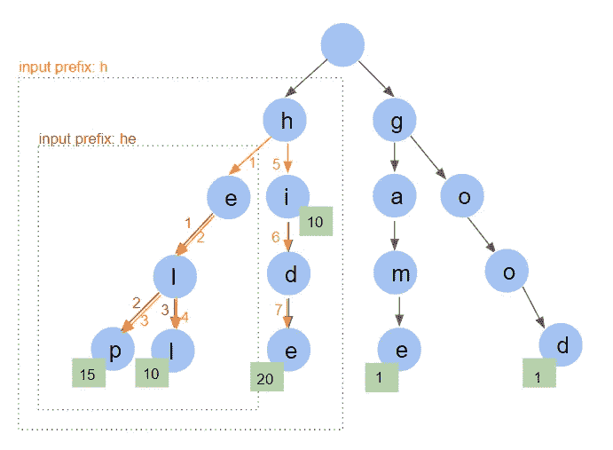

# 为搜索引擎实现自动完成功能

> 原文：<https://blog.devgenius.io/implementing-the-autocomplete-feature-for-a-search-engine-fe17cd4f9aa?source=collection_archive---------8----------------------->

第 2 部分:python 实现

来源:[unsplash.com—@ markuswinkler](https://unsplash.com/@markuswinkler)

# TLDR

这篇文章跟随[之前关于 trie 结构如何工作以及如何应用它来构建实时自动完成功能的讨论](/implementing-the-autocomplete-feature-for-a-search-engine-6327a562b1cd)。第一篇文章致力于 trie 构造和信息检索背后的理论方面。这一个将更实际，因为我们将通过 python 实现。

# 介绍

在[这篇文章的第一部分](/implementing-the-autocomplete-feature-for-a-search-engine-6327a562b1cd)，我们解释了我们日常使用的在线搜索查询的自动完成特性是如何工作的。我们看到这个特性依赖于一种叫做 trie 的数据结构，这种数据结构可以更快地找到共享相同前缀的查询。如果您错过了第一部分，我们强烈建议您点击[此链接](/implementing-the-autocomplete-feature-for-a-search-engine-6327a562b1cd)详细了解数据如何存储在此结构中，以及搜索算法如何快速检索匹配的查询。

在今天的文章中，我们将把重点放在实践部分。首先，我们提出了 trie 和搜索算法的 python 实现。然后，我们构建一个 flask API 来公开它。

# **实现 Trie 结构**

从视觉上看，我们想要构建的 trie 如下所示，每个节点存储一个字符，并且可以有多个子节点。此外，trie 中的每个节点都应该有一个标志来标记查询的结束。

用六个查询填充的 trie 结构

为了实现这一点，我们从构建块开始:节点。我们建议下面的代码片段实现一个 **Trie 节点对象**，它可以存储****字符**，**子节点**作为节点的字典，以及**从-1 开始的计数**。该计数将以频率更新，以标记查询的结束及其在历史查询数据中的出现。**

**一旦定义了节点对象，就该开始构建 trie 了。为此，我们必须逐个字符地循环历史查询，并将每个查询插入到正确的位置。这个逻辑是在插入函数中实现的。**

**在这个阶段，我们有了所需的函数来**构建 trie 并将历史查询**存储在其中。代码的下一部分将致力于**查询检索**。第一步是循环输入字符串(前缀)。然后，遍历树，在包含前缀最后一个字符的根上结束。我们知道，可以通过从**选择的节点**开始递归遍历特里树**来检索解决方案。****

**让我们考虑下图，将“h”作为输入字符串。我们首先定位前缀“h”，然后对 trie 执行深度优先遍历以收集(-elp，-ell，-ide，-i)，如橙色箭头所示。如果我们考虑前缀“he”，同样的事情也适用，输出将是(-lp，-ll)，如红色箭头所示。**

****

**特里树的深度优先遍历**

**这可以通过下面的代码来实现。**

# **让我们试试代码！**

**为了模拟当我们开始输入查询时在搜索引擎上实时发生的情况，我们将在 Flask 上构建一个 API 端点。**

**我们将使用真实的历史查询数据集。据我们所知，这是最大的在线开放数据集，有超过 4.48 亿个查询。可以在这里下载。**

**但是，这里我们将只使用前 100 万行，因为如果不进行并行化，树的构建过程可能会很慢。因此，为了简单起见，我们在这里构建了一个一百万个查询的 trie。同样，在这个例子中，频率是随机产生的。**

**然而，如果任何人有兴趣处理这个项目并使用完整的数据集分析性能，他/她可以在 Github 上的 [projet 资源库中做出贡献。](https://github.com/kaislar/autocomplete)**

**我们在这里构建的 API 有一个端点 **/autocomplete** ，它将一个字符串作为参数，返回匹配输入前缀的前 10 个历史查询。**

**请注意，在运行应用程序之前， **trie 只构建一次**。一旦完成，api 就准备好**接收请求**。**

**我们可以通过向 API 端点发送几个请求来测试实现。如下图所示，这里的响应时间是 3 毫秒，这对于实时应用程序来说是可以接受的**(从 100 万个历史查询数据中选择的 10k 个随机查询的平均 10ms/查询)**。显然，我们没有考虑 trie 构建时间，因为这是在启动 api 之前完成的。在这种情况下，trie 构建时间大约为 30 秒。**

****

**发送到 API 的请求示例**

# **结论**

**在本文中，我们看到了如何使用 Trie 结构实现自动完成功能。这种结构背后的关键是以智能的方式安排历史数据，使得共享相同前缀的查询位于 trie 中的相同节点下。**

**我们已经证明了搜索算法的复杂性与历史数据的大小无关。这是至关重要的，因为我们需要自动完成是可伸缩的和实时响应的。**