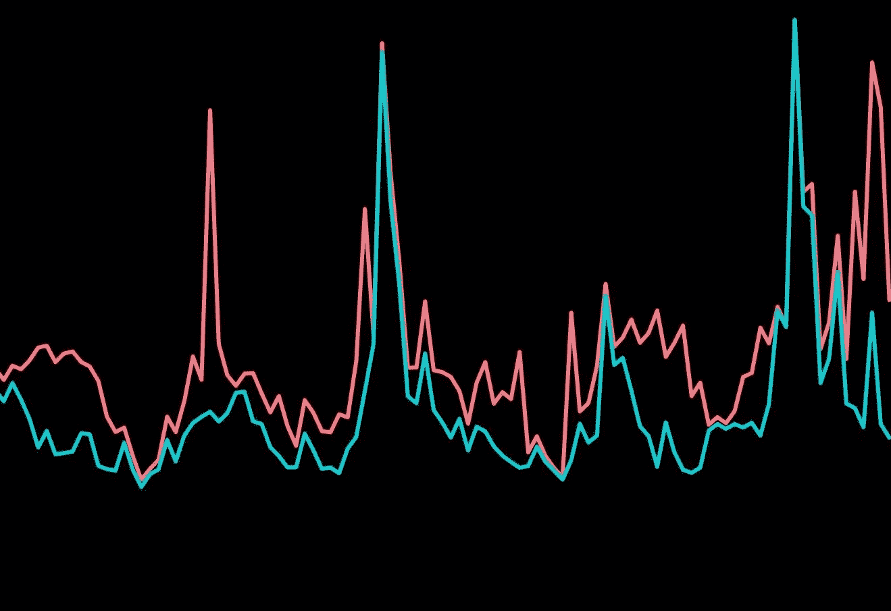
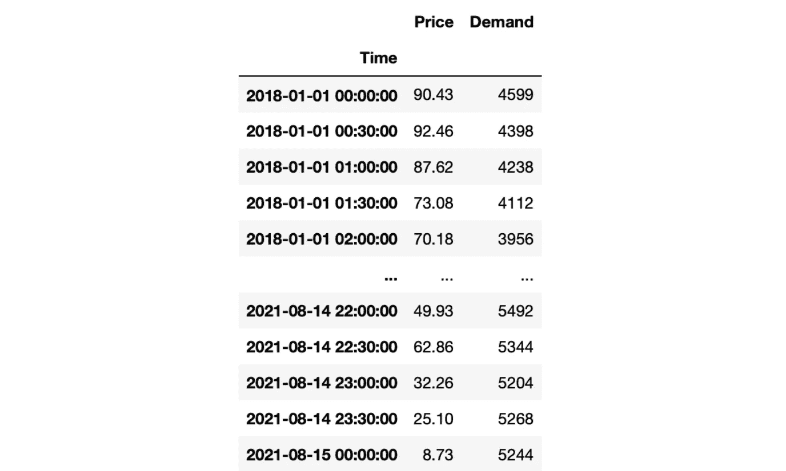
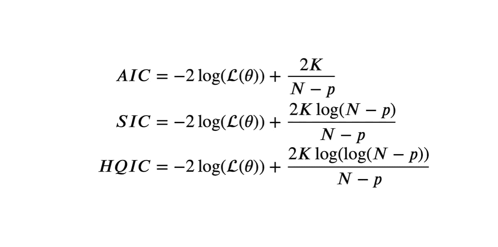
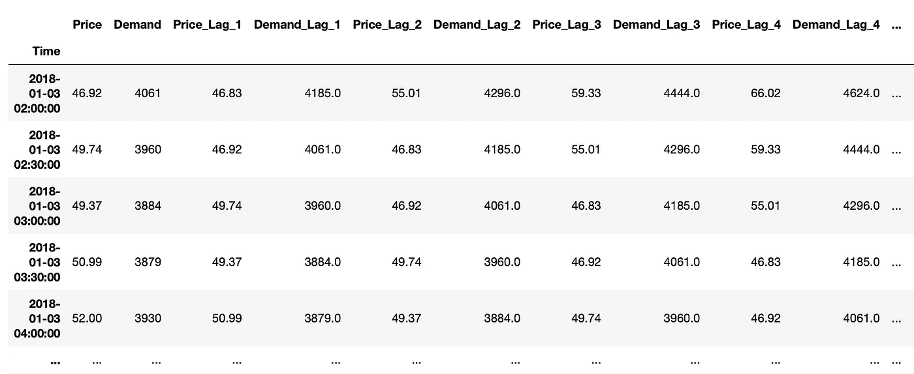
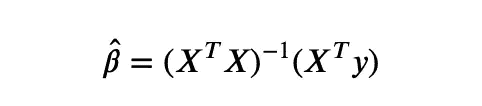
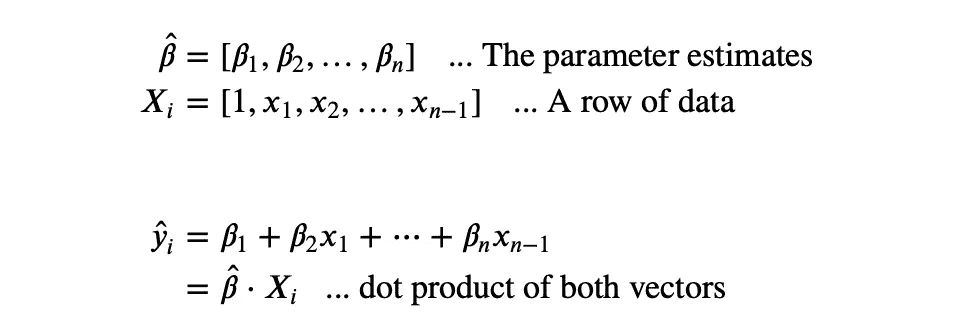
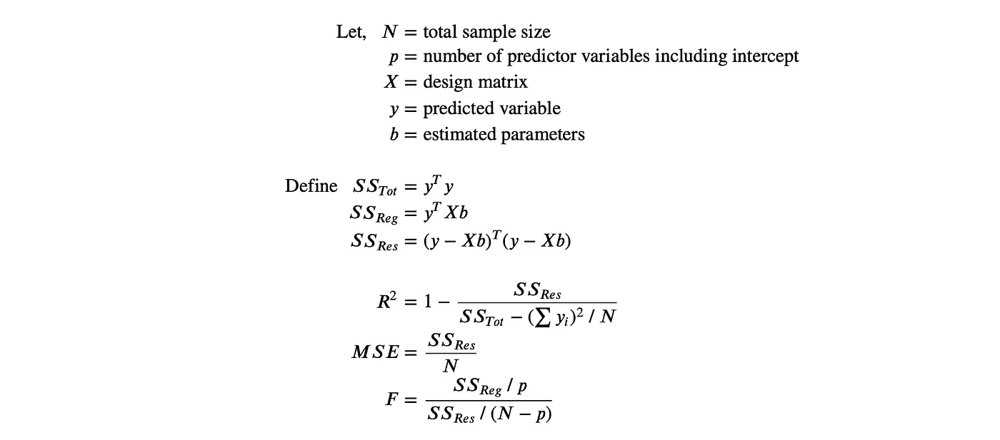

# 用 Python 从头开始实现向量自回归(VAR)

> 原文：<https://blog.devgenius.io/implementing-vector-autoregression-from-scratch-with-python-b12eedbf35ad?source=collection_archive---------0----------------------->

## 通过从头开始构建来了解 VAR



多元时间序列

# 增值转销公司

当谈到时间序列分析和预测时，有许多模型和算法可供选择。时间序列领域的基本模型之一是*向量自回归* (VAR)，这是我们所知的大多数多元时间序列模型的最简单版本。本文旨在通过用 Python 编写代码来解释 VAR 的核心。我会假设你熟悉获取线性回归的估计参数，主要是正态方程。我还假设你熟悉时间序列的特征(即时间序列中的滞后)。

首先，一个 *N* 变量的 VAR 模型就是堆叠成 1 的 *N* 线性回归模型。这些 *N* 线性回归使用相同的设计矩阵(简化:相同的预测数据)并将其用于 *N* 不同的时间序列。预测器数据是先前时间点或滞后的那些 *N* 时间序列。因此，VAR 模型的估计参数就是所有线性回归的估计参数。如果你知道线性回归是如何工作的，你应该不难理解这些内容。

# 预处理

让我们从我们的图书馆开始。

仅此而已。我们希望创建一个没有外部库的 VAR 模型。

接下来，我们加载数据。我使用的数据是澳大利亚维多利亚州的电价和需求。它在 [AEMO 网站](https://aemo.com.au/energy-systems/electricity/national-electricity-market-nem/data-nem/aggregated-data)上公开发布。为了简单起见，我更改了列名，以便用户更容易阅读。你可以在这里下载我的数据版本[，尽管你可以在本教程中使用任何你自己的数据。下面是我的数据版本的一个片段。请仅为本教程设置索引中的任何时间指示器，或者删除它们。](https://drive.google.com/file/d/1CLfYy4KWbGsMnxPwXtMJdBT4hW1yvI0q/view?usp=sharing)



第一数据帧输出

我们现在将得到一点技术。在每个时间序列模型中都有一种叫做最优滞后结构的东西。让我举一个例子来说明这一点。假设我们正在预测一个每日时间序列数据，我们希望预测明天的值。为了预测明天，我用了今天的值，昨天的值和前天的值作为预测值。这个模型的滞后结构为 3，因为我们使用了 3 个过去的数据来预测下一个值。

每个模型都有一个最优的滞后结构，它最大化(或最小化)一个统计量。一般来说，统计量的选择是在信息准则之间进行的；AIC (Akaike)、SIC (Schwarz)或 HQIC (Hannan-Quinn)，但也有其他方法来确定最佳结构。当使用前三个标准时，最佳实践是计算所有标准，并选择“多数规则”滞后，而不管符合哪个标准。在平局的情况下，任意选择将不会显著影响模型。对于那些对数学感兴趣的人，我提供了我提到的判据的公式。



信息标准公式

其中 *L* (θ)是*K*-变量 VAR 模型的似然， *N* 是样本量， *p* 是估计参数的个数。这个过程可能看起来很复杂，但是 Python 有针对这个特定任务的库，即 *statsmodel* 。如果你对滞后结构不是很了解，也不用担心。为了这篇文章，我将选择一个任意的滞后 100。

为了将滞后作为特征，我们将遍历每个特征的每个滞后。方法`df[col].shift(i)`是获取任何特征的第*I*th lag 的便捷方法。如果您很细心，您可能会注意到这个策略会在前 100 行中产生 NaN 值。我们不会为此担心，只需删除前 100 行。注意，每次我提到 100，这指的是你的最优滞后结构。



生成的数据框的片段。你也可以用这幅图来理解什么是滞后。

下一步是获取原始的滞后零数据(在这种情况下，列`Price`和`Demand`)，将它们存储在其他地方，并从数据框中删除它们。这是因为这些原始数据是预测变量，在数据中用它们来训练模型是没有意义的。

我们还应该在数据帧的第一个条目上添加一个截取列。用统计学术语来说，截距是用来调整预测偏差的。但是你需要知道的是，在每个回归模型中，我们需要一个截距，因此这里有一个截距。将截距放在第一列只是惯例。

最后一步是将数据转换成矩阵。

# 模特培训

这就是我们回归的地方。如果你还记得，我提到过一个 *N* 变量 VAR 模型就是简单的 *N* 个同时线性回归。在我们的例子中，时间序列是二元的(或二元的)；因此，VAR 模型只是两个线性回归。

求解线性回归就是获得每个变量的参数估计，通常表示为*β*-矩阵。如果我们已经准备好预测器和预测矩阵，找到 *β* 矩阵将会很简单。在我们的代码中，预测矩阵是变量`X`，预测矩阵是`y_price`和`y_demand`。

为了获得估计的*β*-矩阵，我们需要做一系列的矩阵乘法。主要是法线方程，



正规方程

这里， *X* 指预测矩阵`X`， *y* 指预测矩阵`y_price`和`y_demand`。使用 *Numpy* 可以简化 Python 中的矩阵乘法。我将给出一些 Python 中矩阵操作的命令，这些命令对我们的目的很有用，

*   设`A`和`B`为 *Numpy* 矩阵。
*   `np.matmul(A, B)`用于将矩阵`A`和矩阵`B`相乘。请注意，由于矩阵乘法的性质，`np.matmul(B, A)`将产生不同的结果。
*   `A.T`用于获得矩阵`A`的转置。
*   `np.linalg.inv(A)`用于获得矩阵的逆矩阵`A`。

让我们创建一个函数来从正规方程中获得参数估计。

就这么简单，我们已经在这几行代码中获得了回归参数(和 VAR 参数)。这就结束了模型的训练。存储在`b_price`和`b_demand`中的参数估计值。我们现在可以用它来做预测。

# 预测

让我们继续预测过程。在时间序列预测中，有两种类型的预测。

*   **事前**:预测目前可用的数据。这意味着在训练数据上测试模型。对模型诊断有用。
*   **事后**:利用未来数据进行预测。未来数据是指预测数据。在事后预测中，任何时间 *t* 的预测数据成为时间 *t + n* 的预测值。实用的。

## 预期的

现在让我们回顾一下回归预测的数学方法。如果已经有了回归的参数估计值，可以通过计算参数估计值和数据的点积来找到预测值。这里有一个简单的解释，



我们实际上可以将这个过程简化为两行矩阵乘法`price_estimates = np.matmul(X, b_price)`和`demand_estimates = np.matmul(X, b_demand)`。但是为了更好的理解，我还是决定把它分解一下。

这就结束了事前预测过程。事前预测有助于模型诊断，我将演示如何计算其中的一些。为了评估 VAR 模型的性能，我们将使用通常用于评估线性回归模型的统计数据。

*   r:衡量数据解释了多少差异
*   MSE:测量误差水平
*   f 检验:测量预测值的显著性。

我不会详细解释这些统计数据，但我会为那些对数学感兴趣的人提供公式。



让我们做一些诊断。我要把上面的公式复制成 Python 函数。

运行`Diagnostics()`函数将为我们的数据返回这些输出。

对于价格，

`Diagnostics(y_price, X, b_price, N, p)`

输出:

```
The R-squared is: 0.66
The MSE is: 28262.74
The F-statistic is: 686.42
```

对于需求，

`Diagnostics(y_demand, X, b_demand, N, p)`

输出:

```
The R-squared is: 1.0
The MSE is: 3318.01
The F-statistic is: 2517997.46
```

您可以通过计算 F 统计的调整后 R 值或 p 值来进一步研究诊断。还有许多诊断方法可用于回归分析。

## 依据过去经济发展情形分析的

事后预测就是预测未来。要点是，如果 *t* 表示当前时间点，那么为了预测时间点 *t + n* ，其中 n 是大于 1 的数，我们将需要使用在 *t + n* 的滞后作为预测器。如果 *n* 大于 1，则在 *t + n* 处至少有一个滞后在 *t* 之后。换句话说， *t + n* 的一些滞后是未来预测的时间点。观察下表来观想。

在这里，任何带有星号(*)的条目代表我们在时间 *t* 没有的数据，因此是预测的。对于大的 *n* ，我们将所有预测值作为预测值。下面的 Python 代码显示了事后预测。变量`PointsAhead`表示您希望预测多远，您可以根据自己的需求进行更改。

最终预测将存储在`ExPostPrice`和`ExPostDemand`中。事后预测流程到此结束。因为我们实际上是在预测未来，所以我们不能对我们的预测进行诊断。对事后预测运行诊断的标准解决方案是仅使用到特定时间 *t - n* 的数据来训练模型，然后从时间 *t - n* 到时间 *t* 进行事后预测。然后，您可以对测试集运行诊断，因为这一次，您有了测试集的实际值。

# 恭喜

我们从始至终只用 *Pandas* 和 *Numpy* 成功构建了一个 VAR 模型。我希望你能用你的数据重建这个模型，最好是用一个 3 变量的时间序列，只是为了全面的理解。你也可以在 [GitHub](https://github.com/gerchristko/Vector-Autoregression) 上找到代码和数据集。如果你喜欢这篇文章，考虑鼓掌。请在评论中分享你的反馈和想法。感谢您的阅读！