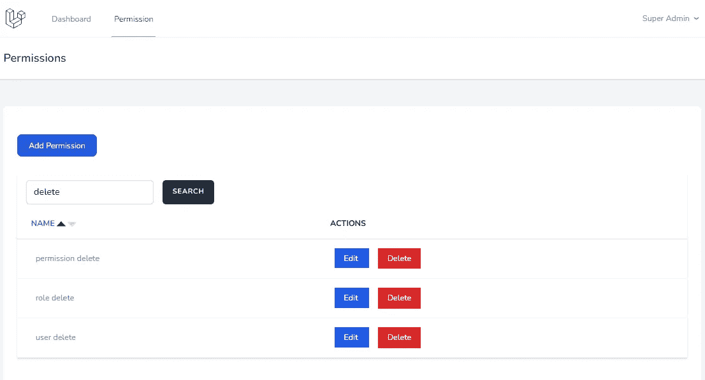
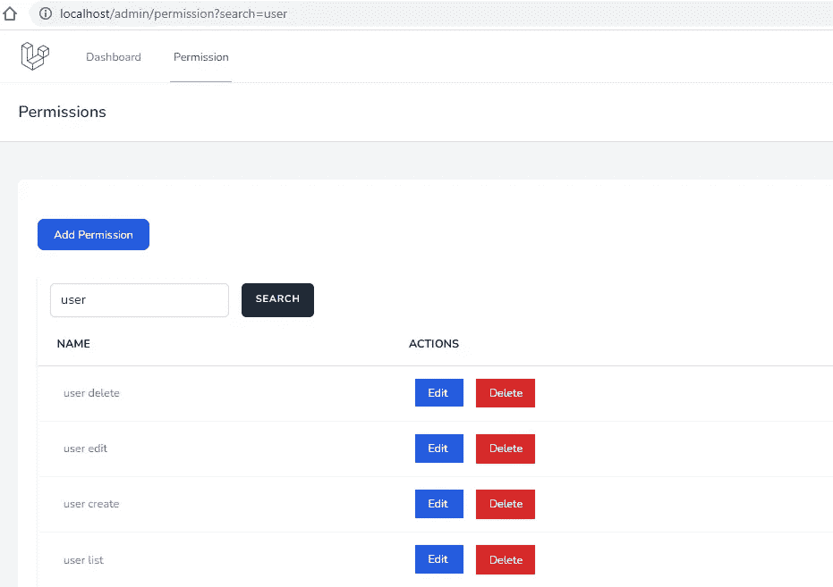
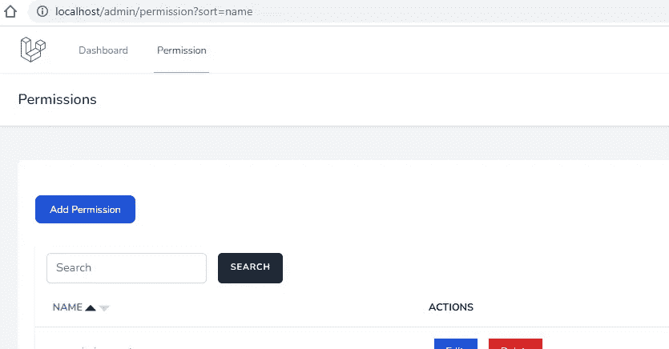
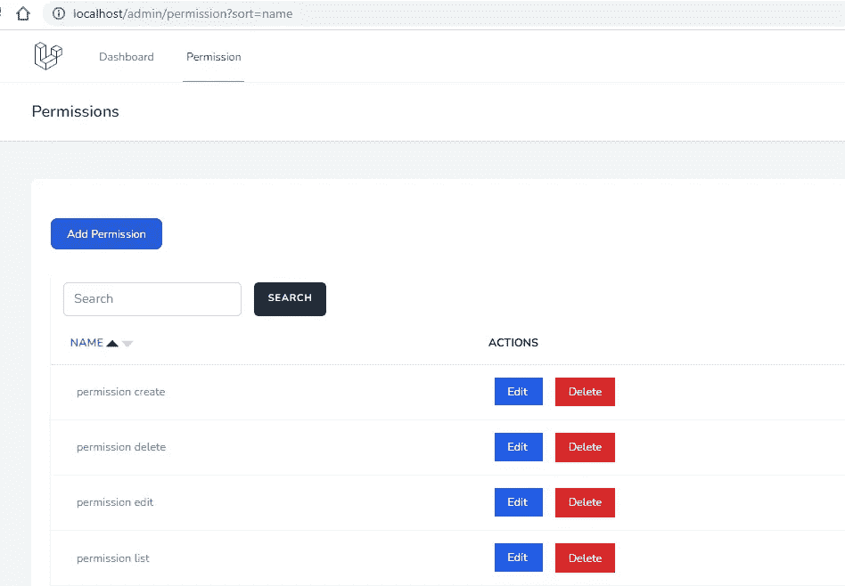

# 在 Laravel CRUD 中实现基本的搜索过滤器和带有分页的列排序

> 原文：<https://blog.devgenius.io/implements-a-basic-search-filter-and-column-sort-with-pagination-in-laravel-crud-5e3c70fb12ac?source=collection_archive---------2----------------------->

## Laravel 从头开始创建一个管理面板——第 6 部分



Laravel CRUD 中的基本搜索过滤器和列排序

在这一部分，我们将在 CRUD 中添加搜索和排序功能。为了更好地理解 Laravel，我不打算使用任何用于过滤和排序的包。

下面的步骤是为我们的 Laravel 管理面板创建一个过滤器和排序。

*   **1。实现一个搜索过滤器**
*   1.1 在索引视图中添加搜索字段
*   1.2 在控制器上添加过滤条件
*   **2。实现列排序**
*   2.1 在视图中添加排序链接
*   2.2 在查询中添加排序依据

# 1.实现搜索过滤器

## 1.1 在索引视图中添加搜索字段

权限 CRUD 只有名称字段。因此，在索引视图上添加以下名称过滤器

资源/视图/管理/权限/索引. blade.php

```
+++ b/resources/views/admin/permission/index.blade.php
@@ -22,6 +22,16 @@
                             </div>
                         @endif
                             <div class="min-w-full border-b border-gray-200 shadow">
+                                <form method="GET" action="{{ route('permission.index') }}">
+                                <div class="py-2 flex">
+                                    <div class="overflow-hidden flex pl-4">
+                                        <input type="search" name="search" value="{{ request()->input('search') }}" class="rounded-md shadow-sm border-gray-300 focus:border-indigo-300 focus:ring focus:ring-indigo-200 focus:ring-opacity-50" placeholder="Search">
+                                        <button type='submit' class='ml-4 inline-flex items-center px-4 py-2 bg-gray-800 border border-transparent rounded-md font-semibold text-xs text-white uppercase tracking-widest hover:bg-gray-700 active:bg-gray-900 focus:outline-none focus:border-gray-900 focus:ring ring-gray-300 disabled:opacity-25 transition ease-in-out duration-150'>
+                                            {{ __('Search') }}
+                                        </button>
+                                    </div>
+                                </div>
+                                </form>
                                 <table class="border-collapse table-auto w-full text-sm">
                                     <thead>
                                         <tr>
```

此外，更改如下所示的`$permissions->links()`,在分页链接中追加查询参数

```
{{ $permissions->appends(request()->query())->links() }}
```

## 1.2 在控制器上添加过滤条件

在 PermissionController 中，在索引函数上添加以下 where 条件

app/Http/Controllers/Admin/permission controller . PHP

```
if (request()->has('search')) {
    $permissions->where('name', 'Like', '%' . request()->input('search') . '%');
}
```

更新后，您的索引函数应该具有以下代码

```
public function index()
{
    $permissions = Permission::latest();
    if (request()->has('search')) {
        $permissions->where('name', 'Like', '%' . request()->input('search') . '%');
    }
    $permissions = $permissions->paginate(5);
    return view('admin.permission.index',compact('permissions'))
        ->with('i', (request()->input('page', 1) - 1) * 5);
}
```

我们在权限 CRUD 中添加了过滤器功能。类似地，我们可以在过滤器中添加多个字段。

不要忘记运行`sail npm run dev`来重建 CSS



带有搜索过滤器的 Laravel CRUD

# **2。实施排序依据**

## 2.1 在视图中添加排序链接

创建新的包含刀片文件以显示排序链接。这将有助于在其他 CRUD 中包含排序链接

资源/视图/管理/包含/排序链接. blade

```
@php
    $down_fill = 'lightgray';
    $up_fill = 'lightgray';
    $attribute = $attribute ?? '';
    $label = $label ?? '';
    if(request()->query('sort') == $attribute) {
        $up_fill = 'black';
    }
    if(request()->query('sort') == '-'.$attribute) {
        $down_fill = 'black';
    }
@endphp
@if (request()->query('sort') == $attribute)
    <a href="{{request()->fullUrlWithQuery(['sort' => '-'.$attribute])}}" class="no-underline hover:underline text-cyan-600 dark:text-cyan-400">{{ __($label) }}</a>
@else
    <a href="{{request()->fullUrlWithQuery(['sort' => $attribute])}}" class="no-underline hover:underline text-cyan-600 dark:text-cyan-400">{{ __($label) }}</a>
@endif
<svg class="inline-block"  width="15px" height="15px" viewBox="0 0 15 15" fill="none">
    <path d="M7.5 3L15 11H0L7.5 3Z" fill="{{$up_fill}}"/>
</svg>
<svg class="inline-block"  width="15px" height="15px" viewBox="0 0 15 15" fill="none">
    <path d="M7.49988 12L-0.00012207 4L14.9999 4L7.49988 12Z" fill="{{$down_fill}}"/>
</svg>
```

现在在 index.blade.php 把`{{ __(‘Name’) }}`替换到线下

```
@include('admin.includes.sort-link', ['label' => 'Name', 'attribute' => 'name'])
```

现在重新加载浏览器并点击标题名称。



具有列排序的 Laravel CRUD

排序 ASC 订单的名称

DESC 订单的排序=-名称

## 2.2 在查询中添加排序依据

在我们的索引查询中添加 order by 的时间。打开 PermissionController 索引函数，并用以下代码替换它

app/Http/Controllers/Admin/permission controller . PHP

```
public function index()
{
    $permissions = (new Permission)->newQuery();
    if (request()->has('search')) {
        $permissions->where('name', 'Like', '%' . request()->input('search') . '%');
    }
    if (request()->query('sort')) {
        $attribute = request()->query('sort');
        $sort_order = 'ASC';
        if (strncmp($attribute, '-', 1) === 0) {
            $sort_order = 'DESC';
            $attribute = substr($attribute, 1);
        }
        $permissions->orderBy($attribute, $sort_order);
    } else {
        $permissions->latest();
    }
    $permissions = $permissions->paginate(5);
    return view('admin.permission.index',compact('permissions'))
        ->with('i', (request()->input('page', 1) - 1) * 5);
}
```

现在，我们在 CRUD 中添加了列排序功能



带 ASC 排序的 CRUD

我们成功地在 CRUD 中添加了一个基本的搜索过滤器和带分页的列排序。

下一部分，我们将创建剩余的角色和用户 CRUD。

# GitHub 知识库

许可代码可在 [1.0.4](https://github.com/balajidharma/basic-laravel-admin-panel/tree/archive/1.0.4) 分支上获得

上一部分—第 5 部分:[基于角色和权限的 CRUD 访问控制](/laravel-crud-access-control-based-on-role-and-permission-f190d03f1fa2)

下一部分—第 7 部分— [创建角色管理的用户界面，添加到管理面板](/create-ui-for-role-management-to-laravel-admin-panel-dce72b09d2ea)