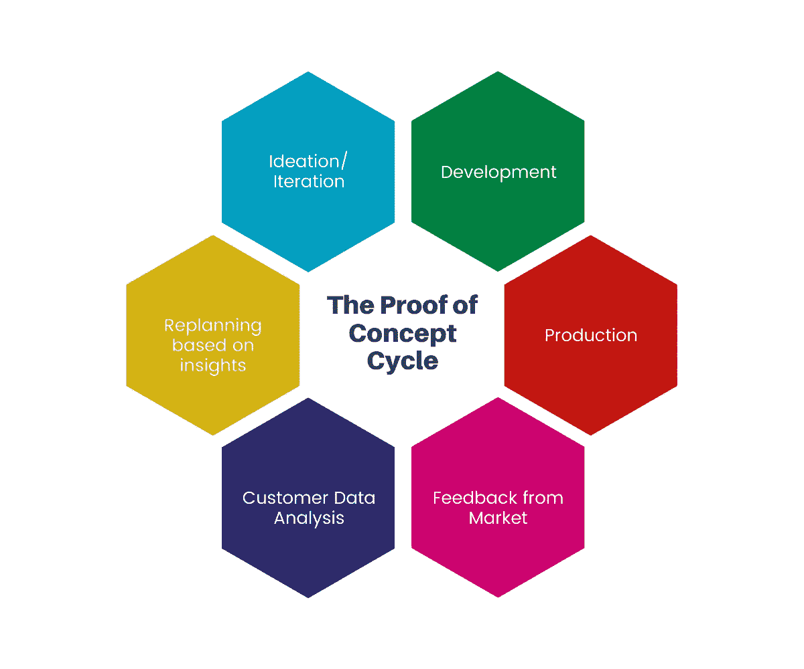
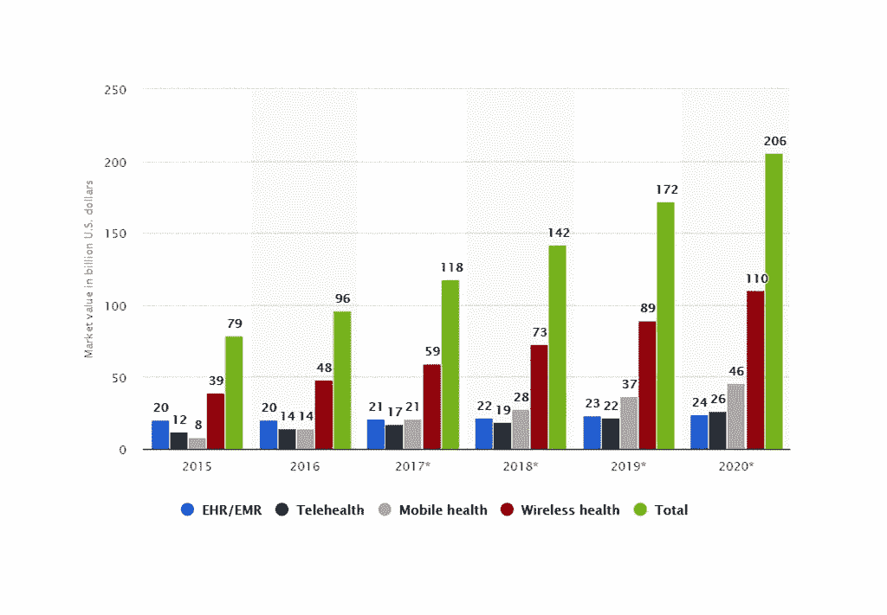
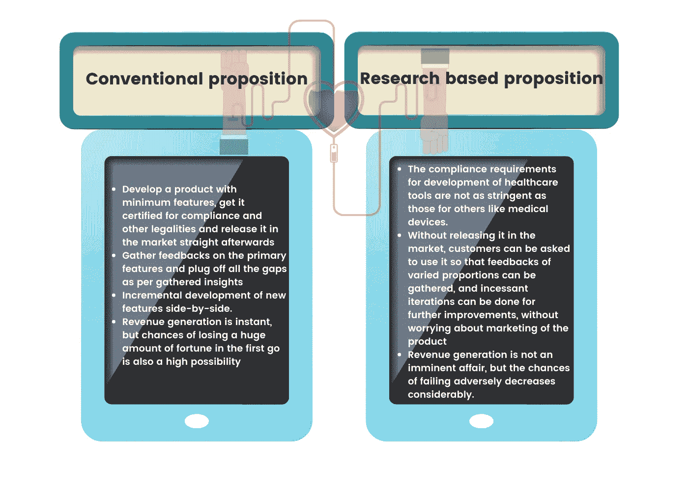

# POC 开发在医疗保健 IT 行业中的重要性

> 原文：<https://blog.devgenius.io/importance-of-poc-development-in-the-healthcare-it-industry-92d2bbc71634?source=collection_archive---------10----------------------->

## 一篇值得深思的文章

## 概念验证在医疗保健信息技术领域的作用

# 什么是 POC，MVP 开发的重要性是什么？

根据[维基百科](https://en.wikipedia.org/wiki/Proof_of_concept)的说法，概念证明(POC)是对某种方法或想法的实现，以证明其可行性，或者说是原则上的证明，其目的是验证某种概念或理论具有被使用的潜力。概念证明通常很小，可能完整也可能不完整。

关于软件开发领域，当一家公司或一个产品团队想要检查某个特定的应用程序或产品想法是否已经解决了所有的技术和财务问题时，它会求助于构建一个具有有限数量的功能的原型，以便最初的几个用户可以使用它来进行有效的反馈共享和故障修复。最小可行产品(MVP)是行业内经常使用的一个概念。当一个人有一个假设，并且想要通过最少的迭代次数和投资来测试它，那么在大多数情况下 MVP 是正确的选择。

# 在医疗保健 IT 中采用 MVP 开发:

现在，考虑到规范和立法方面的合规性要求，在医疗保健领域采用 IT 是一件棘手的事情。重要的是要理解，与其他行业相比，由于涉及到现实生活中的人，风险更高，因此对结果的安全性和准确性的要求也更高。记住这些事实，至少可以说，就时间和金钱而言，需要付出的努力是巨大的，因此，在软件规划和开发阶段的任何一个小故障都会对整体投资产生指数级的负面影响。因此，作为 MVP 的一部分，专注于提议产品的几个重要特性变得毫无疑问地重要，这样它就成为一个平衡的领域，在这个受限的和安全导向的行业中，可以从客户那里得到反馈，而不用花费预算。

在过去的几十年里，IT 革命将医疗保健行业带入了一个新的高度。它不仅对从业者的整体效率产生了积极的影响，而且使人们能够更好地获得高质量的医疗保健。随着移动技术的革命，可能性只会越来越大。可穿戴设备的出现为患者统计数据的实时监控带来了另一个维度。由[统计局制作的这张图表清楚地显示了这种影响。](https://www.statista.com/statistics/387867/value-of-worldwide-digital-health-market-forecast-by-segment/)

# 医疗保健 IT 领域 POC 开发的可行性

这里出现的基本问题是，考虑到法律影响、HIPAA 和 FDA 合规性等关键因素和巨大限制，MVP 开发对于医疗保健行业是否可行。放在上面。MVP 开发基本上有两种方式是富有成效的，它们是:

因此，为了确保没有遗漏任何东西，并且就 MVP 开发而言，一切都在正轨上，可以做以下事情:

*   ***统计市场研究:*** 这将有助于利用市场需求收集见解，分析竞争对手目标受众的行为。需要评估与合规性相关的议程，并设计适当的框架以避免违反监管。
*   ***建立 USP 和商业模式*** 。
*   ***确定 MVP 的最小特征，并据此设计软件文档*** 。
*   ***利益相关者分析*** :从患者角度，对预约排班、实时生命统计跟踪、病历存储与评估、实时聊天功能等模块的需求。从医生的角度来看，端到端的患者监控，实时响应患者查询，上传病历等。
*   ***MVP***所需最大预算的计算。
*   ***试验设计和开发*** 包括但不限于 UI/UX 设计、功能开发、收集反馈的适当渠道，以及在分析见解后实现迭代。

因此，如果计划得当，并以尽可能提高不确定性的方式进行，并促进对共同目标的平等责任感，我们肯定可以实现医疗保健 IT 部门的相关目标。