# 你需要知道的关于熊猫的重要功能

> 原文：<https://blog.devgenius.io/important-functions-you-need-to-know-about-pandas-b58d95b5905c?source=collection_archive---------3----------------------->

# 熊猫—基本功能

Pandas 是一个主要使用的 python 数据分析库。它提供了许多功能和方法来加快数据分析过程。熊猫如此普遍是因为它们的功能性、灵活性和简单的语法。

在解释这些功能之前，我将在加利福尼亚住房数据集上做一些例子。该数据集和代码可在此链接中获得。

[https://github.com/codingrad1/Pandas-Basic-Functionality](https://github.com/codingrad1/Pandas-Basic-Functionality)

熊猫最常见的一些功能是-

# 1)头部和尾部

一旦我们将一个数据集读入 pandas 数据框，我们想看一看它以获得一个概览。Head 允许我们显示数据框顶部的行。

语法为 head—***data . head()***

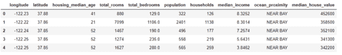

**Tail** 允许我们显示数据框底部的行。

tail 的语法— ***data.tail()***

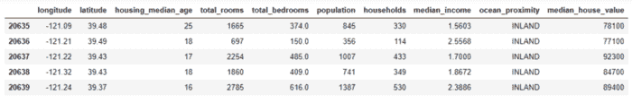

默认情况下显示 5 行，但我们可以调整它，绕过我们想要显示的行数。

# 2.DataFrame.info()

pandas**data frame . info()**函数用于获取数据帧的简明摘要。在对数据进行探索性分析时，这非常方便。为了快速浏览数据集，我们使用 dataframe.info()函数。

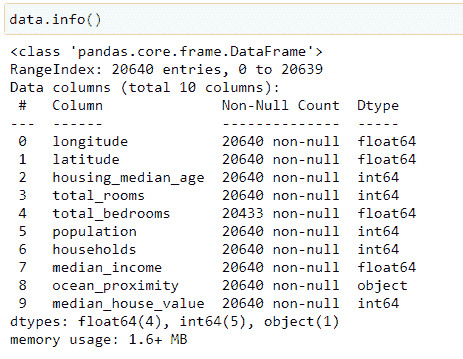

# 3.数据类型

**Dtypes** 显示每一列的数据类型。

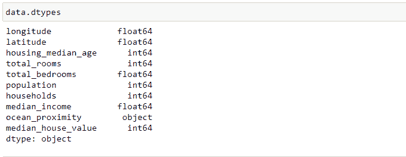

# 4.形状和尺寸

Shape 可用在 NumPy 数组、pandas 系列和 dataframes 上。它显示维度的数量以及每个维度的大小。

Shape 返回行数和列数。它衡量我们拥有多少数据，是数据分析过程的关键输入。

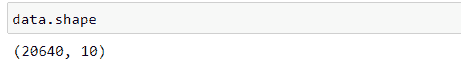

顾名思义，Size 返回数据帧的大小，即行数乘以列数。

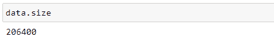

# 5.描述( )

该方法给出了数据帧的总体描述性摘要。这只适用于数字列，如下所示:

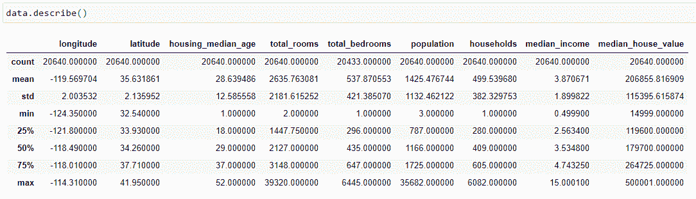

# 6.样品

**样本**方法允许您从**系列**或**数据帧**中随机选择数值。当我们想从分布中选择一个随机样本时，这是很有用的。

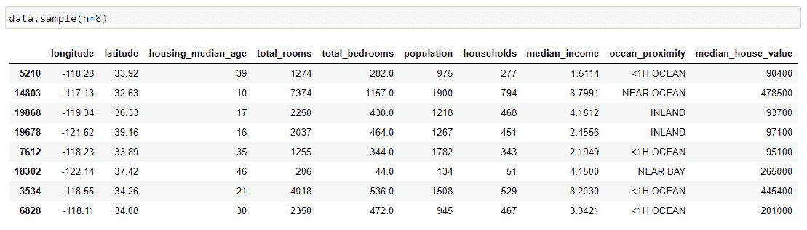

# 7.识别缺失值是空的

处理缺失值是构建稳健的数据分析过程的关键步骤。缺少的值应该是最优先考虑的，因为它们对任何分析的准确性都有重大影响。

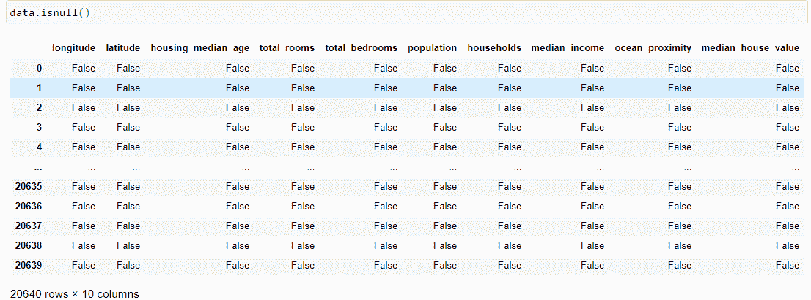

# 8.Isna

**Isna** 函数返回用布尔值填充的数据帧，true 表示缺少值。

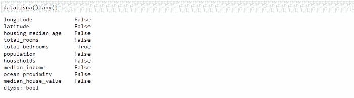

# 9.识别缺失值总和

让我们首先计算数据框中缺失值的总数。可以通过 **df.isnull()计算出每一列中缺失值的个数。sum()**

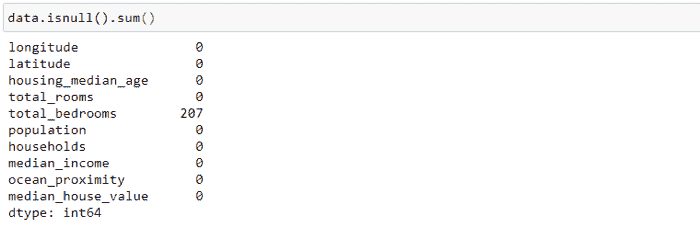

# 10.努尼克岛

Nunique 计算列或行中唯一条目的数量。它在分类特征中非常有用，尤其是在我们事先不知道类别数量的情况下。让我们看看我们的初始数据框架:

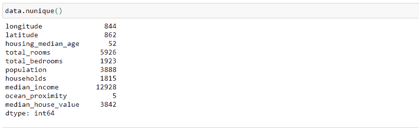

# 11.索引( )

**index()** 是 Python 中的一个内置函数，它从列表的开始处搜索给定的元素，并返回该元素出现处的最低索引。

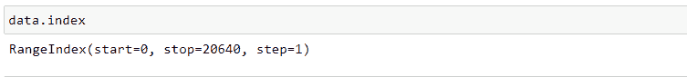

# 12.内存使用情况

**Memory_usage()** 以字节为单位返回每列使用了多少内存。这在我们处理大型数据帧时尤其有用。考虑下面有一百万行的数据帧。

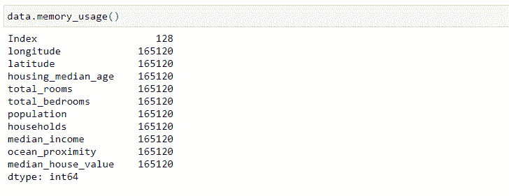

# 13.nsmallest()和 nlargest()

让我们看看如何找到具有最小值的 5 个观察值

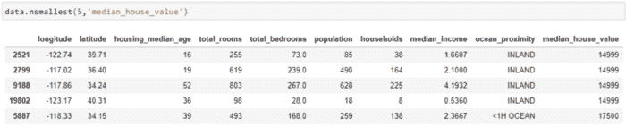

让我们看看如何找到具有最大值的 5 个观察值。

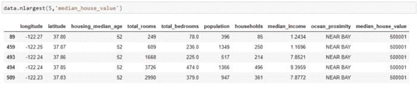

# 14.Loc 和 iloc

**Loc 和 iloc** 用于选择行和列。

*   位置:按标签选择
*   iloc:按职位选择

**loc** 用于通过标签选择数据。列的标签是列名。我们需要小心行标签。如果我们没有指定任何特定的索引，pandas 会默认创建一个整数索引。因此，行标签是从 0 开始向上的整数。

与 **iloc** 一起使用的行位置也是从 0 开始的整数。

用 loc 选择前 6 行和 2 列:

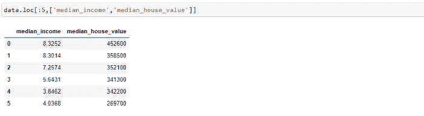

使用 iloc 选择前 4 行和前 6 列:

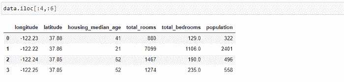

# 15.限幅

使用标签对行和列进行切片。您可以使用标签或按位置选择一系列行或列。

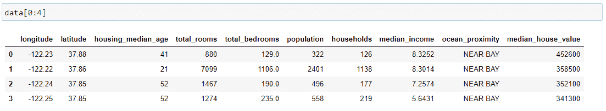

# 16.分组依据

pandas groupby 函数更容易揭示变量之间的潜在关系。下图概述了 groupby 函数的功能。

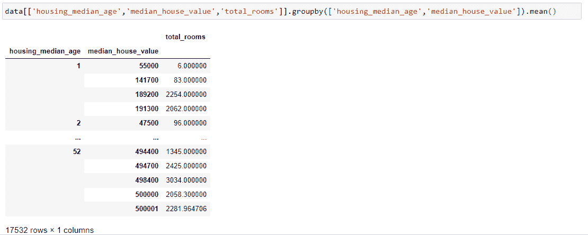

# 17.整理

使用 **sort_index()方法**，绕过轴参数和排序顺序，可以对数据帧进行排序。默认情况下，按升序对行标签进行排序。

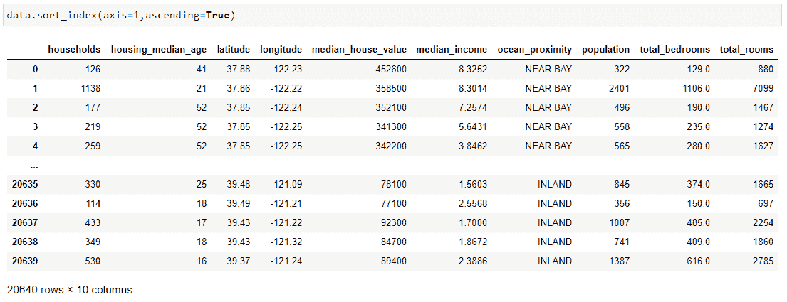

# 18.德罗普纳

dropna()函数用于**从数据帧中移除一行或一列，该数据帧中有 NaN 或没有值**。

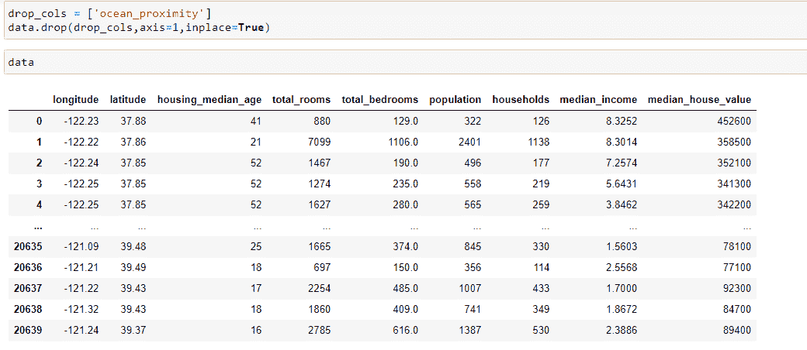

# 19.熊猫——重组

重新索引改变数据帧的行标签和列标签。重新索引意味着使数据符合特定轴上给定的一组标签。

多种操作可以通过索引来完成，如

*   对现有数据重新排序，以匹配新的标签集。
*   在不存在标签数据的标签位置插入缺失值(NA)标记。

比如说-

输出-

# 使用 axis 关键字重新索引列

通过使用 reindex()方法并指定要重新索引的轴，可以重新索引一列或多列。数据帧中不存在的新索引中的默认值被赋值，NaN。

输出-

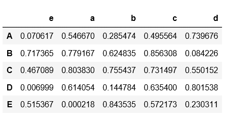

# 替换丢失的值

可以通过向关键字 fill_value 传递一个值来填充数据帧中缺少的值。该关键字替换 NaN 值。

输出-

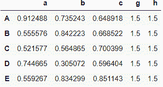

# 20.熊猫——迭代

迭代是一个通用术语，用来一个接一个地处理某件事情的每一项。Pandas 数据帧由行和列组成，因此，为了迭代数据帧，我们必须像字典一样迭代数据帧。

要素工程和要素探索需要遍历数据框。有多种方法可以遍历数据框。

# A.Iterrows():

Iterrows()是 Pandas 的内置函数，用于遍历数据框。应该完全避免使用它，因为与其他迭代技术相比，它的性能非常慢。Iterrows()在迭代时进行多次函数调用，并且迭代的每一行都具有数据框的属性，这使得它更慢。

示例-

输出-

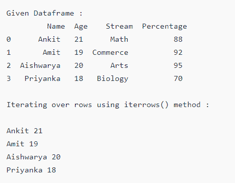

# B.Itertuples():

Itertuples() 是 Pandas 的内置函数，用于遍历数据框。与 iterrows()相比，Itertuples()调用函数的次数相对较少，并且开销也小得多。Itertuples()通过将每一行数据转换为元组列表来遍历数据帧。

示例-

输出-

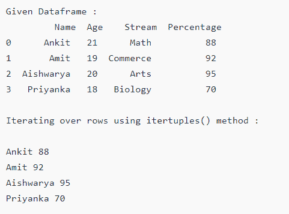

# C.Numpy 数组迭代:

NumPy 提供了一个迭代器对象，即 **nditer** ，可以使用 python 标准迭代器接口对给定数组进行迭代。

示例-

输出-

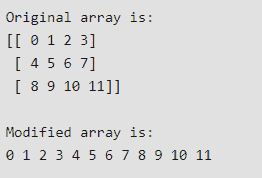

迭代的顺序被选择为匹配阵列的存储器布局，而不考虑特定的排序。这可以通过迭代上述数组的转置来看出。

输出-

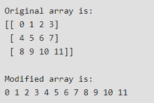

# D.字典迭代:

Python 中的 Dictionary 是数据值的无序集合，用于像 map 一样存储数据值，与其他只保存单个值作为元素的数据类型不同，Dictionary 保存了**键:值**对。

Python 中有多种迭代字典的方法。

*   遍历所有键
*   遍历所有值
*   遍历所有键、值对

# 遍历所有键:

下面代码中的状态顺序每次都会改变，因为字典没有按照特定的顺序存储键。

示例-

输出-

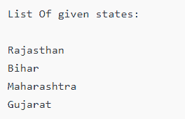

# 遍历所有值:

同样，在这种情况下，在下面的代码中，大写字母的打印顺序每次都会改变，因为字典没有按照特定的顺序存储它们。

示例-

输出-

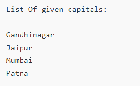

# 遍历所有键、值对:

输出-

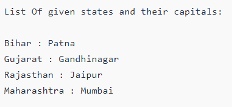

这些是一些可以经常使用的重要功能。还有很多其他功能也是可用的。要阅读所有其他函数，请遵循 Pandas 文档。

感谢阅读。希望你能从这个博客中了解很多。请继续支持我，很快我会在 Numpy 和可视化库 Seaborn 和 Matplotlib 上发布博客。

*更多内容尽在*[*blog . dev genius . io*](http://blog.devgenius.io)*。*