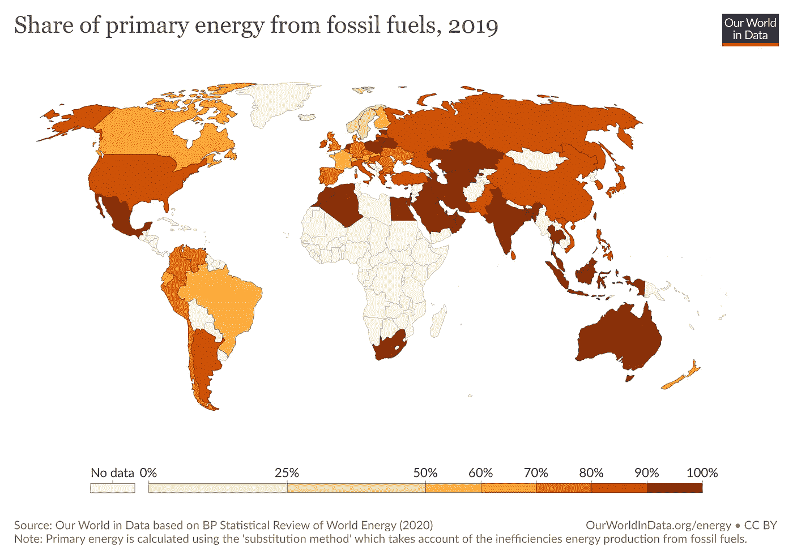
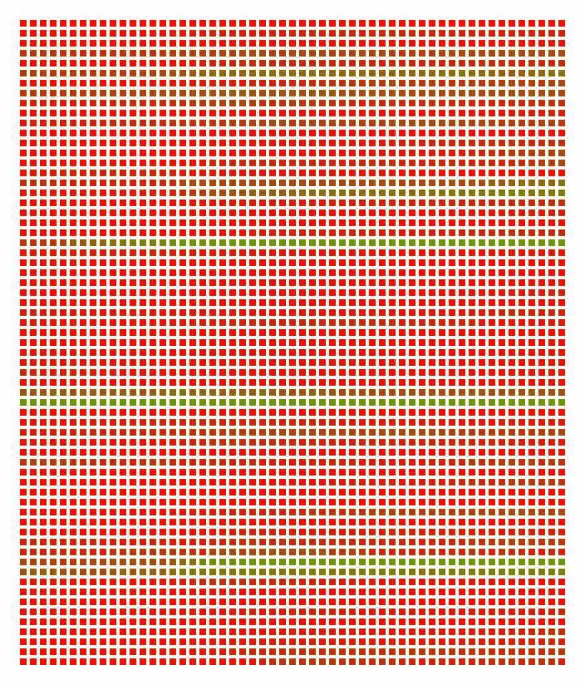

# 使用 Haskell 导入 csv 数据以及世界对化石燃料的依赖

> 原文：<https://blog.devgenius.io/importing-csv-data-with-haskell-and-the-worlds-dependency-on-fossil-fuels-7070e7796b4a?source=collection_archive---------9----------------------->

[2019 年化石燃料占一次能源的比重](https://ourworldindata.org/fossil-fuels)

如果你读了我在[的上一篇文章](https://medium.com/@fabiomolinar/my-first-77-hours-with-haskell-188222314040?source=friends_link&sk=9a364747ddd811db7a86cfbb35416ed3)，关于我对 Haskell 的爱恨情仇，你会发现在我使用这种语言的最初几个小时里，用 Haskell 编程就像坐过山车一样。

但是正如我在最后提到的，【Haskell 的某些东西一直让我想起它。随着我写得越来越多，我开始意识到两个相反的事实可能在很大程度上解释了为什么会这样。这些是:

1.  我不会撒谎，用 Haskell 编程对我来说还是很难。我喜欢挑战。
2.  一段时间后，我最终写出的代码是如此的干净、简洁和漂亮。

在我能够想象出我想要编码的解决方案之前，它需要一些时间在我的头脑中“点击”。但是当它出现时，代码流动得很快，最终的结果是，正如我所说的，干净、简洁和漂亮。这实际上是我上面提到的两个事实背后的东西，它不断将我带回 Haskell:

> 不同于命令式语言，函数式语言如 Haskell 让我花更多的时间思考，花更少的时间编码。

在 Python 或 JavaScript 中，我通常从输入代码开始，当它们出现在我脑海中时，按顺序输入一组指令。就像我在前述文章中描述的例子一样，要绘制一个充满正方形的图像，在函数式编程语言中，我会这样处理它:

1.  绘制背景画布。
2.  循环遍历行数和列数，并在每个点上画一个正方形。

> 这种方法几乎总是会导致重构，因为频繁地翻译思维步骤并不是编程时解决问题的最佳方法。

现在，在函数式编程语言中，我创建了一个函数，它知道在画布空间中给定一个点需要画什么。就是这样。每个像素只运行一次的过程。

现在，让我们进入代码。

同样，我想再次创建一个正方形阵列的图像。然而，现在我希望正方形颜色是外部数据的函数(在本例中，是一个 csv 文件)。我想利用我在[我的上一个故事](https://medium.com/@fabiomolinar/my-first-77-hours-with-haskell-188222314040?source=friends_link&sk=9a364747ddd811db7a86cfbb35416ed3)中创建和讨论的模块，所以这个新的模块范围应该只专注于绘制正确的正方形颜色，而不是构建正方形本身。

像上次一样，现在**我用我需要的数据类型的基本定义开始每个模块**。这使得我的函数的签名更清晰，整个代码更容易理解，同时也是很好的文档。

在第一次迭代中，我的新模块有一个负责读取数据的函数，一个负责从中构建数据结构，另一个负责根据数据定义颜色。第一次尝试中困扰我的一件事是:**事实上我的函数并不都是纯的**。第一个负责读取数据，使用 IO 函数。

> **那时我决定将与 IO 相关的函数移到我所有 IO 所在的** `**Main.hs**` **入口点文件中，保持我的新模块完全纯净**。

就导入 csv 数据而言，`cassava`包使这个过程变得轻而易举，代码运行速度很快，包文档也很好地满足了我的需求。出于我的目的，因为我已经定义了我需要的数据类型，我所要做的就是实现我的`Entry`数据类型的`FromNamedRecord`和`DefaultOrdered`类。

然后，我只需要在我的入口点模块上使用样板代码来运行 IO 操作来加载数据。

这就是基于数据绘制颜色的函数的样子(`fossilColor`包含逻辑的“核心”)。

我不知道你怎么看，但是`fossilColor`功能对我来说就是这么简单和优雅。这就是为什么我越来越了解哈斯克尔。

现在去广场！

正如本故事开头的特色图片所示，结果不言自明。我们的世界仍然严重依赖化石燃料。这是一张(几乎)相同的数据(我去掉了在整个时期没有数据的国家)的图片，以彩色方块的阵列显示。

红色代表高度依赖化石燃料的国家；否则为绿色。

如果你想知道哪些国家显示绿色结果，这些是(括号中是 2018 年的结果):

*   冰岛(22%)
*   挪威(31%)
*   瑞典(31%)

在使用 Haskell 几个小时后，我终于开始对这种语言及其一些核心概念感到舒服了。我对创建图像的速度也很满意。创建图像只花了不到一秒钟。与我第一次尝试创建正方形图像相比，这要好得多！

另一件让我震惊的事情是，我现在能够以多快的速度理解和修复基于编译器错误消息的代码。举个例子(也是迄今为止让我感到非常兴奋的一个例子)，与一元和应用 IO 操作相关的错误消息几乎立刻就让我明白了*。现在我更清楚了，运算符涉及和返回的数据类型是什么，如`<$>`、`<*>`、`>>`、`>>=`、`return`等。*

*我觉得我和哈斯克尔的旅程才刚刚开始。让我们看看接下来的步骤会带来什么。*

*[1]:汉娜·里奇和马克斯·罗瑟(2020)《能量》。OurWorldInData.org 在线出版。检索自:“https://ourworldindata . org/energy”[在线资源]*