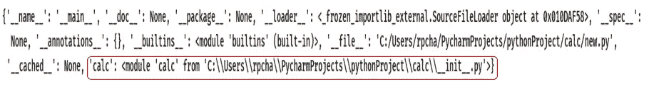

# 在 Python 中导入包

> 原文：<https://blog.devgenius.io/importing-packages-in-python-fb3f4a64ed14?source=collection_archive---------0----------------------->

## 探索用 Python 导入包的不同方法


照片由 [Marcin Jozwiak](https://unsplash.com/@marcinjozwiak?utm_source=unsplash&utm_medium=referral&utm_content=creditCopyText) 在 [Unsplash](https://unsplash.com/s/photos/import-package?utm_source=unsplash&utm_medium=referral&utm_content=creditCopyText) 上拍摄

## 在 Python 中导入包

> 包是通过使用“带点的模块名”来构造 Python 的模块名称空间的一种方式。- [Python 文档](https://docs.python.org/3/tutorial/modules.html#packages)

[用 python 导入模块，参考我的故事。](https://medium.com/dev-genius/importing-modules-in-python-ef4a514870bf)

例如，模块名`A.B`指定了名为`A`的包中名为`B`的子模块

我已经创建了下面的包和子包。让我们看看如何导入这些包。


作者图片

我已经创建了一个包 `calc`

我已经创建了一个子包 `mathcalc`

我已经在`mathcalc`子包下创建了文件 addition.py，subtract.py。

所有的包和子包都有 `init.py`。它可以只是一个空文件。要让 Python 将包含该文件的目录视为包，需要使用`__init__.py`文件。


作者图片

## 用 python 导入包的不同方法。

1.  **使用导入语句**

`import calc.mathcalc.addition`

> ***导入 calc . math calc . add→导入*** `***calc.mathcalc.addition***` ***并有界*** `***locally***`

locals() →它将返回一个表示当前局部符号表的字典。

```
**import** calc.mathcalc.addition
print (locals())
```



在本地符号表中，只有 `calc`名称被更新。

`import calc.mathcalc.addition`→这将加载子模块 calc.mathcalc.addition。必须仅使用其全名进行引用。
“addition . py”里面的函数和变量是这样访问的。

`calc.mathcalc.addition.fnname
calc.mathcalc.addition.varname`


作者图片

**addition.py**

```
var=1
**def** fn(x,y):
    **return** x+y
```

**例如:**

```
**import** calc.mathcalc.addition
print (calc.mathcalc.addition.fn(3,4))
*#Output:7* print(calc.mathcalc.addition.var)
*#Output:1*
```

**2。使用本地名称**

`import calc.mathcalc.addition as mc`

> ***导入 calc . math calc . add→导入*** `***calc.mathcalc.addition***` ***并有界为*** `***mc***`

这将加载子模块`***calc.mathcalc.addition***`。只能用它的本地名`mc`来引用它。

```
**import** calc.mathcalc.addition **as** mc
print (locals())
```


在本地符号表中，只有 `mc`被更新。

`“addition.py”`里面的函数和变量是这样访问的。

`mc.fnname
mc.varname`


作者图片

示例:

```
**import** calc.mathcalc.addition **as** mc
print (mc.fn(3,4))
*#Output:7* print (mc.var)
*#Output:1*
```

**3。使用 from 子句**

`from calc.mathcalc import addition`

> ***从 calc.mathcalc 导入加法→导入*** `***calc.mathcalc.addition***` ***并有界为*** `***addition***`

这也加载了子模块`addition`并使它在没有其包前缀的情况下可用，因此它可以如下使用。

`“addition.py”`内部的函数和变量是这样访问的。

`addition.fnname`
`addition.varname`

```
**from** calc.mathcalc **import** addition
print (locals())
```


在局部符号表中，只更新了`addition` 。


作者图片

**例子:**

```
**from** calc.mathcalc **import** addition
print (addition.fn(3,4))
*#Output:7* print (addition.var)
*#Output: 1*
```

**4。直接导入所需的函数或变量**

`from calc.mathcalc.addition import fn`

它加载子模块`addition`，但这使得它的功能`fn()`直接可用。

> ***从 calc.mathcalc.addition 导入一个→导入*** `***calc.mathcalc.addition***` ***和******为界为*** `***fn***`

我们可以直接进入`fn()`功能。但是加法模块中的其他函数或变量是不能访问的。


图片来源:作者

**举例:**

```
**from** calc.mathcalc.addition **import** fn
print (locals())
```


在局部符号表中，只有 `fn`被更新。

```
**from** calc.mathcalc.addition **import** fn
print (fn(3,4))
*#Output:7* print (var)
*#Output: NameError: name 'var' is not defined*
```

通过在 import 语句中提到函数和变量来直接访问它们。

`from calc.mathcalc.addition import fn,var`

它加载子模块`addition`，但是这使得它的函数`fn()`和变量`var` 直接可用。

> ***from calc . math calc . addition 导入 a→导入*** `***calc.mathcalc.addition***` ***与*** `***calc.mathcalc.addition.fn***` ***为界为*** `***fn***` ***，*** `***calc.mathcalc.addition.var***` ***为界为*** `***var***`

我们可以直接访问函数`fn()`和变量`var`。


图片来源:作者

```
**from** calc.mathcalc.addition **import** fn,var
print (fn(3,4))
*#Output:7* print (var)
*#Output:1*
```

## 需要记住的要点:

`from package import item`

该项可以是包的子模块(或子包),也可以是包中定义的其他名称，如函数、类或变量。
`import`语句首先测试该项是否在包中定义，如果没有，它假定它是一个模块并试图加载它。如果未能找到，则引发一个`ImportError`异常。

`import item.subitem.subsubitem`

除了最后一项，每一项都必须是一个包裹。
最后一项可以是模块或包，但不能是前一项中定义的类、函数或变量。

## 资源(Python 文档):

[套餐](https://docs.python.org/3/tutorial/modules.html#packages)

[路径](https://docs.python.org/3/reference/import.html#__path__)

[进口](https://docs.python.org/3/reference/simple_stmts.html#import)

## 进一步阅读

[](https://medium.com/dev-genius/importing-modules-in-python-ef4a514870bf) [## 在 Python 中导入模块

### 让我们了解一下在 python 中导入模块的不同方法。

medium.com](https://medium.com/dev-genius/importing-modules-in-python-ef4a514870bf) 

请关注此空间，了解更多关于 Python 和数据科学的文章。如果你喜欢看我的更多教程，就关注我的 [***中***](https://medium.com/@IndhumathyChelliah)[***LinkedIn***](https://www.linkedin.com/in/indhumathy-chelliah/)*[***Twitter***](https://twitter.com/IndhuChelliah)***。****

*感谢阅读！*