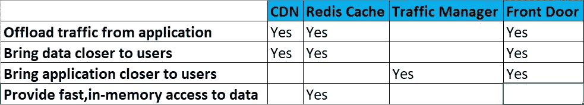

# 提高 Azure 中的应用程序性能

> 原文：<https://blog.devgenius.io/improve-application-performance-in-azure-d31ecc41aa78?source=collection_archive---------8----------------------->

提高应用程序的性能一直是我最喜欢的话题。我总是试图在 Azure 中为特定场景选择服务时做到公平，因为有太多的选项可用，有时很难做出决定。在这个主题中，我将解释 Azure 服务，我们可以用它来加速我们的应用程序。幸运的是，Azure 中没有很多加速应用程序的服务。所以选择起来比其他场景简单一点。

由 [Unsplash](https://unsplash.com/s/photos/speed?utm_source=unsplash&utm_medium=referral&utm_content=creditCopyText) 上的 [chuttersnap](https://unsplash.com/@chuttersnap?utm_source=unsplash&utm_medium=referral&utm_content=creditCopyText) 拍摄

所以首先我会解释 Azure 中有哪些加速应用程序的选项。

**Azure CDN :** 使用 Azure 内容交付网络，我们可以让我们的静态文件更接近用户。

用于 Redis 的 Azure Cache】:这是一个内存中的缓存，如果应用程序必须快速从其中提取数据，它可以用来存储数据。

Azure Traffic Manager :它曾经通过具有最佳性能的应用程序来路由来自用户的流量。

**前门**:有助于放在应用程序前面。它类似于 Azure 流量管理器，但在不同的层面上。Azure front door 使用 HTTP 堆栈，而 Traffic Manager 也使用 DNS 和其他协议。

因此，我们将如何选择在特定场景中使用哪种服务。

# 用户是全球分布的吗？

如果答案是否定的，那么我们就完成了这个问题，我们不会根据这个问题选择任何服务。但是如果答案是肯定的，那么我们必须问自己另一个问题。

> ***用户和应用之间的流量是基于 HTTP 的吗？***

例如，用户通过基于 HTTP 的 web 浏览器使用我们的应用程序作为网站，或者使用 UDP 或其他东西作为传输协议的完全不同的应用程序。如果它是基于 HTTP 的，我们应该使用 ***Azure 前门*** 来加速，因为这项服务基于 HTTP 工作，并且位于云的边缘，离用户很近。它利用技术来加速所有的 HTTP 和 HTTPS 请求。如果使用 UDP 或其他协议，我们可以使用 ***Azure 流量管理器*** 。网站非常适合 Azure front door，Signal R 之类的东西非常适合 Azure traffic manager。它有一些额外的功能，如网络应用防火墙和一点内置的 CDN。如果使用这些服务，我们可能还想用 ***Azure CDN*** 和 Azure cache for Redis 来扩充它们，以便让用户接近这些数据和静态文件。如果应用程序是全球分布的，我们基本上想让一切尽可能靠近用户，以便延迟尽可能低。

# 应用程序是否有经常使用且不经常更改的数据？

那是什么类型的数据？例如，如果任何采购/销售订单编号和金额或任何交易数据应该非常频繁地更新，而任何国家/地区的数据则不会。我们可以将它放在 Redis 缓存中，而不是数据库中，并加快这些数据的检索速度，因为 Azure Cache for Redis 在内存中提供数据以获得最佳速度。它像键-值对一样存储，并且通过使用键和值作为国家数据来检索数据。

如果必须从数据库中检索数据，而数据库位于某个磁盘中，我们需要使用查询和系统来检索，这需要时间。

Azure cache for Redis 还提供了一些高级功能。
**地理复制** **:** 它可以在世界各地的 Redis 上创建 Azure Cache 的实例，靠近用户，并复制所有实例中的数据。
**数据持久化:**允许持久化，因此将 Azure 缓存中的数据保存到 Redis。

# 应用程序使用音频、视频还是图像？

在这种情况下，想象一下这个场景，有一个网站，有视频和图像等内容，我们将它们存储在网站中。当我们在某个地方部署网站，用户从很近或很远的地方使用它时，我们知道当延迟增加时可能会出现问题。不在的用户可能会抱怨应用程序太慢。

***延迟*** 是该数据所需的时间。网站上的数据通过电线到达世界某个地方的用户，但速度非常快，但数据仍然必须通过各种路由器和交换机在互联网上传输，甚至可能通过卫星上下传输，然后到达那里，速度仍然非常快。正如我们所见，延迟是可以用毫秒来衡量的，但延迟是累积的，因为网站不只是一个请求。可能有 10 个或更多的请求。最终，我们可能会看到 2 秒或更长的时间。我们希望最小化延迟，我们可以通过使用 Azure CDN 来实现这一点。当我们使用它时，我们仍然有那个网站和内容，但我们将内容放在 CDN 的存在点，这些存在点基本上是世界各地的数据中心，存在点比 Azure 在世界各地的数据中心多得多。然后，我们确保数据始终靠近用户，因为总会有一个比网站部署位置相对更近的存在点，我们将延迟降至最低并优化性能。

使用 CDN 的另一个好处是，它卸载了处理。当我们从 CDN 中检索这些图像和视频时，它节省了网站宝贵的 CPU 周期，而不必提供这些图像和视频。

因此，这些问题和这个表格可以帮助我们了解 Azure 中的所有服务，这些服务可以帮助我们加快应用程序的速度。