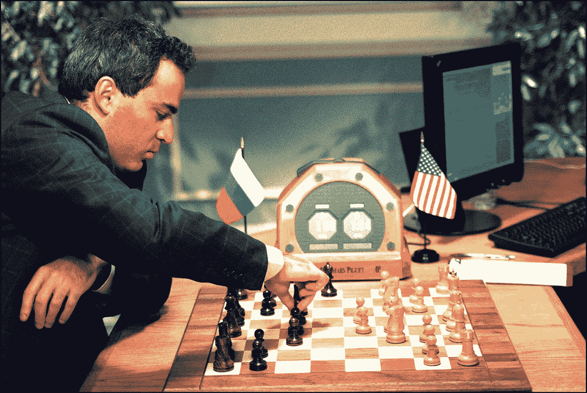
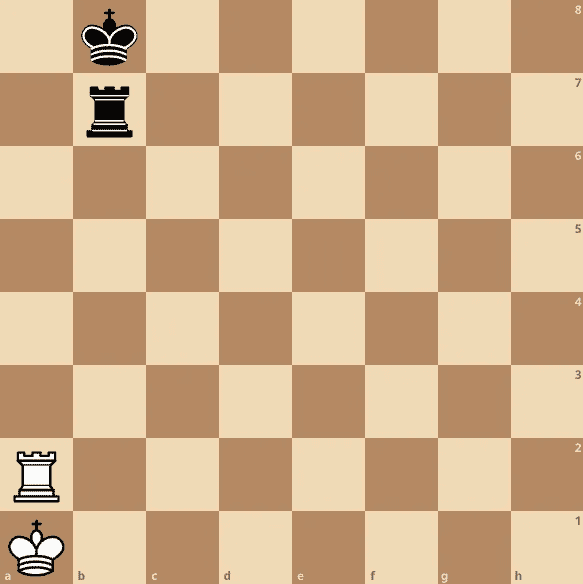
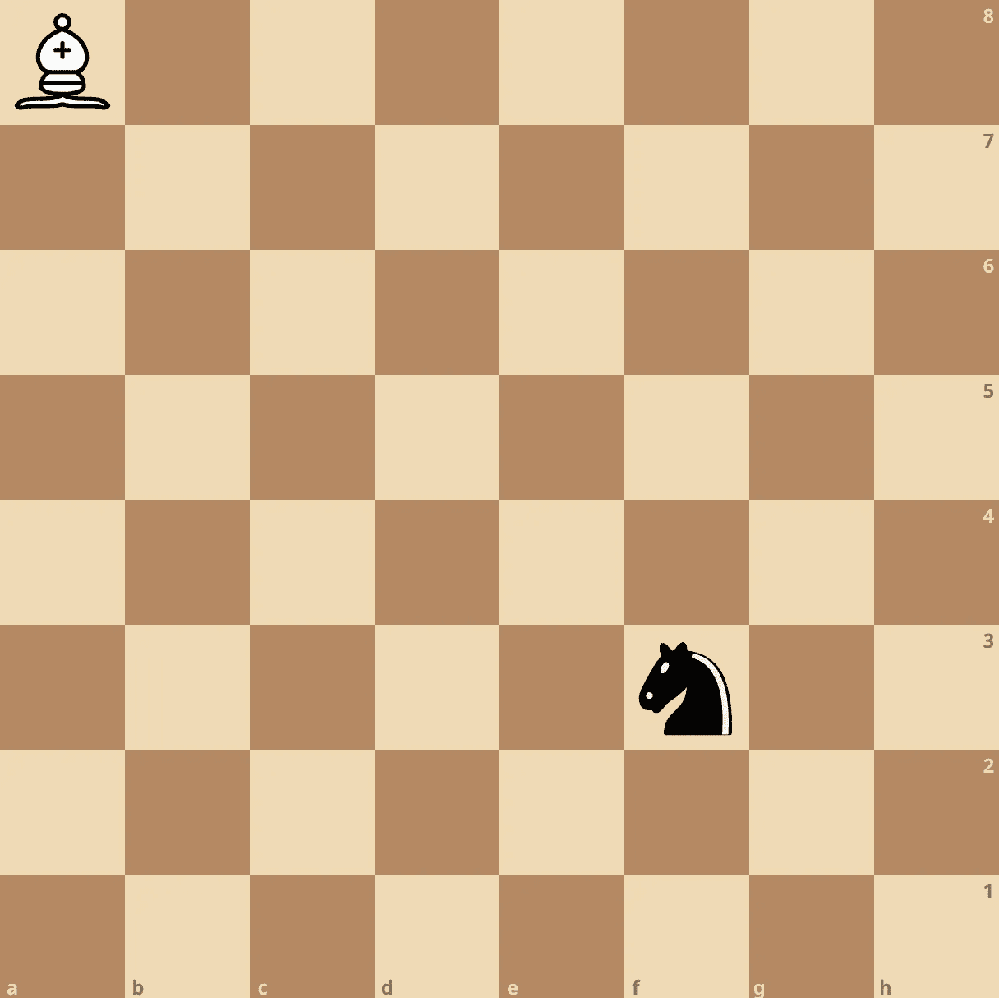

# 通过编写国际象棋引擎来升级为软件工程师

> 原文：<https://blog.devgenius.io/improve-as-a-software-engineer-by-writing-a-chess-engine-c360109371aa?source=collection_archive---------6----------------------->

## 第二部分:数据结构



如果您正在构建一个象棋引擎，内部棋盘表示是一个很好的起点。换句话说，程序将如何表示一个国际象棋的位置？要正确解决这个问题，需要在使用键盘之前思考整个解决方案。

# 天真的方法

天真的方法是简单地看着棋盘，想出一个可以编码信息的结构。例如，您可以使用长度为 64 的数组，将各个部分编码为单个字符。

毫不奇怪，这个解决方案遇到了一些限制。例如，当程序需要生成合法的移动时。为了说明这一点，想象一个位置，只有一个国王和一个车的每种颜色。



象棋位置

为了提供更接近内部板表示的可视化，位置可以表示为:

现在想象白车向右滑动的合法动作。给定位置，引擎必须检查每个索引的合法性。这在一开始很简单，因为一个人被添加了索引，并且检查了敌人或友军棋子的位置。当车向右滑动时，白方的前两个合法位置如下:

然而，最终车会到达棋盘的边缘。从索引中看不出这种情况，因为棋盘表示只是一个长度为 64 的数组。

!!??

为了避免这种情况，象棋引擎必须根据移动方向检查索引是否在 A 文件或 H 文件上。考虑如何以编程方式检查该条件:

这是一个依赖于整数比较的分支条件，这是一个缓慢的操作。不幸的是，这是每一个水平移动所必需的。对于一个每秒处理数百万个位置的象棋引擎来说，这是一个巨大的效率消耗。如果你不熟悉整数比较和分支的性能含义，这篇关于 [CPU 流水线架构](https://en.wikipedia.org/wiki/Instruction_pipelining#Branches)的文章提供了为什么分支会降低执行速度的背景。本质上，除了条件分支之外，CPU 无法做出精确的节省时间的假设，因此并行性大大降低。

请注意，国王，兵攻击，和每一个其他的棋子也必须包括这个横向移动的检查。骑士更糟糕，B 和 G 文件也必须检查，因为骑士可以水平跳过两个文件。

# 一种改进

幸运的是，有一个聪明的方法可以缓解这个问题，这个方法被称为 [0x88](https://en.wikipedia.org/wiki/0x88) (你会明白为什么)。通过将板表示为 128 长度的数组，有一种聪明的方法可以有效地识别板外索引。将 128 指数数组想象成两个并排的棋盘:

这不是显而易见的，但这种板表示通过允许使用按位运算而不是比较来简化板外检查。例如，考虑板外计算(我将解释为什么这样做):

这种单一的位运算比整数比较需要更少的 CPU 时钟周期。为了理解这种比较的工作原理，让我们再次看看我们的表示，但是这次每个索引都以二进制形式打印出来。我把板子一个接一个的放在一起，这样就能在观察窗内了。

现在，更容易看出，使用`0x88` ( `0b10001000`)作为掩码，总是会在真实棋盘上产生正值，如果棋子离开棋盘边缘，则会产生零值。

这里有几个按位`&`运算的例子来说明这一点。真实板上的三个随机索引:

三个来自右侧验证板:

如你所见，按位的`&`和十六进制的`0x88`可以快速显示一步棋是否离开了棋盘边缘。这对国际象棋程序来说是一个巨大的效率增益！

# 比特板

记住按位运算的效率，有一种比`0x88`更好的方法。

利用现代 CPU 中的 64 位寄存器(棋盘上有 64 个可能的位置)，一个位置可以用一组 64 位整数来表示。这种方法被称为 bitboards。在这种方法中，整数的每一位代表棋盘上的一个方格。

有了 bitboards，高效的位运算可以用来计算合法的移动。让我们举一个例子，在棋盘的角落找到一个主教的移动，在它的路径上有一个敌人的棋子:



因为两个相关的位板可能如下所示:

使用位板的一个常用方法是从每个索引开始在所有方向上有一个预先计算好的滑动查找表。查看我的 Golang 工具来计算这些哈希表[这里](https://github.com/tonyOreglia/glee/blob/master/pkg/hashtables/generate-hash-tables.go)。在这种情况下使用的是

有了这些信息，计算可用的象步就变成了一系列的位运算

这要复杂得多，但是请记住，对于一个象棋引擎来说，最重要的衡量标准是速度。有一个最低有效位扫描(可以用处理器指令最佳地完成)。结果是一个代表主教合法行动的位板。利用这种方法对所有四个对角线方向(在皇后的情况下，所有八个方向)的国际象棋程序可以比以前的两个棋盘表示更有效地计算移动。

象棋编程 Wiki 是一个很好的资源，可以学习更多关于棋盘和象棋编程的知识。

# 带着目的思考

这一课适用于任何软件工程项目。**在设计信息架构时，总是要详细考虑用例。**这条规则适用于实现内部数据结构、数据库表关系、网站布局和其他任何东西。在选择如何表示任何数据时，主要考虑的是如何使用该数据。**作为工程师，我们必须时刻牢记目标。**

我的象棋引擎被命名为 Glee，是 Golang 象棋引擎的缩写。

*   [象棋引擎源代码](https://github.com/tonyOreglia/glee)
*   [前端源代码](https://github.com/tonyOreglia/personal-website/tree/master/src/ChessGame)
*   [在这里对抗欢乐合唱团！](https://tonycodes.com/chess)

```
This article is part two of a series
- Find Part one [here](/level-up-as-a-software-engineer-by-writing-a-chess-engine-896b7f8eb443).
- Find Part three about Move Generation [here](/level-up-as-a-software-engineer-by-writing-a-chess-engine-f4532f509b56).
- Find Part four about Testing [here](/level-up-as-a-software-engineer-by-writing-a-chess-engine-1d0ffc7aebf9).
```

我希望这篇文章已经有趣和有见地！

如果你有兴趣和我一起深入国际象棋编程，[加入 Medium](https://tony-oreglia.medium.com/membership) ，[关注](https://tony-oreglia.medium.com/)，[订阅我的时事通讯](https://tony-oreglia.medium.com/subscribe)，或者在 [Twitter](https://twitter.com/tony_oreglia) 和 [LinkedIn](https://www.linkedin.com/in/tony-oreglia/) 上联系。