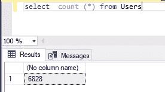

# 提高您的性能。NET 应用程序，只需一行简单的代码

> 原文：<https://blog.devgenius.io/improve-performance-in-your-net-app-via-one-simple-line-of-code-c0dfa12a9f9e?source=collection_archive---------0----------------------->

嗨，开发者们😀

今天，我们来谈谈如何在中提高性能。NET 应用程序通过`AsNoTracking`实体框架的方法。

来自数据库的请求可以被**跟踪**或**不被跟踪**。默认情况下，所有从 DB 返回模型对象的查询都是**可跟踪的**。

当数据上下文从数据库中检索数据时，实体框架将检索到的对象放在缓存中，并监视这些对象发生的变化，直到它使用`SaveChanges()`或`SaveChangesAsync()`方法，将任何变化提交给数据库。但是我们并不总是需要跟踪变化。例如，我们只需要显示数据以供查看。

为了防止数据被缓存，使用了`AsNoTracking()`方法。当`AsNoTracking()`被应用时，请求返回的数据不被缓存，也就是说，请求变成**未跟踪**。这意味着实体框架不执行任何额外的处理，也不分配额外的空间来存储从数据库中获取的对象。因此，这种查询更快。

现在开始认真练习:)

假设我们有以下模型和数据环境:

并且我已经在数据库中为`Users`表插入了 6828 行。

下一步—从不带`AsNoTracking`和带`AsNoTracking`的数据库中获取数据，并比较性能。为了比较，我使用了[基准](https://benchmarkdotnet.org/articles/overview.html)。

基准结果

哇！我们可以看到在执行速度和内存使用方面的优势。大多数情况下，在大量数据上，差异会很明显。

但是请记住，我们不能更新使用`AsNoTracking`接收的任何项目或集合，因为实体框架不会将这些对象存储在缓存中。

除了使用`AsNoTracking`方法，您还可以禁用对上下文对象的跟踪。

为此，设置`db.ChangeTracker.AutoDetectChangesEnabled`属性的`false`值:

一般来说，通过`ChangeTracker`属性，我们可以管理一个对象的跟踪，并接收各种信息。例如，我们可以找出当前正在跟踪多少个对象:

什么时候应该使用 AsNoTracking？如果你只是需要显示数据用于显示而不需要进一步更新，那么这就是我们可以使用 AsNoTracking 的情况。

快乐编码🤓

# 学到了新东西？

如果你喜欢这篇文章，可以 [**给我买杯咖啡**](https://www.buymeacoffee.com/stasoz) 我写下一篇文章的时候再喝:)

