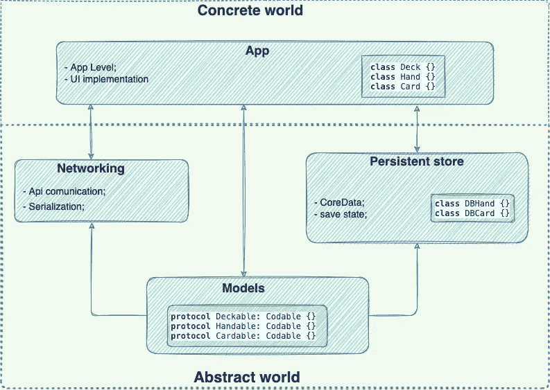
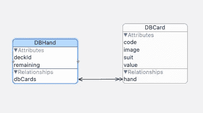

# 通过抽象您代码来改进您的架构

> 原文：<https://blog.devgenius.io/improve-your-architecture-by-abstract-your-code-ad97fe9baf71?source=collection_archive---------3----------------------->

**Info 注:**本文并不呈现所有代码，尤其是 UI 实现，其重点是业务逻辑和架构。别担心，你可以在这里访问所有的代码和资源[。](https://github.com/iOSifMol/AbstractCode)

在这篇文章中，我想向你展示一种在可重用性、封装甚至测试方面改进你的代码架构的方法。我的建议是抽象你的代码，使之基于协议。在应用程序级别，你的代码代表了你定义的实际对象(模型)的具体世界，你越深入应用程序子层，这个世界就变得越抽象，越面向协议。换句话说，你的模型是抽象的，如果你可以这么说的话，类似于:模块 X 期望“某物”像这样运行，并返回“某物”像这样运行。

你看到“某物”这个词，它指的是抽象的东西，但同时它在一些约束之间起作用。在编码过程中，协议很好地表现了有约束的东西。例如，`Equatable`协议允许相等比较，但是它约束符合它的类型，以覆盖`==`操作符。

现在，让我们更实际一点，举一个真实的例子，看看这种基于协议的方法如何抽象您的代码。出于示例目的，我使用了一个纸牌游戏，它将与网络以及持久性存储交互。为简单起见，这个游戏将只画一手牌，每按一个按钮，然后将它保存到数据库中。所以你可以在以后继续从同一副牌中抽牌。我将使用[deckofcardsapi.com](https://deckofcardsapi.com/)API 来获得创建一副牌、抽一手牌和重新洗牌的支持，至于持久存储，我将使用 CoreData。架构图可能如下所示:

该应用程序依赖于三个子模块，一个负责所有服务器-应用程序通信的网络层，一个管理应用程序状态的持久层，以及最后但同样重要的一个抽象层，它定义了一系列约束和描述应用程序模型的协议。接下来，我们将在每个模块中选择一个 be one 进行研究。

# 模型

模型层是一个 100%抽象的层，它定义了应用模型的外观和行为。在我们的例子中，纸牌游戏意味着三个协议。像一副牌一样的东西，像一手牌一样的东西，像一张牌一样的东西。这里我们有这些协议:

在上面的代码片段中，您可以观察到每个协议名称的后缀“able ”,以更好地表明它应该像一副牌、一只手等一样，而不是具体的东西。有了这三个定义，我们的应用模型就得到很好的描述。

# **联网**

就输出而言，网络层也是一个抽象层，同时也是一个通用层。它的作用是建立 api 和 app 之间的通信。api 规范:

基于 api 规范，我定义了一个 enum 来描述所有的路线，比如:

Enum associated values 表示构成端点 URL 路径的实际参数，这样构成路径变得非常简单。一旦我们有了合适的路由，让我们看看 api 通信实际上是如何实现的:

我们有一个通用方法来覆盖所有的 api 调用，作为输入，它接收要执行的路由和来自响应的预期输出类型。方法输出返回一个`Result`,如果成功，它将传递预期的对象，另一方面，如果失败，它将传递一个适当的错误。这个方法的实现非常简单，它基于给定的路由创建一个`URL`,然后向 api 发送一个数据任务并解析响应。响应解析作为休闲完成:

# 持续疮

为了持久化状态，我使用了 CoreData，它需要具体的模型来保存状态。为了保持这个模块的抽象接口，我们必须创建一个系统来将输入和输出对象转换成 CoreData 对象或从 CoreData 对象转换过来。这个系统允许我们有一个很好的封装，所以模块接口对核心数据层没有依赖性。通过一些小步骤，让我们看看模型是什么样子，包装系统是如何工作的。

从 DBHand / DBCard 转换到 cartable/hand able 的包装系统是在提供两种方法的扩展中完成的:

*   `cardable` / `handable`将核心数据对象转换成抽象对象；
*   `create`从给定抽象对象创建核心数据对象并将其插入到当前上下文中；

现在代码数据模型已经就绪，我们可以转到实际的数据库实现了:

DB 实现也很简单，我们有助手方法来创建持久存储和获取当前上下文。接下来我们有公共方法，一个从数据库中拉出一只手，另一个保存它。

# 应用

这是混凝土世界的顶层。在这里，我们的抽象模型获得了生命。我们只需要遵守我们创建的协议，一切都会好的。

就是这么简单，只是一个简单的定义，一切都是有联系的。利用我们刚刚创建的层也很简单:

# 结论

抽象代码有很多好处。我们明确区分了具体层和抽象层，这也是拥有单组模型(来自应用程序的模型)的优势，所有子模块都依赖于抽象协议。提供了良好的封装，例如 DB 模块，其中所有的 CoreData 实现都隐藏在接口之外。最后但并非最不重要的一点是，它为测试提供了良好的结构，您可以在单元测试中定义具体的模拟模型。

希望你喜欢这篇文章，并找到有用的信息。别忘了你在这里有所有可用的资源。