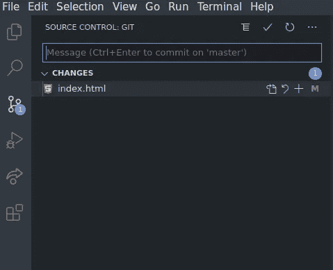

# 使用 VS 代码提高您的 Git 生产率

> 原文：<https://blog.devgenius.io/improve-your-git-productivity-with-vs-code-aeed0c646796?source=collection_archive---------22----------------------->

说到版本控制，与 git 交互的最常见方式是通过命令行——通常这是最方便和有效的方式。然而，如果你想提高你的生产率，VS Code 有很多内置的特性可以帮助你管理你的工作流程。

默认情况下，VS 代码集成了对 git 的支持，尽管如果您使用另一个源代码管理提供者，有许多扩展提供相同或相似的功能。要查找其他源代码管理提供者的扩展，您可以在扩展标签中搜索`@category:"scm providers"`。

通过在命令行中利用 VS Code 内置的源代码控制特性，您可以:

*   提高你的生产力。
*   简化您的工作流程。
*   创建更干净的提交。

# 源代码管理概述

“源代码管理”选项卡

首先，源代码控制选项卡是您与 VS 代码的 git 特性进行交互的地方。此选项卡将显示您在当前存储库中所做的任何更改的概述。这些被分为几类—(未分级的)变更和分级的变更。

其中一个非常有用的功能是，您可以并排查看对文件所做的更改，这样您就可以快速看到文件中修改、删除或添加了什么。

*VS Code changes/diff 视图——左窗格中的文件显示上次提交时的状态，而右窗格显示当前状态。*

VS 代码会突出显示被修改的行，这样你就可以很快看到一个文件是如何被修改的。红线表示一些文本已被删除，而绿线表示文本已被添加。在上面的例子中，你可以很快地看到标题被修改了，标题和段落被添加了。在最右边，VS 代码用红色和绿色的块给你一个整个文档的概览，这样你就可以快速地在更大的文件中找到修改。如果您正在查看未分级的变更，您可以直接从右边的编辑器中编辑该文件。

# 文件状态指示器

状态指示器

在浏览器面板中，VS 代码为你提供了一些当前文件夹中文件的 git 状态指示器。这些由文件右侧的大写字母表示。

*   m:文件已被修改。
*   u:文件没有被 git 跟踪。
*   答:文件已被添加用于跟踪，但未被修改。

# 檐槽指示器

檐槽指示器是非常有用的工具，原因如下:

*   它们允许您在处理文件时查看对文件所做的更改。
*   它们允许您有选择地将文件中的特定代码行或代码块添加到临时区域，这意味着您可以创建更清晰、更具体的提交。

有三种不同的檐槽指示器类型:

*   红色三角形表示一行已被删除。
*   蓝色条表示某行已被修改。
*   绿色条表示已经添加了一行。

檐槽指示器

点击一个装订线指示器会弹出一个包含更多信息和选项的新窗口。该窗口将向您显示对该特定代码块所做的更改。右上角的菜单将为您提供恢复这些更改的选项，或者通过单击右上角的加号，您可以暂存这些行。如果您只想提交文件中的特定代码块，例如，如果您仍在处理文件的另一部分，或者您想将对文件的多个更改拆分为单独的提交，这将非常有用。

逐行修改。

# 合并冲突

当您将代码合并到一个存储库中时，例如，当从远程存储库中下载更新的代码或者将一个分支合并到另一个分支时，您可能会遇到合并冲突。通常，当一行或多行代码在两个地方都被修改时，就会发生这种情况，例如本地和远程存储库，或者主分支和您试图合并到主分支的另一个分支。

在这种情况下，git 无法判断应该保留哪一行代码。在 VIM 等文本编辑器中，这可以用一系列分隔冲突行的字符来表示，例如:

vim 中的合并冲突。

在这种情况下，您需要手动删除包含`<<<<<<< HEAD`、`=======`和`>>>>>>> test-2`的行以及您想要删除的变更，例如`a paragraph.`

然而，VS 代码通过自动检测合并冲突，并通过单击一个按钮提供合并冲突的选项，使这个过程变得更加简单。首先，冲突被突出显示，当前的更改为绿色，即将到来的更改为蓝色。冲突上方的选项允许您保留其中一个更改或两个都保留。如果您需要配对程序来解决冲突，您也可以方便地启动实时共享会话。

VS 代码中的合并冲突。

# 结论

通过使用 VS Code 内置的源代码控制特性，您可以方便地管理您的工作流并提高您的生产率。为了充分利用 VS 源代码控制，您可以在 git 命令行界面中使用这些集成特性。