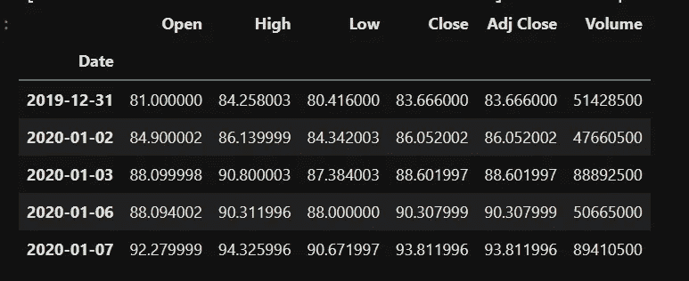
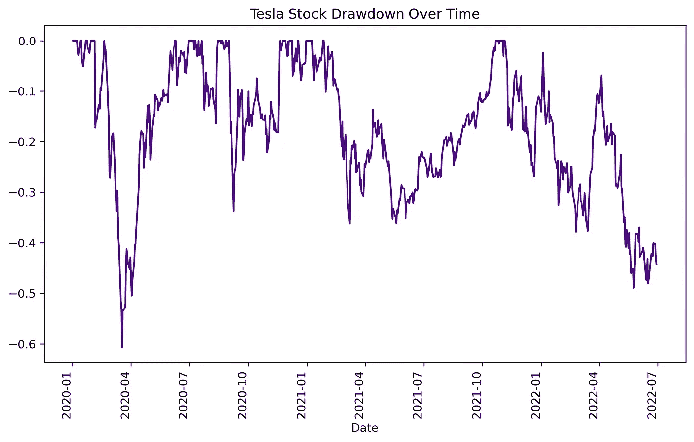

# 在 Python 代码中利用函数和管道的惊人力量

> 原文：<https://blog.devgenius.io/improve-your-python-code-using-the-amazing-combo-of-functions-and-pipe-59d480a59028?source=collection_archive---------6----------------------->

## 为你和他人简化你的代码。而且真的很有效！

照片由 [Unsplash](https://unsplash.com/@clemhlrdt?utm_source=unsplash&utm_medium=referral&utm_content=creditCopyText) 上的 [Clément Hélardot](https://unsplash.com/@clemhlrdt?utm_source=unsplash&utm_medium=referral&utm_content=creditCopyText) 拍摄

我必须承认，直到最近，我都没有充分利用 Python 函数，甚至没有尽可能经常地使用它们。

从那以后，我学会了如何结合函数和管道。一个巨大的差异制造者。

希望对你也有帮助。让我们开始吧！

## 内容:

1.  [用例](https://medium.com/p/59d480a59028/edithttps://medium.com/p/59d480a59028#1cae)
2.  [定义计算压降的函数](https://medium.com/p/59d480a59028#d5a5)
3.  [使用管道方法链接函数](https://medium.com/p/59d480a59028#5ea0)
4.  [结论](https://medium.com/p/59d480a59028#9c88)

## 1.用例

我们将计算特斯拉的股票随着时间的推移而减少。

让我们使用特斯拉在 yfinance 中的股票代码来检索它的股票数据

输出

## 2.定义计算压降的函数

原则是每个功能定义**一个任务。有多种功能总比一个很长很难理解的好。**

它有几个优点:

*   功能小。它有 1-2 行代码，所以更容易知道它做什么。
*   我们可以很容易地测试它。
*   我们可以给它一个很好的描述性的名字。
*   其他人会更容易读懂。

( [Khuyen Tran](https://medium.com/u/84a02493194a?source=post_page-----59d480a59028--------------------------------) 写了一篇关于干净代码的 Python 最佳实践的博文。我把链接放在了这篇文章的末尾)

让我们转到压降计算及其定义:

> 下降是衡量某个变量从历史峰值下降的指标(维基百科的定义)

下面是用函数编写的代码:

每个功能都列出了具体的任务和说明性的名称。让我们浏览一下:

*   **Create_copy:** 我们处理检索到的数据的副本
*   **daily_returns:** 这个函数计算特斯拉股票每天的盈亏。你可以在这里找到我之前关于此事的博文[。](https://medium.com/dev-genius/how-to-calculate-the-daily-returns-and-volatility-of-a-stock-with-python-d4e1de53e53b)
*   累积回报:我们用 cumprod()得到它们
*   我们用 cummax()来测量它们
*   **提款:**我们可以用累计收益和前一个峰值来计算提款。

## 3.使用管道方法链接这些函数

一旦我们定义了这些函数，有趣的部分就是用*管道将它们链接起来。*

Pipe()允许您对 DataFrame 对象应用一个或多个函数。我们会给他们每个人打电话，让他们把水位降下来。

让我们用添加 plot()来可视化结果。

我推荐你在这里阅读文档[。](https://pandas.pydata.org/docs/reference/api/pandas.DataFrame.pipe.html)

输出

真的就那么简单。调用你想要的任何函数都很方便，代码修改也很简单，这是我喜欢的。

## 4.结论

我更喜欢同时使用函数和管道来编写代码。您可以编写更简洁、更易于维护的代码。我鼓励你实践它，你会看到好处！

参考资料:

[Python 干净代码:让 Python 函数更具可读性的 6 个最佳实践|作者 Khuyen Tran |迈向数据科学](https://towardsdatascience.com/python-clean-code-6-best-practices-to-make-your-python-functions-more-readable-7ea4c6171d60)

[提款定义(investopedia.com)](https://www.investopedia.com/terms/d/drawdown.asp)

[熊猫。data frame . pipe-pandas 1 . 4 . 3 文档(pydata.org)](https://pandas.pydata.org/docs/reference/api/pandas.DataFrame.pipe.html)