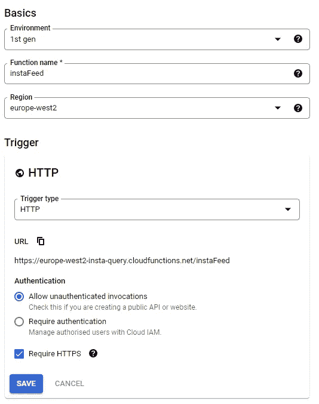

# 使用云功能改进 React 中的 Instagram 帖子

> 原文：<https://blog.devgenius.io/improving-instagram-posts-in-react-cea3eec4dbaa?source=collection_archive---------14----------------------->


我最近探索了一种在 React 中以 3x3 网格显示最新 Instagram 帖子的方法。在本文中，我的目标是用这种方法解决一些问题。在前一篇文章的基础上，我的**目标**是:

*   添加对`VIDEO`和`CAROUSEL_ALBUM`帖子类型的支持
*   通过隐藏`access_token`和`user_id`变量来提高安全性

## 增加对`VIDEO`和`CAROUSEL_ALBUM`帖子类型的支持

首先，`InstaItem`接口需要更新。如[文档](https://developers.facebook.com/docs/instagram-basic-display-api/reference/media#reading)中所述，如果媒体项是`VIDEO`，则它可能有一个`thumbnail_url`字段。我向接口添加了`mediaType`和一个可选的`thumbnailUrl`，并定义了`MediaType`类型:


更新的界面

为了将 3x3 显示网格逻辑从实际的 post 逻辑中分离出来，我决定创建一个单独的`MediaItem`组件来接受一个`InstaItem`对象并显示它(不管它是`IMAGE`、`VIDEO`还是`CAROUSEL_ALBUM`类型)。这样，如果将来有任何更改(比如添加新的媒体类型)，更改将很容易进行，3x3 网格逻辑根本不需要更改。


MediaItem 组件

在这里，我还添加了一些图标，这些图标会出现在右上角，以表示帖子是`VIDEO`还是`CAROUSEL_ALBUM`，为此我使用了 [MUI 图标](https://mui.com/material-ui/material-icons/)。将所有内容放在一个`a`标签中允许用户点击文章，他们将被带到一个新的标签中。我把`iconStyle` `height`和`width`做成百分比，为了让它有求必应。

现在要做的就是更新`InstaGrid`组件以使用`MediaItem`组件:


更新的 InstaGrid 组件

在这里，我选择为网格本身使用[情感风格的](https://emotion.sh/docs/styled)组件。这是网格现在的样子:


增加了对视频和 CAROUSEL_ALBUM 媒体类型的支持

## 隐藏`access_token`和`user_id`变量

我看到了 Ania Kubow 的关于在 React 中安全隐藏 API 密钥的教程。她的方法非常巧妙，她构建了一个小型服务器应用程序来存储 API 键，并代表 React 应用程序使用这些键来查询给定的 API。

我的好朋友维克多建议实现一个谷歌云功能来做到这一点。使用云功能可以省去我维护独立服务器的麻烦，所以我选择了这个选项。

云函数获取我所有帖子的`media_id`列表，然后使用这些`id`值查询`media`端点。

为此，我创建了第一代云函数，将其区域设置为离我当前位置最近的区域，并为其命名。**我允许未经授权的调用**，这样我就可以从 React 应用程序中查询函数。



在`package.json`里面，我添加了`axios`依赖:

```
{
  "name": "sample-http",
  "version": "0.0.1",
  "dependencies": {
    "axios": "^1.1.3"
  }
}
```

在`index.js`里面，我写了以下代码:

```
const axios = require('axios');const accessToken = "IGQ..."; // paste your access_token
const userId = "562..."; // paste your user_idconst instaUrl = `https://graph.instagram.com/${userId}/media?access_token=${accessToken}`;exports.getInstaFeed = async (req, res) => {
  res.set('Access-Control-Allow-Origin', "*")
  res.set('Access-Control-Allow-Methods', 'GET'); try {
    const response = (await axios.get(instaUrl)).data;
    const data = response.data; const medias = [];
    for (let i = 0; i < data.length && i < 9; i++) {
      const item = data[i];
      const id = item.id;

      const mediaUrl = `https://graph.instagram.com/${id}?access_token=${accessToken}&fields=media_url,permalink,thumbnail_url,media_type`; const mediaResponse = (await axios.get(mediaUrl)).data;
      medias.push(mediaResponse);
    } res.status(200).send(medias);
  } catch (error) {
    console.log(error);
    res.status(500).send({ error: error.message });
  }
};
```

获得`access_token`和`user_id`所需的步骤在之前的文章中[有描述。](/how-add-your-instagram-posts-to-your-react-project-e8527d2a7187)

此处`mediaUrl`字段参数为`media_url`、`permalink`、`thumbnail_url`和`media_type`，以匹配`InstaItem`界面。

部署该功能后，在谷歌云平台的`Trigger`标签下，可以找到该功能的链接。现在剩下的就是更新`InstaFeed`容器组件:


更新的 InstaFeed 容器组件

就是这样！

## 结论

现在，我们有了一个 3x3 的最新 Instagram 帖子网格，支持`VIDEO`和`CAROUSEL_ALBUM`媒体类型。它也更安全，因为它在一个云函数中隐藏了`access_token`和`user_id`。

现在这种方法还有一个问题，Instagram 对访问他们的 API 有一个速率限制，这个速率相当低(每小时 200 个请求)。这个问题的一个潜在解决方案是缓存结果，只在用户上传新帖子时重新获取，或者只是偶尔轮询一次。