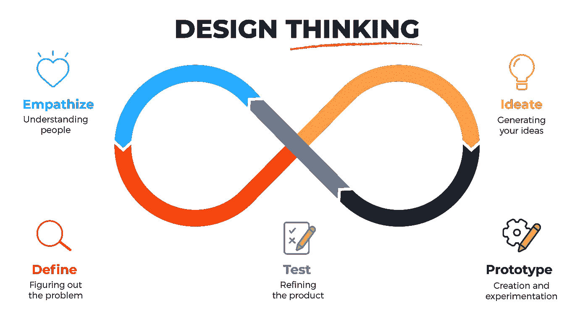
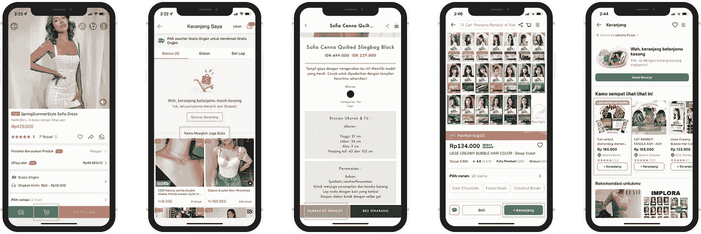
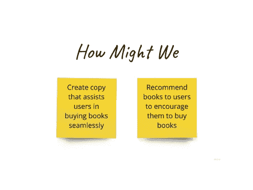
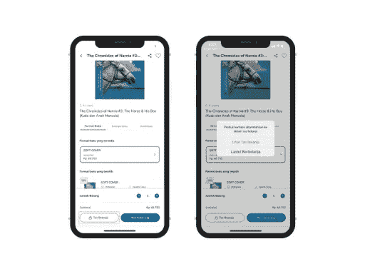
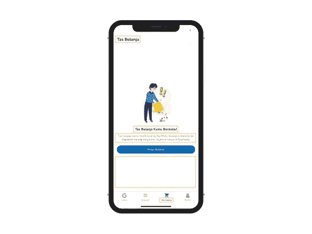
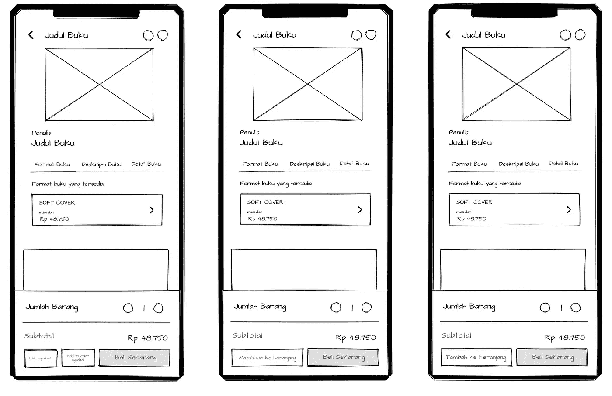
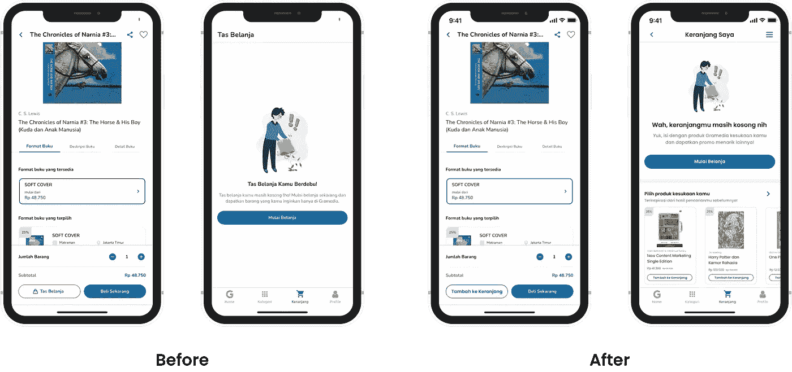
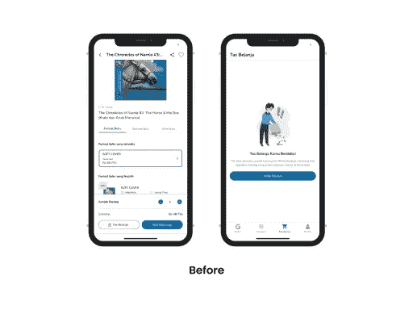
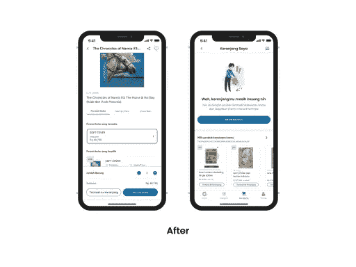
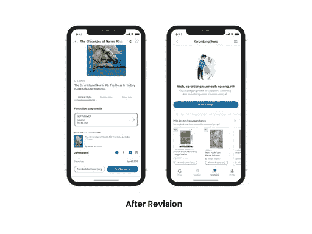

# 改进 Gramedia 移动应用程序上的购物车页面

> 原文：<https://blog.devgenius.io/improving-the-cart-page-on-the-gramedia-mobile-app-32776d10d4d7?source=collection_archive---------24----------------------->

> 有些人认为设计意味着它看起来怎么样。但是，当然，如果你深入了解，它确实是这样工作的。”— 史蒂夫·乔布斯

# 🔍项目背景

Gramedia Digital 是一款来自 Gramedia 书店的手机应用。它提供超过 100，000 种不同类别的数字杂志、书籍和报纸，如商业、娱乐、设计、小说、儿童等。此外，读者可以获得来自印度尼西亚、菲律宾、马来西亚、新加坡、日本、印度、巴西和英国的最受欢迎的杂志、畅销书和报纸的数字版本。

# Disclaimer❗️

这个项目是我作为 UX 作家的作品集的一部分。无论如何，我目前没有和 Kompas Gramedia 签订职业合同。

# 🎨设计目标

✅创造了符合 UX 书写指标的副本

✅在购买之旅中改进用户体验副本

✅鼓励用户将产品添加到购物车

✅在购物车页面上添加产品推荐功能

# 💡工作过程

通过这个案例研究，我将设计思维框架用于我的工作流程。

Karl S. 2020,《设计思维过程——它是如何工作的？由 Make 于 2022 年 8 月 11 日访问，<[https://www . maqe . com/insight/the-design-thinking-process-how-it-work/](https://www.maqe.com/insight/the-design-thinking-process-how-does-it-work/)>。

# 第一阶段——移情

**观察**

从我的个人经历来看，我想买一本书，但由于新冠肺炎病例的增加，我不敢出门，所以我决定通过应用程序购买。但是，我觉得我还是可以推迟购买他想要的书，因为我想看其他的书，所以我打算把它们放在我的购物车里。但是没有按钮指引我往购物车里放书，所以我很困惑购物袋按钮是什么意思。因为购物车页面上没有产品推荐，我不知道去哪里买类似的书，所以没有被说服买这本书，但它也有和我以前买过的书一样的好处。

**问题**

我可以断定用户遇到了以下问题:

✅用户感到困惑，因为没有向购物车添加产品的说明

✅用户觉得没有动力开始购物，因为购物车页面上没有产品推荐

# 第 2 阶段—定义

我决定用 Traveloka、Shopee 和 Berrybenka 等其他几个应用程序进行基准测试。

在其他应用程序中，他们使用动词，以便用户知道点击按钮是否意味着他们正在采取行动，而不是名词“购物袋”

**Shopee** 有一个带有**添加购物车符号**的按钮，该按钮指导用户并给出将所需商品先保存到购物车中的选项。空的 Shopee 购物车页面还提供产品推荐，以便用户有兴趣根据愿望列表或以前的搜索结果来探索其他产品。

和 Shopee 一样， **Tokopedia** 也提供了一个**+购物车按钮**来引导用户在购物前将他们的产品保存在购物车页面上。产品推荐中还包含+cart 按钮，以便用户可以直接将产品输入到购物车页面。

与其他的不同， **Berrybenka** 有一个“**添加到愿望列表**”按钮。按钮中的副本也足够清晰，可以引导用户将产品放在购物车页面上。

在基准测试之后，我们可以这样阐述这个问题:

📌在 Gramedia 应用程序的产品页面上,“购物袋”按钮只会混淆用户，让用户不知道该按钮是用来将产品添加到购物车页面还是将用户引导到不同的屏幕。

📌购物车页面上的屏幕也很空，用户只能从“开始购物”按钮进入产品页面。对于有点懒得再去寻找想要的产品的用户来说，就是来来回回。

📌页面菜单(Keranjang)和页面标题(Tas Belanja)之间存在不一致，这会使用户感到困惑。

# 我们怎么可能

我们从上述问题中得到的 HMW 包括:

# 第三阶段——构思

根据发现的问题和 HMWs，我有一个改进向购物车页面添加产品的流程的想法:

# 📌订单页面

在第一个屏幕上，我们可以将“Tas Belanja”按钮的文案更改为可以向用户提供方向或指示以将其添加到购物车的文案。

有了好的文案和对用户的直接指引，我们就不需要再打开一个包含弹出窗口的屏幕，解释进入购物车页面的选项。

这可以缩短用户流程，并且可以缩短向购物车页面添加商品的过程。

# 📌购物车页面

1.  “Tas Belanja”页面的标题与“Cart”导航栏上的菜单不一致，即使它指向同一个页面，也会使用户感到困惑。如果在页面标题和导航栏上的菜单之间划等号就更好了。
2.  标题为“Tas Belanja Kamu Berdebu”的句子并不表示该页是否需要填写。
3.  句子的主体是适当的，但是如果你将通过填写购物车页面获得一个宣传片来吸引用户对商店的注意，它可以通过提供信息来再次开发。
4.  没有书籍或产品推荐，使得用户不被鼓励增加购买。

**按钮缩微品的构思包括:**

# 📌订单页面

**第一步**

我的想法是通过显示一个心形符号和一个购物车形状来改变按钮，这样屏幕上总共有 3 个按钮。不过并不实用，再加上 wishlist 按钮已经在屏幕右上角了。

**第二步**

第二，我把文案改成了‘Masukkan ke Keranjang’，因为比之前的文案更直白。但是文案不简洁，还是太长。

**第三步**

最后，我把它改成了' Tambah ke Keranjang ' > >，因为这个副本包含了可以把用户导向购物车页面的动词，而且“Tambah”这个词也比“masukkan”短。

> 输入+符号或添加“添加”一词可以让用户理解清楚，并指导他们将想要的产品添加到指定页面。此外，菜单和页面标题是一致和清晰的，使用户不会混淆。

# 📌购物车页面

我还重新设计了购物车页面，添加了产品推荐，让屏幕看起来不那么空洞，鼓励用户购买更多商品。

✅将页面标题从 Tas Belanja 改为 Keranjang Saya。

基本原理:将页面标题与菜单导航相匹配

✅标题:Wah，keranjangmu masih kosong nih

基本原理:如果用户没有购买，就通知他们

✅正文:哎呀，isi 推出了一款全新的音乐媒体产品，并推出了一款全新的推广产品！

基本原理:鼓励用户购买

✅标题:Pilih produk kesukaan kamu

基本原理:告知用户是否有几本书可以根据他们的口味购买。

✅正文:我的灵感来自于一篇文章！

基本原理:说服用户选择这本书的推荐是出于用户的兴趣，因为它取自他们上次搜索的结果。

# 第 4 阶段—原型

基于之前构思的结果，我制作了一个高保真设计的原型，如下所示:

# 第 5 阶段—测试

在调整和改进了整体设计、布局和按钮副本之后，我与三位受访者进行了全面的测试，以验证我的设计结果。我这样做是为了验证我的想法，并从他人那里获得反馈。

## “看到这个屏幕你会怎么想？”

**用户 1**

我被“Tas Belanja”和“Keranjang”这两个术语搞糊涂了。那么，哪个术语是正确的呢？此外，商品的数量也令人困惑，因为它们与产品是分开的(你可以在 Tokopedia 找到一个很好的例子)。

**用户 2**

这很简单，但是有些句子或单词应该变得更有吸引力。此外，“Tas Belanja”按钮和购物车页面感觉不一致。

**用户 3**

看起来很无聊。

## “屏幕重新设计后你怎么看？有什么我可以改进的地方吗？”

**用户 1**

总体是好的；只是你可以通过添加一个逗号来更改标题副本，就像这样“Wah，keranjangmu masih kosong，nih。”除此之外，还可以提高设计的物品数量。

**用户 2**

我对购物车页面上的描述有反馈。也许可以改成“Yuk，这是一款全新的产品，是一款全新的促销产品！”让销售更柔和但更有说服力。

**用户 3**

我更喜欢把“Tambah ke Keranjang”按钮改为“Tas Belanja”。还有一些我认为对同一产品也有帮助的建议，尤其是对那些想结账的人。

## “你觉得推荐页的文案怎么样？它鼓励你买书吗？为什么/为什么不呢？”

**用户 1**

它足够吸引人，让我想买书，因为这本书用我最喜欢的东西和宣传片逗我。

**用户 2**

在我看来，是的，很有说服力。因为我觉得推荐菜单是快速营销的招数之一。通过跟随关键词或请求，这个应用程序可以间接地传达任何类似的产品信息。

**用户 3**

我认为这足以鼓励我作为一个用户，尤其是如果推荐是基于我以前买过的东西

# 📝循环

在得到朋友的一些反馈后，我试着这样修改，结果如下:

✅国立卫生研究院！

我修改了标题，最终选择了这个文案，因为我是根据 PUEBI 规则修复的。在感叹号之前和/或之后使用逗号，如 o、ya、wah、aduh 或 hai，以及用作问候的词，如 bu、dik 或 nak。所以，我修改了文案，在感叹号前加了一个感叹号和一个逗号。

✅ **Yuk，这是一款全新的产品，可以推广到任何地方！**

在最后一篇文章中，我用了这样一句话“Yuk，isi 与 Gramedia 的产品一起使用，并推广 lainnya”。和朋友做了 A/B 测试后，品牌名应该不用了，因为是这个移动应用的产品。因此，我总结并丢弃了品牌名称，以便最终的文案更加简洁明了。

# 📖吸取的教训

*   在完成 UX 写作案例研究的过程中。我意识到，正确和有针对性的文案可以帮助用户使用应用程序，并影响业务方面，尤其是在销售层面。
*   用户需要清晰、坚定、易懂的文案，这应该是解决他们问题的关键。因此，在未来，我需要学习更多关于创建一个适合每个用户的副本，并探索这个过程，以便我可以在未来成为一名优秀的 UX 作家。
*   我还学会了如何做一个全面的 UX 写作测试，它帮助我进行修改，以便最终的副本更好。

# 👩‍🏫导师的反馈

在与我在 adplist.org 大学的导师马拉女士进行了一次指导会议，并请她审查我的作品集后，她建议在“Pilih produk kesukaan kamu”购物车页面上复制一份书名，这可以升级为“Rekomendasi buku buat kamu”

✅**rekomendas buku buat kamu**

在与 Mala 女士讨论后，发现该部分的正确副本是“Rekomendasi buku buat kamu”**为什么？**因为之前的副本感觉更主观，所以我们无法预测该产品是否确实是用户最喜欢的产品，即使它是根据用户之前的搜索结果自动生成的。有可能用户是一个学生，正在寻找与他的主题相关的书，而用户不一定喜欢它。因此，正确的文案使用带有推荐元素的术语，而不是选择用户最喜欢的产品。

# 💫影响

基于以上所有的研究过程、对测试的理解和验证。因此，我把这项研究的影响分为两个方面，如下:

对于用户:

*   用户发现简单明了的设计很有帮助。
*   用户理解“添加到购物车”按钮。
*   产品推荐帮助用户并鼓励他们购买更多的产品。

商业方面(Kompas Gramedia 公司):

*   公司意识到用户不理解“购物袋”按钮的含义，因为它与购物车页面不一致。
*   将来有机会更好地开发这一功能。
*   小但有影响力。虽然按钮文案和设计改动不多，但能影响用户购买产品的决定。

# 你知道吗？👏

你能为了一篇文章放弃 **50 次鼓掌**吗？

点击并按住鼓掌按钮几秒钟。

感谢您花时间阅读我的案例研究！😊