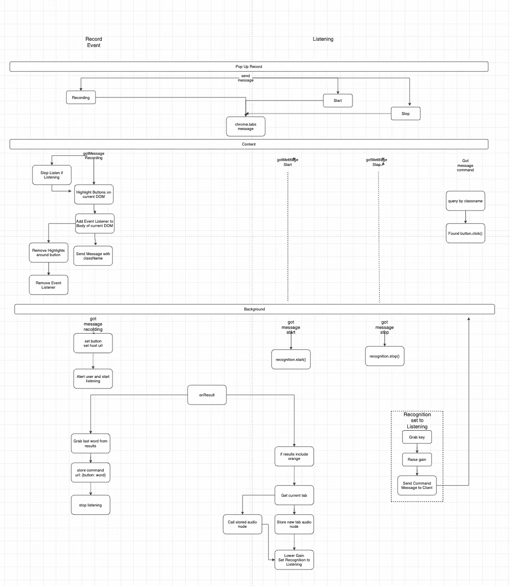
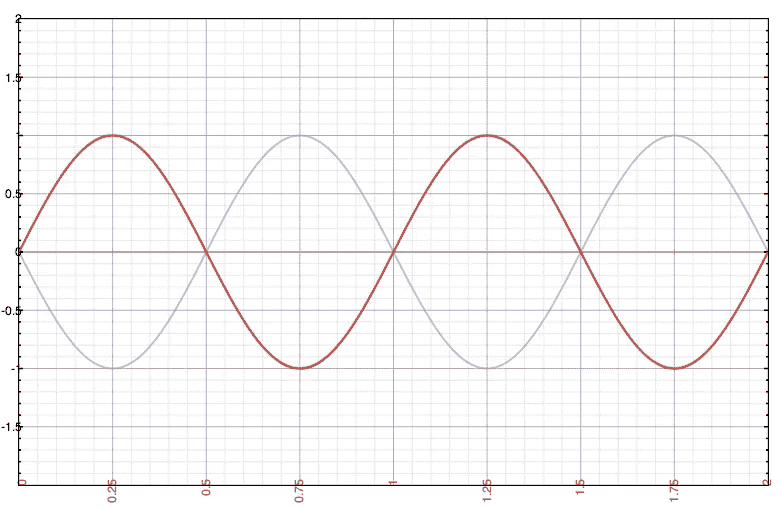
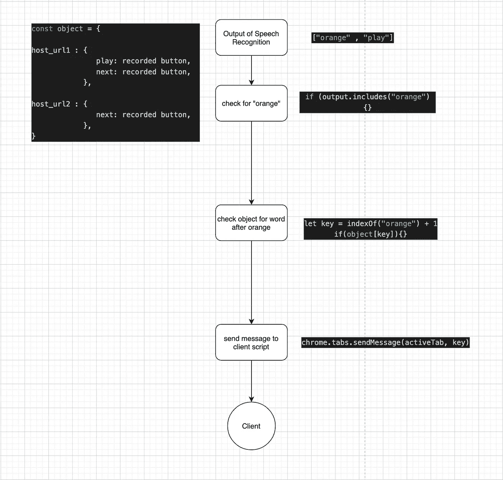
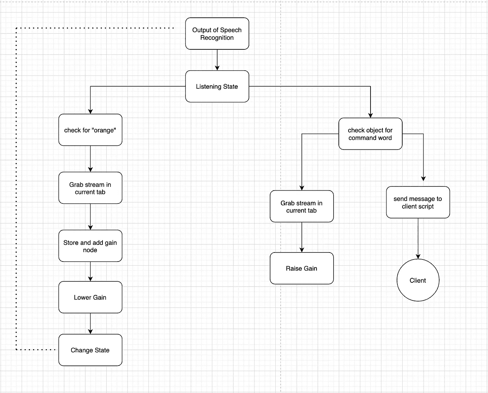
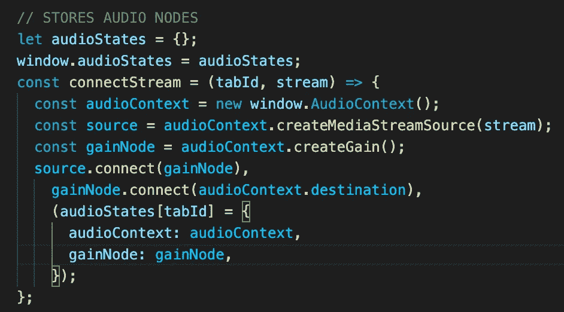

# 改进 chrome 扩展的声音识别实例

> 原文：<https://blog.devgenius.io/improving-the-vocal-recognition-instance-of-my-chrome-extension-73a36d470542?source=collection_archive---------19----------------------->

最近，我研究了如何改进 chrome 扩展 orange 的声音识别实例。基本上，它允许用户用他们的声音控制网页。我主要用它来控制网飞、Spotify 和 Youtube 等网站的播放。

下面是更新版本的快速演示:

我对旧版本的主要问题是，无论我在听什么来源的声音，都会淹没我的声音，导致识别混乱。

在这篇文章中，我将介绍一些我用来改进该扩展的语音识别实例的技术。我以前写过关于扩展的基本工作原理，可以在这里找到:

 [## 我如何制作一个 chrome 扩展，使用声音识别来控制网页上的 DOM 元素。

### 所以最近我发表了我的第一个 chrome 扩展“orange”。它允许用户用他们的声音控制任何网页…

medium.com](https://medium.com/dev-genius/how-i-made-a-chrome-extension-that-uses-vocal-recognition-to-control-dom-elements-on-a-webpage-a3a5cb19a584) 

[它也发布到 chrome 网上商店，可以在这里下载](https://chrome.google.com/webstore/detail/orange/ibamdegelmgihmnlomabhfkomnpdfjmc)

**极性反转**

我改进语音识别的第一个想法是从麦克风的音频流中过滤浏览器音频。

这类似于我在做音频工程师时使用的一种技术。基本上，如果你有一个重复的声音，并颠倒其中一个声音的极性，它们就会相互抵消。下图显示了两个反向的波。当红色波的振幅为+1 时，蓝色波的振幅为-1，因此相互抵消。

所以如果我从浏览器音频中抓取浏览器音频，并将其倒置；然后将其与麦克风输入流合并，它应该会过滤掉麦克风流中不想要的音频，只留下口头命令字，对吗？

不幸的是，这比我说的要复杂。为了让极性反转技术发挥作用，声音必须完全匹配。我描述的极性反转技术不起作用，因为它没有考虑从扬声器到麦克风的声学路径的传递函数。

然而，这个问题是可以解决的；使用声学回声消除，您可以计算声学路径的传递函数。然而，当我达到这一点时，我觉得我做得有点过了，于是决定看看其他的选择。

**音量控制**

后退一步，我决定我应该只记录识别的输出，并看看当我从我的计算机上播放最大音量时它是如何响应的。我发现这种识别至少会识别出命令中的两个单词中的一个(例如“橙色播放”)并且大多数时候它会是“橙色的”。

为了更好地了解这个命令事件是如何工作的，这里有一个图表。

如你所见，我寻找单词“orange”的实例，然后调用它后面的任何单词。这是需要改进的代码，因为我依赖于两个单词都被识别。

由于我在大多数情况下能够选择“橙色”,所以我将命令事件更改为:

通过使用布尔值来管理命令事件的状态，我可以提高识别能力。说出“橘子”这个词的时候；当前浏览器中的音频被降低，并且状态被改变为收听。这种状态将持续大约 4 秒钟，给用户时间说出他们的第二个命令字。

我喜欢这种方法的一个原因是，它不仅提高了识别能力，而且有助于指导用户如何调用命令。我添加了一个声音效果来强调这一点，一旦音频被降低并且状态被设置为收听，它就会播放。一旦播放了声音效果，用户就知道说出第二个命令字。

无论如何，希望你觉得这本书有趣。如果你想讨论这个扩展，请在下面留言。