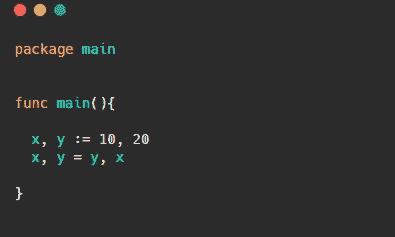

# 在围棋中，交换两个变量而不使用第三个变量

> 原文：<https://blog.devgenius.io/in-go-swap-two-variables-without-using-a-third-variable-6495f2dbfd2?source=collection_archive---------13----------------------->

## 权威指南

## 围棋中有一个方便的技巧，可以交换两个变量

[约尔根·哈兰](https://unsplash.com/@jhaland?utm_source=medium&utm_medium=referral)在 [Unsplash](https://unsplash.com?utm_source=medium&utm_medium=referral) 上的照片

如果你需要的话，Go 有一个非常好的方便的方法来交换两个变量(我在竞争性编程会话中见过这个非常有用)

这里我们把变量`x and y`的位置放在`= is the bit helps swaps these two variable values.`之前和之后

如果你想知道这是否是惯用的 Go，我不能 100%说它是惯用的代码编写方式，但是我可以看到这种编码方式在 Golang 标准库中使用，我相信 Golang 语言开发团队不会编写这种代码:)

参考::[https://golang.org/src/sort/sort.go?s=5416:5441#L273](https://golang.org/src/sort/sort.go?s=5416:5441#L273)