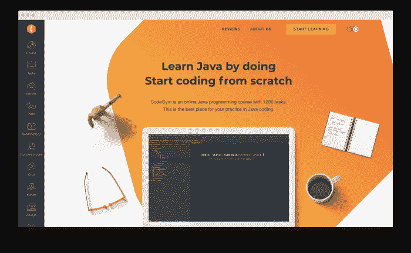

# 内部开发还是自由职业 Java 开发？选择的痛苦

> 原文：<https://blog.devgenius.io/in-house-or-freelance-java-dev-the-agony-of-choice-f6a26edbb38d?source=collection_archive---------8----------------------->

找到一份在家工作可以让你梦想成真。但是什么是最好的在家工作呢？做开发商！

为此，最好的编程语言是什么？嗯，事情变得更棘手了。这是软件工程行业中最有争议的话题之一，因为每个开发人员都有自己的观点。这完全取决于你喜欢的编码风格和你喜欢的软件开发类型。有许多有价值的选择，但要成为一名专家，可以在远程和办公室工作之间进行选择，并轻松地在它们之间切换…

# 你需要学习一门有持久力的编程语言

如果你没有或只有很少的背景，并考虑学习一门编程语言来增加你的职业机会和收入，我建议你从 Java 开始。它是一种通用的、面向对象的语言，已经存在超过 25 年了。它仍然是最受欢迎的编程语言之一，这意味着它似乎不会很快走向任何地方。也被称为 WORA 语言(编写一次，在任何地方运行)，由于其平台独立性，这意味着您可以在任何平台上执行 Java 源代码，所以它非常受欢迎。不是没有原因的，Java 运行在全球大约 70 亿种不同的设备上，并被技术、娱乐、政府、金融、医疗保健、教育、保险、国防和许多其他领域的公司所使用。

# 成为 Java 开发人员的额外好处

Java 是目前世界上最流行的语言之一，所以毫不奇怪，对 Java 开发人员有巨大的需求。因此，Java 开发人员也很受欢迎，他们的薪水是业内最高的。据 Payscale.com 称，在美国，初级 Java 开发人员的平均年薪为 60721 美元。经过几年的经验，你可以期望达到并超过 10 万美元。所以，赚钱可能是一个重要的原因。

此外，Java 开发人员在转行率最低的职业中名列前茅，这意味着压力很小，也很少有机会筋疲力尽。这主要是由于非无聊任务和项目的多样性。Java 开发不仅仅是编码。作为一名 Java 开发人员，您将参与开发过程的每个阶段。

另一个原因是强大的协作和支持。有大量不同的 Java 社区，你可以在那里寻求建议，分享你的经验，和志同道合的人交流。

最后，Java 开发人员的工作并不像看起来那么可怕。任何人都可以成为一名成功的 Java 开发人员，而不需要该领域的四年学位。在这里，建立一个你的项目组合和拥有必要的硬技能是最重要的。

# Java 开发人员做什么

简言之，Java 开发人员负责开发、设计和管理基于 Java 的应用程序和工具。这些可以是高负载系统、Android 应用、web 应用、软件工具、游戏等。一个 Java 开发人员总是在它们的后面。

当然，Java 开发人员的角色因公司而异。尽管如此，还是有一些基本的共同点:

*   编写、修改和部署代码；
*   编程、执行软件分析、测试和调试；
*   进行软件更新和改进；
*   解决问题；
*   与 IT 团队合作。

# 新现实:远程工作！

疫情冠状病毒永久性地改变了人们工作的方式、时间和地点。而且，不仅工人，雇主也发现在家工作有很多好处。例如，节省时间和金钱，最大限度地减少压力，提高生产力，甚至通过大幅减少通勤人数来保护环境。

在家工作增长最快的职业类别是计算机和 IT，以及项目管理、销售、市场营销、会计和金融。这就是为什么越来越多的 Java 开发人员从办公室转向自由职业者。许多公司并不总是有全职 IT 人员，他们更喜欢外包开发任务或为小项目雇佣自由职业者。

尽管如此，仍然有很多企业欣赏内部开发人员。所以，让我们比较一下自由职业者和内部 Java 开发人员的优缺点。

# 内部员工与自由职业者

你们中的一些人可能想知道“如果一个内部开发人员和一个自由职业开发人员都从事代码工作，会有什么不同？”。然而，问题“成为谁？”可能比乍看起来更棘手。事实是不同的公司需要不同的方法，对一个雇主来说正确的方法对另一个雇主来说可能是浪费金钱和时间。这同样适用于对自己职业有不同期望的内部开发人员和自由职业者。

# 观点

在自由职业平台上，猎头可以找到各种各样的专家，他们在执行不同的项目时获得了不同的技能水平，而自由职业者可以根据自己的喜好发现大量的工作。自由职业者可以做范围广泛的任务，从演出到持续合作，独立完成工作并提高他们想要的技能。

至于内部开发人员，他们在特定项目上的专业领域通常更加具体。此外，他们通常知道如何在团队中工作，他们更容易与同事建立联系，以制作出完美的全能产品。当大多数程序员选择内部开发时，公司的个人成长也是吸引他们的原因。

# 任务

说到任务和责任，自由职业者通常对公司没有任何义务，除了完成他们拿薪水的项目。一旦他们完成了，他们可以寻找另一个。

对于内部开发人员，情况完全不同。他们应该不断地维护产品:修复 bug，审查需要更改的内容，更新产品，并优化它。换句话说，不同类型的公司采用自由职业者和内部 Java 开发人员。

例如，自由职业者经常与成长中的初创公司、专家市场过热的偏远公司以及临时项目合作。反过来，内部开发人员更适合软件开发公司、企业对政府公司和有固定工作量的公司。

# 薪水

一般来说，自由职业者都有固定的薪水或时薪。然而，与内部员工相比，这个工资会更低。内部开发人员也有带薪假期和其他额外津贴。但对于大多数雇主来说，维持内部开发人员意味着更多的支出(缴税、办公室租金、休假等)。)，这也是越来越多的公司雇佣自由职业者的原因。因此，对自由职业者来说，更多的工作机会和更少的竞争。

然而，当你连续为一些公司或项目工作时，你有更大的机会从初级开发人员成长为高级开发人员。随着你个人的成长，相应地，你的收入也会增长。

# 工作时间表

内部专家每天工作标准时间为 6-8 小时，而自由职业者的工作时间要灵活得多。他们只能接受自己喜欢的项目，这是内部开发人员通常无法承受的奢侈。所以，自由职业者在这里肯定是赢家。

正如你所看到的，这两种职业都有其优点和缺点。是完成一次性项目还是执行常规任务并开发一些严肃的软件，是在工作时间工作还是坚持自由的时间表，这完全取决于你。然而，我确信在这两种情况下，您都需要很好的 Java 知识。

# 从哪里学习 Java

因为 Java 是一种非常受欢迎和受欢迎的语言，所以 Java 开发职位的竞争会非常激烈。你不一定需要计算机科学的学士学位，但是良好的 Java 知识和努力工作的愿望是必不可少的。下面是一些有用的资源，可以帮助你快速学习 Java:

*   [CodeGym](https://codegym.cc/) 。这个面向 Java 初学者的在线课程不需要你等待几个星期甚至几个月来组建一个离线小组。该课程包括 1200 个引人入胜的实践任务(总共 500 多个小时)，基于非枯燥的教学技巧，如游戏化、讲故事、激励。所有的任务都经过虚拟导师的验证，他会对你的代码给出即时建议，并帮助你纠正错误。作为一个不错的尝试，CodeGym 课程在桌面和移动设备上都可以使用。

*   [Codecademy](https://www.codecademy.com/) 是另一个在线互动平台，在编程中提供低成本甚至一些免费的编码课。它拥有一个用户友好的网络集成开发环境，你可以在那里编写代码并立即检查。网站上还有很多有用的提示，可以帮助你更快地完成每项任务。

*   [Udemy](https://www.udemy.com/) 。这是一个又一个在线平台，有大量的特定课程，如 Android、web、游戏开发。它提供了不同的视频教程和额外的阅读资源。但它缺乏的是广泛的实际任务。

完成上述课程后，你将获得基本的 Java 技能，甚至可能获得你的第一个自制应用程序来构建一个令人眼花缭乱的投资组合。

# 结论

不管你走什么路，选择什么课程，记住你花越多的时间练习，你的 Java 编程技能就会变得越好，越精炼。我的意思是，为了成为最好的 Java 开发人员之一，永远不要停止学习新概念。此外，请记住，作为一名自由职业者或内部开发人员工作并不总是容易的，但它总是有益和令人兴奋的。当谈到用 Java 能创造什么时，天空是无限的。所以，去极限吧，我朋友！