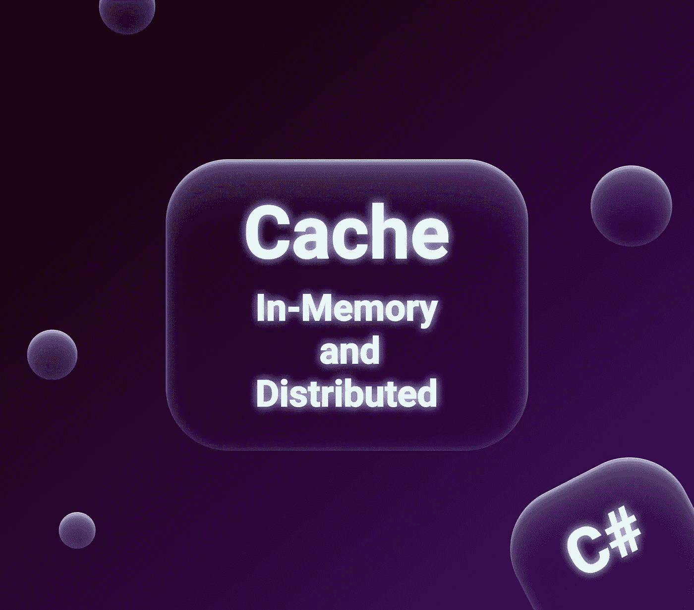

# 内存中和分布式缓存(。网络核心)

> 原文：<https://blog.devgenius.io/in-memory-and-distributed-cache-net-core-9be16bec34d7?source=collection_archive---------1----------------------->

你好，我们来谈谈缓存，缓存有哪些类型，以及如何在中使用它们。网络核心

# 什么是缓存？

缓存是将数据存储在一个特殊的地方，以便将来更快地访问。通过显著减少对数据源(如数据库)的调用次数，应用缓存可以显著提高任何应用程序的性能。

当网页上的一些元素的数据很少改变或者在一段时间后改变时，缓存特别有效。

# 中的缓存类型。网络核心

**内存缓存—** 缓存存储并接收来自运行应用程序的服务器的缓存数据的结果。

这种类型的缓存适用于只包含一台服务器的中小型应用程序。

内存缓存有缺点，如果服务器重启或崩溃，数据会怎么样？显然它们会消失:)当然，这在开发阶段可能是有用的，但在生产中这种行为是不可接受的。

对于这种类型的缓存，还会出现另一个问题，如何从另一个服务器访问数据？因为一个应用程序可以有多个服务器，也可以是 web 场的一部分。

内存缓存有一种技术——**粘性会话。**粘滞会话意味着一个会话总是去往负载均衡器后面的一个特定服务器。

这里我们有分布式缓存来解决下一个问题:当服务器重启或崩溃时缓存丢失，服务器之间的缓存共享。

**分布式缓存—** 缓存不包含在特定服务器的内存中，而是可以使用其他一些节点来存储缓存的数据。因此，每台服务器都可以访问缓存，即使服务器重启或崩溃，缓存的数据也不会丢失。

存储分布式缓存的节点示例: [SQL Server 数据库](https://docs.microsoft.com/en-us/sql/sql-server/?view=sql-server-ver15)、 [Azure Redis 缓存](https://docs.microsoft.com/en-us/azure/azure-cache-for-redis/cache-overview)、 [NCache](http://www.alachisoft.com/ncache/aspnet-core-idistributedcache-ncache.html) 等。

# 如何在？网芯？

首先，让我们创建一个 API 项目。

然后，我们需要在 Startup.cs 中将内存缓存添加到依赖项中

好了，现在我们可以在我们的解决方案中使用`IMemoryCache`。

通过`IMemoryCache`,我们可以向缓存中添加新值，或者检查和检索缓存中已经存在的值。

基本方法:

*   TryGetValue —检查给定键是否存在任何值
*   设置—设置给定键的值

我将在我称为`EmployeeController`的新控制器中注入`IMemoryCache`接口。

下面我提供了带有注释的代码`EmployeeController`。

您可能已经注意到，我已经设置了缓存选项来设置到期日期。这种到期可以是滑动的或绝对的。在上面的例子中，我设置了滑动。

## 过期。滑动 vs 绝对

随着时间的推移，每个缓存对象都可能变得过时和不相关，当缓存对象过期时，应用程序不会返回缓存结果，而是请求再次获取数据，然后进行缓存。

作为开发人员，我们可以设置缓存对象的到期日期——绝对到期日期或滑动到期日期。

**绝对**过期意味着缓存将在给定时间后过期。

例如，我们设置 60 秒，正好 60 秒后，不管调用它的次数是多少，这个对象都将过期。

**滑动**到期允许你删除给定时间内未被访问的项目。

例如，我们设定 60 秒。如果 60 秒内没有电话，那么它将被删除。如果对象被检索，那么这 60 秒将再次被覆盖。

**我可以使用绝对选项滑动吗？**

当然，因为如果一个项目被访问的频率总是超过它的滑动过期时间，那么这个项目就有可能永远不会过期。

为了避免这种情况，我们可以将这两个选项结合起来，在这种情况下，使用逻辑 OR 来决定某个项目是否应该标记为过期。如果过期参数之一超时，则从缓存中删除该对象。

示例:

试着想象一下上面例子中的结果是什么，缓存什么时候会被清空，或者只是在本地调试:)

# 分布式缓存

IDistributedCache —中央接口。NET Core 的分布式缓存实现。

该接口期望任何分布式缓存实现的基本方法都应该提供:

*   Get，GetAsync 通过键从缓存中获取项目。
*   Set，SetAsync —通过键在缓存中添加新项目
*   Refresh，RefreshAsync —根据项目的字符串关键字刷新项目，并重置其滑动过期超时
*   Remove，RemoveAsync —通过键从 cash 中移除项目。

目前，该接口有 4 种实现方式:

*   分布式 SQL Server 缓存
*   分布式 Redis 缓存
*   分布式 NCache 缓存
*   **分布式内存缓存**

您当然可以编写自己的 IDistributedCache 实现。

如果你仔细阅读，你可能会注意到我将**分布式内存缓存**表示为分布式缓存的一个实现。如果我们更深入地研究文档，我们会发现事实上这不是真正的分布式缓存，它使用 web 服务器的内存作为缓存存储。就像上面我们看到的`IMemoryCache`一样。

## 那么，我们为什么需要分布式内存缓存呢？

在分布式缓存开发的早期，这可能是一个有用的工具。当一个新的应用程序开发开始时，我们可以设置内存分布式缓存，然后使用 IDistributedCache 接口与缓存存储进行交互。

然后我们只需在启动时更改配置，就可以用另一个真正的实现(Redis、NCache、SQL Server Cache)来替换它。

## 密码

为了演示如何使用分布式缓存，我将使用相同的解决方案，但是我将在`Startup.cs`中添加`AddDistributedMemoryCache()`而不是`AddMemoryCache()`

带有解释注释的代码:

链接到知识库—[https://github.com/stasoz1/CacheExamples](https://github.com/stasoz1/CacheExamples)快乐编码😁

# 学到了新东西？

如果你喜欢这篇文章，可以 [**给我买杯咖啡**](https://www.buymeacoffee.com/stasoz) 我写下一篇文章的时候再喝:)

*更多内容尽在*[*blog . dev genius . io*](http://blog.devgenius.io)*。*