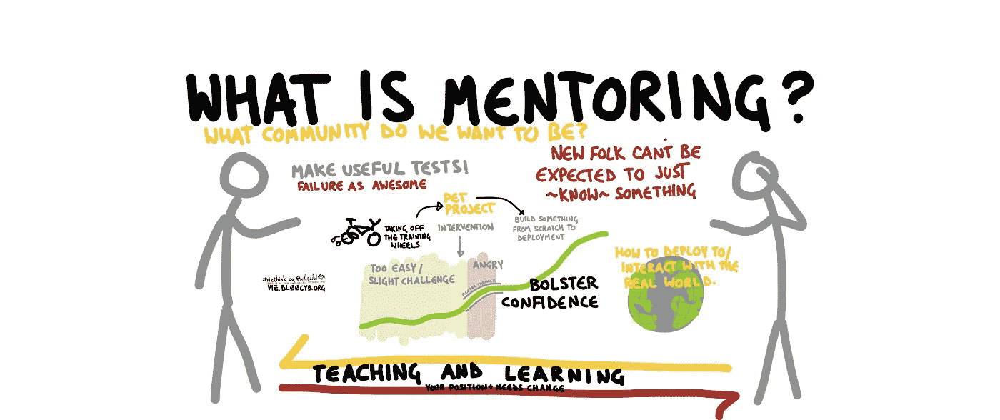
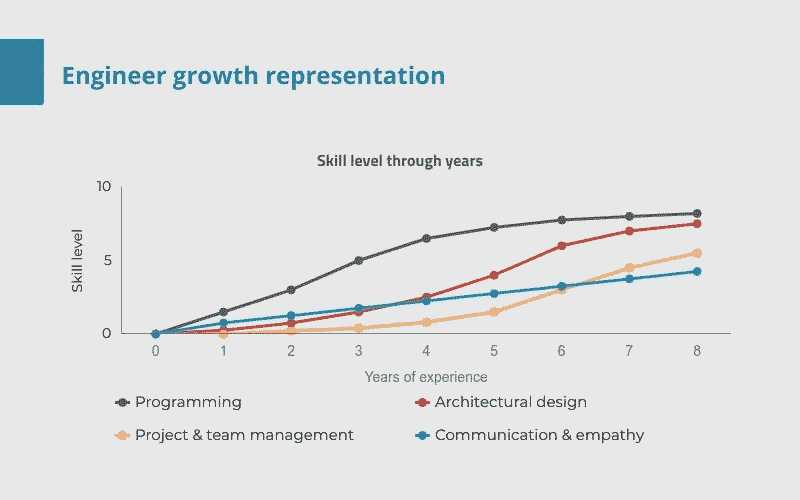

# 为什么做导师很难

> 原文：<https://blog.devgenius.io/in-the-shoes-of-a-mentor-what-5-years-have-taught-me-9dd6b6e89aac?source=collection_archive---------5----------------------->

这是关于导师制的三部分系列的第一部分。我们将涵盖:

1.  为什么做导师很难，
2.  为什么它是有益的，
3.  提升你的导师技能的具体建议。

## 导师是关于人的

我从未停止有一个导师。7 年来，不同的人以不同的角色指导我。它从编程开始，然后是架构设计，然后是项目和团队管理。一个不变的指导是关于沟通和同理心。

对我来说，导师制不是教某人算法，推荐“合适的书”，或者给他们任务去解决。

> 导师制是指导个人实现他们的全部潜力，支持他们并对他们坦诚相待。

在我第二年的某个时候，我正在解决对公司真正重要的问题。这意味着要解决许多我所知甚少的新问题。我每隔 10-15 分钟就问我的导师一些新问题，直到某个时候，他引入了一个每小时 10 分钟的时间窗口，我可以问问题。几个星期后，我就停止提问了。

现在回想起来，当我面临同样的导师挑战时，这是一种迫使我变得独立并提高我的谷歌搜索技能的天才方式。不幸的是，当时我不明白这个意图，会觉得被抛弃了。

意图是好的，但执行只是部分成功。

# 做导师是件艰难的事情

在我的 7 年里，我已经做了大约 5 年的导师，教不同的人不同的东西。随着时间的推移，我对导师角色的理解发生了很大变化，改变了我教学、给出建议和交流的方式。

## 这可能要花很多时间

之前的故事就是一个很好的例子。根据导师制度的不同，导师制度可以轻易地占用你 10%-20%的时间。这段时间用于提供指导和支持，讨论想法，提出建设性的批评，并向你的导师提出适当的挑战。

> *但是投入时间对于导师和被导师的成功都至关重要。这是发展一种真实的、有形的关系的唯一途径。*

作为一名导师，我真的很感激能够在任何时候向我的导师寻求帮助，尽管可能是非常忙碌的一天或一个周日下午。这就是为什么，虽然我有时有一堆重要和/或紧急的事情要做，但我总是会努力花时间听我的导师们说话，并在他们身边。

## 这可能会令人沮丧

我试图灌输“为什么”这个问题我的导师。他们需要理解为什么某件事重要到必须去做，为什么是现在，为什么是他们。这对任何人来说都不容易做到，尤其是对新员工。他们不是来“完成任务”的，而是来解决问题的。我给他们更多的责任，拥有特性、项目，自己成为导师。他们不断面临成长的挑战。

成长包括失败。作为一名导师，有时候我很难接受。人们很容易忘记，当我刚起步时，这些问题对我来说有多难。尤其是当这些人成功地解决了相似或更困难的问题时。这对编程来说是正确的，对交流、时间估计、合作和其他事情来说也是如此。

对我来说，在这种情况下，重要的是要理解他们是如何看待这种情况的。最有可能的是，他们遗漏了一些关键信息，而这些信息将会使整个画面完整。一旦我明白了原因，我们都可以学到一些东西，继续前进，没什么大不了的。

## 可能会不舒服

为了最好地帮助别人，我总是尽量诚实，并以建设性的批评形式给出直接的反馈。不要“假设”我是对的，从我注意到的事情和我的感受开始，这一点非常重要。我期待同样的回报。免责声明——我不是一个容易谈论感情和直接与人对抗的人。经过多年的练习，还是有意识的努力。

虽然这很有效，我还没有一次不好的经历，但这很不舒服，而且很伤脑筋。但这也是为什么要这么做的原因——这有助于在诚实和透明的基础上建立有意义的关系。

## 这可能令人心碎

我记得不得不放弃我的一个导师。事实上，我们已经建立了基于诚实的关系，这有助于我们分道扬镳，没有任何人怀恨在心，但我仍然很难过。我在他身上花了很多时间，我们建立了友好的关系，但这里不适合他。

大多数关系都必须在某个时候结束。但正如老话所说，目的地不重要，重要的是旅程。我们辅导的人有自己的想法，会做我们不同意的事情。这将会导致心碎，并且会感到痛苦，直到我们接受这是过程的一部分。

## 结论

导师是关于人的。你面临的真正问题永远不会是正确的算法或正确的方法。看起来是这样，但通常有更深层次的原因。这可能是诚实或信任的问题，你可能会感到沮丧或心碎，并羞于谈论自己目前的精神状态。所有这些都需要很长时间来改善。

这并不意味着不值得努力！

*如果你喜欢我的内容，请考虑在*[*devwayolife*](http://devwayoflife.com/)订阅