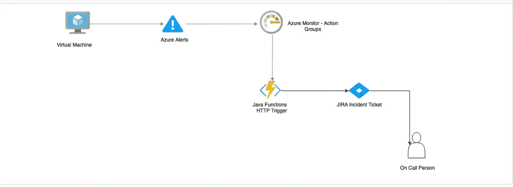
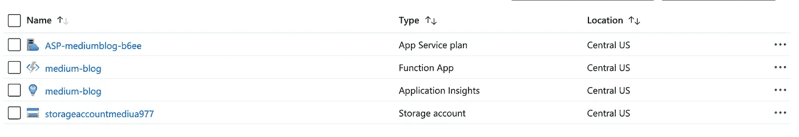
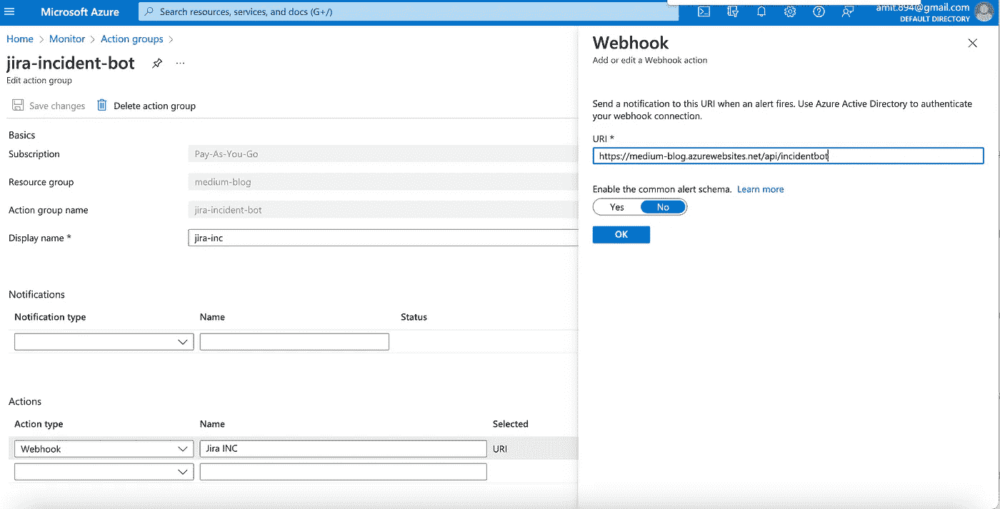
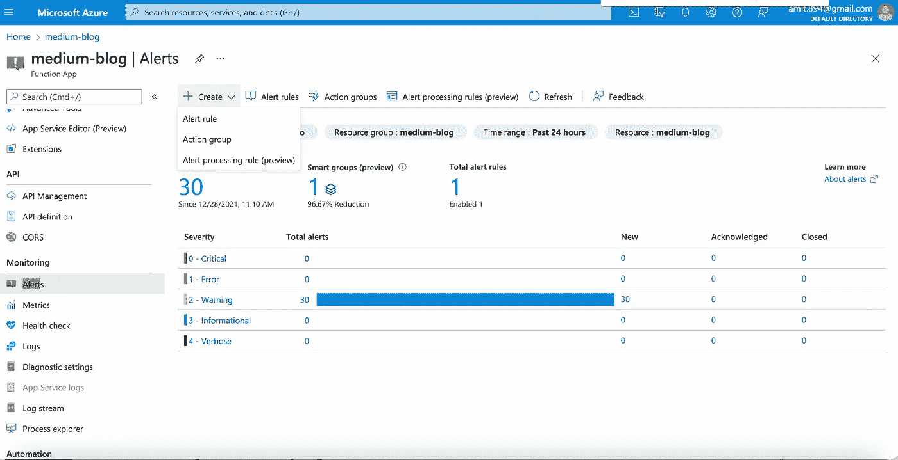
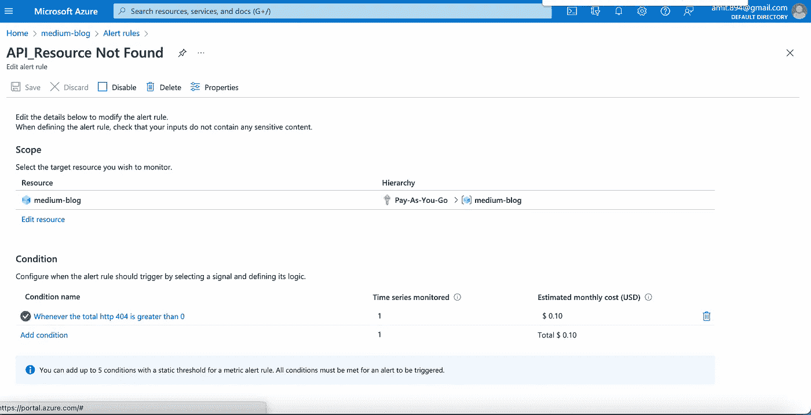
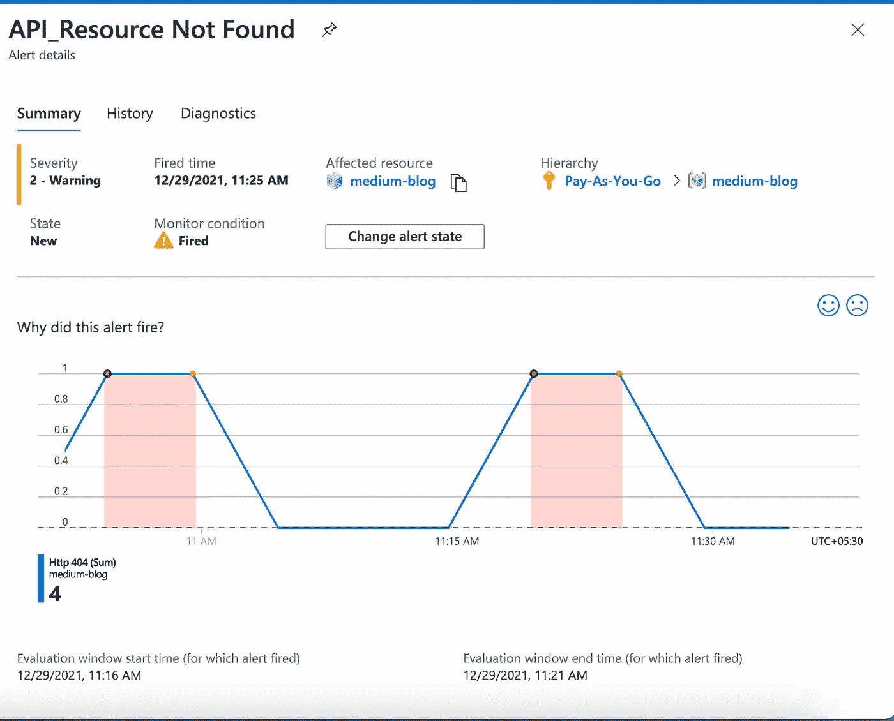
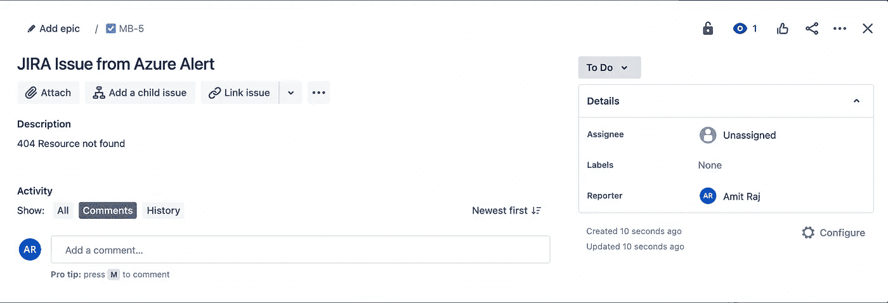

# Azure 函数上的事件 Bot

> 原文：<https://blog.devgenius.io/incident-bot-on-azure-functions-ed20da8af478?source=collection_archive---------7----------------------->

这篇博客是我们从零开始讨论 **DevOps** 概念的系列文章的一部分，面向的是入门知识有限的读者。这篇文章属于*中级*系列，因为它涉及到理解无服务器应用程序的工作原理，也就是 [**Azure 函数**](https://docs.microsoft.com/en-us/azure/azure-functions/functions-overview) 。

云系列中的一些早期博客如下。

[**TweetBot**](https://awstip.com/aws-lambda-simple-tweetbot-2f2f83fbe161)[**Azure Functions-GitHub Actions**](https://towardsdev.com/deploying-on-azure-functions-github-actions-a8f2a98acc0f)[**NodeJs+Nginx**](/nodejs-nginx-on-azure-vm-cf23d05a9b9b)

# 什么是 Azure 函数？

Functions 是 Azure 的旗舰产品，是 FAAS(功能即服务)/无服务器类别的一部分，应用团队不必考虑管理基础设施的额外复杂性。一般用于部署 Python、Java、C#等语言的无状态微服务；功能有三种方案——[消费](https://docs.microsoft.com/en-us/azure/azure-functions/consumption-plan)、[溢价](https://docs.microsoft.com/en-us/azure/azure-functions/functions-premium-plan?tabs=portal)和[专用](https://docs.microsoft.com/en-us/azure/azure-functions/dedicated-plan)方案。可以根据工作负载的类型(开发、阶段和生产)来使用这些计划。消耗是随使用付费的模式，建议用于运行概念验证和实验。

# 自动化事件管理

对于运行任何大规模操作，端到端事故管理系统应具备这三个关键要素- *监控、检测、警报*而无需任何人工参与。自动化系统的性质应该独立于在*业务、系统和应用*异常之间收集的指标。理想情况下，将警报源与通知系统(如 [*【传呼机职责】*](https://www.pagerduty.com/)*[*service now*](https://www.servicenow.com/)*[*【JIRA*](https://www.atlassian.com/software/jira)*)连接起来的指挥者对于生产中的规模化运营至关重要。此外，该系统应满足-减少噪音，驾驶行为和改善端到端 [MTTD](https://www.sentinelone.com/blog/mttd-mean-time-to-detect-detailed-explanation/#:~:text=Mean%20time%20to%20detect%20(MTTD,about%20a%20problem%2C%20the%20better.) 和 [MTTR](https://www.fiixsoftware.com/mean-time-to-repair-maintenance/) 指标。***

***下面的例子是 orchestrator 使用[Azure Monitor Action Groups](https://docs.microsoft.com/en-us/azure/azure-monitor/alerts/action-groups)和 [Azure Functions](https://azure.microsoft.com/en-in/services/functions/) 将 Azure Alerts 与 JIRA 连接起来的一个用例。***

******

*****事故管理工作流程*****

## ***创建功能应用程序***

***Azure Function 应用程序可以从以下任一选项创建-***

***I)从 Azure 门户-[https://docs . Microsoft . com/en-us/Azure/Azure-functions/functions-create-function-app-Portal](https://docs.microsoft.com/en-us/azure/azure-functions/functions-create-function-app-portal)***

***ii)从通用 Terraform 模块-[https://github . com/innovation Norway/terra form-azurem-function-app](https://github.com/innovationnorway/terraform-azurerm-function-app)。***

***一旦创建了 Function-app，以下资源将会出现在 Azure 门户中。调试和日志记录需要应用洞察资源。***

******

*****Azure 功能-资源*****

## ***创建 Java 模块***

***为了创建一个 Java 模块，我们需要将整个事故管理功能分成三个部分***

***i) **HTTP 触发器类-** 当实际的 web 钩子被触发时被调用的类。***

***ii) **JIRA 服务类别—** 服务类别，负责向 JIRA 提供商认证和创建问题。***

***iii) **JIRA 模型—** 维护创建 *JIRA 任务/问题/史诗* **所需数据元素的模型类。*****

## **部署 Azure 功能**

**以下中型博客可用于使用 GitHub 操作将代码部署到 Azure 函数。**

** [## 在 Azure 功能上部署- GitHub 操作

### 本博客是我们从零开始讨论 DevOps 概念的系列文章的一部分，面向的读者有限…

towardsdev.com](https://towardsdev.com/deploying-on-azure-functions-github-actions-a8f2a98acc0f) 

发布 Azure 函数部署后，可以通过对给定端点使用 GET 操作来触发端点-**。*此端点将创建 JIRA 事件/任务。*

## *创建 Azure Monitor 操作组*

*I)点击 Azure 门户上的 Monitor，并从中选择操作组。*

*ii)创建一个新的操作组(jira-incident bot ),并将上面的 webhook url 添加为通知系统。*

**

## *创建警报规则*

*I)在给定资源的左侧导航选项卡上，单击**警报**并从那里**创建警报规则**。*

**

*ii)选择**警报指标、警报频率**和正常警报创建所需的其他指标。*

**

*iii)选择如上创建的**动作组**，以便下次触发警报时，触发功能应用程序上的 web-hook。*

## *结束 2 结束测试*

*I)点击 Azure VM 上的一个端点，这导致 404 消息。
ii)警报状态变为“已触发”,如下所示*

**

***天蓝色警报状态改变***

*创建 JIRA 板上的以下问题，并将其分配给待命人员。*

**

***JIRA 给待命人员的任务***

## *额外资源*

* [## GitHub—Amit 894/Azure-function-Incident bot:Azure 函数上 Java 中的事件 Bot

### 此时您不能执行该操作。您已使用另一个标签页或窗口登录。您已在另一个选项卡中注销，或者…

github.com](https://github.com/amit894/azure-function-incidentbot) 

如需反馈，请留言至***Amit[dot]894[at]Gmail[dot]com****或联系*[*https://about.me/amit_raj*](https://about.me/amit_raj)*的任何链接。****